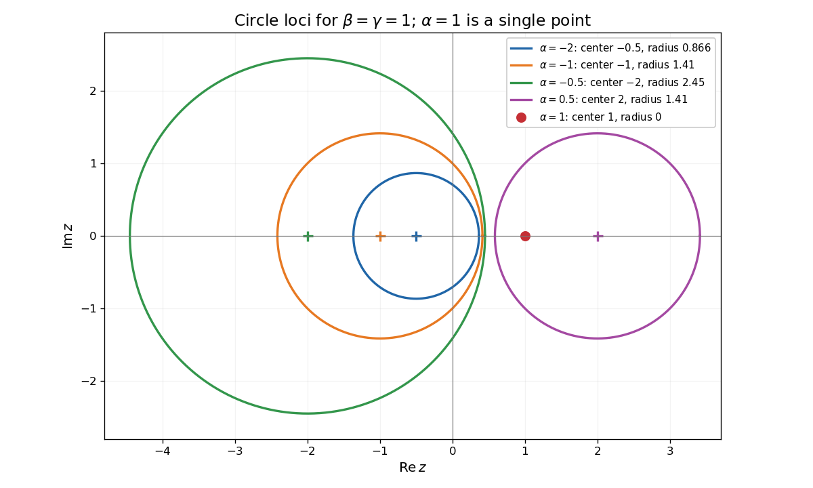

<h1 id="7c/solution">Solution</h1>

↑ **Parent:** [7C](../7c.md)

Complete the square in the real-valued [complex plane](../../../../../complex-plane.md) equation:

$$
\alpha\left|z-\frac\beta\alpha\right|^2=\frac{|\beta|^2-\alpha\gamma}{\alpha}.
$$

Dividing by $\alpha$ gives **center and radius**

$$
\boxed{c=\frac\beta\alpha,\qquad r=\frac{\sqrt{|\beta|^2-\alpha\gamma}}{|\alpha|}.}
$$

If the radicand is zero, the locus is the single point $c$, a degenerate [circle](../../../../../circle.md). If it is negative, the locus is empty. The absolute value of $\alpha$ is essential even when $\alpha<0$.

For the requested sketch, the five centers and radii are respectively $(-1/2,\sqrt3/2)$, $(-1,\sqrt2)$, $(-2,\sqrt6)$, $(2,\sqrt2)$ and $(1,0)$, all centers on the real axis.

**[Figure 1](#7c/image-five-complex-plane-circle-loci-including-the-radius-zero-point-at-alpha-equals-one). Five complex-plane circle loci, including the radius-zero point at alpha equals one**.

The original PDF's map is $f(z)=(\beta/\bar\beta)\bar z$; the converted TeX drops the conjugate on its denominator. Write $\beta=|\beta|e^{i\theta}$, so $f(z)=e^{2i\theta}\bar z$. This is the [reflection symmetry of a complex circle equation](../../../../../reflection-symmetry-of-a-complex-circle-equation.md). It fixes $c=\beta/\alpha$ and satisfies

$$
|f(z)-c|=|f(z)-f(c)|=|z-c|,\qquad f(f(z))=z.
$$

Thus it maps every point of the [circle](../../../../../circle.md) into the same [circle](../../../../../circle.md). Conversely, for any point $w$ on that [circle](../../../../../circle.md), $z=f(w)$ also lies on it and $f(z)=w$. This proves **$f(C)=C$**, including the surjectivity required by the question.

For any three nonempty [circles](../../../../../circle.md), fix $u\in C_3$. The [triangle inequality](../../../../../triangle-inequality.md) gives, for every $z\in C_1,w\in C_2$,

$$
|z-w|\le|z-u|+|u-w|\le m(C_1,C_3)+m(C_2,C_3).
$$

Taking the maximum over $z,w$ proves **the requested inequality**.

For centers $c_1,c_2$ and radii $r_1,r_2$, the [maximum separation of two circles](../../../../../maximum-separation-of-two-circles.md) is bounded above by $|c_1-c_2|+r_1+r_2$. If the centers differ, choose $z=c_1+r_1v$ and $w=c_2-r_2v$, where $v=(c_1-c_2)/|c_1-c_2|$, to attain the bound. If the centers coincide, any unit $v$ gives opposite points attaining $r_1+r_2$. Therefore

$$
\boxed{m(C_{\alpha_1\beta_1\gamma_1},C_{\alpha_2\beta_2\gamma_2})
=\frac{|\alpha_1\beta_2-\alpha_2\beta_1|}{|\alpha_1\alpha_2|}
+\frac{\sqrt{|\beta_1|^2-\alpha_1\gamma_1}}{|\alpha_1|}
+\frac{\sqrt{|\beta_2|^2-\alpha_2\gamma_2}}{|\alpha_2|}.}
$$

The function $m$ is not a [metric](../../../../../metric.md) on positive-radius [circles](../../../../../circle.md), since $m(C,C)=2r$, even though it satisfies this triangle-type inequality.

## ↑ Ancestors (10)

1. [7C](../7c.md)
2. [Paper 1](../../paper-1-split.md)
3. [Ia](../../split.md)
4. [2001](../../../split.md)
5. [Past exam of the mathematics course of the University of Cambridge](../../../../split.md)
6. [Mathematics course of the University of Cambridge](../../../../../mathematics-course-of-the-university-of-cambridge.md)
7. [Course of the University of Cambridge](../../../../../course-of-the-university-of-cambridge.md)
8. [University of Cambridge](../../../../../university-of-cambridge-split.md)
9. [List of universities](../../../../../list-of-universities.md)
10. [Codex Wiki](../../../../../split.md)
