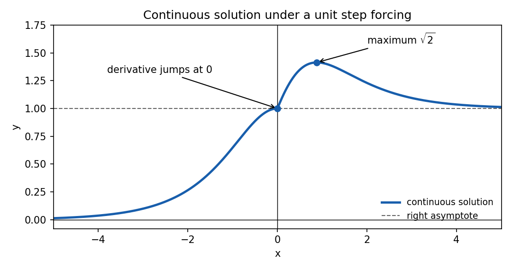
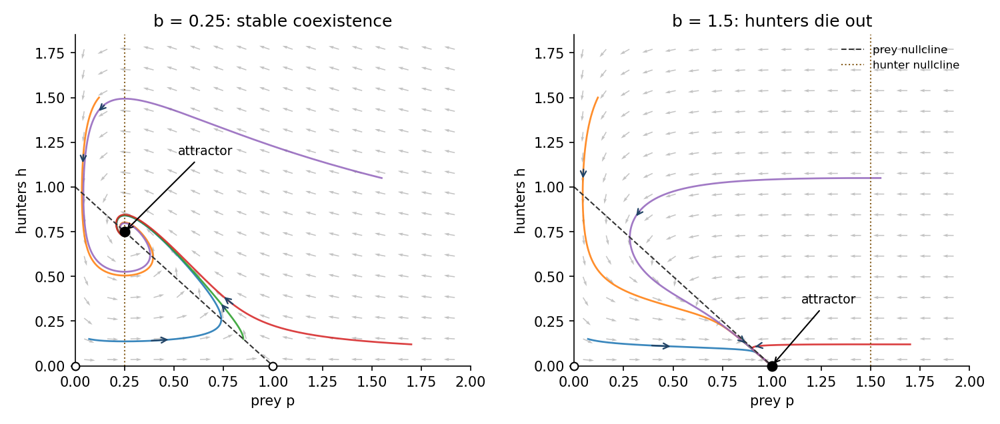

# Paper 2

↑ **Parent:** [Ia](../ia.md)

[https://www.maths.cam.ac.uk/undergrad/pastpapers/files/2001/PaperIA_2.pdf](https://www.maths.cam.ac.uk/undergrad/pastpapers/files/2001/PaperIA_2.pdf)

**Table of contents**

- [1B](#1b)
  - [Solution](#1b/solution)
- [2B](#2b)
  - [Solution](#2b/solution)
- [3F](#3f)
  - [Solution](#3f/solution)
- [4F](#4f)
  - [Solution](#4f/solution)
- [5B](#5b)
  - [Solution](#5b/solution)
- [6B](#6b)
  - [Solution](#6b/solution)
- [7B](#7b)
  - [Solution](#7b/solution)
- [8B](#8b)
  - [Solution](#8b/solution)
- [9F](#9f)
  - [Solution](#9f/solution)
- [10F](#10f)
  - [Solution](#10f/solution)
- [11F](#11f)
  - [Solution](#11f/solution)
- [12F](#12f)
  - [Solution](#12f/solution)

## 1B

↑ **Parent:** [Paper 2](paper-2.md)

<h3 id="1b/solution">Solution</h3>

↑ **Parent:** [1B](#1b)

An [integrating factor](../../../differential-equation.md#integrating-factor) is $\mu(x)=\cosh x$, since $\mu'/\mu=\tanh x$. Thus

$$
(\cosh x\,y)'=\cosh x\,H(x),\qquad
\cosh x\,y(x)=1+\int_0^x\cosh t\,H(t)\,dt.
$$

For negative $x$ the integral vanishes; for positive $x$ it is $\sinh x$. Consequently

$$
\boxed{y(x)=\begin{cases}
\operatorname{sech}x,&x\le0,\\
\operatorname{sech}x+\tanh x,&x\ge0.
\end{cases}}
$$

Both branches give $y(0)=1$. This is [Heaviside forcing in a first-order integrating-factor equation](../../../differential-equation.md#heaviside-forcing-in-a-first-order-integrating-factor-equation): the solution is continuous and piecewise differentiable, while its one-sided derivatives at zero are $0$ and $1$. The [Heaviside step function](../../../analysis.md#heaviside-step-function)'s value at zero does not affect the integral solution. The equation holds classically on the two open half-lines and in the weak sense across zero.

The left branch rises from zero at $-\infty$ to one. On the right,

$$
y'(x)=\frac{1-\sinh x}{\cosh^2x},
$$

so its unique maximum is **$y=\sqrt2$ at $x=\operatorname{arsinh}1$**, after which it decreases to the horizontal asymptote $y=1$ from above.

**[Figure 1](#1b/image-continuous-step-forced-solution-with-its-derivative-jump-maximum-and-asymptotes). Continuous step-forced solution with its derivative jump, maximum and asymptotes**.

## 2B

↑ **Parent:** [Paper 2](paper-2.md)

<h3 id="2b/solution">Solution</h3>

↑ **Parent:** [2B](#2b)

The homogeneous [characteristic equation](../../../differential-equation.md#characteristic-equation-of-a-constant-coefficient-differential-equation) is $r^2-r-2=(r-2)(r+1)=0$, so its solutions are $e^{2x}$ and $e^{-x}$. Because the forcing contains the latter exponential, set $y=e^{-x}v$. Direct differentiation reduces the [inhomogeneous linear differential equation](../../../differential-equation.md#inhomogeneous-linear-differential-equation) to

$$
v''-3v'=18x.
$$

A polynomial particular solution is $v=-3x^2-2x$, since $v''-3v'=-6-3(-6x-2)=18x$. Therefore

$$
y=C_1e^{2x}+e^{-x}(C_2-2x-3x^2).
$$

The exponentially growing first term cannot be canceled by the decaying second term, so boundedness at positive infinity requires $C_1=0$. The [initial condition](../../../differential-equation.md#initial-condition) $y(0)=1$ sets $C_2=1$. Hence

$$
\boxed{y(x)=(1-2x-3x^2)e^{-x}.}
$$

## 3F

↑ **Parent:** [Paper 2](paper-2.md)

<h3 id="3f/solution">Solution</h3>

↑ **Parent:** [3F](#3f)

The side of the inscribed [equilateral triangle](../../../geometry-and-topology.md#equilateral-triangle) has length $\sqrt3\,r$. If $d$ is the distance of a [chord](../../../topology.md#chord-of-a-circle) midpoint from the center, a right triangle gives [chord](../../../topology.md#chord-of-a-circle) length $2\sqrt{r^2-d^2}$. Thus a [chord](../../../topology.md#chord-of-a-circle) is sufficiently long exactly when $d<r/2$.

**(a)** Uniform midpoint area puts the midpoint in the radius-$r/2$ [disk](../../../topology.md#disk-mathematics) with [probability](../../../probability-theory.md#probability)

$$
\boxed{\frac{\pi(r/2)^2}{\pi r^2}=\frac14.}
$$

**(b)** Fix the first endpoint by rotational symmetry. [Independence](../../../random-variable.md#independent-random-variables) and uniformity make the angle $\theta$ of the second endpoint uniform on $[0,2\pi)$. Its [chord](../../../topology.md#chord-of-a-circle) length is $2r\sin(\theta/2)$, so the required event is $2\pi/3<\theta<4\pi/3$. Hence

$$
\boxed{\frac{4\pi/3-2\pi/3}{2\pi}=\frac13.}
$$

**(c)** If the midpoint distance itself has [uniform distribution](../../../continuous-probability-distribution.md#continuous-uniform-distribution) on $[0,r]$, the event $d<r/2$ has [probability](../../../probability-theory.md#probability)

$$
\boxed{\frac12.}
$$

These are three different [probability measures](../../../probability-theory.md#probability-measure) on [chords](../../../topology.md#chord-of-a-circle). Their different answers are [Bertrand's paradox](../../../probability-theory.md#bertrand-paradox-probability): specifying what is uniform is indispensable. Uniform area, uniform endpoints and uniform radial distance are not interchangeable sampling rules. Equality at the length threshold has [probability](../../../probability-theory.md#probability) zero in all three models.

## 4F

↑ **Parent:** [Paper 2](paper-2.md)

<h3 id="4f/solution">Solution</h3>

↑ **Parent:** [4F](#4f)

Use the equally likely release prior, and write $s$ for the [probability](../../../probability-theory.md#probability) that the guard names B when A is released. If B is released the guard cannot name B; if C is released the guard must name B. The [law of total probability](../../../probability-theory.md#law-of-total-probability) therefore gives

$$
P(B\text{ named})=\frac{s}{3}+\frac13=\frac{1+s}{3}.
$$

A remains jailed and B is named precisely when C is released. Its [probability](../../../probability-theory.md#probability) is $1/3$, so the [conditional probability](../../../probability-theory.md#conditional-probability) is

$$
\boxed{P(A\text{ remains}\mid B\text{ named})=\frac1{1+s}.}
$$

In **(a)** unbiased naming has $s=1/2$, giving **$2/3$**: the guard's claim is false and A's chances have not improved. In **(b)** preferentially naming B has $s=1$, giving **$1/2$**: that naming rule makes the claim correct. In **(c)** preferentially naming C has $s=0$, giving **$1$**: naming B then reveals that C is the released person, so A certainly remains.

This is the [three prisoners problem](../../../probability-theory.md#three-prisoners-problem). The observed name includes information about how the guard selects a name; it is not merely the event that B remains. With general release priors $\pi_A,\pi_B,\pi_C$, the same calculation gives $\pi_C/(s\pi_A+\pi_C)$, making explicit where the equal-prior convention enters.

## 5B

↑ **Parent:** [Paper 2](paper-2.md)

<h3 id="5b/solution">Solution</h3>

↑ **Parent:** [5B](#5b)

For the homogeneous [linear recurrence relation](../../../algebra.md#linear-recurrence-relation), substitute $y_k=r^k$. Its [characteristic equation of a linear recurrence](../../../algebra.md#characteristic-equation-of-a-linear-recurrence) is $r^2-r+1=0$, with roots $e^{i\pi/3}$ and $e^{-i\pi/3}$. Taking real [linear combinations](../../../vector-space.md#linear-combination) gives

$$
\boxed{y_k=A\cos(k\pi/3)+B\sin(k\pi/3).}
$$

These two real sequences are [linearly independent](../../../vector-space.md#linear-independence): their values at $k=1,2$ form a matrix with [determinant](../../../linear-algebra.md#determinant) $\sqrt3/2\ne0$. Thus their two constants account uniquely for arbitrary first two values.

Let $P_k=\sum_{n=1}^k a_n/(k-n+1)$ and reindex as $P_k=\sum_{j=1}^k a_{k-j+1}/j$. In $P_{k+2}-P_{k+1}+P_k$, each term with $1\le j\le k$ has coefficient

$$
a_{k-j+3}-a_{k-j+2}+a_{k-j+1}=0.
$$

The term $j=k+1$ is $(a_2-a_1)/(k+1)=0$, and the remaining term is $a_1/(k+2)=1/(k+2)$. This explicitly proves that $P_k$ is the required particular solution, a [discrete Green convolution for the period-six recurrence](../../../algebra.md#discrete-green-convolution-for-the-period-six-recurrence).

The unit-response coefficients have the homogeneous form just found. The values $a_1=a_2=1$ give zero cosine coefficient and sine coefficient $2/\sqrt3$, so

$$
a_n=\frac2{\sqrt3}\sin(n\pi/3).
$$

Subtracting this particular solution from any other solution leaves a homogeneous recurrence. Thus the complete answer is

$$
\boxed{y_k=A\cos(k\pi/3)+B\sin(k\pi/3)
+\frac2{\sqrt3}\sum_{n=1}^k\frac{\sin(n\pi/3)}{k-n+1},\qquad k\ge1.}
$$

## 6B

↑ **Parent:** [Paper 2](paper-2.md)

<h3 id="6b/solution">Solution</h3>

↑ **Parent:** [6B](#6b)

Where $y_1$ is nonzero, the [Wronskian](../../../differential-equation.md#wronskian) identity $W=y_1y_2'-y_1'y_2$ becomes the first-order equation

$$
y_2'-\frac{y_1'}{y_1}y_2=\frac W{y_1}.
$$

Its [integrating factor](../../../differential-equation.md#integrating-factor) is $1/y_1$, giving $(y_2/y_1)'=W/y_1^2$. Integration proves the [reduction of order](../../../differential-equation.md#reduction-of-order) formula

$$
\boxed{y_2(x)=y_1(x)\left[C_0+\int_{x_0}^x\frac{W(t)}{y_1(t)^2}\,dt\right].}
$$

Taking $C_0=0$ gives the displayed representative in the question, with $y_2(x_0)=0$ when $y_1(x_0)\ne0$. Changing the lower limit adds a multiple of $y_1$ and does not change the [linearly independent](../../../vector-space.md#linear-independence) solution modulo the known one. The scale of $W$ separately fixes the normalization of $y_2$.

Differentiate the [determinant](../../../linear-algebra.md#determinant) and use the original second-order equation for each solution:

$$
W'=y_1y_2''-y_1''y_2
=y_1(-py_2'-qy_2)-(-py_1'-qy_1)y_2=-pW.
$$

This proves [Abel's identity](../../../differential-equation.md#abel-s-identity) **$W'+pW=0$** rather than merely quoting it.

For the specific equation, substituting $y_1=1-x$, $y_1'=-1$, $y_1''=0$ leaves $(1-x^2)-(1+x)(1-x)=0$. Away from zero its normalized first-derivative coefficient is $p(x)=x-1/x$, so

$$
W(x)=Cx e^{-x^2/2}.
$$

Although the equation is singular at zero, this expression extends analytically there. Near zero, $y_1$ is nonzero and the [reduction of order](../../../differential-equation.md#reduction-of-order) integrand is regular. With the prescribed lower limit,

$$
y_2(x)=C(1-x)\int_0^x\frac{t e^{-t^2/2}}{(1-t)^2}\,dt.
$$

The integrand through degree three is

$$
\frac{t e^{-t^2/2}}{(1-t)^2}
=t\bigl(1-t^2/2+O(t^4)\bigr)\bigl(1+2t+3t^2+O(t^3)\bigr)
=t+2t^2+\frac52t^3+O(t^4).
$$

After integrating and multiplying by $1-x$,

$$
y_2(x)=C\left(\frac{x^2}{2}+\frac{x^3}{6}-\frac{x^4}{24}+O(x^5)\right).
$$

The condition $y_2''(0)=1$ fixes $C=1$, and the lower limit already gives $y_2(0)=0$. Therefore the first three nonzero terms are

$$
\boxed{y_2(x)=\frac{x^2}{2}+\frac{x^3}{6}-\frac{x^4}{24}+O(x^5).}
$$

The representation genuinely solves the second-order equation: writing $L[y]=y''+py'+qy$, differentiating its [Wronskian](../../../differential-equation.md#wronskian) gives $W'+pW=y_1L[y_2]-y_2L[y_1]=y_1L[y_2]$. Its left-hand side is zero and $y_1\ne0$ near zero. Analyticity then extends the original unnormalized equation to zero itself. Its [Wronskian](../../../differential-equation.md#wronskian) with $y_1$ is nonzero for sufficiently small $x\ne0$, proving [linear independence](../../../vector-space.md#linear-independence). The vanishing [Wronskian](../../../differential-equation.md#wronskian) at the singular point zero does not contradict [linear independence](../../../vector-space.md#linear-independence) on a regular interval. The integral representation is used locally near zero, before the zero of $y_1$ at one.

## 7B

↑ **Parent:** [Paper 2](paper-2.md)

<h3 id="7b/solution">Solution</h3>

↑ **Parent:** [7B](#7b)

Write $A=aI+B$, where $B=\bigl(\begin{smallmatrix}1&-2\\1&-1\end{smallmatrix}\bigr)$ has $B^2=-I$. One eigenpair is

$$
\boxed{\ell=a+i,\qquad e=\begin{pmatrix}1+i\\1\end{pmatrix}.}
$$

Because $A$ is real, conjugating $Ae=\ell e$ gives $A\bar e=\bar\ell\bar e$. The [eigenvector](../../../linear-operator-theory.md#eigenvector) matrix $(e,\bar e)$ has [determinant](../../../linear-algebra.md#determinant) $2i\ne0$, so the [eigenvectors](../../../linear-operator-theory.md#eigenvector) form a [basis](../../../vector-space.md#basis). Reality of $z$ then forces conjugate coefficients, giving $z=\alpha e+\bar\alpha\bar e$.

Set $c=(1-i)/2$. The forcing has the same basis decomposition,

$$
h(t)=c e^{-it}e+\bar c e^{it}\bar e.
$$

Equating the coefficient of $e$ in the [linear system of differential equations](../../../differential-equation.md#linear-system-of-differential-equations) yields

$$
\boxed{\dot\alpha+(a+i)\alpha=c e^{-it}.}
$$

For $a>0$, an [integrating factor](../../../differential-equation.md#integrating-factor) gives $\alpha=(c/a)e^{-it}+C e^{-(a+i)t}$. The zero initial vector means $\alpha(0)=0$, so

$$
\alpha(t)=\frac c a(1-e^{-at})e^{-it}.
$$

Taking the real vector combination gives

$$
\boxed{z(t)=\frac{1-e^{-at}}a
\begin{pmatrix}2\cos t\\\cos t-\sin t\end{pmatrix},\qquad a>0.}
$$

Exact secular [resonance](../../../dynamical-systems.md#resonance) occurs at $a=0$: the forcing frequency matches the undamped homogeneous mode. For positive $a$, damping prevents secular growth, and the late-time periodic amplitude is proportional to $1/a$. Thus there is a resonant small-damping limit, but no unbounded resonant response at fixed $a>0$.

Since $(1-e^{-at})/a\to t$ for each fixed $t$, the requested limit gives

$$
\boxed{z(t)=t\begin{pmatrix}2\cos t\\\cos t-\sin t\end{pmatrix}\quad(a=0).}
$$

Equivalently $\alpha=c t e^{-it}$ at zero damping; its linear prefactor displays the resonance explicitly.

## 8B

↑ **Parent:** [Paper 2](paper-2.md)

<h3 id="8b/solution">Solution</h3>

↑ **Parent:** [8B](#8b)

The term $p$ represents prey reproduction and $-p^2/a$ limits growth by available food, giving carrying capacity $a$ in the absence of hunters. The loss $-ph/a$ represents encounters between prey and hunters. For hunters, $hp/(8b)$ is prey-supported growth and $-h/8$ is mortality; their per-capita growth changes sign at prey population $b$. The coordinate axes are invariant, and positive initial populations remain positive.

For $a=1$, the physical [equilibrium points](../../../dynamical-systems.md#equilibrium-point-of-a-dynamical-system) are the origin, $(1,0)$, and $(b,1-b)$ when $b<1$. The [Jacobian matrix](../../../calculus.md#jacobian-matrix) is

$$
J(p,h)=\begin{pmatrix}
1-2p-h&-p\\h/(8b)&(p/b-1)/8
\end{pmatrix}.
$$

At $(0,0)$ its [eigenvalues](../../../linear-operator-theory.md#eigenvalue) are $1$ and $-1/8$, so the origin is always a [saddle equilibrium](../../../dynamical-systems.md#saddle-equilibrium), attracting along the hunter-only axis and repelling along the prey-only axis. At $(1,0)$ the [eigenvalues](../../../linear-operator-theory.md#eigenvalue) are

$$
-1,\qquad\frac{1-b}{8b}.
$$

It is a [saddle equilibrium](../../../dynamical-systems.md#saddle-equilibrium) for $0<b<1/2$ and an asymptotically [stable node](../../../dynamical-systems.md#stable-node) for $b>1$.

For $0<b<1/2$, the coexistence [Jacobian matrix](../../../calculus.md#jacobian-matrix) is

$$
J_* =\begin{pmatrix}-b&-b\\(1-b)/(8b)&0\end{pmatrix},
\qquad\lambda^2+b\lambda+\frac{1-b}{8}=0.
$$

Its [trace](../../../linear-algebra.md#matrix-trace) is negative and [determinant](../../../linear-algebra.md#determinant) positive. Its discriminant $b^2-(1-b)/2=(2b-1)(b+1)/2$ is negative, so **$(b,1-b)$ is an asymptotically [stable focus](../../../dynamical-systems.md#stable-spiral)**. Interior trajectories approach it in damped, counterclockwise oscillations in the $(p,h)$ plane. Both populations ultimately coexist.

To justify the global interior fate for this [logistic predator-prey model](../../../mathematical-biology.md#logistic-predator-prey-model), let $h_*=1-b$ and use the [Lyapunov function](../../../dynamical-systems.md#lyapunov-function)

$$
V=p-b-b\log(p/b)+8b\bigl[h-h_*-h_*\log(h/h_*)\bigr].
$$

It is nonnegative and its sublevel sets are compact inside the positive quadrant. Differentiation gives the explicit cancellation

$$
\dot V=(p-b)(1-p-h)+(h-h_*)(p-b)=-(p-b)^2.
$$

The only invariant subset on which this vanishes is $p=b,h=h_*$: remaining at $p=b$ requires $\dot p=b(1-b-h)=0$. [LaSalle's invariance principle](../../../dynamical-systems.md#lasalle-s-invariance-principle) therefore proves that every strictly positive initial state converges to this coexistence point.

For $b>1$, the formal coexistence point has negative $h$ and is outside the physical state space. The only physical [equilibria](../../../dynamical-systems.md#equilibrium-point-of-a-dynamical-system) are the [saddle equilibrium](../../../dynamical-systems.md#saddle-equilibrium) at the origin and the stable prey-only node. Since $\dot p\le p(1-p)$, positive prey has $\limsup p\le1$. Eventually $p<b$ with a fixed margin, so hunter population decays exponentially. When $h$ is sufficiently small, comparison with $\dot p=p(1-\varepsilon-p)$ gives $\liminf p\ge1-\varepsilon$ for every $\varepsilon>0$. Thus **$h\to0$ and $p\to1$** for positive initial prey: hunters die out and prey reaches carrying capacity.

On the boundary, hunter-only initial data approach the origin; prey-only positive data approach $(1,0)$ in either parameter range. The sketches show representative values in the two requested ranges. Dashed and dotted lines are the prey and hunter [nullclines](../../../dynamical-systems.md#nullcline); filled dots are attractors and open dots are [saddle equilibria](../../../dynamical-systems.md#saddle-equilibrium).

**[Figure 2](#8b/image-predator-prey-phase-portraits-showing-stable-coexistence-for-b-0-25-and-hunter-extinction-for-b-1-5). Predator-prey phase portraits showing stable coexistence for b=0.25 and hunter extinction for b=1.5**.

## 9F

↑ **Parent:** [Paper 2](paper-2.md)

<h3 id="9f/solution">Solution</h3>

↑ **Parent:** [9F](#9f)

Let the win [probabilities](../../../probability-theory.md#probability) in games 1,2,3 be $u,v,w$. [Independence](../../../random-variable.md#independent-random-variables) makes a prescribed result pattern the product of its three win/loss [probabilities](../../../probability-theory.md#probability). Taking a complement for event (a), [inclusion-exclusion](../../../combinatorics.md#inclusion-exclusion-principle) for overlapping pairs in (b) and (c), and disjoint exact-two patterns in (d) and (e), gives

$$
\begin{array}{c|l}
\text{event}&\text{probability}\\\hline
(a)&1-(1-u)(1-v)(1-w)\\
(b)&uv+vw+uw-2uvw\\
(c)&uv+vw-uvw\\
(d)&uv(1-w)+(1-u)vw\\
(e)&uv(1-w)+(1-u)vw+u(1-v)w
\end{array}
$$

For (b), a three-win outcome is counted three times in the pair sum and must be counted once, so subtract twice its [probability](../../../probability-theory.md#probability). For (c), only the overlapping pairs 12 and 23 are allowed, so subtract the three-win intersection once. For (d), the two allowed exact patterns are 110 and 011. For (e), add 101 as well.

Substituting $(u,v,w)=(q,p,q)$ and $(p,q,p)$ gives the complete comparison:

$$
\boxed{\begin{array}{c|c|c|c}
& DMD&MDM&\text{maximizing order}\\\hline
(a)&1-(1-q)^2(1-p)&1-(1-p)^2(1-q)&MDM\\
(b)&2pq+q^2-2pq^2&2pq+p^2-2p^2q&MDM\\
(c)&pq(2-q)&pq(2-p)&DMD\\
(d)&2pq(1-q)&2pq(1-p)&DMD\\
(e)&2pq+q^2-3pq^2&2pq+p^2-3p^2q&MDM
\end{array}}
$$

For (a) and (b), the differences $P_{MDM}-P_{DMD}$ are respectively $(p-q)(1-p)(1-q)>0$ and $(p-q)(p+q-2pq)>0$. For (c) and (d), the differences $P_{DMD}-P_{MDM}$ are $pq(p-q)>0$ and $2pq(p-q)>0$. For (e), $P_{MDM}-P_{DMD}=(p-q)(p+q-3pq)>0$ by the additional hypothesis. Thus all maximizing orders follow with strict inequalities.

## 10F

↑ **Parent:** [Paper 2](paper-2.md)

<h3 id="10f/solution">Solution</h3>

↑ **Parent:** [10F](#10f)

For a [uniform random point in a disk](../../../probability-theory.md#uniform-random-point-in-a-disk), the event $R<x$ occupies a [disk](../../../topology.md#disk-mathematics) of area $\pi x^2$ when $0<x<1$. Thus

$$
\boxed{F_R(x)=\begin{cases}0,&x\le0,\\x^2,&0<x<1,\\1,&x\ge1.\end{cases}}
$$

The radial [probability density function](../../../continuous-probability-distribution.md#probability-density-function) is $f_R(r)=2r$ on $(0,1)$. Integrating gives

$$
\boxed{\mathbb ER=\int_0^1 2r^2\,dr=\frac23,\qquad
\mathbb ER^2=\frac12,\qquad\operatorname{Var}R=\frac1{18}.}
$$

Choose the polar angle $\Theta\in[0,2\pi)$. The Cartesian density is $1/\pi$ in the [disk](../../../topology.md#disk-mathematics), and the [polar coordinates](../../../calculus.md#polar-coordinates) [Jacobian determinant](../../../calculus.md#jacobian-determinant) is $r$. Hence

$$
f_{R,\Theta}(r,\theta)=\frac r\pi=(2r)\frac1{2\pi}\quad(0<r<1,\ 0\le\theta<2\pi).
$$

The product support and product density prove that **$R$ and $\Theta$ are [independent](../../../random-variable.md#independent-random-variables)**, with uniform angle.

Reflection symmetry gives $\mathbb EX=\mathbb EY=0$ and $\mathbb E(XY)=0$, so **$\operatorname{Cov}(X,Y)=0$**. They are nevertheless not [independent](../../../random-variable.md#independent-random-variables). The events $X>3/4$ and $Y>3/4$ each have positive [probability](../../../probability-theory.md#probability), but their intersection is empty inside the [disk](../../../topology.md#disk-mathematics), because it would require $X^2+Y^2>18/16>1$. [Independence](../../../random-variable.md#independent-random-variables) would give a positive product [probability](../../../probability-theory.md#probability) for that intersection.

Except at the probability-zero center, $X/R=\cos\Theta$ and $Y/R=\sin\Theta$. Therefore

$$
\boxed{\mathbb E\frac XR+i\mathbb E\frac YR
=\mathbb E e^{i\Theta}=\frac1{2\pi}\int_0^{2\pi}e^{i\theta}\,d\theta=0,
\qquad\xi=\Theta\pmod{2\pi}.}
$$

An arbitrary definition at the center does not change these [expected values](../../../probability-theory.md#expected-value). This example distinguishes uncorrelated Cartesian coordinates from [independent](../../../random-variable.md#independent-random-variables) [polar coordinates](../../../calculus.md#polar-coordinates).

## 11F

↑ **Parent:** [Paper 2](paper-2.md)

<h3 id="11f/solution">Solution</h3>

↑ **Parent:** [11F](#11f)

A loaded gun remains loaded after its visit with [probability](../../../probability-theory.md#probability) $1/2$. An unloaded gun is loaded and then not fired with [probability](../../../probability-theory.md#probability) $(3/4)(1/2)=3/8$. The visited gun's new loaded [probability](../../../probability-theory.md#probability) is therefore

$$
p'=\frac p2+\frac{3(1-p)}8=\frac38+\frac p8.
$$

Preservation requires $p'=p$, giving

$$
\boxed{p=\frac37.}
$$

This is [product stationarity under single-coordinate Markov updates](../../../markov-process.md#product-stationarity-under-single-coordinate-markov-updates): the visited coordinate has the same [Bernoulli distribution](../../../discrete-probability-distribution.md#bernoulli-distribution) afterward, and its [independent](../../../random-variable.md#independent-random-variables) local random decisions do not affect the other coordinates. Thus the originally [independent](../../../random-variable.md#independent-random-variables) [indicator random variables](../../../probability-theory.md#indicator-random-variable) remain jointly [independent](../../../random-variable.md#independent-random-variables) after each scheduled visit, not merely equal in their marginal [probabilities](../../../probability-theory.md#probability).

Let $X_j$ be the [indicator random variable](../../../probability-theory.md#indicator-random-variable) that gun $j$ is loaded. Then $N=\sum_{j=1}^mX_j$ has [binomial distribution](../../../discrete-probability-distribution.md#binomial-distribution) with parameters $m,3/7$. By [linearity of expectation](../../../probability-theory.md#linearity-of-expectation) and [independence](../../../random-variable.md#independent-random-variables) of the [indicator random variables](../../../probability-theory.md#indicator-random-variable),

$$
\boxed{\mathbb EN=\frac{3m}{7},\qquad
\operatorname{Var}N=\sum_{j=1}^m\operatorname{Var}X_j
=m\frac37\frac47=\frac{12m}{49}.}
$$

## 12F

↑ **Parent:** [Paper 2](paper-2.md)

<h3 id="12f/solution">Solution</h3>

↑ **Parent:** [12F](#12f)

Fix any starting village and let $A$ be the pickup distance, $B$ the subsequent passenger distance. From each vertex, the four possible pickup distances are $0,5,10,15$, each with [probability](../../../probability-theory.md#probability) $1/4$. From each pickup village, the three other possible destinations have distances $5,10,15$, each with [probability](../../../probability-theory.md#probability) $1/3$.

Sharing the pickup village does not by itself give [independence](../../../random-variable.md#independent-random-variables). Here it does hold because the [conditional distribution](../../../probability-theory.md#conditional-distribution) of $B$ is the same for every pickup village: for all allowed $a,b$,

$$
P(A=a,B=b)=\sum_{u:\,d(\text{start},u)=a}P(U=u)P(B=b\mid U=u)
=P(A=a)\frac13=P(A=a)P(B=b).
$$

Thus $D=A+B$ has the [taxi distance convolution on a rectangular road cycle](../../../probability-theory.md#taxi-distance-convolution-on-a-rectangular-road-cycle). Counting the twelve equally likely pairs gives

$$
\boxed{\begin{array}{c|rrrrrr}
d\text{ (miles)}&5&10&15&20&25&30\\\hline
P(D=d)&1/12&2/12&3/12&3/12&2/12&1/12
\end{array}}
$$

No other distances are possible. The [probability distribution](../../../probability-theory.md#probability-distribution) is the same for every starting village, so no assumption about the previous customer's destination is needed.

The separate moments are $\mathbb EA=15/2$, $\mathbb EB=10$, $\operatorname{Var}A=125/4$ and $\operatorname{Var}B=50/3$. [Independence](../../../random-variable.md#independent-random-variables) therefore gives

$$
\boxed{\mathbb ED=\frac{35}{2}\text{ miles},\qquad
\operatorname{Var}D=\frac{125}{4}+\frac{50}{3}=\frac{575}{12}\text{ miles}^2.}
$$

As a check from the displayed [probability mass function](../../../probability-theory.md#probability-mass-function), $\mathbb ED^2=2125/6$ and subtracting $(35/2)^2$ gives the same [variance](../../../variance.md).

## ↑ Ancestors (8)

1. [Ia](../ia.md)
2. [2001](../../2001.md)
3. [Past exam of the mathematics course of the University of Cambridge](../../../past-exam-of-the-mathematics-course-of-the-university-of-cambridge.md)
4. [Mathematics course of the University of Cambridge](../../../university-of-cambridge.md#mathematics-course-of-the-university-of-cambridge)
5. [Course of the University of Cambridge](../../../university-of-cambridge.md#course-of-the-university-of-cambridge)
6. [University of Cambridge](../../../university-of-cambridge.md)
7. [List of universities](../../../README.md#list-of-universities)
8. [Codex Wiki](../../../README.md)
