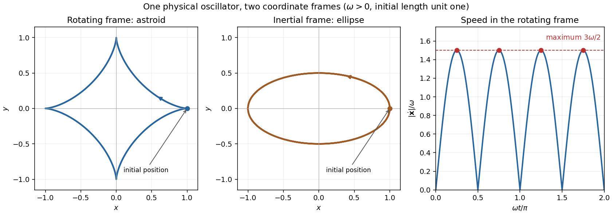

# Paper 4

↑ **Parent:** [Ia](../ia.md)

[https://www.maths.cam.ac.uk/undergrad/pastpapers/files/2001/PaperIA_4.pdf](https://www.maths.cam.ac.uk/undergrad/pastpapers/files/2001/PaperIA_4.pdf)

**Table of contents**

- [1E](#1e)
  - [a](#1e/a)
    - [Solution](#1e/a/solution)
  - [b](#1e/b)
    - [Solution](#1e/b/solution)
- [2E](#2e)
  - [Solution](#2e/solution)
- [3A](#3a)
  - [Solution](#3a/solution)
- [4A](#4a)
  - [Solution](#4a/solution)
- [5E](#5e)
  - [a](#5e/a)
    - [Solution](#5e/a/solution)
  - [b](#5e/b)
    - [Solution](#5e/b/solution)
- [6E](#6e)
  - [Solution](#6e/solution)
- [7E](#7e)
  - [a](#7e/a)
    - [Solution](#7e/a/solution)
  - [b](#7e/b)
    - [Solution](#7e/b/solution)
  - [c](#7e/c)
    - [Solution](#7e/c/solution)
- [8E](#8e)
  - [Solution](#8e/solution)
- [9A](#9a)
  - [Solution](#9a/solution)
- [10A](#10a)
  - [Solution](#10a/solution)
- [11A](#11a)
  - [Solution](#11a/solution)
- [12A](#12a)
  - [Solution](#12a/solution)

## 1E

↑ **Parent:** [Paper 4](paper-4.md)

<h3 id="1e/a">a</h3>

↑ **Parent:** [1E](#1e)

<h4 id="1e/a/solution">Solution</h4>

↑ **Parent:** [A](#1e/a)

Suppose $F:X\to\mathcal P(X)$ were a [surjection](../../../algebra.md#surjective-function) onto the [power set](../../../set.md#power-set) of the [set](../../../set.md) $X$. Form the [subset](../../../set.md#subset)

$$
D=\{x\in X:x\notin F(x)\}.
$$

Surjectivity would give $a\in X$ with $F(a)=D$. But then $a\in D$ holds exactly when $a\notin F(a)=D$, a [contradiction](../../../mathematical-logic.md#contradiction). Hence no such [surjection](../../../algebra.md#surjective-function) exists, and in particular **there is no bijection between a set and its power set**. This is the diagonal construction in [Cantor's theorem](../../../set.md#cantor-s-theorem); it also covers the [empty set](../../../set.md#empty-set), whose [power set](../../../set.md#power-set) has one element.

<h3 id="1e/b">b</h3>

↑ **Parent:** [1E](#1e)

<h4 id="1e/b/solution">Solution</h4>

↑ **Parent:** [B](#1e/b)

**No such set exists.** If $R$ had precisely the [sets](../../../set.md) $x$ satisfying $x\notin x$ as its elements, applying that membership criterion to $R$ itself would give

$$
R\in R\quad\Longleftrightarrow\quad R\notin R,
$$

a [contradiction](../../../mathematical-logic.md#contradiction). This is [Russell's paradox](../../../set-theory.md#russell-s-paradox). It rules out this unrestricted universal collection; a [set](../../../set.md) whose elements happen not to contain themselves is perfectly possible, for example the [empty set](../../../set.md#empty-set).

## 2E

↑ **Parent:** [Paper 4](paper-4.md)

<h3 id="2e/solution">Solution</h3>

↑ **Parent:** [2E](#2e)

For nonnegative [integers](../../../number-theory.md#integer) $n,m$, prove the [hockey-stick identity](../../../combinatorics.md#hockey-stick-identity) by [mathematical induction](../../../foundations-of-mathematics.md#mathematical-induction) on $m$. The [induction base case](../../../foundations-of-mathematics.md#induction-base-case) $m=0$ is $\binom n0=\binom{n+1}0=1$. If the formula holds through $m-1$, [Pascal's identity](../../../combinatorics.md#pascal-s-rule) gives

$$
\sum_{j=0}^m\binom{n+j}j
=\binom{n+m}{m-1}+\binom{n+m}m
=\binom{n+m+1}m.
$$

This supplies the [inductive step](../../../foundations-of-mathematics.md#inductive-step).

A [binary string](../../../computer-science.md#binary-string) containing exactly $n$ zeroes and $j$ ones has length $n+j$. Choosing its $j$ one-positions gives $\binom{n+j}j$ possibilities. Different values of $j$ give disjoint collections, so [counting binary strings with bounded ones](../../../computer-science.md#counting-binary-strings-with-bounded-ones) yields

$$
\boxed{\sum_{j=0}^m\binom{n+j}j=\binom{n+m+1}m.}
$$

This includes $n=0$: the $m+1$ strings are the empty string and the all-one strings of lengths one through $m$.

## 3A

↑ **Parent:** [Paper 4](paper-4.md)

<h3 id="3a/solution">Solution</h3>

↑ **Parent:** [3A](#3a)

For an attractive [central force](../../../physics.md#central-force), the transverse [acceleration](../../../classical-mechanics.md#acceleration) vanishes. In [polar coordinates](../../../calculus.md#polar-coordinates),

$$
2\dot r\dot\theta+r\ddot\theta=0
\quad\Longrightarrow\quad
\frac d{dt}(r^2\dot\theta)=0.
$$

Thus the [specific angular momentum](../../../classical-mechanics.md#specific-angular-momentum) $h=r^2\dot\theta$ is constant. Assume $h\ne0$, so angle can parameterize the [orbit](../../../dynamical-systems.md#orbit-dynamical-system), and put $u=1/r$. Primes denote angle [derivatives](../../../calculus.md#derivative). The [chain rule](../../../calculus.md#chain-rule) gives

$$
\dot\theta=hu^2,\qquad
\dot r=-hu',\qquad
\ddot r=-h^2u^2u'',\qquad
r\dot\theta^2=h^2u^3.
$$

The outward radial component of the attractive [force](../../../classical-mechanics.md#force) is $-f(u)$. Its [Newton's second law](../../../classical-mechanics.md#newton-s-second-law) equation is therefore $m(\ddot r-r\dot\theta^2)=-f(u)$, giving the [Binet equation](../../../classical-mechanics.md#binet-equation)

$$
\boxed{u''+u=\frac{f(u)}{mh^2u^2}.}
$$

The sign reflects $f$ being the positive inward force magnitude. Zero [angular momentum](../../../classical-mechanics.md#angular-momentum) produces radial motion and is outside this angular parametrization.

## 4A

↑ **Parent:** [Paper 4](paper-4.md)

<h3 id="4a/solution">Solution</h3>

↑ **Parent:** [4A](#4a)

Put $M=m_1+m_2$, define the [center of mass](../../../classical-mechanics.md#center-of-mass) $\mathbf R=(m_1\mathbf x_1+m_2\mathbf x_2)/M$, and let $\mathbf r=\mathbf x_1-\mathbf x_2$ be relative [position](../../../classical-mechanics.md#position). Adding the two [Newton's second law](../../../classical-mechanics.md#newton-s-second-law) equations gives

$$
M\ddot{\mathbf R}=\mathbf F_1+\mathbf F_2=0,
\qquad
\boxed{\mathbf R(t)=\mathbf R(0)+t\dot{\mathbf R}(0).}
$$

The [center of mass](../../../classical-mechanics.md#center-of-mass) has constant [velocity](../../../classical-mechanics.md#velocity), by conservation of total [momentum](../../../classical-mechanics.md#momentum).

Subtracting the particle [accelerations](../../../classical-mechanics.md#acceleration) instead gives

$$
\ddot{\mathbf r}=\frac{\mathbf f(\mathbf r)}{m_1}+\frac{\mathbf f(\mathbf r)}{m_2}
=\frac{\mathbf f(\mathbf r)}\mu,
\qquad
\boxed{\mu\ddot{\mathbf r}=\mathbf f(\mathbf r),\quad
\mu=\frac{m_1m_2}{m_1+m_2}.}
$$

Thus relative motion is a one-particle problem with the [reduced mass](../../../classical-mechanics.md#reduced-mass) $\mu$, while [center-of-mass motion](../../../classical-mechanics.md#center-of-mass-motion) is uniform. The same [reduced mass](../../../classical-mechanics.md#reduced-mass) appears in the [kinetic energy](../../../classical-mechanics.md#kinetic-energy) decomposition $T=\tfrac12M|\dot{\mathbf R}|^2+\tfrac12\mu|\dot{\mathbf r}|^2$.

## 5E

↑ **Parent:** [Paper 4](paper-4.md)

<h3 id="5e/a">a</h3>

↑ **Parent:** [5E](#5e)

<h4 id="5e/a/solution">Solution</h4>

↑ **Parent:** [A](#5e/a)

For a [prime number](../../../number-theory.md#prime-number) $p$, the nonzero [residue classes](../../../number-theory.md#residue-class) form the multiplicative [group](../../../group.md) of the [finite field](../../../algebra.md#finite-field) $\mathbb F_p$. Every class has a unique [multiplicative inverse](../../../arithmetic.md#multiplicative-inverse). A class equals its own inverse precisely when $x^2=1$, so $(x-1)(x+1)=0$ in the [field](../../../algebra.md#field) and $x=1$ or $x=-1$.

For an [odd prime](../../../number-theory.md#odd-prime), pair each remaining class with its distinct inverse. Each pair contributes one to the product, leaving

$$
\boxed{(p-1)!\equiv1\cdot(-1)=-1\pmod p.}
$$

For $p=2$, the same congruence is $1\equiv-1\pmod2$. This proves [Wilson's theorem](../../../number-theory.md#wilson-s-theorem).

<h3 id="5e/b">b</h3>

↑ **Parent:** [5E](#5e)

<h4 id="5e/b/solution">Solution</h4>

↑ **Parent:** [B](#5e/b)

Write $r=(p-1)/2$, $O=1\cdot3\cdots(p-2)$ and $E=2\cdot4\cdots(p-1)$. The residues $p-2,p-4,\ldots,p-2r$ are exactly the odd factors of $O$, in reverse order. Hence

$$
O\equiv(-1)^rE\pmod p,
\qquad OE=(p-1)!\equiv-1\pmod p
$$

by [Wilson's theorem](../../../number-theory.md#wilson-s-theorem). It follows that the [odd-residue squared product modulo a prime](../../../number-theory.md#odd-residue-squared-product-modulo-a-prime) is

$$
\boxed{1^2\cdot3^2\cdots(p-2)^2=O^2\equiv(-1)^{r+1}=(-1)^{(p+1)/2}\pmod p.}
$$

Thus it is $-1$ for $p\equiv1\pmod4$ and $1$ for $p\equiv3\pmod4$.

## 6E

↑ **Parent:** [Paper 4](paper-4.md)

<h3 id="6e/solution">Solution</h3>

↑ **Parent:** [6E](#6e)

For finite [sets](../../../set.md) $A_1,\ldots,A_s$, the [inclusion-exclusion principle](../../../combinatorics.md#inclusion-exclusion-principle) states

$$
\left|\bigcup_{i=1}^sA_i\right|
=\sum_{\varnothing\ne J\subseteq\{1,\ldots,s\}}(-1)^{|J|+1}
\left|\bigcap_{j\in J}A_j\right|.
$$

To prove it, count the contribution of an element lying in exactly $r\ge1$ of the [sets](../../../set.md). Its total coefficient is

$$
\sum_{j=1}^r(-1)^{j+1}\binom rj=1-(1-1)^r=1,
$$

by the [binomial theorem](../../../combinatorics.md#binomial-theorem). An element in none contributes zero. Summing these elementwise counts proves the formula. Applying the same argument to [indicator functions](../../../measure-theory.md#indicator-function) and taking [expectations](../../../probability-theory.md#expected-value) proves the corresponding probability formula.

Factor $4199=13\cdot17\cdot19$. An integer is [coprime](../../../number-theory.md#coprime-integers) to this product precisely when none of its three [prime factors](../../../number-theory.md#prime-factor) divides it. [Inclusion-exclusion](../../../combinatorics.md#inclusion-exclusion-principle) applied to the multiples of those [prime numbers](../../../number-theory.md#prime-number) among $1,\ldots,4199$ gives [Euler's totient function](../../../number-theory.md#euler-totient-function)

$$
\begin{aligned}
\varphi(4199)
&=4199-(323+247+221)+(19+17+13)-1\\
&=4199\left(1-\frac1{13}\right)\left(1-\frac1{17}\right)\left(1-\frac1{19}\right)\\
&=12\cdot16\cdot18=\boxed{3456}.
\end{aligned}
$$

For the survey, let $H,D,S$ be the three detestation [events](../../../probability-theory.md#event) and use proportions as [probabilities](../../../probability-theory.md#probability). The union $H\cup D$ is the reported total union with the only-$S$ group removed, so $\mathbb P(H\cup D)=0.90-0.27=0.63$. The two-set [inclusion-exclusion principle](../../../combinatorics.md#inclusion-exclusion-principle) gives $\mathbb P(H\cap D)=0.45+0.28-0.63=0.10$. Removing the all-three group leaves

$$
\boxed{\mathbb P((H\cap D)\setminus S)=0.10-0.06=0.04.}
$$

The required proportion is **4%**. The separately reported total $S$ proportion is consistent with, but unnecessary for, this calculation.

## 7E

↑ **Parent:** [Paper 4](paper-4.md)

<h3 id="7e/a">a</h3>

↑ **Parent:** [7E](#7e)

<h4 id="7e/a/solution">Solution</h4>

↑ **Parent:** [A](#7e/a)

If $p$ is a [prime number](../../../number-theory.md#prime-number) and $p\nmid a$, multiplication by $a$ permutes the nonzero [residue classes](../../../number-theory.md#residue-class) modulo $p$: $ai\equiv aj$ implies $i\equiv j$ because $a$ has a [multiplicative inverse](../../../arithmetic.md#multiplicative-inverse). Multiplying all the permuted classes gives

$$
a^{p-1}(p-1)!\equiv(p-1)!\pmod p.
$$

The [factorial](../../../combinatorics.md#factorial) is a nonzero element of the [finite field](../../../algebra.md#finite-field) $\mathbb F_p$, so cancellation is valid. Therefore

$$
\boxed{a^{p-1}\equiv1\pmod p,}
$$

which is [Fermat's little theorem](../../../number-theory.md#fermat-little-theorem).

<h3 id="7e/b">b</h3>

↑ **Parent:** [7E](#7e)

<h4 id="7e/b/solution">Solution</h4>

↑ **Parent:** [B](#7e/b)

Let $d$ be the [multiplicative order](../../../number-theory.md#multiplicative-order) of $a$ modulo $p$. Use [Euclidean division](../../../number-theory.md#euclidean-division) to write $x=qd+r$, $0\le r<d$. Since $a^d\equiv1$,

$$
a^x\equiv a^r\pmod p.
$$

If $a^x\equiv1$, minimality of $d$ forces $r=0$, so **$d$ divides $x$**. Conversely, $d\mid x$ immediately gives $a^x\equiv1$. For negative [integers](../../../number-theory.md#integer) $x$, powers are interpreted using the [multiplicative inverse](../../../arithmetic.md#multiplicative-inverse) and the same argument applies.

Apply the result to $x=p-1$, using [Fermat's little theorem](../../../number-theory.md#fermat-little-theorem). Then $d\mid p-1$, equivalently

$$
\boxed{p\equiv1\pmod d.}
$$

<h3 id="7e/c">c</h3>

↑ **Parent:** [7E](#7e)

<h4 id="7e/c/solution">Solution</h4>

↑ **Parent:** [C](#7e/c)

If $x^2\equiv-1\pmod p$ with $p$ an [odd prime](../../../number-theory.md#odd-prime), then $x^4\equiv1$ but $x^2\not\equiv1$. The [multiplicative order](../../../number-theory.md#multiplicative-order) consequently divides four and is neither one nor two, so it is **four**. The preceding divisibility result makes $4\mid p-1$ necessary.

For sufficiency, suppose $p\equiv1\pmod4$ and put $r=(p-1)/2$, an [even integer](../../../number-theory.md#even-number). Pair opposite factors in the [factorial](../../../combinatorics.md#factorial):

$$
(p-1)!=\prod_{j=1}^rj(p-j)\equiv(-1)^r(r!)^2=(r!)^2\pmod p.
$$

[Wilson's theorem](../../../number-theory.md#wilson-s-theorem) gives $(r!)^2\equiv-1\pmod p$, explicitly producing a [square root of minus one modulo a prime](../../../number-theory.md#square-root-of-minus-one-modulo-a-prime). Thus

$$
\boxed{\text{For odd }p,\quad x^2\equiv-1\pmod p\text{ is soluble }\Longleftrightarrow p\equiv1\pmod4.}
$$

## 8E

↑ **Parent:** [Paper 4](paper-4.md)

<h3 id="8e/solution">Solution</h3>

↑ **Parent:** [8E](#8e)

[Mathematical induction](../../../foundations-of-mathematics.md#mathematical-induction) consists of an [induction base case](../../../foundations-of-mathematics.md#induction-base-case) $P(1)$ and an [inductive step](../../../foundations-of-mathematics.md#inductive-step) $P(n)\Rightarrow P(n+1)$ for every [positive integer](../../../number-theory.md#positive-integer) $n$. To derive it from the [well-ordering principle](../../../arithmetic.md#well-ordering-principle-for-the-natural-numbers), suppose the [set](../../../set.md) of counterexamples were nonempty and take its least element $n$. The base case excludes $n=1$. If $n>1$, minimality gives $P(n-1)$, and the step then gives $P(n)$, a [contradiction](../../../mathematical-logic.md#contradiction). Hence there are no counterexamples.

For the stated [integer congruence](../../../number-theory.md#integer-congruence), the base case is $9\equiv2\pmod7$. If $9^n\equiv2^n\pmod7$, multiplication and $9\equiv2\pmod7$ give

$$
9^{n+1}\equiv9\cdot2^n\equiv2^{n+1}\pmod7,
$$

completing the induction.

The purported shifted-sum proof has a correct conditional successor calculation, but **the base case is missing and false**: at $n=1$ it would assert $1=1+126$. An [inductive step](../../../foundations-of-mathematics.md#inductive-step) without a true [induction base case](../../../foundations-of-mathematics.md#induction-base-case) cannot establish any instance.

## 9A

↑ **Parent:** [Paper 4](paper-4.md)

<h3 id="9a/solution">Solution</h3>

↑ **Parent:** [9A](#9a)

The [equation of motion in a rotating frame](../../../classical-mechanics.md#equation-of-motion-in-a-rotating-frame) with constant [angular velocity](../../../classical-mechanics.md#angular-velocity) $\boldsymbol\omega$ is

$$
m\left[\ddot{\mathbf x}+2\boldsymbol\omega\times\dot{\mathbf x}
+\boldsymbol\omega\times(\boldsymbol\omega\times\mathbf x)\right]=\mathbf F.
$$

With $\mathbf F=-4m\omega^2\mathbf x$ and $\boldsymbol\omega=(0,0,\omega)$, this becomes

$$
\ddot x-2\omega\dot y+3\omega^2x=0,\qquad
\ddot y+2\omega\dot x+3\omega^2y=0,\qquad
\ddot z+4\omega^2z=0.
$$

The given initial data make $z=0$. For the [complex coordinate](../../../complex-analysis.md#complex-coordinate) $\zeta=x+iy$, the planar equations combine into

$$
\ddot\zeta+2i\omega\dot\zeta+3\omega^2\zeta=0.
$$

Its [characteristic roots](../../../differential-equation.md#characteristic-root-of-a-constant-coefficient-differential-equation) are $i\omega$ and $-3i\omega$. Applying $\zeta(0)=1$, $\dot\zeta(0)=0$ gives $\zeta=\tfrac34e^{i\omega t}+\tfrac14e^{-3i\omega t}$. The triple-angle identities reduce this [astroid motion of a harmonic oscillator in a rotating frame](../../../classical-mechanics.md#astroid-motion-of-a-harmonic-oscillator-in-a-rotating-frame) to

$$
\boxed{(x,y,z)=(\cos^3\omega t,\sin^3\omega t,0).}
$$

It traces an [astroid](../../../algebraic-geometry.md#astroid). Differentiating gives the relative [speed](../../../classical-mechanics.md#speed)

$$
|\dot{\mathbf x}|^2
=9\omega^2\sin^2\omega t\cos^2\omega t
=\frac94\omega^2\sin^2(2\omega t).
$$

For $\omega>0$, its maxima occur at $t=(2n+1)\pi/(4\omega)$, with

$$
\boxed{|\dot{\mathbf x}|_{\max}=\frac{3\omega}{2}.}
$$

This is speed measured in the specified [rotating frame](../../../physics.md#rotating-reference-frame). The same physical motion has inertial complex coordinate $e^{i\omega t}\zeta=\cos(2\omega t)+(i/2)\sin(2\omega t)$, an [ellipse](../../../geometry-and-topology.md#ellipse); its initial [velocity](../../../classical-mechanics.md#velocity) is the frame-rotation contribution even though the initial relative [velocity](../../../classical-mechanics.md#velocity) is zero.

**[Figure 1](#9a/image-the-oscillator-s-astroid-in-rotating-coordinates-ellipse-in-inertial-coordinates-and-maxima-of-relative-speed). The oscillator's astroid in rotating coordinates, ellipse in inertial coordinates, and maxima of relative speed**.

## 10A

↑ **Parent:** [Paper 4](paper-4.md)

<h3 id="10a/solution">Solution</h3>

↑ **Parent:** [10A](#10a)

Let $m=4\pi\rho a^3/3$ be the drop's [mass](../../../classical-mechanics.md#mass), with constant [mass density](../../../fluid-mechanics.md#density) $\rho$. Its volume-growth rule gives $4\pi a^2\dot a=c\pi a^2v$, hence $\dot a=cv/4$ and $\dot m=\rho c\pi a^2v$. The incoming mist is stationary, so the [variable-mass system](../../../classical-mechanics.md#variable-mass-system) momentum balance is

$$
\frac d{dt}(mv)=mg-k\rho\pi a^2v^2.
$$

Expanding the [derivative](../../../calculus.md#derivative) and substituting the accretion rate gives the [accreting raindrop with quadratic drag](../../../classical-mechanics.md#accreting-raindrop-with-quadratic-drag) equations

$$
\boxed{\dot a=\frac c4v,\qquad
\dot v=g-\frac34(c+k)\frac{v^2}a.}
$$

The extra $c$ contribution is the [momentum](../../../classical-mechanics.md#momentum) needed to accelerate collected matter from rest; omitting it would treat the growing drop as a constant-mass particle.

Set $q=v^2/a$ and $B=7c/8+3k/4$. The [chain rule](../../../calculus.md#chain-rule) gives

$$
\begin{aligned}
\dot q
&=\frac{2v\dot v}a-\frac{v^2\dot a}{a^2}\\
&=\frac va\left[2g-\left(\frac74c+\frac32k\right)q\right]
=\boxed{\frac{2v}a(g-Bq)}.
\end{aligned}
$$

To justify the limiting value as well as its stability sign, use $c>0$, as appropriate to volume growth. Divide by $\dot a=cv/4$ and integrate the resulting first-order equation:

$$
\boxed{q(a)=\frac gB+\left(q(a_0)-\frac gB\right)
\left(\frac{a_0}a\right)^{7+6k/c}.}
$$

Thus $q$ remains between two positive constants, its initial value and $g/B$. Since $d\sqrt a/dt=c\sqrt q/8$, the radius is defined for all increasing time and tends to infinity. The correction vanishes, proving the [speed-radius attractor of an accreting raindrop](../../../classical-mechanics.md#speed-radius-attractor-of-an-accreting-raindrop):

$$
\boxed{\frac{v^2}a\longrightarrow\frac g{7c/8+3k/4},\qquad
\dot v\longrightarrow g-\frac{3(c+k)}4\frac gB
=\frac{cg}{7c+6k}<\frac g7.}
$$

The strict inequality uses $k>0$. The growing radius prevents a finite terminal [velocity](../../../classical-mechanics.md#velocity); instead the [acceleration](../../../classical-mechanics.md#acceleration) approaches this positive constant.

## 11A

↑ **Parent:** [Paper 4](paper-4.md)

<h3 id="11a/solution">Solution</h3>

↑ **Parent:** [11A](#11a)

Write $h=r^2\dot\theta$ for the conserved [specific angular momentum](../../../classical-mechanics.md#specific-angular-momentum). Zero [specific orbital energy](../../../classical-mechanics.md#specific-orbital-energy) in the inverse-square [Newtonian gravitational field](../../../classical-mechanics.md#newtonian-gravitational-field) gives

$$
\frac12\left(\dot r^2+\frac{h^2}{r^2}\right)-\frac{GM}r=0.
$$

Define $r_0=h^2/(2GM)$, the [periapsis](../../../classical-mechanics.md#periapsis) radius for a nonradial [parabolic trajectory](../../../classical-mechanics.md#parabolic-trajectory). Then

$$
\dot r^2=\frac{2GM(r-r_0)}{r^2}.
$$

On the outgoing branch, integrate from the [periapsis](../../../classical-mechanics.md#periapsis) time $t_0$ and put $s=\sqrt{r-r_0}$:

$$
\begin{aligned}
t-t_0
&=\frac1{\sqrt{2GM}}\int_{r_0}^r\frac{r'\,dr'}{\sqrt{r'-r_0}}\\
&=\frac2{\sqrt{2GM}}\left(\frac{s^3}3+r_0s\right)
=\frac{\sqrt2}{3\sqrt{GM}}(r+2r_0)\sqrt{r-r_0}.
\end{aligned}
$$

The incoming branch has the opposite sign. Squaring gives the [radius-time relation for a parabolic Kepler orbit](../../../classical-mechanics.md#radius-time-relation-for-a-parabolic-kepler-orbit), a version of the [Barker equation](../../../classical-mechanics.md#barker-equation):

$$
\boxed{(r-r_0)(r+2r_0)^2=\frac92GM(t-t_0)^2.}
$$

Here $r_0$ and $t_0$ are fixed by [angular momentum](../../../classical-mechanics.md#angular-momentum) and the time origin at [periapsis](../../../classical-mechanics.md#periapsis). The relation applies on both branches, with $r\ge r_0$; it is not necessary to solve for the polar angle.

## 12A

↑ **Parent:** [Paper 4](paper-4.md)

<h3 id="12a/solution">Solution</h3>

↑ **Parent:** [12A](#12a)

A coaxial shell of radius $r$ and thickness $dr$ has [mass](../../../classical-mechanics.md#mass) $dm=2\pi\rho l r\,dr$. Integrating squared radius against [mass](../../../classical-mechanics.md#mass), the [moment of inertia of a uniform solid cylinder](../../../classical-mechanics.md#moment-of-inertia-of-a-uniform-solid-cylinder) about its axis is

$$
I=\int_0^a r^2dm=2\pi\rho l\int_0^a r^3dr
=\frac{\pi\rho l a^4}2=\boxed{\frac12Ma^2},
\qquad M=\pi\rho a^2l.
$$

On the smooth incline, no tangential contact [force](../../../classical-mechanics.md#force) produces spin, so the initially stationary cylinder simply slides with [acceleration](../../../classical-mechanics.md#acceleration) $g\sin\theta$. Therefore $t_{\rm slide}=\sqrt{2L/(g\sin\theta)}$.

For [rolling without slipping](../../../classical-mechanics.md#rolling-without-slipping), let $F$ be uphill [static friction](../../../classical-mechanics.md#static-friction) and $A$ the downward translational [acceleration](../../../classical-mechanics.md#acceleration). [Newton's second law](../../../classical-mechanics.md#newton-s-second-law), the rotational [torque](../../../classical-mechanics.md#torque) equation, and the contact constraint give

$$
MA=Mg\sin\theta-F,\qquad
Fa=I\alpha,\qquad A=a\alpha.
$$

With $I=Ma^2/2$, these give $F=MA/2$ and $A=2g\sin\theta/3$. The [rolling-time factor on a straight incline](../../../classical-mechanics.md#rolling-time-factor-on-a-straight-incline) is consequently

$$
\boxed{t_{\rm roll}=\sqrt{\frac{3L}{g\sin\theta}}
=\sqrt{\frac32}\,t_{\rm slide}.}
$$

The required friction is $Mg\sin\theta/3$; the stated no-slip motion presupposes sufficient [static friction](../../../classical-mechanics.md#static-friction). At an instantaneously stationary contact point it does no work. Gravitational [potential energy](../../../classical-mechanics.md#potential-energy) is shared between translational and rotational [kinetic energy](../../../classical-mechanics.md#kinetic-energy), explaining why rolling accelerates more slowly than the smooth slide.

## ↑ Ancestors (8)

1. [Ia](../ia.md)
2. [2001](../../2001.md)
3. [Past exam of the mathematics course of the University of Cambridge](../../../past-exam-of-the-mathematics-course-of-the-university-of-cambridge.md)
4. [Mathematics course of the University of Cambridge](../../../university-of-cambridge.md#mathematics-course-of-the-university-of-cambridge)
5. [Course of the University of Cambridge](../../../university-of-cambridge.md#course-of-the-university-of-cambridge)
6. [University of Cambridge](../../../university-of-cambridge.md)
7. [List of universities](../../../README.md#list-of-universities)
8. [Codex Wiki](../../../README.md)
