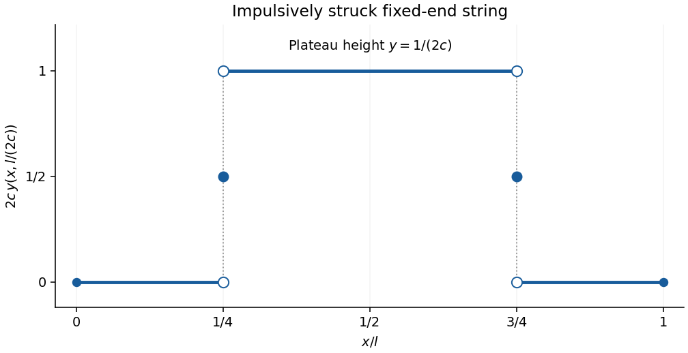

# Paper 3

↑ **Parent:** [Ib](../ib.md)

[https://www.maths.cam.ac.uk/undergrad/pastpapers/files/2001/PaperIB_3.pdf](https://www.maths.cam.ac.uk/undergrad/pastpapers/files/2001/PaperIB_3.pdf)

**Table of contents**

- [1A](#1a)
  - [Solution](#1a/solution)
  - [a](#1a/a)
    - [Solution](#1a/a/solution)
  - [b](#1a/b)
    - [Solution](#1a/b/solution)
- [2G](#2g)
  - [Solution](#2g/solution)
  - [i](#2g/i)
    - [Solution](#2g/i/solution)
  - [ii](#2g/ii)
    - [Solution](#2g/ii/solution)
- [3B](#3b)
  - [Solution](#3b/solution)
- [4B](#4b)
  - [Solution](#4b/solution)
- [5D](#5d)
  - [Solution](#5d/solution)
- [6E](#6e)
  - [Solution](#6e/solution)
- [7C](#7c)
  - [Solution](#7c/solution)
- [8G](#8g)
  - [Solution](#8g/solution)
- [9B](#9b)
  - [Solution](#9b/solution)
- [10F](#10f)
  - [Solution](#10f/solution)
- [11A](#11a)
  - [Solution](#11a/solution)
- [12H](#12h)
  - [Solution](#12h/solution)
- [13B](#13b)
  - [Solution](#13b/solution)
- [14B](#14b)
  - [Solution](#14b/solution)
  - [a](#14b/a)
    - [Solution](#14b/a/solution)
  - [b](#14b/b)
    - [Solution](#14b/b/solution)
- [15D](#15d)
  - [Solution](#15d/solution)
- [16E](#16e)
  - [a](#16e/a)
    - [Solution](#16e/a/solution)
  - [b](#16e/b)
    - [Solution](#16e/b/solution)
- [17C](#17c)
  - [Solution](#17c/solution)
- [18G](#18g)
  - [Solution](#18g/solution)
- [19B](#19b)
  - [Solution](#19b/solution)
- [20F](#20f)
  - [a](#20f/a)
    - [Solution](#20f/a/solution)
  - [b](#20f/b)
    - [Solution](#20f/b/solution)

## 1A

↑ **Parent:** [Paper 3](paper-3.md)

<h3 id="1a/solution">Solution</h3>

↑ **Parent:** [1A](#1a)

A [norm](../../../functional-analysis.md#norm) on a real [vector space](../../../vector-space.md) $V$ is a map $p:V\to[0,\infty)$ satisfying $p(x)=0$ exactly when $x=0$, $p(tx)=|t|p(x)$ for real $t$, and $p(x+y)\le p(x)+p(y)$. Its induced [metric](../../../topological-analysis.md#metric) is $d_p(x,y)=p(x-y)$. The three axioms respectively give definiteness, compatibility with scaling, and the [triangle inequality](../../../topological-analysis.md#triangle-inequality).

<h3 id="1a/a">a</h3>

↑ **Parent:** [1A](#1a)

<h4 id="1a/a/solution">Solution</h4>

↑ **Parent:** [A](#1a/a)

Here [equivalent metrics](../../../topological-analysis.md#equivalence-of-metrics) means that the two [metrics](../../../topological-analysis.md#metric) induce the same [topology](../../../topology.md), and [Lipschitz equivalent norms](../../../functional-analysis.md#equivalent-norms) means that there are constants $c,C>0$ such that $cp(x)\le q(x)\le Cp(x)$ for every $x$.

Suppose first that the inequalities hold. Since they also hold for $x-y$, the identity maps between the two [metric spaces](../../../topological-analysis.md#metric-space) are [Lipschitz continuous](../../../real-analysis.md#lipschitz-continuity). In particular, each is continuous, so the [topologies](../../../topology.md) agree.

Conversely, equality of the [topologies](../../../topology.md) makes the identity from the $p$-[norm](../../../functional-analysis.md#norm) to the $q$-[norm](../../../functional-analysis.md#norm) continuous at zero. There is therefore $\delta>0$ such that $p(x)<\delta$ implies $q(x)<1$. For nonzero $x$, apply this to $\delta x/(2p(x))$ and use the absolute homogeneity of both [norms](../../../functional-analysis.md#norm):

$$
q(x)<\frac{2}{\delta}p(x).
$$

The reverse identity is also continuous, so there is $\varepsilon>0$ with $q(x)<\varepsilon\Rightarrow p(x)<1$. Rescaling again gives $p(x)<2q(x)/\varepsilon$. Thus

$$
\boxed{\frac{\varepsilon}{2}p(x)\le q(x)\le\frac{2}{\delta}p(x).}
$$

The inequalities also hold at zero. This is [topology determines norm equivalence](../../../functional-analysis.md#topology-determines-norm-equivalence); it works in arbitrary dimension because the rescaling argument needs neither a [basis](../../../vector-space.md#basis) nor compactness of a unit sphere.

<h3 id="1a/b">b</h3>

↑ **Parent:** [1A](#1a)

<h4 id="1a/b/solution">Solution</h4>

↑ **Parent:** [B](#1a/b)

Expand using the bilinearity and symmetry of the real [inner product](../../../linear-algebra.md#inner-product):

$$
\|x+y\|^2=\langle x,x\rangle+2\langle x,y\rangle+\langle y,y\rangle,\qquad
\|x-y\|^2=\langle x,x\rangle-2\langle x,y\rangle+\langle y,y\rangle.
$$

Addition proves the [parallelogram law](../../../linear-algebra.md#parallelogram-law),

$$
\boxed{\|x+y\|^2+\|x-y\|^2=2\|x\|^2+2\|y\|^2.}
$$

For the maximum [norm](../../../functional-analysis.md#norm) on $\mathbb R^2$, take $x=(1,0)$ and $y=(0,1)$. All four vectors $x,y,x+y,x-y$ have maximum [norm](../../../functional-analysis.md#norm) one. The left side of the [parallelogram law](../../../linear-algebra.md#parallelogram-law) is then $2$, whereas the right side is $4$. **The maximum norm cannot come from an inner product.**

## 2G

↑ **Parent:** [Paper 3](paper-3.md)

<h3 id="2g/solution">Solution</h3>

↑ **Parent:** [2G](#2g)

Use [separation of variables](../../../partial-differential-equation.md#separation-of-variables) in [Laplace's equation](../../../partial-differential-equation.md#laplace-equation): writing $\phi=R(r)\Theta(\theta)$ gives

$$
\frac{r^2R''+rR'}R=-\frac{\Theta''}{\Theta}=n^2.
$$

Single-valuedness requires $2\pi$-periodicity, so the nonconstant angular [Fourier modes](../../../fourier-analysis.md#fourier-mode) have integer $n\ge1$ and are $\cos n\theta,\sin n\theta$. Their radial solutions are $r^n,r^{-n}$. The zero angular mode has radial solutions $1,\log r$. These give the [harmonic Fourier expansions in planar concentric domains](../../../partial-differential-equation.md#harmonic-fourier-expansions-in-planar-concentric-domains) used below.

For the [annulus](../../../topology.md#annulus-mathematics) with $0<a<b$, constant boundary data suggest a radial [harmonic function](../../../partial-differential-equation.md#harmonic-function) $A+B\log r$. Enforcing both boundary values gives

$$
\boxed{\phi(r,\theta)=1+\frac{\log(r/a)}{\log(b/a)}.}
$$

This has the required boundary values and satisfies $(r\phi_r)_r=0$. It is unique: the difference of two continuous solutions is [harmonic](../../../partial-differential-equation.md#harmonic-function) in the [annulus](../../../topology.md#annulus-mathematics) and zero on both boundary circles, so the [maximum principle for harmonic functions](../../../partial-differential-equation.md#maximum-principle-for-harmonic-functions), applied to the difference and its negative, makes it zero.

<h3 id="2g/i">i</h3>

↑ **Parent:** [2G](#2g)

<h4 id="2g/i/solution">Solution</h4>

↑ **Parent:** [I](#2g/i)

Regularity at $r=0$ excludes every negative radial power and the logarithmic zero mode. Thus the general regular single-valued [harmonic function](../../../partial-differential-equation.md#harmonic-function) on the [disk](../../../topology.md#disk-mathematics) has the form

$$
\boxed{\phi(r,\theta)=A_0+\sum_{n=1}^{\infty}r^n(A_n\cos n\theta+B_n\sin n\theta).}
$$

The coefficients must give a [series](../../../real-analysis.md#series-mathematics) converging locally in the disk; if finiteness and continuity on its boundary are required, the boundary [Fourier series](../../../fourier-series.md) must represent the prescribed finite continuous boundary values. Conversely every such locally convergent expansion is [harmonic](../../../partial-differential-equation.md#harmonic-function), and the [Fourier coefficients](../../../fourier-series.md#fourier-coefficient) on circles show that it includes every regular solution. There is no angular term linear in $\theta$, because it would be multivalued.

<h3 id="2g/ii">ii</h3>

↑ **Parent:** [2G](#2g)

<h4 id="2g/ii/solution">Solution</h4>

↑ **Parent:** [Ii](#2g/ii)

With the usual exterior-boundary interpretation that the [harmonic function](../../../partial-differential-equation.md#harmonic-function) remains bounded as $r\to\infty$, positive radial powers and $\log r$ are excluded. Hence

$$
\boxed{\phi(r,\theta)=A_0+\sum_{n=1}^{\infty}r^{-n}(C_n\cos n\theta+D_n\sin n\theta).}
$$

The [series](../../../real-analysis.md#series-mathematics) must converge locally for $r>1$, with any required finite boundary values at $r=1$. These are the interior [harmonic Fourier expansions in planar concentric domains](../../../partial-differential-equation.md#harmonic-fourier-expansions-in-planar-concentric-domains) after the inversion $r\mapsto1/r$.

If “finite” means only finite at each finite point, without a condition at infinity, growing solutions such as $r\cos\theta$ and $\log r$ are allowed. Under that literal reading the general exterior expansion is

$$
A_0+B_0\log r+\sum_{n\ge1}\big[(A_nr^n+C_nr^{-n})\cos n\theta+(B_nr^n+D_nr^{-n})\sin n\theta\big],
$$

with local convergence. **Boundedness at infinity is the condition selecting the decaying exterior expansion.**

## 3B

↑ **Parent:** [Paper 3](paper-3.md)

<h3 id="3b/solution">Solution</h3>

↑ **Parent:** [3B](#3b)

A convenient version of [Rouché's theorem](../../../complex-analysis.md#rouche-s-theorem) is: if $f,g$ are [holomorphic functions](../../../complex-analysis.md#holomorphic-function) on a neighbourhood of a closed [disk](../../../topology.md#disk-mathematics), and $|g|<|f|$ on its boundary, then $f$ and $f+g$ have the same number of [zeros](../../../polynomial.md#zero-of-a-function), counted with [multiplicity](../../../polynomial.md#multiplicity-mathematics), in the disk. In particular neither has a boundary zero under this comparison.

Put $F_a(z)=z^4-a(z-1)(z^2-1)-1/2$ and use the boundary $|z|=\sqrt2$. There $|z^4|=4$, $1\le|z^2-1|\le3$, and $\sqrt2-1\le|z-1|\le\sqrt2+1$.

For $a=1/3$, compare with $z^4$:

$$
\left|\frac13(z-1)(z^2-1)+\frac12\right|\le\sqrt2+\frac32<4.
$$

Therefore [Rouché's theorem](../../../complex-analysis.md#rouche-s-theorem) gives four [zeros](../../../polynomial.md#zero-of-a-function).

For $a=12$, compare with $-12(z-1)(z^2-1)$:

$$
|z^4-1/2|\le\frac92<12(\sqrt2-1)\le12|z-1||z^2-1|.
$$

The comparison polynomial is $-12(z-1)^2(z+1)$, which has three [zeros](../../../polynomial.md#zero-of-a-function) in the disk, counting the double zero at $1$.

For $a=5$, take $G(z)=(z^2-1)(z-2)(z-3)$. Expansion gives $F_5=G+1/2$. On the boundary,

$$
|G|\ge(2-\sqrt2)(3-\sqrt2)=8-5\sqrt2>\frac12.
$$

The last strict inequality follows from $3/2>\sqrt2$. Only the simple [zeros](../../../polynomial.md#zero-of-a-function) $1,-1$ of $G$ lie inside the disk. Thus, in the requested order,

$$
\boxed{4,\quad3,\quad2.}
$$

## 4B

↑ **Parent:** [Paper 3](paper-3.md)

<h3 id="4b/solution">Solution</h3>

↑ **Parent:** [4B](#4b)

For a [spherical triangle](../../../geometry-and-topology.md#spherical-triangle) on a sphere of radius $R$, bounded by shorter [great circle](../../../geometry-and-topology.md#great-circle) arcs and with interior angles $\alpha,\beta,\gamma$, the [spherical excess formula](../../../differential-geometry.md#spherical-excess-formula), the triangular form of the [Gauss-Bonnet theorem](../../../differential-geometry.md#gauss-bonnet-theorem), is

$$
\boxed{\operatorname{area}=R^2(\alpha+\beta+\gamma-\pi).}
$$

Here is an area proof. On the unit sphere, a [spherical lune](../../../geometry-and-topology.md#spherical-lune) of angle $\alpha$ has area $2\alpha$: rotating around its vertices shows it occupies a fraction $\alpha/(2\pi)$ of the sphere when one uses the full angular width, or directly integrates $\int_0^\alpha\int_0^\pi\sin\theta\,d\theta\,d\varphi$. The three side great circles of the triangle divide the sphere into eight regions, including the triangle $T$ and its antipodal triangle $-T$. Choose, at each vertex, the lune containing $T$, and also its antipodal lune. Each of $T$ and $-T$ is covered three times by these six lunes; each other region is covered once. Thus, with $A$ the area of $T$,

$$
4(\alpha+\beta+\gamma)=4\pi+4A.
$$

This proves $A=\alpha+\beta+\gamma-\pi$; scaling lengths by $R$ scales area by $R^2$.

Radially project each face of the regular [dodecahedron](../../../geometry-and-topology.md#dodecahedron) from its centre onto the unit sphere. Each edge and the origin lie in a plane, so its image is a shorter [great circle](../../../geometry-and-topology.md#great-circle) arc. The twelve faces give congruent [convex regular spherical polygons](../../../geometry-and-topology.md#convex-regular-spherical-polygon) partitioning the sphere. At each projected vertex three congruent face angles fill the tangent plane. Hence each spherical pentagon has angle $2\pi/3$ at each of its five vertices. Splitting a pentagon into three [spherical triangles](../../../geometry-and-topology.md#spherical-triangle) and summing the [spherical excess formula](../../../differential-geometry.md#spherical-excess-formula) gives

$$
\operatorname{area}=5\frac{2\pi}{3}-3\pi=\boxed{\frac\pi3},\qquad
\boxed{\text{each angle}=\frac{2\pi}{3}}.
$$

This also agrees with $4\pi/12$, as required by the spherical partition.

## 5D

↑ **Parent:** [Paper 3](paper-3.md)

<h3 id="5d/solution">Solution</h3>

↑ **Parent:** [5D](#5d)

The equality-constrained [Lagrangian sufficiency theorem](../../../mathematical-optimization.md#lagrange-sufficiency-theorem) says: if $x^*$ is feasible and, for some fixed multipliers, it globally minimizes the [optimization Lagrangian](../../../mathematical-optimization.md#optimization-lagrangian) over all $x$, then it globally minimizes the objective over feasible $x$. On the feasible set the constraint terms vanish, so the two minimizations agree. No convexity assumption is needed for this version once global minimization of the [optimization Lagrangian](../../../mathematical-optimization.md#optimization-lagrangian) has been established.

Let $S_1=\sum_i a_i$, $S_2=\sum_i a_i^2$, and $\Delta=nS_2-S_1^2$. Since

$$
\Delta=n\sum_i(a_i-S_1/n)^2>0,
$$

the two constraints are independent. For the squared [Euclidean norm](../../../functional-analysis.md#euclidean-norm) objective in the original PDF, take

$$
L(x,\lambda,\mu)=\sum_i x_i^2-2\lambda\left(\sum_i x_i-1\right)-2\mu\sum_i a_ix_i.
$$

[Completing the square](../../../polynomial.md#completing-the-square) shows that its unique global minimizer has $x_i=\lambda+\mu a_i$. The constraints become $n\lambda+S_1\mu=1$, $S_1\lambda+S_2\mu=0$, giving $\lambda=S_2/\Delta$, $\mu=-S_1/\Delta$. The [Lagrangian sufficiency theorem](../../../mathematical-optimization.md#lagrange-sufficiency-theorem) therefore gives

$$
\boxed{x_i^*=\frac{S_2-S_1a_i}{nS_2-S_1^2},\qquad \min\sum_i x_i^2=\frac{S_2}{nS_2-S_1^2}.}
$$

For the value, use $\sum_i(x_i^*)^2=\lambda\sum_i x_i^*+\mu\sum_i a_ix_i^*=\lambda$. Uniqueness also follows directly: for every feasible $x$, the cross term in $\sum_i(x_i-x_i^*)^2$ vanishes, so the difference of objectives equals that strictly positive sum unless $x=x^*$. This is the [minimum squared norm under two affine constraints](../../../mathematical-optimization.md#minimum-squared-norm-under-two-affine-constraints).

## 6E

↑ **Parent:** [Paper 3](paper-3.md)

<h3 id="6e/solution">Solution</h3>

↑ **Parent:** [6E](#6e)

Write $\omega(t)=\prod_{i=0}^n(t-x_i)$. If $x$ is an [interpolation node](../../../numerical-analysis.md#interpolation-node), the [polynomial interpolation error](../../../algebra.md#polynomial-interpolation-error) is zero. Otherwise set

$$
K=\frac{f(x)-p(x)}{\omega(x)},\qquad F(t)=f(t)-p(t)-K\omega(t).
$$

The function $F$ has $n+2$ distinct [zeros](../../../polynomial.md#zero-of-a-function): the $n+1$ interpolation nodes and $x$. Repeated [Rolle's theorem](../../../calculus.md#rolle-theorem) therefore gives a point $\xi$ strictly between the smallest and largest of these points with $F^{(n+1)}(\xi)=0$. Since $p^{(n+1)}=0$ and $\omega^{(n+1)}=(n+1)!$, this yields the [polynomial interpolation error](../../../algebra.md#polynomial-interpolation-error)

$$
\boxed{f(x)-p(x)=\frac{f^{(n+1)}(\xi)}{(n+1)!}\prod_{i=0}^n(x-x_i).}
$$

All differentiations are justified by $f\in C^{n+1}[a,b]$. At an interpolation node the same displayed equality holds with any $\xi\in[a,b]$, because the product is zero.

## 7C

↑ **Parent:** [Paper 3](paper-3.md)

<h3 id="7c/solution">Solution</h3>

↑ **Parent:** [7C](#7c)

Call the four given column vectors $v_1,v_2,v_3,v_4$. Direct componentwise calculation gives

$$
v_3=2v_1+\frac12v_2,\qquad v_4=v_1+v_2.
$$

The first two vectors are independent: their first two components give the determinant $1\cdot2-4\cdot2=-6\ne0$. They form a [basis](../../../vector-space.md#basis) of $W$, so $\boxed{\dim W=2}$.

Choose columns $v_1,v_2,0,0,-v_1-v_2$. This gives the [matrix](../../../vector-space.md#matrix)

$$
\boxed{M=\begin{pmatrix}1&4&0&0&-5\\2&2&0&0&-4\\2&-2&0&0&0\\-1&6&0&0&-5\\1&-2&0&0&1\end{pmatrix}.}
$$

Its [image](../../../set-theory.md#image-of-a-function) is exactly $W$, since all its columns belong to $W$ and its first two span $W$. Its column sum is zero, so $(1,1,1,1,1)^T$ belongs to its [kernel](../../../linear-algebra.md#kernel-of-a-linear-map).

All [linear maps](../../../vector-space.md#linear-map) with the stated kernel condition and image contained in $W$ factor uniquely through the [quotient vector space](../../../vector-space.md#quotient-vector-space) $\mathbb R^5/\operatorname{span}\{(1,1,1,1,1)^T\}$. This quotient has dimension four. A [linear map](../../../vector-space.md#linear-map) from it to the two-dimensional $W$ is specified by eight independent real coordinates, so the requested space has dimension $\boxed8$. Requiring the image to equal $W$, instead of being contained in $W$, would not define a vector space; the printed containment is essential.

## 8G

↑ **Parent:** [Paper 3](paper-3.md)

<h3 id="8g/solution">Solution</h3>

↑ **Parent:** [8G](#8g)

Take positive vortex strength $\kappa$ to mean anticlockwise [circulation](../../../fluid-mechanics.md#circulation-physics). A [line vortex](../../../fluid-mechanics.md#line-vortex) at $z_0$ has local [velocity potential](../../../fluid-mechanics.md#velocity-potential) $\kappa\arg(z-z_0)/(2\pi)$. The [image vortex at a plane wall](../../../fluid-mechanics.md#image-vortex-at-a-plane-wall) must have strength $-\kappa$ to enforce zero normal velocity at $y=0$. At the initial instant, a potential is therefore

$$
\boxed{\phi(x,y)=\frac{\kappa}{2\pi}\left[\arg((x-a)+i(y-b))-\arg((x-a)+i(y+b))\right].}
$$

This is a local, multivalued [velocity potential](../../../fluid-mechanics.md#velocity-potential): its [gradient](../../../calculus.md#gradient) is single-valued away from the vortex, but the nonzero [circulation](../../../fluid-mechanics.md#circulation-physics) precludes a globally single-valued potential around it. For a vortex centred at $(X,Y)$, the velocity is

$$
u_x=-\frac{\kappa}{2\pi}\frac{y-Y}{(x-X)^2+(y-Y)^2},\qquad
u_y=\frac{\kappa}{2\pi}\frac{x-X}{(x-X)^2+(y-Y)^2}.
$$

The real vortex and its opposite image give cancelling $u_y$ at the wall. A [point vortex](../../../fluid-mechanics.md#line-vortex) moves with the regular velocity induced by the other vortex, not its singular self-field. Evaluating the image field at $(X,b)$ gives $\dot X=\kappa/(4\pi b)$ and $\dot b=0$. Hence

$$
\boxed{(X(t),Y(t))=\left(a+\frac{\kappa t}{4\pi b},\,b\right).}
$$

The time-dependent [velocity potential](../../../fluid-mechanics.md#velocity-potential) is obtained by replacing $a$ with $X(t)$ above; the image remains at $(X(t),-b)$. Reversing the convention for positive [circulation](../../../fluid-mechanics.md#circulation-physics) reverses the translation direction.

## 9B

↑ **Parent:** [Paper 3](paper-3.md)

<h3 id="9b/solution">Solution</h3>

↑ **Parent:** [9B](#9b)

Use [completing the square](../../../polynomial.md#completing-the-square) in the [Hermitian form](../../../linear-algebra.md#hermitian-form) $x^*Ax$, rather than [unitary diagonalization of a normal matrix](../../../linear-operator-theory.md#unitary-diagonalization-of-a-normal-matrix). The first pivot is one, so

$$
x^*Ax=|x_1+ix_2+2ix_3|^2+2|x_2|^2+(-2-i)\overline{x_2}x_3+(-2+i)\overline{x_3}x_2+|x_3|^2.
$$

A second square completion gives

$$
x^*Ax=|x_1+ix_2+2ix_3|^2+2\left|x_2+\frac{-2-i}{2}x_3\right|^2-\frac32|x_3|^2.
$$

Therefore one answer is

$$
\boxed{D=\operatorname{diag}(1,2,-3/2),\qquad T=\begin{pmatrix}1&i&2i\\0&1&(-2-i)/2\\0&0&1\end{pmatrix}.}
$$

The diagonal entries of $D$ are rational, $\det T=1$, and the displayed identity for every $x$ proves $T^*DT=A$.

If $T$ were a [unitary matrix](../../../linear-operator-theory.md#unitary-matrix), this [matrix congruence](../../../linear-algebra.md#matrix-congruence) would also be a [similarity transformation](../../../linear-algebra.md#similarity-transformation), so the diagonal entries of $D$ would be the [eigenvalues](../../../linear-operator-theory.md#eigenvalue) of $A$. Its [characteristic polynomial](../../../linear-operator-theory.md#characteristic-polynomial) is

$$
\det(tI-A)=t^3-9t^2+17t+3=(t-3)(t^2-6t-1).
$$

Thus its [eigenvalues](../../../linear-operator-theory.md#eigenvalue) are $3,3+\sqrt{10},3-\sqrt{10}$, two of which are irrational. **A unitary factor cannot give a rational diagonal here.** Alternatively, the permitted [rational root theorem](../../../mathematics.md#rational-root-theorem) implies that three rational eigenvalues would all be integers, whereas the quadratic factor has no integer roots.

## 10F

↑ **Parent:** [Paper 3](paper-3.md)

<h3 id="10f/solution">Solution</h3>

↑ **Parent:** [10F](#10f)

In the observer's [rest frame](../../../physics.md#rest-frame), $U=(c,0)$ and $P=(E'/c,\mathbf p')$. The [Lorentz invariance](../../../special-relativity.md#lorentz-invariance) of the [Minkowski inner product](../../../geometry-and-topology.md#minkowski-inner-product) gives $P\cdot U=E'$ and

$$
P\cdot P=\frac{E'^2}{c^2}-|\mathbf p'|^2=m^2c^2.
$$

The relation between [four-momentum](../../../special-relativity.md#four-momentum) and [velocity](../../../classical-mechanics.md#velocity) is $\mathbf p'=E'\mathbf v/c^2$, so

$$
\frac{v^2}{c^2}=\frac{c^2|\mathbf p'|^2}{E'^2}=1-\frac{c^2(P\cdot P)}{(P\cdot U)^2}.
$$

Taking the nonnegative square root proves

$$
\boxed{v=c\sqrt{1-\frac{c^2(P\cdot P)}{(P\cdot U)^2}}.}
$$

For a future-directed massive particle and observer, $P\cdot U>0$ and the expression lies in $[0,1)$; the massless limit, with nonzero energy, gives $v=c$.

## 11A

↑ **Parent:** [Paper 3](paper-3.md)

<h3 id="11a/solution">Solution</h3>

↑ **Parent:** [11A](#11a)

For the [differentiability from continuous partial derivatives](../../../analysis.md#differentiability-from-continuous-partial-derivatives) argument, choose a small box around zero inside the given open set. For $h=(h_1,\ldots,h_p)$ in that box, telescope $f(h)-f(0)$ by changing one coordinate at a time. The one-dimensional [mean value theorem](../../../calculus.md#mean-value-theorem) on the $j$th coordinate segment gives

$$
f(h)-f(0)=\sum_{j=1}^p h_j f_j(\xi_j),
$$

where $\xi_j$ lies on that segment, and therefore $\|\xi_j\|_2\le\|h\|_2$. A zero-length segment contributes zero and needs no choice of intermediate point. Set $L(h)=\sum_j f_j(0)h_j$. For every $\varepsilon>0$, continuity of the finitely many [partial derivatives](../../../calculus.md#partial-derivative) at zero gives $|f_j(\xi_j)-f_j(0)|<\varepsilon/\sqrt p$ when $h$ is sufficiently small. Then the [Cauchy-Schwarz inequality](../../../probability-and-statistics.md#cauchy-schwarz-inequality) gives

$$
|f(h)-f(0)-L(h)|\le\frac{\varepsilon}{\sqrt p}\sum_j|h_j|\le\varepsilon\|h\|_2.
$$

Thus $f$ is [Fréchet differentiable](../../../calculus.md#frechet-differentiability) at zero, with [derivative](../../../calculus.md#derivative) $L$. No continuity of the [partial derivatives](../../../calculus.md#partial-derivative) away from zero was used.

For the supplied one-dimensional function,

$$
g'(s)=\begin{cases}2s\sin(1/s)-\cos(1/s),&s\ne0,\\0,&s=0.\end{cases}
$$

The derivative at zero follows from $g(s)/s=s\sin(1/s)\to0$. For nonzero $s$ the derivative is continuous. At zero, the sequences $s_k=1/(2\pi k)$ and $t_k=1/((2k+1)\pi)$ give derivative values $-1$ and $1$. Since $f_x(x,y)=g'(x)$, **the partial derivative is continuous exactly where $x\ne0$**, irrespective of $y$.

Nevertheless **$f$ is differentiable at every point of the plane**. The one-dimensional function $g$ is differentiable at every real number. At a fixed $(x_0,y_0)$,

$$
g(x_0+h)-g(x_0)=g'(x_0)h+o(|h|),\qquad
g(y_0+k)-g(y_0)=g'(y_0)k+o(|k|).
$$

Their sum has remainder $o(\sqrt{h^2+k^2})$, which proves [Fréchet differentiability](../../../calculus.md#frechet-differentiability) with derivative $(h,k)\mapsto g'(x_0)h+g'(y_0)k$. In particular, at the origin $|f(h,k)|\le h^2+k^2$, an immediate remainder bound. Continuity of all partial derivatives is sufficient, not necessary, for differentiability.

## 12H

↑ **Parent:** [Paper 3](paper-3.md)

<h3 id="12h/solution">Solution</h3>

↑ **Parent:** [12H](#12h)

Assume $0<a<b<l$ for the interior pulse; endpoint variants use the same coefficient formula. Orthogonality of the [Fourier sine basis](../../../fourier-series.md#fourier-sine-basis) gives

$$
b_n=\frac2l\int_a^b\sin\frac{n\pi x}{l}\,dx=\frac{2}{n\pi}\left(\cos\frac{n\pi a}{l}-\cos\frac{n\pi b}{l}\right),\qquad
f(x)\sim\sum_{n\ge1}b_n\sin\frac{n\pi x}{l}.
$$

The [Fourier sine series](../../../fourier-series.md#fourier-sine-series) equals $f$ at its interior continuity points and takes value $1/2$ at the jumps $a,b$; the sine series is zero at both endpoints. Thus it does not retain an arbitrarily assigned value at a jump.

For the string, write $y(x,t)=\sum_{n\ge1}q_n(t)\sin(n\pi x/l)$. The [wave equation on a string](../../../wave-equation.md#wave-equation-on-a-string) gives

$$
q_n''+\left(\frac{n\pi c}{l}\right)^2q_n=0,\qquad q_n(0)=0,\qquad q_n'(0)=\frac2l\sin\frac{n\pi}{4}.
$$

The last equality is the [Fourier sine series](../../../fourier-series.md#fourier-sine-series) of the [Dirac delta](../../../distribution-theory.md#dirac-delta-function) at $l/4$. Solving the modal [ordinary differential equations](../../../differential-equation.md#ordinary-differential-equation) gives

$$
\boxed{y(x,t)=\frac{2}{\pi c}\sum_{n=1}^{\infty}\frac{\sin(n\pi/4)\sin(n\pi x/l)\sin(n\pi ct/l)}n.}
$$

This [impulsively struck fixed-end string](../../../wave-equation.md#impulsively-struck-fixed-end-string) is understood as a [distributional weak solution](../../../partial-differential-equation.md#weak-solution); the initial velocity is a distribution, not a classical continuous function.

To evaluate the requested time, take the odd $2l$-periodic extension $v$ of $\delta(x-l/4)$ and use the [D'Alembert formula](../../../wave-equation.md#d-alembert-s-formula) $y=(2c)^{-1}\int_{x-ct}^{x+ct}v(s)\,ds$. At $ct=l/2$, the interval contains the positive impulse at $l/4$. For $x<l/4$, it also contains the negative reflected impulse at $-l/4$, so the contributions cancel. For $l/4<x<3l/4$ only the positive impulse contributes. For $x>3l/4$ neither contributes. Thus the midpoint-valued [Fourier series](../../../fourier-series.md) gives

$$
\boxed{y\left(x,\frac{l}{2c}\right)=\begin{cases}0,&0\le x<l/4\text{ or }3l/4<x\le l,\\1/(2c),&l/4<x<3l/4,\\1/(4c),&x=l/4\text{ or }x=3l/4.\end{cases}}
$$

The discontinuity values are a convention for the Fourier representative and do not affect the distribution. The sketch shows the reflected negative front cancelling the left portion of the initially generated plateau.

**[Figure 1](#12h/image-fixed-end-string-at-time-l-divided-by-2c-showing-the-plateau-and-midpoint-values-at-the-two-jump-fronts). Fixed-end string at time l divided by 2c, showing the plateau and midpoint values at the two jump fronts**.

## 13B

↑ **Parent:** [Paper 3](paper-3.md)

<h3 id="13b/solution">Solution</h3>

↑ **Parent:** [13B](#13b)

The [product topology](../../../geometry-and-topology.md#product-topology) on $X\times Y$ consists of arbitrary unions of rectangles $U\times V$ with $U\subseteq X$, $V\subseteq Y$ open. Such rectangles form a [basis of a topology](../../../topology.md#basis-of-a-topology): every point lies in one, and intersections of two rectangles are rectangles with open factors.

If $d_X,d_Y$ induce the factor topologies, set

$$
\boxed{d((x,y),(x',y'))=\max\{d_X(x,x'),d_Y(y,y')\}.}
$$

Definiteness and symmetry are immediate. Each factor [triangle inequality](../../../topological-analysis.md#triangle-inequality) bounds its distance by the sum of the two relevant product distances; taking the maximum proves the product [triangle inequality](../../../topological-analysis.md#triangle-inequality). A ball of radius $r$ is exactly $B_X(x,r)\times B_Y(y,r)$, so every metric-open set is product-open. Conversely an open rectangle containing $(x,y)$ contains a product ball with radius the minimum of two suitable factor radii. Hence the [maximum product metric](../../../topological-analysis.md#maximum-product-metric) induces precisely the [product topology](../../../geometry-and-topology.md#product-topology).

A [compact space](../../../topology.md#compact-space) is one for which every [open cover](../../../topology.md#open-cover) has a finite subcover. Let $\mathcal U$ cover $X\times Y$, with both factors compact; if either is empty the result is immediate. For each fixed $x$ and each $y$, choose a rectangle $U_{x,y}\times V_{x,y}$ containing $(x,y)$ and lying in a member of $\mathcal U$. The sets $V_{x,y}$ cover $Y$, so finitely many, indexed by $y_1,\ldots,y_{m_x}$, suffice. Their $X$-neighbourhoods have open intersection

$$
U_x=\bigcap_{j=1}^{m_x}U_{x,y_j},
$$

containing $x$. The finitely many selected members of $\mathcal U$ cover all of $U_x\times Y$. Now the sets $U_x$ cover $X$, so select finitely many of these by compactness of $X$. Taking the union of their finite selections from $\mathcal U$ gives a finite cover of the whole product. **The product of two compact spaces is compact**, without requiring the factors to be Hausdorff.

## 14B

↑ **Parent:** [Paper 3](paper-3.md)

<h3 id="14b/solution">Solution</h3>

↑ **Parent:** [14B](#14b)

In the [upper half-plane model](../../../geometry-and-topology.md#poincare-half-plane-model), [hyperbolic lines](../../../geometry-and-topology.md#hyperbolic-line) are vertical Euclidean rays and semicircles centred on the real axis, equivalently circle arcs meeting the real boundary orthogonally. A semicircle with endpoints $r<s$ is mapped to the imaginary axis by

$$
g(z)=\frac{z-r}{s-z},\qquad \text{matrix representative }\frac1{\sqrt{s-r}}\begin{pmatrix}1&-r\\-1&s\end{pmatrix}\in\operatorname{SL}(2,\mathbb R).
$$

Its determinant is one, and its real endpoints map to $0,\infty$. A vertical line $x=a$ is mapped to the imaginary axis by $z\mapsto z-a$. Thus every hyperbolic line can be carried to a fixed one; composing one such map with the inverse of another proves transitivity of $\operatorname{PSL}(2,\mathbb R)$ on the lines.

Reflection in $x=a$ is $R_a(z)=2a-\overline z$. Reflection in the unit semicircle is $R_\circ(z)=1/\overline z$. The latter fixes the semicircle pointwise, is an involution, and preserves the [hyperbolic metric](../../../geometry-and-topology.md#hyperbolic-metric) because $|dw|=|dz|/|z|^2$ and $\operatorname{Im}w=\operatorname{Im}z/|z|^2$. The vertical reflection similarly preserves $|dz|/\operatorname{Im}z$. Their composition in the specified order is

$$
\boxed{R_aR_\circ(z)=2a-\frac1z.}
$$

<h3 id="14b/a">a</h3>

↑ **Parent:** [14B](#14b)

<h4 id="14b/a/solution">Solution</h4>

↑ **Parent:** [A](#14b/a)

Parallel [hyperbolic lines](../../../geometry-and-topology.md#hyperbolic-line) have one common ideal endpoint and no interior intersection. Move the common endpoint to infinity by a [Möbius transformation](../../../group-theory.md#mobius-transformation). The two lines are then distinct vertical lines $x=a,x=b$. Their [hyperbolic reflections](../../../geometry-and-topology.md#hyperbolic-reflection) have product

$$
R_aR_b(z)=z+2(a-b),
$$

whose $m$th power is $z+2m(a-b)$. Since $a\ne b$, no positive power is the identity.

Ultraparallel [hyperbolic lines](../../../geometry-and-topology.md#hyperbolic-line) have no common endpoint or intersection. To see their common perpendicular explicitly, first map one line to the imaginary axis. The other has two boundary endpoints on the same side, say $0<r<s$ after possibly reflecting. It is a semicircle of centre $(r+s)/2$ and radius $(s-r)/2$. The circle centred at zero with radius $\sqrt{rs}$ meets it orthogonally, since $((r+s)/2)^2=rs+((s-r)/2)^2$, and also meets the imaginary axis orthogonally. It supplies the common perpendicular. Map that perpendicular to the imaginary axis. Orthogonality then makes both lines semicircles centred at zero, of distinct radii $r,s$. This normal form can also be obtained by a real [Möbius transformation](../../../group-theory.md#mobius-transformation) carrying the endpoints of the common perpendicular to $0,\infty$. Their reflections are $z\mapsto r^2/\overline z$ and $z\mapsto s^2/\overline z$, so their product is

$$
z\mapsto\frac{r^2}{s^2}z.
$$

No positive power of this dilation is the identity because $r^2/s^2>0$ and $r\ne s$. Thus **the product has infinite order in both nonintersecting cases**. Geometrically the ultraparallel product is a translation along the common perpendicular through twice the separation of the lines.

<h3 id="14b/b">b</h3>

↑ **Parent:** [14B](#14b)

<h4 id="14b/b/solution">Solution</h4>

↑ **Parent:** [B](#14b/b)

If two [hyperbolic lines](../../../geometry-and-topology.md#hyperbolic-line) intersect, move their intersection to the centre of the [Poincaré disk model](../../../geometry-and-topology.md#poincare-disk-model). Lines through the centre are diameters. Reflection in a diameter making Euclidean angle $\alpha$ with the real axis is $z\mapsto e^{2i\alpha}\overline z$. The composition of two such reflections is the rotation $z\mapsto e^{2i(\alpha-\beta)}z$. The [Poincaré disk model](../../../geometry-and-topology.md#poincare-disk-model) is conformal, so the Euclidean angle difference is the hyperbolic intersection angle $\theta$, up to sign and replacing it by $\pi-\theta$, neither of which changes rationality of $\theta/\pi$.

The rotation has finite order exactly when $m\theta\in\pi\mathbb Z$ for some positive integer $m$, equivalently $\theta/\pi\in\mathbb Q$. If $\theta/\pi=r/s$ in lowest terms, its order is $s$. Conversely, the nonintersecting cases in part(a) have infinite order. Therefore

$$
\boxed{R_1R_2\text{ has finite order precisely when the lines meet at a rational multiple of }\pi.}
$$

## 15D

↑ **Parent:** [Paper 3](paper-3.md)

<h3 id="15d/solution">Solution</h3>

↑ **Parent:** [15D](#15d)

Use the original PDF constraints, whose right sides are $8$ and $9$. Introduce nonnegative surplus variables $s_1,s_2$, slack $s_3$, and artificial variables $a_1,a_2$:

$$
2x_1+x_2-s_1+a_1=8,\qquad x_1+3x_2-s_2+a_2=9,\qquad x_1+s_3=6.
$$

All seven variables are nonnegative. Phase I of the [two-phase simplex method](../../../mathematical-optimization.md#two-phase-simplex) minimizes $w=a_1+a_2$ with initial basis $(a_1,a_2,s_3)$. The initial [simplex dictionary](../../../numerical-analysis.md#simplex-dictionary) is

$$
\begin{aligned}
a_1&=8-2x_1-x_2+s_1,\\a_2&=9-x_1-3x_2+s_2,\\s_3&=6-x_1,\\w&=17-3x_1-4x_2+s_1+s_2.
\end{aligned}
$$

Enter $x_2$ and leave $a_2$: the ratio test gives $\min(8,9/3)=3$. Substituting $x_2=3-x_1/3+s_2/3-a_2/3$ gives

$$
a_1=5-\frac53x_1+s_1-\frac13s_2+\frac13a_2,\qquad
w=5-\frac53x_1+s_1-\frac13s_2+\frac43a_2.
$$

Now enter $x_1$ and leave $a_1$. The bounds from $a_1,x_2,s_3$ are $3,9,6$, so the ratio test selects $3$. The new dictionary is

$$
\begin{aligned}
x_1&=3+\frac35s_1-\frac15s_2-\frac35a_1+\frac15a_2,\\
x_2&=2-\frac15s_1+\frac25s_2+\frac15a_1-\frac25a_2,\\
s_3&=3-\frac35s_1+\frac15s_2+\frac35a_1-\frac15a_2.
\end{aligned}
$$

The associated basic solution has $a_1=a_2=0$ and $w=0$, which is a global minimum because artificial variables are nonnegative. Delete their columns for Phase II. In the remaining basis $(x_1,x_2,s_3)$ the objective is

$$
z=9-p+\frac{9-4p}{5}s_1+\frac{3p-3}{5}s_2.
$$

For $2\le p\le9/4$, both [reduced costs](../../../mathematical-optimization.md#reduced-cost) are nonnegative, so the [simplex method](../../../mathematical-optimization.md#simplex-method) has reached the optimum at $(x_1,x_2)=(3,2)$:

$$
\boxed{z_{\min}=9-p.}
$$

For $9/4<p\le3$, the coefficient of $s_1$ is negative. Enter $s_1$; the ratio test gives $10$ from $x_2$ and $5$ from $s_3$, so $s_3$ leaves. Eliminating $s_1$ gives

$$
x_1=6-s_3,\qquad x_2=1+\frac13s_2+\frac13s_3,\qquad s_1=5+\frac13s_2-\frac53s_3,
$$

and hence

$$
z=18-5p+\frac p3s_2+\left(\frac{4p}{3}-3\right)s_3.
$$

The two reduced costs are now positive, so $(6,1)$ is optimal and

$$
\boxed{z_{\min}=18-5p.}
$$

At $p=9/4$ the whole feasible edge from $(3,2)$ to $(6,1)$ is optimal; both value formulas agree. These dictionaries explicitly carry out both phases rather than inferring the answer solely from a feasible-region sketch.

## 16E

↑ **Parent:** [Paper 3](paper-3.md)

<h3 id="16e/a">a</h3>

↑ **Parent:** [16E](#16e)

<h4 id="16e/a/solution">Solution</h4>

↑ **Parent:** [A](#16e/a)

The [monic orthogonal polynomial](../../../numerical-analysis.md#monic-orthogonal-polynomial) $p_n$ is orthogonal to every [polynomial](../../../polynomial.md) of degree less than $n$, since $p_0,\ldots,p_{n-1}$ form a basis of that polynomial space. Let $r_1,\ldots,r_k$ be its distinct interior roots at which its sign changes, and put $q(x)=\prod_{j=1}^k(x-r_j)$, with $q=1$ if $k=0$. The real polynomial $p_nq$ has constant sign throughout $(a,b)$: multiplication by each linear factor removes its corresponding sign change, while even-multiplicity roots do not change sign. It is not identically zero. Since $w>0$, its weighted integral is nonzero.

If $k<n$, orthogonality instead gives $\int_a^b p_nq\,w\,dx=0$, a contradiction. Thus $k\ge n$. Degree $n$ also gives $k\le n$, so $k=n$ and all roots have multiplicity one, with no roots left outside the interval. Therefore **there are exactly $n$ distinct simple zeros in $(a,b)$**. The weighted inner products are understood to exist, as required by the stipulated orthogonality.

<h3 id="16e/b">b</h3>

↑ **Parent:** [16E](#16e)

<h4 id="16e/b/solution">Solution</h4>

↑ **Parent:** [B](#16e/b)

Let $d_n(x)=\det(xI-A_n)$, and set $d_0=1$, $d_1=x-a_1$. Expansion of the tridiagonal [determinant](../../../linear-algebra.md#determinant) along its last row gives

$$
d_n=(x-a_n)d_{n-1}-b_n^2d_{n-2}.
$$

For the second term, the last-row entry is $-b_n$, its cofactor has negative sign, and the remaining minor has last-column entry $-b_n$ multiplying $d_{n-2}$; their product is $-b_n^2d_{n-2}$. Thus $d_n$ and $p_n$ have identical initial values and recurrence, and induction proves

$$
\boxed{p_n(x)=\det(xI-A_n).}
$$

The [eigenvalues](../../../linear-operator-theory.md#eigenvalue) of the [Jacobi matrix](../../../numerical-analysis.md#jacobi-matrix) $A_n$ are precisely the roots of this [characteristic polynomial](../../../linear-operator-theory.md#characteristic-polynomial). Part(a) therefore gives **all $n$ eigenvalues simple and lying strictly in $(a,b)$**. This conclusion follows from orthogonality as well as symmetry; symmetry alone would establish real eigenvalues but not their interval location.

## 17C

↑ **Parent:** [Paper 3](paper-3.md)

<h3 id="17c/solution">Solution</h3>

↑ **Parent:** [17C](#17c)

Work in the finite-dimensional [vector space](../../../vector-space.md) $V$ implicit in the requested matrix representation and $n=\dim V$. Put $K_j=\ker\alpha^j$, with $K_0=0$. These form an increasing sequence ending in $K_m=V$, and $\alpha(K_j)\subseteq K_{j-1}$. Choose a [basis](../../../vector-space.md#basis) of $K_1$, extend it to a basis of $K_2$, and continue until a basis of $V$ is obtained. Each basis vector introduced at stage $j$ maps into the span of vectors chosen at earlier stages. Its matrix column can therefore have nonzero entries only in earlier rows. This proves that the matrix is **strictly upper triangular**.

For a strictly upper-triangular $n\times n$ [matrix](../../../vector-space.md#matrix) $N$, a nonzero contribution to $(N^r)_{ij}$ requires an index chain $i<i_1<\cdots<i_{r-1}<j$. No such chain has $n$ links among $n$ indices. Consequently $\boxed{\alpha^n=0}$. An example with exact index four is the [Nilpotent Jordan block](../../../linear-operator-theory.md#nilpotent-jordan-block)

$$
\boxed{M=\begin{pmatrix}0&1&0&0\\0&0&1&0\\0&0&0&1\\0&0&0&0\end{pmatrix}.}
$$

Here $M^3$ has entry one in position $(1,4)$ and all others zero, while $M^4=0$.

In the adapted basis, $I+A$ is upper triangular with diagonal entries one, so all its [eigenvalues](../../../linear-operator-theory.md#eigenvalue) are one. This does not persist for the product of two such matrices with unrelated adapted bases. Take

$$
A=\begin{pmatrix}0&1\\0&0\end{pmatrix},\qquad B=\begin{pmatrix}0&0\\1&0\end{pmatrix}.
$$

Both square to zero, but

$$
(I+A)(I+B)=\begin{pmatrix}2&1\\1&1\end{pmatrix}
$$

has [characteristic polynomial](../../../linear-operator-theory.md#characteristic-polynomial) $t^2-3t+1$ and [eigenvalues](../../../linear-operator-theory.md#eigenvalue) $(3\pm\sqrt5)/2$, neither equal to one. The obstruction is that the two nilpotent matrices need not admit a common triangularizing basis.

## 18G

↑ **Parent:** [Paper 3](paper-3.md)

<h3 id="18g/solution">Solution</h3>

↑ **Parent:** [18G](#18g)

For [inviscid flow](../../../fluid-mechanics.md#inviscid-flow) that is also [incompressible flow](../../../fluid-mechanics.md#incompressible-flow) and [irrotational flow](../../../fluid-mechanics.md#irrotational-flow) with [velocity potential](../../../fluid-mechanics.md#velocity-potential) $\mathbf u=\nabla\phi$, the [Euler equations](../../../fluid-mechanics.md#euler-equations-for-an-inviscid-fluid) integrate to the [Unsteady Bernoulli equation](../../../fluid-mechanics.md#unsteady-bernoulli-equation)

$$
\boxed{\left.\frac{\partial\phi}{\partial t}\right|_{\text{fixed laboratory point}}+\frac12|\nabla\phi|^2+\frac p\rho+gz=F(t).}
$$

The same $F(t)$ applies throughout a connected irrotational fluid region; an additive time-dependent potential can absorb it. With gravity absent, fluid at rest at infinity and $\phi\to0$, it is $p_\infty(t)/\rho$.

Take the cylinder centre at laboratory position $(X(t),0)$ with $\dot X=U(t)$, and define $r,\theta$ relative to this moving centre. The circulation-free [potential flow](../../../fluid-mechanics.md#potential-flow) satisfies [Laplace's equation](../../../partial-differential-equation.md#laplace-equation), decays at infinity, and has surface condition $\phi_r(a,\theta)=U\cos\theta$. The $\cos\theta$ harmonic solution is consequently

$$
\boxed{\phi=-\frac{Ua^2}{r}\cos\theta.}
$$

The velocities are $u_r=Ua^2\cos\theta/r^2$ and $u_\theta=Ua^2\sin\theta/r^2$, hence $|\mathbf u|^2=U^2a^4/r^4$.

The time derivative must be taken at fixed laboratory coordinates, not fixed $r,\theta$. At a fixed fluid point $\dot r=-U\cos\theta$, $\dot\theta=U\sin\theta/r$, so

$$
\left.\phi_t\right|_{\rm lab}=-\frac{\dot Ua^2}{r}\cos\theta-\frac{U^2a^2}{r^2}\cos2\theta.
$$

Substituting into the [Unsteady Bernoulli equation](../../../fluid-mechanics.md#unsteady-bernoulli-equation) gives the entire pressure field

$$
\boxed{p(r,\theta,t)=p_\infty(t)+\frac{\rho a^2\dot U}{r}\cos\theta+\frac{\rho U^2a^2}{r^2}\cos2\theta-\frac{\rho U^2a^4}{2r^4}.}
$$

At the cylinder surface this is $p_\infty+\rho a\dot U\cos\theta+\rho U^2(\cos2\theta-1/2)$. Pressure acts against the outward radial normal of the cylinder, so the force per unit length is

$$
F_x=-a\int_0^{2\pi}p(a,\theta,t)\cos\theta\,d\theta=-\rho\pi a^2\dot U,\qquad
F_y=-a\int_0^{2\pi}p(a,\theta,t)\sin\theta\,d\theta=0.
$$

All steady terms cancel by trigonometric orthogonality. Therefore

$$
\boxed{\mathbf F=-\rho\pi a^2\dot U\,\mathbf e_x.}
$$

This identifies the [added mass of a circular cylinder](../../../physics.md#added-mass-of-a-circular-cylinder) as the mass of displaced fluid per unit length. The solution assumes the ambient fluid is initially at rest and has no separately prescribed circulation; these select the usual pure translating-cylinder flow.

## 19B

↑ **Parent:** [Paper 3](paper-3.md)

<h3 id="19b/solution">Solution</h3>

↑ **Parent:** [19B](#19b)

First write $T=\begin{pmatrix}a&b\\0&d\end{pmatrix}$ with $a,d>0$. Direct multiplication gives

$$
E=J_1^{-1}TJ_1T^{-1}=\begin{pmatrix}d/a&-b/a\\-b/a&(a^2+b^2)/(ad)\end{pmatrix}.
$$

The [inner product](../../../linear-algebra.md#inner-product) of its two columns is

$$
-\frac b{a^2}\left(d+\frac{a^2+b^2}{d}\right).
$$

If $E$ is orthogonal this is zero, and positivity of the bracket forces $b=0$. The first column must then have length one, so $d/a=1$. Thus $T=aI$, $E=I$, and $J_1T=TJ_1$.

For the general [QR decomposition](../../../linear-algebra.md#qr-decomposition), apply the [Gram-Schmidt process](../../../linear-algebra.md#gram-schmidt-process) to the ordered columns $v_1,\ldots,v_N$ of the invertible real [matrix](../../../vector-space.md#matrix) $A$. At stage $j$, subtract projections onto the already chosen orthonormal vectors to get $u_j$; independence of the columns gives $u_j\ne0$. Set $q_j=u_j/\|u_j\|$. The [matrix](../../../vector-space.md#matrix) $B$ with columns $q_j$ is orthogonal, and

$$
C=B^TA,\qquad C_{ij}=q_i\cdot v_j,
$$

is upper triangular. Its diagonal entry $C_{jj}=\|u_j\|$ is strictly positive. This proves $A=BC$ with the required properties.

Now suppose $KA=AK$ in dimension $2n$. Substitution of $A=BC$ gives

$$
CKC^{-1}=B^{-1}KB.
$$

The [matrix](../../../vector-space.md#matrix) $K$ is orthogonal, as are $B$ and $B^{-1}$, so this matrix and $E=K^{-1}CKC^{-1}$ are orthogonal. Regard $C$ as upper triangular in $2\times2$ blocks, with invertible diagonal blocks $C_i$. The inverse is upper triangular in the same blocks, by solving the triangular block equations; multiplication by block diagonal $K$ preserves this pattern. Thus $E$ is block upper triangular.

An orthogonal block upper-triangular matrix is block diagonal. Indeed its first two columns are supported in the first two rows and are orthonormal, so span that first coordinate plane. Orthogonality of every subsequent column to them makes its first two entries zero. The remaining lower-right matrix is orthogonal; iterate this argument. Therefore $E=\operatorname{diag}(E_1,\ldots,E_n)$ with each $E_i$ orthogonal. The rule for diagonal blocks of products of block upper-triangular matrices gives

$$
E_i=J_1^{-1}C_iJ_1C_i^{-1}.
$$

Each $C_i$ is itself an upper-triangular real $2\times2$ matrix with positive diagonal. The first calculation gives $E_i=I$. Consequently $E=I$, whence $CK=KC$. Finally $B=AC^{-1}$ is a product of matrices commuting with $K$, so $BK=KB$. We have proved

$$
\boxed{KC=CK,\qquad KB=BK.}
$$

This is [positive-diagonal QR decomposition preserves a complex structure](../../../linear-algebra.md#positive-diagonal-qr-decomposition-preserves-a-complex-structure); the positivity convention is important in the two-dimensional step.

## 20F

↑ **Parent:** [Paper 3](paper-3.md)

<h3 id="20f/a">a</h3>

↑ **Parent:** [20F](#20f)

<h4 id="20f/a/solution">Solution</h4>

↑ **Parent:** [A](#20f/a)

Expand the [wavefunction](../../../quantum-mechanics.md#wave-function) in the complete orthonormal [energy eigenstates](../../../quantum-mechanics.md#energy-eigenstate). The [Time-dependent Schrödinger equation](../../../physics.md#time-dependent-schrodinger-equation) makes each coefficient satisfy $i\hbar\dot a_n(t)=E_na_n(t)$, so

$$
\boxed{\psi(x,t)=\sum_{n=1}^{\infty}a_n e^{-iE_nt/\hbar}\psi_n(x).}
$$

The series is interpreted in the [Hilbert space](../../../hilbert-space.md) norm. Its norm is conserved because the phase factors have modulus one and the [energy eigenstates](../../../quantum-mechanics.md#energy-eigenstate) are orthonormal. For initial data in the domain of the [Hamiltonian operator](../../../quantum-mechanics.md#hamiltonian-quantum-mechanics), this is a strong solution of the equation; for any square-summable coefficients it gives the corresponding [unitary time evolution](../../../quantum-mechanics.md#unitary-time-evolution).

<h3 id="20f/b">b</h3>

↑ **Parent:** [20F](#20f)

<h4 id="20f/b/solution">Solution</h4>

↑ **Parent:** [B](#20f/b)

In the two-dimensional span of the first two [energy eigenstates](../../../quantum-mechanics.md#energy-eigenstate), the measured [observable](../../../quantum-mechanics.md#observable) has matrix $S=\begin{pmatrix}7&24\\24&-7\end{pmatrix}$. Its square is $625I$, and its trace is zero, giving [eigenvalues](../../../linear-operator-theory.md#eigenvalue) $25,-25$. The orthogonal complement has eigenvalue zero. Thus the full spectrum is $\boxed{\{-25,0,25\}}$.

The normalized eigenstates for $-25$ and $25$ are respectively

$$
\chi_- =\frac{3\psi_1-4\psi_2}{5},\qquad \chi_+=\frac{4\psi_1+3\psi_2}{5}.
$$

The lowest measurement outcome prepares $\chi_-$ up to an irrelevant overall phase. The subsequent [unitary time evolution](../../../quantum-mechanics.md#unitary-time-evolution) gives

$$
\chi_-(t)=\frac35e^{-iE_1t/\hbar}\psi_1-\frac45e^{-iE_2t/\hbar}\psi_2.
$$

By the [Born rule](../../../quantum-mechanics.md#born-rule), the probability of measuring the lowest eigenvalue again is the squared projection onto its one-dimensional [eigenspace](../../../linear-operator-theory.md#eigenspace):

$$
\begin{aligned}
P_-&=|\langle\chi_-,\chi_-(t)\rangle|^2=\left|\frac9{25}e^{-iE_1t/\hbar}+\frac{16}{25}e^{-iE_2t/\hbar}\right|^2\\
&=\boxed{\frac{337+288\cos((E_1-E_2)t/\hbar)}{625}}.
\end{aligned}
$$

This is the [two-level quantum return probability](../../../quantum-mechanics.md#two-level-quantum-return-probability) with $q=9/25$. At $t=0$ the probability is one; if the two energies happen to be equal it remains one for every time.

## ↑ Ancestors (8)

1. [Ib](../ib.md)
2. [2001](../../2001.md)
3. [Past exam of the mathematics course of the University of Cambridge](../../../past-exam-of-the-mathematics-course-of-the-university-of-cambridge.md)
4. [Mathematics course of the University of Cambridge](../../../university-of-cambridge.md#mathematics-course-of-the-university-of-cambridge)
5. [Course of the University of Cambridge](../../../university-of-cambridge.md#course-of-the-university-of-cambridge)
6. [University of Cambridge](../../../university-of-cambridge.md)
7. [List of universities](../../../README.md#list-of-universities)
8. [Codex Wiki](../../../README.md)
