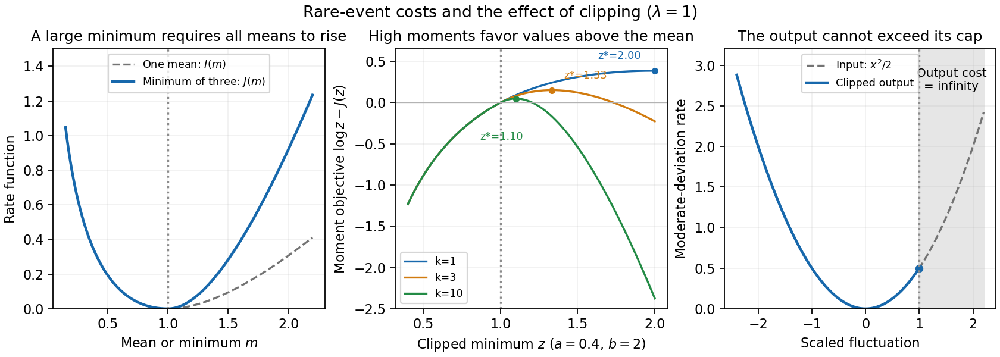

<h1 id="3/e/solution">Solution</h1>

↑ **Parent:** [E](../e.md)

The input admits positive [moderate deviations](../../../../../../moderate-deviation-principle.md) on every scale $L^{(1+\delta)/2}$ with $0<\delta<1$. The [bufferless queue output](../../../../../../bufferless-queue-output.md) retains exactly the same overflow events at thresholds below the cap, so clipping does not improve the exponents on the smaller $\alpha$ scale. It removes every positive burst at thresholds on the larger $\gamma$ scale.

At the cap's own scale $\beta$, apply the [contraction principle for large deviations](../../../../../../contraction-principle-for-large-deviations.md) to the map $x\mapsto\min(x,C)$. The output has [good rate function](../../../../../../good-rate-function.md)

$$
K_\beta(y)=\begin{cases}y^2/(2\lambda),&y\le C,\\+\infty,&y>C.\end{cases}
$$

At $C$ the cost is $\inf_{x\ge C}x^2/(2\lambda)=C^2/(2\lambda)$. Thus the [burstiness of queue input](../../../../../../burstiness-of-queue-input.md) has been reduced in its sufficiently large positive tail, while its smaller-scale rare fluctuations persist. These are the [moderate deviation scales of a clipped Poisson aggregate](../../../../../../moderate-deviation-scales-of-a-clipped-poisson-aggregate.md).

**[Figure 1](#3/e/image-exponential-mean-minimum-costs-moment-optimization-and-the-moderate-deviation-rate-of-clipped-poisson-input). Exponential-mean minimum costs, moment optimization, and the moderate-deviation rate of clipped Poisson input**.

## ↑ Ancestors (11)

1. [E](../e.md)
2. [3](../../3.md)
3. [Paper 26](../../../paper-26-split.md)
4. [Iii](../../../split.md)
5. [2001](../../../../split.md)
6. [Past exam of the mathematics course of the University of Cambridge](../../../../../split.md)
7. [Mathematics course of the University of Cambridge](../../../../../../mathematics-course-of-the-university-of-cambridge.md)
8. [Course of the University of Cambridge](../../../../../../course-of-the-university-of-cambridge.md)
9. [University of Cambridge](../../../../../../university-of-cambridge-split.md)
10. [List of universities](../../../../../../list-of-universities.md)
11. [Codex Wiki](../../../../../../split.md)
