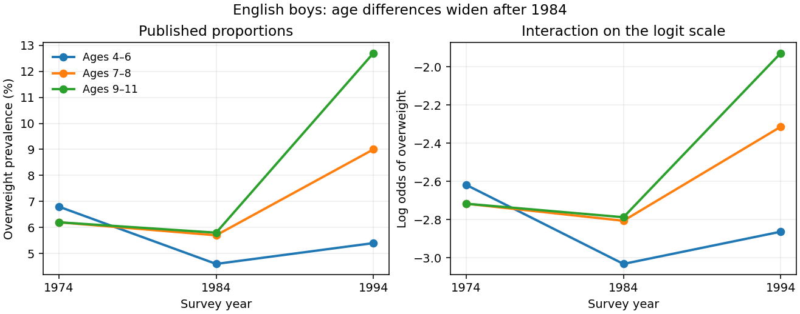

<h1 id="1/solution">Solution</h1>

↑ **Parent:** [1](../1.md)

For a group with sample size $n_s$, let $Y_s$ be its overweight count. The natural sampling model is a [binomial distribution](../../../../../binomial-distribution.md), $Y_s\sim\operatorname{Bin}(n_s,\pi_s)$, with observed proportion $p_s=Y_s/n_s$. A [grouped-binomial logistic regression](../../../../../grouped-binomial-logistic-regression.md) specifies

$$
\operatorname{logit}(\pi_s)=\log\frac{\pi_s}{1-\pi_s}=x_s^T\beta.
$$

Fitting event/nonevent counts, or fitting the proportions with weights $n_s$, gives the same [binomial likelihood](../../../../../binomial-likelihood.md). The weights represent trial counts; unweighted regression of the proportions would give small and large groups the same influence. If printed percentages are rounded, exact original event counts are preferable to manufacturing fractional counts from $n_sp_s$.

Year should ordinarily be a factor with three levels unless a linear trend over time is specifically intended. Country, sex and age group are also possible factors. The actual subset, reference levels and formula are absent from this PDF. For a year-by-age [interaction term](../../../../../interaction-term.md), write

$$
\eta_{at}=\alpha+u_a+v_t+w_{at},\qquad \pi_{at}=\frac{e^{\eta_{at}}}{1+e^{\eta_{at}}}.
$$

With treatment contrasts, $\alpha$ is the baseline [logit](../../../../../logit.md), $u_a$ and $v_t$ are effects at the reference level of the interacting factor, and $w_{at}$ is an additional difference of log-odds differences. Exponentiating a main-effect contrast gives an [odds ratio](../../../../../odds-ratio.md); exponentiating an interaction contrast gives a ratio of [odds ratios](../../../../../odds-ratio.md). It is incorrect to interpret a main effect as a constant effect across the other factor when the [interaction term](../../../../../interaction-term.md) is present.

A coefficient table should be read as estimate, [standard error](../../../../../standard-error.md), a Wald estimate/error ratio and its reference-distribution probability. A whole multi-level [interaction term](../../../../../interaction-term.md) is better tested by a nested [likelihood-ratio test](../../../../../likelihood-ratio-test.md), using the decrease in [deviance](../../../../../exponential-family-deviance.md) and the number of added independent coefficients. Null and residual [deviances](../../../../../exponential-family-deviance.md), residual degrees of freedom, convergence and fitted probabilities should all be checked. Large residual dispersion suggests lack of fit or dependence within sampled schools; a [quasibinomial regression](../../../../../quasibinomial-regression.md) or an appropriate clustered analysis may then be preferable. Residual deviance is not automatically a valid chi-squared goodness-of-fit statistic for sparse groups or after estimating a free dispersion.

An interaction plot should display the group means or fitted probabilities against year, with separate lines for the interacting factor, and should also inspect the link scale. Nonparallel probability curves alone do not establish a logit interaction: even an additive logit model transforms nonlinearly to probabilities. As an independent descriptive illustration, the original study's Table 2 reports English boys' age-specific percentages. The following original plot shows their widening age differences after 1984 on both scales. It uses published descriptive values, not a reconstruction of the absent examination fit. The data are from [https://pmc.ncbi.nlm.nih.gov/articles/PMC26603/](https://pmc.ncbi.nlm.nih.gov/articles/PMC26603/) .

**[Figure 1](#1/image-published-english-boys-overweight-prevalence-by-age-and-year-shown-on-probability-and-logit-scales). Published English boys' overweight prevalence by age and year, shown on probability and logit scales**.

For example, on the probability scale the 1984–1994 increase for the oldest group exceeds that for the youngest by $6.9-0.8=6.1$ percentage points using the rounded table values. On the logit scale the corresponding difference of differences is

$$
\left[\operatorname{logit}(0.127)-\operatorname{logit}(0.058)\right]-\left[\operatorname{logit}(0.054)-\operatorname{logit}(0.046)\right]\approx0.69.
$$

This describes the interaction pattern, but its sampling uncertainty requires the group counts. **The absent output prevents identifying the exam fit's coefficient estimates and significance tests.**

There are two different uses of [Poisson regression](../../../../../poisson-regression.md). A rare-event approximation models $Y_s\sim\operatorname{Pois}(n_s\pi_s)$ with

$$
\log\mathbb E(Y_s)=\log n_s+x_s^T\gamma.
$$

The fixed [offset](../../../../../generalized-linear-model-offset.md) $\log n_s$ accounts for exposure, and exponentiated slopes are [risk ratios](../../../../../risk-ratio.md), not [odds ratios](../../../../../odds-ratio.md). The approximation is most appropriate when probabilities are small; it is not exact for appreciable prevalence because binomial variance is $n_s\pi_s(1-\pi_s)$ rather than $n_s\pi_s$.

An exact alternative stacks event and nonevent counts in each group and fits a [log-linear model](../../../../../log-linear-model.md) with a separate group intercept and event-by-predictor effects:

$$
\mu_{s0}=e^{\gamma_s},\qquad\mu_{s1}=e^{\gamma_s+x_s^T\beta}.
$$

Conditioning on their total $n_s$ gives the binomial event probability $\mu_{s1}/(\mu_{s0}+\mu_{s1})$, whose [logit](../../../../../logit.md) is exactly $x_s^T\beta$. Profiling the group intercepts enforces the observed totals and reproduces the [grouped-binomial logistic regression](../../../../../grouped-binomial-logistic-regression.md). This [Poisson surrogate for a conditional multinomial model](../../../../../poisson-surrogate-for-a-conditional-multinomial-model.md) is exact and should not be confused with the rare-event approximation.

## ↑ Ancestors (10)

1. [1](../1.md)
2. [Paper 28](../../paper-28-split.md)
3. [Iii](../../split.md)
4. [2001](../../../split.md)
5. [Past exam of the mathematics course of the University of Cambridge](../../../../split.md)
6. [Mathematics course of the University of Cambridge](../../../../../mathematics-course-of-the-university-of-cambridge.md)
7. [Course of the University of Cambridge](../../../../../course-of-the-university-of-cambridge.md)
8. [University of Cambridge](../../../../../university-of-cambridge-split.md)
9. [List of universities](../../../../../list-of-universities.md)
10. [Codex Wiki](../../../../../split.md)
