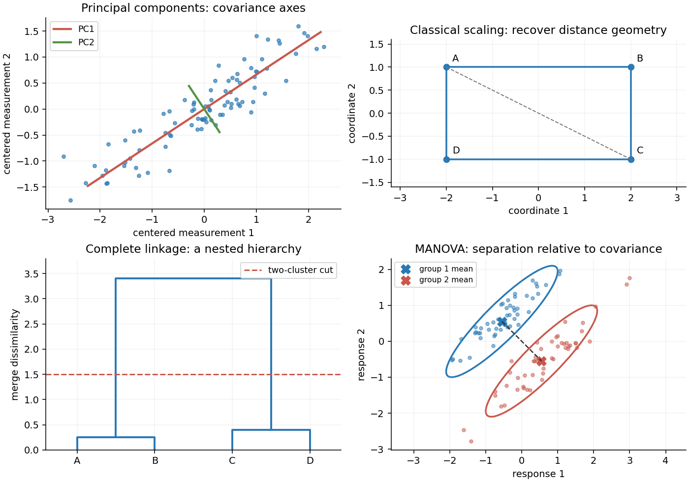

<h1 id="3/a/solution">Solution</h1>

↑ **Parent:** [A](../a.md)

[Principal component analysis](../../../../../../principal-component-analysis.md) replaces correlated measurements by orthogonal linear coordinates ordered by their [variance](../../../../../../variance-split.md). For centered observations collected in an $n\times p$ [matrix](../../../../../../matrix.md) $Z$, write the [sample covariance matrix](../../../../../../sample-covariance-matrix.md) as $S=Z^TZ/(n-1)$. A unit loading vector $a$ gives score vector $Za$ with sample [variance](../../../../../../variance-split.md) $a^TSa$. The [Rayleigh quotient](../../../../../../rayleigh-quotient.md) is maximized by a unit [eigenvector](../../../../../../eigenvector.md) of $S$ for its largest [eigenvalue](../../../../../../eigenvalue.md).

The subsequent [principal components](../../../../../../principal-component.md) maximize the same quadratic form subject to orthogonality to the earlier loading vectors. By the [spectral theorem](../../../../../../spectral-theorem.md), if $S=Q\Lambda Q^T$ with descending eigenvalues, the scores $ZQ$ have diagonal covariance $\Lambda$. Their fractions of explained [variance](../../../../../../variance-split.md) are $\lambda_j/\sum_i\lambda_i$. Repeated [eigenvalues](../../../../../../eigenvalue.md) identify an eigenspace rather than a unique axis.

Keeping the first $q$ [principal components](../../../../../../principal-component.md) gives the rank-$q$ reconstruction $\widehat Z=ZQ_qQ_q^T$. Its squared reconstruction error is

$$
\|Z-\widehat Z\|_F^2=(n-1)\sum_{j>q}\lambda_j.
$$

For any rank-$q$ orthogonal projection $P$, retained variance is $\operatorname{tr}(SP)=\sum_j\lambda_j q_j^TPq_j$. The weights $q_j^TPq_j$ lie in $[0,1]$ and sum to $q$, so this is at most the sum of the largest $q$ eigenvalues. Projecting onto any candidate reconstruction subspace is its best least-squares reconstruction; this proves the minimum-error property and agrees with the [singular value decomposition](../../../../../../singular-value-decomposition.md). Thus **PCA finds the linear subspace preserving the greatest variance, equivalently minimizing squared reconstruction error.** The upper-left sketch shows the first axis aligned with the elongated cloud; the second is perpendicular. A [scree plot](../../../../../../scree-plot.md) and substantive interpretability help choose $q$.

**[Figure 1](#3/a/image-original-sketches-of-principal-components-classical-scaling-hierarchical-clustering-and-multivariate-mean-comparison). Original sketches of principal components, classical scaling, hierarchical clustering and multivariate mean comparison**.

These methods depend on measurement scale. A variable measured in large numerical units can dominate covariance-based [principal component analysis](../../../../../../principal-component-analysis.md); standardizing variables gives [principal component analysis on a correlation matrix](../../../../../../principal-component-analysis-on-a-correlation-matrix.md). Scores summarize patterns, but the method neither establishes causation nor guarantees that the largest-variance directions best predict a separate response.

## ↑ Ancestors (11)

1. [A](../a.md)
2. [3](../../3.md)
3. [Paper 30](../../../paper-30-split.md)
4. [Iii](../../../split.md)
5. [2001](../../../../split.md)
6. [Past exam of the mathematics course of the University of Cambridge](../../../../../split.md)
7. [Mathematics course of the University of Cambridge](../../../../../../mathematics-course-of-the-university-of-cambridge.md)
8. [Course of the University of Cambridge](../../../../../../course-of-the-university-of-cambridge.md)
9. [University of Cambridge](../../../../../../university-of-cambridge-split.md)
10. [List of universities](../../../../../../list-of-universities.md)
11. [Codex Wiki](../../../../../../split.md)
