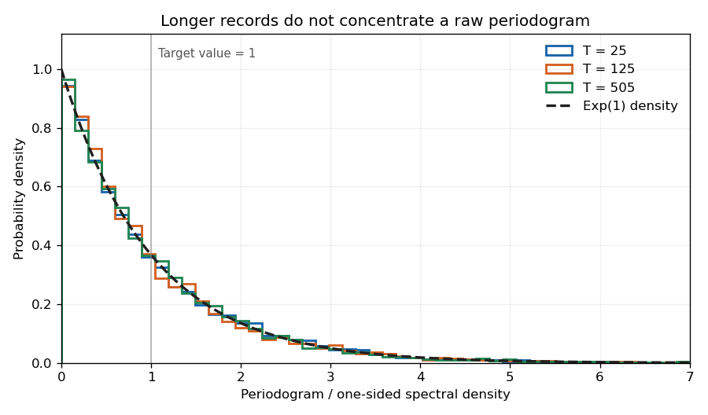

<h1 id="3/solution">Solution</h1>

↑ **Parent:** [3](../3.md)

Write $\sigma_\varepsilon^2$ for the driving [white noise](../../../../../white-noise.md) [variance](../../../../../variance-split.md) and $\Theta(z)=1+\sum_{\ell=1}^q\theta_\ell z^\ell$. The [autoregressive polynomial](../../../../../autoregressive-polynomial.md) factors as

$$
\Phi(z)=1-\frac56z+\frac16z^2
=(1-z/2)(1-z/3).
$$

The [discrete Gaussian white noise](../../../../../discrete-gaussian-white-noise.md) values are [independent](../../../../../independent-random-variables.md). The roots of $\Phi$ are outside the [unit disc](../../../../../unit-disc.md), so expanding $\Theta(z)/\Phi(z)$ gives an absolutely summable [causal time-series representation](../../../../../causal-time-series-representation.md). Hence $x_t$ is a centered [Gaussian](../../../../../normal-distribution.md) process formed from driving [white noise](../../../../../white-noise.md) values at times at most $t$. In particular, for $k>q$, every driving [white noise](../../../../../white-noise.md) value $\varepsilon_{t-\ell}$ with $\ell\leq q$ is [independent](../../../../../independent-random-variables.md) of $x_{t-k}$. The [autocovariance tail recurrence of a causal ARMA process](../../../../../autocovariance-tail-recurrence-of-a-causal-arma-process.md) follows by taking [covariance](../../../../../covariance.md) of the recursion with $x_{t-k}$:

$$
\boxed{\gamma_k-\frac56\gamma_{k-1}+\frac16\gamma_{k-2}=0\qquad(k>q).}
$$

The roots of the [characteristic polynomial](../../../../../characteristic-polynomial.md) of this tail recurrence are $1/2$ and $1/3$. Let $k_0=\max(q-1,0)$. There exist constants $c,d$ such that

$$
\gamma_k=c\,2^{-k}+d\,3^{-k}\qquad(k\geq k_0).
$$

For example, put $a=6\gamma_{k_0+1}-2\gamma_{k_0}$ and $b=3\gamma_{k_0}-6\gamma_{k_0+1}$; then $c=2^{k_0}a$ and $d=3^{k_0}b$ reproduce the two starting values and therefore the whole recurrence. Choose $C$ strictly larger than $|c|+|d|$ and all the finitely many values $2^k|\gamma_k|$ with $0\leq k<k_0$. Symmetry $\gamma_{-k}=\gamma_k$ now gives

$$
\boxed{|\gamma_k|<C\,2^{-|k|}\quad(k\in\mathbb Z).}
$$

For negative $k$ this is stronger than the requested bound with $2^{-k}$. It also proves $\sum_{k\geq1}k|\gamma_k|<\infty$.

For the Fourier calculation, take $D=2m+1$ positive and $T=DN$ positive. The supplied equal-norm trigonometric identities require $j\not\equiv0\pmod D$; the usual intended range is $1\leq j\leq m$. Because $D$ is odd, $2j\not\equiv0\pmod D$ at every such nonzero frequency. The [geometric series](../../../../../geometric-series.md) of $e^{i\omega t}$ and $e^{2i\omega t}$ over $T$ terms vanish. They imply

$$
\sum_{t=1}^T c_ts_t=0,\qquad
\sum_{t=1}^T c_t^2=\sum_{t=1}^Ts_t^2=T/2,
\qquad c_t=\cos(\omega t),\quad s_t=\sin(\omega t).
$$

Other integer values of $j$ reduce modulo $D$; folding a negative frequency changes the sine coefficient only by a sign. The permitted zero frequency is handled below.

Grouping the double [expectation](../../../../../expected-value.md) sum according to the time lag yields

$$
\mathbb E(AB)
=\frac1{\pi T}\sum_{t,u=1}^T\gamma_{u-t}c_ts_u
=\frac1{\pi T}\left[
\gamma_0\sum_{t=1}^Tc_ts_t+
\sum_{k=1}^{T-1}\gamma_k
\left(\sum_{t=1}^{T-k}c_ts_{t+k}+\sum_{t=k+1}^Tc_ts_{t-k}\right)\right].
$$

Replace the two truncated sums for lag $k$ by full sums. Their total is

$$
\sum_{t=1}^Tc_t(s_{t+k}+s_{t-k})
=2\cos(\omega k)\sum_{t=1}^Tc_ts_t=0.
$$

Each replacement adds at most $k$ terms, each of absolute value at most one. This gives the [finite-record Fourier covariance bound](../../../../../finite-record-fourier-covariance-bound.md):

$$
\boxed{|\mathbb E(AB)|\leq\frac1{\pi T}\sum_{k=1}^{T-1}2k|\gamma_k|
=O(T^{-1})\longrightarrow0.}
$$

Both coefficients have [expected value](../../../../../expected-value.md) zero, so this [expectation](../../../../../expected-value.md) is their [covariance](../../../../../covariance.md).

For each finite $T$, $(A,B)$ has a [multivariate normal distribution](../../../../../multivariate-normal-distribution.md) because it is a [linear transformation](../../../../../linear-map.md) of the [Gaussian](../../../../../normal-distribution.md) observation vector. If the [variances](../../../../../variance-split.md) converge to $v_A,v_B$, its [characteristic function](../../../../../characteristic-function.md) converges to

$$
\exp\!\left[-\frac12(v_Au^2+v_Bv^2)\right],
$$

since the cross-covariance tends to zero. This is the [characteristic function](../../../../../characteristic-function.md) of two [independent](../../../../../independent-random-variables.md) centered normal variables; zero limiting [variances](../../../../../variance-split.md) are allowed.

We can calculate the [variance](../../../../../variance-split.md) limits rather than merely assume their existence. Grouping the cosine [covariance](../../../../../covariance.md) sum gives

$$
\mathbb EA^2=\frac1{\pi T}
\left[\gamma_0\sum_tc_t^2+
2\sum_{k=1}^{T-1}\gamma_k\sum_{t=1}^{T-k}c_tc_{t+k}\right].
$$

Over a full record, $\sum_{t=1}^Tc_tc_{t+k}=(T/2)\cos(\omega k)$. Truncation changes this by at most $k$. The same statements hold for the sine products. Consequently

$$
\mathbb EA^2=
\frac{\gamma_0}{2\pi}+\frac1\pi\sum_{k=1}^{T-1}\gamma_k\cos(k\omega)+R_{A,T},
\qquad
|R_{A,T}|\leq\frac2{\pi T}\sum_{k=1}^{T-1}k|\gamma_k|,
$$

and the identical main term and bound apply to $\mathbb EB^2$. Absolute summability now gives

$$
\boxed{\lim\mathbb EA^2=\lim\mathbb EB^2
=\frac{\gamma_0+2\sum_{k\geq1}\gamma_k\cos(k\omega)}{2\pi}.}
$$

Specify the spectral convention to identify this limit. Let

$$
f_2(\omega)=\frac1{2\pi}\sum_{k\in\mathbb Z}\gamma_ke^{-ik\omega},
\qquad
s(\omega)=2f_2(\omega)=
\frac{\gamma_0+2\sum_{k\geq1}\gamma_k\cos(k\omega)}{\pi}.
$$

Here $f_2$ is the two-sided [probability density function](../../../../../probability-density-function.md) on $[-\pi,\pi]$, and $s$ is the one-sided [probability density function](../../../../../probability-density-function.md) on $[0,\pi]$, satisfying $\gamma_k=\int_0^\pi s(\omega)\cos(k\omega)\,d\omega$. Thus each [variance](../../../../../variance-split.md) limit is $f_2(\omega)=s(\omega)/2$. For this particular model, the filter representation also gives

$$
s(\omega)=\frac{\sigma_\varepsilon^2}{\pi}
\frac{|\Theta(e^{-i\omega})|^2}
{|1-e^{-i\omega}/2|^2\,|1-e^{-i\omega}/3|^2}.
$$

For the specified squared-sum estimator, an exact [expectation](../../../../../expected-value.md) calculation uses $c_tc_u+s_ts_u=\cos(\omega(t-u))$:

$$
\mathbb EI(\omega)=
\frac1\pi\left[\gamma_0+
2\sum_{k=1}^{T-1}\left(1-\frac kT\right)\gamma_k\cos(k\omega)\right].
$$

The missing tail and the $k/T$ terms vanish; indeed the bias is $O(T^{-1})$ by the exponential [covariance](../../../../../covariance.md) bound. Therefore **$I(\omega)$ is asymptotically unbiased for the one-sided [probability density function](../../../../../probability-density-function.md) $s(\omega)$**. Under the common two-sided convention its limit in [expectation](../../../../../expected-value.md) is $2f_2(\omega)$, so $I(\omega)/2$ is the appropriately normalized estimator.

At an interior frequency with $s(\omega)>0$, the joint [Gaussian](../../../../../normal-distribution.md) limit gives the [exponential limit of a one-sided periodogram](../../../../../exponential-limit-of-a-one-sided-periodogram.md):

$$
\boxed{\frac{I(\omega)}{s(\omega)}
\xrightarrow{d}\frac{\chi_2^2}{2}=\operatorname{Exp}(1).}
$$

Moreover, for a centered [Gaussian](../../../../../normal-distribution.md) pair,

$$
\operatorname{Var}(A^2+B^2)
=2(\operatorname{Var}A)^2+2(\operatorname{Var}B)^2
+4\operatorname{Cov}(A,B)^2
\longrightarrow s(\omega)^2.
$$

The nondegenerate exponential limiting law rules out [convergence in probability](../../../../../convergence-in-probability.md) to $s(\omega)$. Thus **the unsmoothed [periodogram](../../../../../periodogram.md) is not [consistent](../../../../../consistency-statistics.md) at frequencies with positive spectrum**, despite its asymptotic unbiasedness. If $s(\omega)=0$, the nonnegative estimator has [expectation](../../../../../expected-value.md) tending to zero and is [consistent](../../../../../consistency-statistics.md) there by [Markov's inequality](../../../../../markov-inequality.md). Smoothing an increasing number of nearby ordinates while shrinking the frequency bandwidth can remove the positive-spectrum [variance](../../../../../variance-split.md) obstruction.

For $j\equiv0\pmod D$, the sine coefficient is identically zero and the cosine coefficient is the normalized sum of the observations. The corrected limits are

$$
\mathbb EB^2=0,\qquad
\mathbb EA^2\longrightarrow
\frac{\gamma_0+2\sum_{k\geq1}\gamma_k}{\pi}=s(0).
$$

The joint limit is $(N(0,s(0)),0)$, [independent](../../../../../independent-random-variables.md) in the degenerate sense. The exact [expectation](../../../../../expected-value.md) formula for $I$ still applies and tends to $s(0)$, but now $I(0)/s(0)\xrightarrow{d}\chi_1^2$ when $s(0)>0$, with limiting [variance](../../../../../variance-split.md) $2s(0)^2$. The estimator is again inconsistent. This covers the zero frequency allowed by the printed inequality on $j$.

**[Figure 1](#3/image-normalized-one-sided-periodograms-remain-dispersed-as-the-record-length-increases). Normalized one-sided periodograms remain dispersed as the record length increases**.

The figure uses the allowed cancellation $\Theta=\Phi$, so the observations reduce to [white noise](../../../../../white-noise.md). Orthogonal Fourier projections give the exponential law exactly at each plotted record length; increasing the record does not narrow the individual [periodogram](../../../../../periodogram.md) ordinate.

## ↑ Ancestors (10)

1. [3](../3.md)
2. [Paper 33](../../paper-33-split.md)
3. [Iii](../../split.md)
4. [2001](../../../split.md)
5. [Past exam of the mathematics course of the University of Cambridge](../../../../split.md)
6. [Mathematics course of the University of Cambridge](../../../../../mathematics-course-of-the-university-of-cambridge.md)
7. [Course of the University of Cambridge](../../../../../course-of-the-university-of-cambridge.md)
8. [University of Cambridge](../../../../../university-of-cambridge-split.md)
9. [List of universities](../../../../../list-of-universities.md)
10. [Codex Wiki](../../../../../split.md)
