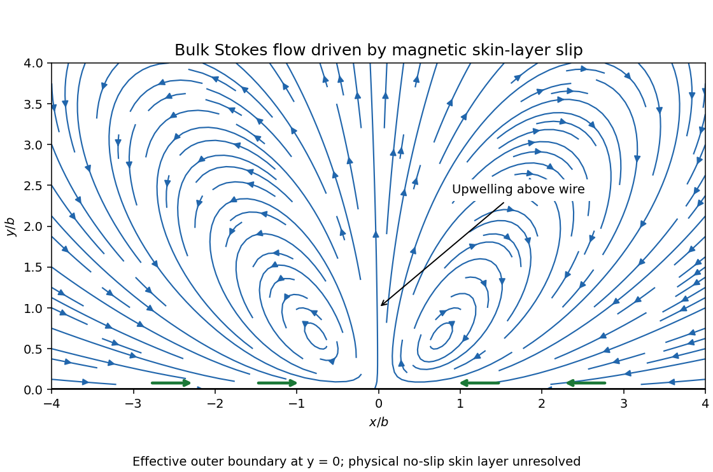

# Paper 36

↑ **Parent:** [Iii](../iii.md)

[https://www.maths.cam.ac.uk/postgrad/part-iii/files/pastpapers/2001/Paper36.pdf](https://www.maths.cam.ac.uk/postgrad/part-iii/files/pastpapers/2001/Paper36.pdf)

**Table of contents**

- [1](#1)
  - [a](#1/a)
    - [Solution](#1/a/solution)
  - [b](#1/b)
    - [Solution](#1/b/solution)
  - [c](#1/c)
    - [Solution](#1/c/solution)
  - [d](#1/d)
    - [Solution](#1/d/solution)
- [2](#2)
  - [a](#2/a)
    - [Solution](#2/a/solution)
  - [b](#2/b)
    - [Solution](#2/b/solution)
  - [c](#2/c)
    - [Solution](#2/c/solution)
  - [d](#2/d)
    - [Solution](#2/d/solution)
- [3](#3)
  - [a](#3/a)
    - [Solution](#3/a/solution)
  - [b](#3/b)
    - [Solution](#3/b/solution)
  - [c](#3/c)
    - [Solution](#3/c/solution)
  - [d](#3/d)
    - [Solution](#3/d/solution)

## 1

↑ **Parent:** [Paper 36](paper-36.md)

<h3 id="1/a">a</h3>

↑ **Parent:** [1](#1)

<h4 id="1/a/solution">Solution</h4>

↑ **Parent:** [A](#1/a)

Use the real [magnetic field](../../../electromagnetism.md#magnetic-field) $\boldsymbol{\mathcal B}$ in the coupled equations; its leading periodic approximation will be $\operatorname{Re}(\mathbf B e^{i\omega t})$. In the conducting [incompressible flow](../../../fluid-mechanics.md#incompressible-flow), the [magnetohydrodynamic momentum equation](../../../astrophysical-fluid-dynamics.md#magnetohydrodynamic-momentum-equation), [resistive induction equation](../../../astrophysical-fluid-dynamics.md#resistive-induction-equation) and [solenoidal magnetic-field constraint](../../../electromagnetism.md#solenoidal-magnetic-field-constraint) are

$$
\begin{aligned}
\rho[\partial_t\mathbf u+(\mathbf u\cdot\nabla)\mathbf u]&=-\nabla p+\rho\nu\nabla^2\mathbf u+\mathbf j\times\boldsymbol{\mathcal B},\\
\partial_t\boldsymbol{\mathcal B}&=\nabla\times(\mathbf u\times\boldsymbol{\mathcal B})+\eta\nabla^2\boldsymbol{\mathcal B},\\
\nabla\cdot\mathbf u&=0,\qquad\nabla\cdot\boldsymbol{\mathcal B}=0,\qquad\mathbf j=\mu_0^{-1}\nabla\times\boldsymbol{\mathcal B}.
\end{aligned}
$$

Here $p$ is [pressure](../../../thermodynamics.md#pressure), $\mathbf j$ is [electric current density](../../../electromagnetism.md#current-density), and $\eta$ and $\nu$ are [magnetic diffusivity](../../../astrophysical-fluid-dynamics.md#magnetic-diffusivity) and [kinematic viscosity](../../../fluid-mechanics.md#kinematic-viscosity). The [moving-conductor Ohm law](../../../astrophysical-fluid-dynamics.md#moving-conductor-ohm-law) gives $\mathbf E=-\mathbf u\times\boldsymbol{\mathcal B}+\eta\nabla\times\boldsymbol{\mathcal B}$.

In the insulating exterior, neglecting [displacement current](../../../electromagnetism.md#displacement-current), the [magnetic field](../../../electromagnetism.md#magnetic-field) is [curl](../../../calculus.md#curl)-free away from the wire and [solenoidal](../../../calculus.md#solenoidal-vector-field). The imposed [electric current density](../../../electromagnetism.md#current-density) supplies

$$
\nabla\times\boldsymbol{\mathcal B}_{\rm ext}=\mu_0J\cos(\omega t)\delta(x)\delta(y+b)\mathbf e_z,
\qquad \nabla\cdot\boldsymbol{\mathcal B}_{\rm ext}=0.
$$

The exterior [electric field](../../../electromagnetism.md#electric-field) also satisfies [Faraday's law](../../../electromagnetism.md#faraday-s-law-of-induction). At the rigid wall, impose the [no-slip boundary condition](../../../viscous-fluid-flow.md#no-slip-boundary-condition) $\mathbf u=0$. At finite conductivity, the [interface conditions for electromagnetic fields](../../../electromagnetism.md#interface-conditions-for-electromagnetic-fields) give continuous normal [magnetic field](../../../electromagnetism.md#magnetic-field), continuous tangential [magnetic field](../../../electromagnetism.md#magnetic-field) for equal permeability and no prescribed singular surface current, and continuous tangential [electric field](../../../electromagnetism.md#electric-field). The normal [electric current density](../../../electromagnetism.md#current-density) is zero at an insulating wall; it is automatic for the present two-dimensional fields with current only along $z$. The induced fields decay far from the wire and wall, and initial conditions, or selection of the periodic state after transients, complete the specification. In the limiting [perfect conductor](../../../electromagnetism.md#perfect-conductor) approximation a surface current can emerge, permitting a tangential-field jump.

The fully coupled solution need not remain monochromatic: a harmonic [magnetic field](../../../electromagnetism.md#magnetic-field) produces both a mean and a twice-frequency [Lorentz force density](../../../electromagnetism.md#lorentz-force-density), and the resulting [velocity](../../../classical-mechanics.md#velocity) can generate further harmonics. The following parts consistently use the leading magnetic response with fluid motion neglected.

<h3 id="1/b">b</h3>

↑ **Parent:** [1](#1)

<h4 id="1/b/solution">Solution</h4>

↑ **Parent:** [B](#1/b)

The [Biot-Savart law](../../../electromagnetism.md#biot-savart-law) gives the [complex amplitude](../../../physics.md#complex-amplitude) of the field from the real wire as

$$
\mathbf B_{\rm wire}(x,y)=\frac{\mu_0J}{2\pi}\frac{-(y+b)\mathbf e_x+x\mathbf e_y}{x^2+(y+b)^2}.
$$

An oppositely directed image current $-J$ at $(0,b)$ gives

$$
\mathbf B_{\rm image}(x,y)=-\frac{\mu_0J}{2\pi}\frac{-(y-b)\mathbf e_x+x\mathbf e_y}{x^2+(y-b)^2}.
$$

The [method of images](../../../mathematics.md#method-of-images) makes the normal oscillating [magnetic field](../../../electromagnetism.md#magnetic-field) vanish at $y=0$, as required when the alternating component cannot penetrate a [perfect conductor](../../../electromagnetism.md#perfect-conductor). The two tangential components reinforce one another there. Consequently

$$
\boxed{\mathbf B(x,0^-)=C(x)\mathbf e_x,\qquad C(x)=-\frac{\mu_0Jb}{\pi(x^2+b^2)}.}
$$

Only the oscillating field is being excluded. A pre-existing steady [magnetic field](../../../electromagnetism.md#magnetic-field) is not erased by the [perfect conductor](../../../electromagnetism.md#perfect-conductor) limit.

<h3 id="1/c">c</h3>

↑ **Parent:** [1](#1)

<h4 id="1/c/solution">Solution</h4>

↑ **Parent:** [C](#1/c)

Let $\delta=\sqrt{2\eta/\omega}$ and $q=(1+i)/\delta$. Within the [magnetic skin layer](../../../astrophysical-fluid-dynamics.md#magnetic-skin-layer), differentiation across the layer dominates differentiation along the wall by the factor $b/\delta$. The leading [resistive induction equation](../../../astrophysical-fluid-dynamics.md#resistive-induction-equation) is therefore

$$
i\omega B_x=\eta\partial_y^2B_x,\qquad B_x(x,0)=C(x),\qquad B_x\longrightarrow0\quad(y/\delta\longrightarrow\infty).
$$

Because $\eta q^2=i\omega$ and $\operatorname{Re}q>0$, its decaying solution is

$$
\boxed{B_x=C(x)e^{-qy},\qquad B_z=0.}
$$

The [solenoidal magnetic-field constraint](../../../electromagnetism.md#solenoidal-magnetic-field-constraint) determines the first smaller component,

$$
B_y=\frac{C'(x)}q e^{-qy},\qquad \frac{B_y}{B_x}=O(\delta/b).
$$

Corrections to $B_x$ from longitudinal diffusion have relative order $(\delta/b)^2$. Thus the zero normal boundary field from the [perfect conductor](../../../electromagnetism.md#perfect-conductor) calculation is a leading-order condition, not an additional exact condition at finite $\eta$. A smaller exterior-field correction matches $B_y$.

To leading order the [electric current density](../../../electromagnetism.md#current-density) is $j_z=qCe^{-qy}/\mu_0$. For two real harmonic fields, the period average of their product is half the real part of the product of one amplitude with the conjugate of the other. Thus the [mean Lorentz force in a magnetic skin layer](../../../astrophysical-fluid-dynamics.md#mean-lorentz-force-in-a-magnetic-skin-layer) is

$$
\overline{\mathbf F}=\frac1{2\mu_0}\operatorname{Re}\{(\nabla\times\mathbf B)\times\mathbf B^*\}.
$$

Its normal component is

$$
\boxed{\overline F_y=\frac{C(x)^2}{2\mu_0\delta}e^{-2y/\delta},\qquad \overline{\mathbf F}=\overline F_y\mathbf e_y\quad\hbox{to leading order}.}
$$

The first possible tangential contribution from the smaller $B_y$ vanishes: it is $-CC'e^{-2y/\delta}\operatorname{Re}(q/q^*)/(2\mu_0)$, and $q/q^*=i$. This cancellation matters in computing the tangential streaming flow.

<h3 id="1/d">d</h3>

↑ **Parent:** [1](#1)

<h4 id="1/d/solution">Solution</h4>

↑ **Parent:** [D](#1/d)

Write $P(x)$ for the outer [pressure](../../../thermodynamics.md#pressure) extrapolated to the wall. The normal balance in the thin [boundary layer](../../../continuum-mechanics.md#boundary-layer) is $p_y=\overline F_y$, giving

$$
p(x,y)=P(x)-\frac{C(x)^2}{4\mu_0}e^{-2y/\delta}.
$$

The spatially varying [magnetic pressure](../../../astrophysical-fluid-dynamics.md#magnetic-pressure) deficit drives a tangential [pressure gradient](../../../fluid-mechanics.md#pressure-gradient). For fixed forcing as $\omega\to\infty$, layer inertia is small compared with [viscous dissipation](../../../stokes-flow.md#viscous-dissipation); explicitly the ratio is $U\delta^2/(\nu b)$. The leading tangential balance is

$$
\rho\nu u_{yy}=p_x=-\frac{CC'}{2\mu_0}e^{-2y/\delta}.
$$

The outer gradient $P'$ contributes only at higher inner order. Matching the leading outer shear gives $u_y\to0$, and the physical [no-slip boundary condition](../../../viscous-fluid-flow.md#no-slip-boundary-condition) gives $u(x,0)=0$. Two integrations yield the [magnetic skin-layer streaming slip](../../../astrophysical-fluid-dynamics.md#magnetic-skin-layer-streaming-slip):

$$
\boxed{u(x,y)=U(x)(1-e^{-2y/\delta}),\qquad U(x)=\frac{\delta^2CC'}{8\mu_0\rho\nu}=\frac{\delta^2}{16\mu_0\rho\nu}\frac{d(C^2)}{dx}.}
$$

For the present field amplitude,

$$
\boxed{U(x)=-\frac{\mu_0J^2b^2\delta^2}{4\pi^2\rho\nu}\frac{x}{(x^2+b^2)^3}.}
$$

Using [incompressibility](../../../fluid-mechanics.md#incompressible-flow) and $v(x,0)=0$ also gives

$$
v(x,y)=-U'(x)\left[y-\frac\delta2(1-e^{-2y/\delta})\right].
$$

Hence $v/u=O(\delta/b)$ in the layer, except at symmetry zeros where a componentwise ratio is inappropriate. In the matching region $\delta\ll y\ll b$, $u\sim U$ and $v\sim-yU'$, up to the smaller displacement term $\delta U'/2$.

**The effective outer boundary conditions are tangential slip $u_{\rm bulk}(x,0)=U(x)$ and zero leading normal velocity $v_{\rm bulk}(x,0)=0$.** These describe the bulk flow extrapolated through the unresolved [magnetic skin layer](../../../astrophysical-fluid-dynamics.md#magnetic-skin-layer); the actual wall remains at rest. For $x>0$ the slip is negative, and for $x<0$ it is positive. Fluid converges along the wall toward the wire, turns upward near $x=0$, and returns outward farther above the wall.

The following original [streamline](../../../fluid-mechanics.md#streamline) sketch uses the small-[Reynolds number](../../../fluid-mechanics.md#reynolds-number) bulk [Stokes flow](../../../stokes-flow.md) for this slip. It illustrates that circulation without claiming that the unspecified bulk [Reynolds number](../../../fluid-mechanics.md#reynolds-number) fixes a unique complete flow. With $X=x/b$, $Y=y/b$, $Z=X+iY$, a dimensionless [stream function](../../../fluid-mechanics.md#stream-function) is

$$
\Psi=Y\operatorname{Re}\left[\frac1{4(Z+i)^3}-\frac{i}{8(Z+i)^2}\right].
$$

Its factor in brackets is [holomorphic](../../../complex-analysis.md#complex-differentiability-at-a-point) in $Y>0$, so $\Psi$ solves the [biharmonic equation](../../../calculus.md#biharmonic-equation); its wall derivative is $\Psi_Y(X,0)=-X/(1+X^2)^3$. Thus it satisfies both effective wall conditions and gives an exact creeping-flow illustration of the derived slip.

**[Figure 1](#1/d/image-bulk-stokes-flow-streamlines-driven-by-magnetic-skin-layer-slip-converging-along-the-wall-and-rising-above-the-wire). Bulk Stokes-flow streamlines driven by magnetic skin-layer slip, converging along the wall and rising above the wire**.

## 2

↑ **Parent:** [Paper 36](paper-36.md)

<h3 id="2/a">a</h3>

↑ **Parent:** [2](#2)

<h4 id="2/a/solution">Solution</h4>

↑ **Parent:** [A](#2/a)

Separate the [velocity field](../../../fluid-mechanics.md#velocity-field) and [magnetic field](../../../electromagnetism.md#magnetic-field) into mean and fluctuating parts,

$$
\mathbf u=\overline{\mathbf U}+\mathbf u',\qquad \mathbf B=\overline{\mathbf B}+\mathbf b',\qquad \langle\mathbf u'\rangle=\langle\mathbf b'\rangle=0.
$$

Assume the [Reynolds averaging](../../../turbulence.md#reynolds-averaging) operation commutes with derivatives and has the usual product rules. Averaging the [resistive induction equation](../../../astrophysical-fluid-dynamics.md#resistive-induction-equation) gives

$$
\partial_t\overline{\mathbf B}=\nabla\times(\overline{\mathbf U}\times\overline{\mathbf B}+\boldsymbol{\mathcal E})+\eta\nabla^2\overline{\mathbf B},\qquad \boldsymbol{\mathcal E}=\langle\mathbf u'\times\mathbf b'\rangle.
$$

The [mean-field electromotive force](../../../astrophysical-fluid-dynamics.md#mean-field-electromotive-force) is the contribution through which small-scale motions affect the large-scale [magnetic field](../../../electromagnetism.md#magnetic-field). If the mean field varies slowly compared with the fluctuation scales, its response can be expanded in the mean field and its spatial derivatives. With homogeneous isotropic statistics, the leading terms are

$$
\boxed{\boldsymbol{\mathcal E}=\alpha\overline{\mathbf B}-\beta\nabla\times\overline{\mathbf B}.}
$$

The [alpha effect](../../../astrophysical-fluid-dynamics.md#alpha-effect) is the term parallel to the mean field. Since an electromotive response is a polar vector whereas a [magnetic field](../../../electromagnetism.md#magnetic-field) is axial, isotropic $\alpha$ is a [pseudoscalar](../../../quantum-mechanics.md#pseudoscalar); reflection-symmetric statistics force it to vanish. Nonzero [kinetic helicity](../../../fluid-mechanics.md#hydrodynamical-helicity) supplies the required handedness. The [turbulent diffusivity](../../../turbulence.md#eddy-diffusivity) term transports and smooths the mean field; constant positive $\beta$ adds $\beta\nabla^2\overline{\mathbf B}$ to its evolution.

One controlled calculation is [first-order smoothing](../../../astrophysical-fluid-dynamics.md#first-order-smoothing-approximation). For negligible mean flow, omit the fluctuating nonlinear product in the fluctuation induction equation, obtaining

$$
(\partial_t-\eta\nabla^2)\mathbf b'=\nabla\times(\mathbf u'\times\overline{\mathbf B}).
$$

For [incompressible flow](../../../fluid-mechanics.md#incompressible-flow) this forcing is $(\overline{\mathbf B}\cdot\nabla)\mathbf u'-(\mathbf u'\cdot\nabla)\overline{\mathbf B}$. A short-memory approximation of duration $\tau$ replaces the inverse temporal response by multiplication by $\tau$. Substitution into the [mean-field electromotive force](../../../astrophysical-fluid-dynamics.md#mean-field-electromotive-force) then uses isotropy:

$$
\begin{aligned}
\epsilon_{ijk}\langle u'_j\partial_\ell u'_k\rangle&=-\frac13\langle\mathbf u'\cdot\nabla\times\mathbf u'\rangle\delta_{i\ell},\\
\langle u'_ju'_\ell\rangle&=\frac13\langle|\mathbf u'|^2\rangle\delta_{j\ell}.
\end{aligned}
$$

Consequently

$$
\boxed{\alpha\simeq-\frac\tau3\langle\mathbf u'\cdot\nabla\times\mathbf u'\rangle,\qquad \beta\simeq\frac\tau3\langle|\mathbf u'|^2\rangle.}
$$

The first sign follows by taking the trace of the alpha-response tensor: $\epsilon_{ijk}u'_j\partial_i u'_k=-\mathbf u'\cdot\nabla\times\mathbf u'$. This establishes the [helicity formula for isotropic first-order smoothing](../../../astrophysical-fluid-dynamics.md#helicity-formula-for-isotropic-first-order-smoothing). Its controlled regimes include small [magnetic Reynolds number](../../../astrophysical-fluid-dynamics.md#magnetic-reynolds-number) or sufficiently short fluctuation [correlation time](../../../time-series.md#correlation-time). Outside such a closure, the coefficients involve response-weighted time correlations; an instantaneous helicity formula is not universal.

<h3 id="2/b">b</h3>

↑ **Parent:** [2](#2)

<h4 id="2/b/solution">Solution</h4>

↑ **Parent:** [B](#2/b)

An explicit example avoids an unspecified [correlation time](../../../time-series.md#correlation-time). For each coordinate axis $\mathbf e_j$, choose transverse unit vectors $\mathbf a_j,\mathbf b_j$ with $\mathbf e_j\times\mathbf a_j=\mathbf b_j$, and take the three real [circular polarizations](../../../electromagnetism.md#circular-polarization)

$$
\mathbf u_j=U(\mathbf a_j\cos\phi_j-\sigma\mathbf b_j\sin\phi_j),\qquad \phi_j=kx_j-\Omega t,\qquad \sigma=\pm1.
$$

The propagation directions are mutually perpendicular and all three waves have the same handedness. Direct differentiation gives

$$
\nabla\times\mathbf u_j=\sigma k\mathbf u_j,\qquad \nabla^2\mathbf u_j=-k^2\mathbf u_j,\qquad \mathbf u_j\times\partial_{\phi_j}\mathbf u_j=-\sigma U^2\mathbf e_j.
$$

A spatial average over the periodic cell removes cross terms between different waves. Hence the mean [kinetic helicity](../../../fluid-mechanics.md#hydrodynamical-helicity) of their sum is

$$
\mathcal H=\langle\mathbf u\cdot\nabla\times\mathbf u\rangle=3\sigma kU^2.
$$

The sum has isotropic second moments, $\langle u_i u_j\rangle=U^2\delta_{ij}$.

For a locally uniform test [magnetic field](../../../electromagnetism.md#magnetic-field) $\overline{\mathbf B}$, the periodic [first-order smoothing](../../../astrophysical-fluid-dynamics.md#first-order-smoothing-approximation) response obeys

$$
(\partial_t-\eta\nabla^2)\mathbf b_j=k\overline B_j\partial_{\phi_j}\mathbf u_j.
$$

Set $a=\eta k^2>0$. Since $\partial_t=-\Omega\partial_\phi$ and $\partial_\phi^2\mathbf u_j=-\mathbf u_j$, direct substitution gives the response after transients decay:

$$
\mathbf b_j=\frac{k\overline B_j}{a^2+\Omega^2}(a\partial_{\phi_j}\mathbf u_j-\Omega\mathbf u_j).
$$

The term proportional to $\mathbf u_j$ contributes no [cross product](../../../vector-space.md#cross-product) with that same wave. Cross terms between distinct waves average to zero. Therefore

$$
\boldsymbol{\mathcal E}=\sum_j\langle\mathbf u_j\times\mathbf b_j\rangle=-\frac{\sigma kU^2a}{a^2+\Omega^2}\overline{\mathbf B},
$$

and the [isotropic alpha effect of three helical traveling waves](../../../astrophysical-fluid-dynamics.md#isotropic-alpha-effect-of-three-helical-traveling-waves) is

$$
\boxed{\alpha=-\frac{a}{3(a^2+\Omega^2)}\mathcal H,\qquad a=\eta k^2.}
$$

This is the alpha-helicity relation with the exact response time $\tau_{\rm eff}=a/(a^2+\Omega^2)$ for these monochromatic waves. In the quasistatic limit $\Omega=0$, $\alpha=-\mathcal H/(3\eta k^2)$. A single wave would give an anisotropic response along its propagation direction; the three equal waves make the response tensor a scalar multiple of the identity. The calculation retains the validity assumptions of [first-order smoothing](../../../astrophysical-fluid-dynamics.md#first-order-smoothing-approximation), rather than extrapolating the formula to arbitrary fluctuation amplitude.

<h3 id="2/c">c</h3>

↑ **Parent:** [2](#2)

<h4 id="2/c/solution">Solution</h4>

↑ **Parent:** [C](#2/c)

With no mean flow and constant isotropic coefficients, the [mean-field dynamo](../../../astrophysical-fluid-dynamics.md#mean-field-dynamo) equation is

$$
\partial_t\overline{\mathbf B}=\alpha\nabla\times\overline{\mathbf B}+\eta_T\nabla^2\overline{\mathbf B},\qquad \nabla\cdot\overline{\mathbf B}=0,\qquad \eta_T=\eta+\beta>0.
$$

If the symbol $\beta$ already denotes the total diffusivity in the chosen mean-field convention, replace $\eta_T$ by $\beta$. Let $\nabla\times\mathbf B_0=\kappa\mathbf B_0$. This [Beltrami field](../../../electromagnetism.md#beltrami-field) is [solenoidal](../../../calculus.md#solenoidal-vector-field) for $\kappa\ne0$, and taking its [curl](../../../calculus.md#curl) again gives $\nabla^2\mathbf B_0=-\kappa^2\mathbf B_0$. Thus

$$
\boxed{\overline{\mathbf B}(\mathbf x,t)=e^{st}\mathbf B_0(\mathbf x),\qquad s=\alpha\kappa-\eta_T\kappa^2.}
$$

For example, $\mathbf B_0=(\cos kz,-\sin kz,0)$ has $\kappa=k$, whereas reversing the sine sign gives $\kappa=-k$. Choose the helicity sign to agree with $\alpha$. The [homogeneous alpha-squared dynamo growth criterion](../../../astrophysical-fluid-dynamics.md#homogeneous-alpha-squared-dynamo-growth-criterion) is then

$$
\boxed{0<|\kappa|<\frac{|\alpha|}{\eta_T}.}
$$

On an unbounded or suitably periodic domain with freely selectable [wavenumber](../../../wave-equation.md#wavenumber), this gives exponentially growing modes for every $\alpha\ne0$. Maximizing their [growth rate](../../../wave-equation.md#growth-rate) gives $\kappa_* =\alpha/(2\eta_T)$ and $s_{\max}=\alpha^2/(4\eta_T)$. In a specified bounded domain, the permitted modes and boundary conditions impose a threshold; the optimal wavelength must also remain large compared with the turbulent scale for [mean-field electrodynamics](../../../astrophysical-fluid-dynamics.md#mean-field-electrodynamics) to apply.

**A nonzero alpha effect is necessary in this constant-coefficient model.** If $\alpha=0$, the mean equation is pure diffusion and the claimed growing modes do not exist. Positivity of $\beta$ alone does not imply growth.

<h3 id="2/d">d</h3>

↑ **Parent:** [2](#2)

<h4 id="2/d/solution">Solution</h4>

↑ **Parent:** [D](#2/d)

The central implication is that a helical conducting flow can continually regenerate a large-scale [magnetic field](../../../electromagnetism.md#magnetic-field), rather than merely stretch an existing component for a finite time. The [alpha effect](../../../astrophysical-fluid-dynamics.md#alpha-effect) competes with microscopic and [turbulent diffusivity](../../../turbulence.md#eddy-diffusivity), so [dynamo action](../../../astrophysical-fluid-dynamics.md#dynamo-action) requires a sufficiently strong regenerative response on a sufficiently large scale.

In a [planetary dynamo](../../../planetary-science.md#planetary-dynamo), convection in an electrically conducting interior provides motion. Rotation through the [Coriolis force](../../../physics.md#coriolis-force), together with [density stratification](../../../gravity-wave.md#density-stratification) and boundaries, can give the motion a preferred handedness and nonzero [kinetic helicity](../../../fluid-mechanics.md#hydrodynamical-helicity). This makes the [alpha effect](../../../astrophysical-fluid-dynamics.md#alpha-effect) plausible, although its sign and magnitude vary spatially. A [geodynamo](../../../planetary-science.md#geodynamo) must also satisfy the magnetic matching conditions at the core boundaries and the global excitation threshold. Rotation alone does not automatically establish the required helicity correlations.

For stellar and galactic fields, [differential rotation](../../../astrophysical-fluid-dynamics.md#differential-rotation) supplies the [Omega effect](../../../astrophysical-fluid-dynamics.md#omega-effect), converting a [poloidal magnetic field](../../../astrophysical-fluid-dynamics.md#poloidal-magnetic-field) into a [toroidal magnetic field](../../../astrophysical-fluid-dynamics.md#toroidal-magnetic-field). An [alpha effect](../../../astrophysical-fluid-dynamics.md#alpha-effect) can regenerate the poloidal component, closing an [alpha-Omega dynamo](../../../astrophysical-fluid-dynamics.md#alpha-omega-dynamo) loop. The [alpha-squared dynamo](../../../astrophysical-fluid-dynamics.md#alpha-squared-dynamo) provides another possibility when sufficiently helical motions dominate over shear. A large-scale nearly axisymmetric mean field is compatible with the [Cowling anti-dynamo theorem](../../../astrophysical-fluid-dynamics.md#cowling-anti-dynamo-theorem) because the fluctuating motions and fields that generate the [mean-field electromotive force](../../../astrophysical-fluid-dynamics.md#mean-field-electromotive-force) need not be axisymmetric.

The growing [Beltrami field](../../../electromagnetism.md#beltrami-field) calculation is a kinematic onset model, not a prediction of unlimited growth. The growing [Lorentz force density](../../../electromagnetism.md#lorentz-force-density) modifies the flow, leading to [dynamo quenching](../../../astrophysical-fluid-dynamics.md#dynamo-quenching) and saturation. In nearly ideal closed systems, conserved [magnetic helicity](../../../electromagnetism.md#magnetic-helicity) constrains the simultaneous large- and small-scale field evolution; helicity transport through boundaries and finite resistivity can therefore be important. Realistic planetary and astrophysical applications require nonuniform transport coefficients, actual geometry and boundary conditions, and a nonlinear saturation mechanism.

## 3

↑ **Parent:** [Paper 36](paper-36.md)

<h3 id="3/a">a</h3>

↑ **Parent:** [3](#3)

<h4 id="3/a/solution">Solution</h4>

↑ **Parent:** [A](#3/a)

Choose a [magnetic vector potential](../../../electromagnetism.md#magnetic-vector-potential) $\mathbf A$ with $\nabla\times\mathbf A=\mathbf B$, and define the total [magnetic helicity](../../../electromagnetism.md#magnetic-helicity) by

$$
\boxed{H_M=\int_D\mathbf A\cdot\mathbf B\,dV.}
$$

The value is unchanged by a single-valued [gauge transformation](../../../electromagnetism.md#gauge-transformation) $\mathbf A\mapsto\mathbf A+\nabla\chi$, because

$$
\Delta H_M=\int_D\nabla\cdot(\chi\mathbf B)\,dV=\int_{\partial D}\chi\mathbf B\cdot\mathbf n\,dS=0.
$$

Here both the [solenoidal magnetic-field constraint](../../../electromagnetism.md#solenoidal-magnetic-field-constraint) and the tangent boundary field are essential. In a multiply connected domain, choose the vector potential by extending the tangent field by zero to all space and fixing its decay there, or fix the equivalent circulation convention. This avoids silently varying the non-gradient harmonic ambiguity of a vector potential on the restricted domain.

The [ideal magnetohydrodynamic induction equation](../../../astrophysical-fluid-dynamics.md#ideal-magnetohydrodynamic-induction-equation) permits

$$
\partial_t\mathbf A=\mathbf v\times\mathbf B+\nabla\psi,\qquad \partial_t\mathbf B=\nabla\times(\mathbf v\times\mathbf B).
$$

Differentiating $H_M$ and using [integration by parts](../../../calculus.md#integration-by-parts) for [curl](../../../calculus.md#curl),

$$
\begin{aligned}
\dot H_M&=\int_D(\mathbf v\times\mathbf B)\cdot\mathbf B\,dV+\int_D\nabla\psi\cdot\mathbf B\,dV+\int_D\mathbf A\cdot\nabla\times(\mathbf v\times\mathbf B)\,dV\\
&=2\int_D(\mathbf v\times\mathbf B)\cdot\mathbf B\,dV+\int_{\partial D}\psi\mathbf B\cdot\mathbf n\,dS+\int_{\partial D}\mathbf n\cdot[(\mathbf v\times\mathbf B)\times\mathbf A],dS=0.
\end{aligned}
$$

The volume product vanishes algebraically, the gauge flux vanishes since $\mathbf B\cdot\mathbf n=0$, and the last boundary term vanishes since $\mathbf v=0$. Thus **magnetic helicity is conserved even though viscosity dissipates mechanical energy**.

Through [magnetic flux freezing](../../../astrophysical-fluid-dynamics.md#magnetic-flux-freezing), [magnetic field lines](../../../electromagnetism.md#magnetic-field-line) move with the fluid and retain their linkage during every smooth ideal motion. For two thin closed [flux tubes](../../../electromagnetism.md#flux-tube) carrying fluxes $\Phi_1,\Phi_2$, their mutual contribution is $2L\Phi_1\Phi_2$, where $L$ is their [linking number](../../../knot-theory.md#linking-number); self-contributions measure twisting and writhing of the tubes. This explains the topological content of [magnetic helicity](../../../electromagnetism.md#magnetic-helicity). Conservation of this one scalar is a consequence of the frozen structure, not a complete description of all that structure.

<h3 id="3/b">b</h3>

↑ **Parent:** [3](#3)

<h4 id="3/b/solution">Solution</h4>

↑ **Parent:** [B](#3/b)

Let $K$ be the [kinetic energy](../../../classical-mechanics.md#kinetic-energy), $M$ the [magnetic energy](../../../electromagnetism.md#magnetic-energy) and $E=K+M$:

$$
K=\frac\rho2\int_D|\mathbf v|^2\,dV,\qquad M=\frac1{2\mu_0}\int_D|\mathbf B|^2\,dV.
$$

Dot the [magnetohydrodynamic momentum equation](../../../astrophysical-fluid-dynamics.md#magnetohydrodynamic-momentum-equation) with $\mathbf v$ and integrate. [Incompressibility](../../../fluid-mechanics.md#incompressible-flow) and the zero boundary [velocity](../../../classical-mechanics.md#velocity) remove the advective and [pressure](../../../thermodynamics.md#pressure) work. The viscous term integrates to $-\rho\nu\int_D|\nabla\mathbf v|^2$. Thus

$$
\dot K=\int_D\mathbf v\cdot(\mathbf j\times\mathbf B)\,dV-\rho\nu\int_D|\nabla\mathbf v|^2\,dV.
$$

The [ideal magnetohydrodynamic induction equation](../../../astrophysical-fluid-dynamics.md#ideal-magnetohydrodynamic-induction-equation) gives, with no boundary contribution,

$$
\dot M=\frac1{\mu_0}\int_D\mathbf B\cdot\nabla\times(\mathbf v\times\mathbf B)\,dV=-\int_D\mathbf v\cdot(\mathbf j\times\mathbf B)\,dV.
$$

The [Lorentz force density](../../../electromagnetism.md#lorentz-force-density) therefore transfers energy between the field and the fluid without creating total energy. Since $\nabla\cdot\mathbf v=0$ and $\mathbf v=0$ on the boundary, another [integration by parts](../../../calculus.md#integration-by-parts) gives $\int|\nabla\mathbf v|^2=\int|\boldsymbol\omega_v|^2$, where $\boldsymbol\omega_v=\nabla\times\mathbf v$ is [vorticity](../../../fluid-mechanics.md#vorticity). The [viscous magnetic-relaxation energy identity](../../../astrophysical-fluid-dynamics.md#viscous-magnetic-relaxation-energy-identity) is

$$
\boxed{\frac{dE}{dt}=-\rho\nu\int_D|\boldsymbol\omega_v|^2\,dV,\qquad E(0)=\frac1{2\mu_0}\int_D|\mathbf B_0|^2\,dV.}
$$

The conserved nonzero [magnetic helicity](../../../electromagnetism.md#magnetic-helicity) prevents all the field energy from disappearing. Fix a bounded inverse-curl convention for the [magnetic vector potential](../../../electromagnetism.md#magnetic-vector-potential), so that $\|\mathbf A\|_2\leq C_D\|\mathbf B\|_2$. The [Cauchy-Schwarz inequality](../../../probability-and-statistics.md#cauchy-schwarz-inequality) gives the [magnetic-energy lower bound from helicity](../../../electromagnetism.md#magnetic-energy-lower-bound-from-helicity),

$$
M\geq\frac{|H_M|}{2\mu_0C_D}>0.
$$

Consequently $E$ decreases to a finite positive limit and

$$
\rho\nu\int_0^\infty\|\boldsymbol\omega_v(t)\|_2^2,dt=E(0)-E_\infty<\infty.
$$

Under the intended regular long-time interpretation of smooth [vorticity](../../../fluid-mechanics.md#vorticity), the dissipation cannot keep producing peaks of fixed height and arbitrarily short duration. More precisely, if $d(t)=\|\boldsymbol\omega_v(t)\|_2^2$ is [uniformly continuous](../../../topological-analysis.md#uniform-continuity), [uniformly continuous integrable dissipation tends to zero](../../../topological-analysis.md#uniformly-continuous-integrable-dissipation-tends-to-zero) proves $d(t)\to0$. The [Poincaré inequality](../../../sobolev-space.md#poincare-inequality) and the identity above then imply $\|\mathbf v(t)\|_2\to0$.

To identify the asymptotic state, suppose the regular relaxation has a limit, or work on a compact invariant limiting set on which the energy is continuous. On such a set the energy is constant, so the displayed identity forces $\boldsymbol\omega_v=0$, and the zero boundary [velocity](../../../classical-mechanics.md#velocity) forces $\mathbf v=0$. The induction equation is then stationary, and the momentum equation becomes

$$
\boxed{\mathbf j_\infty\times\mathbf B_\infty=\nabla p_\infty,\qquad \nabla\cdot\mathbf B_\infty=0,\qquad \mathbf B_\infty\cdot\mathbf n=0.}
$$

This is [magnetostatic equilibrium](../../../electromagnetism.md#magnetostatic-equilibrium), with nonzero field allowed and required here by conserved [magnetic helicity](../../../electromagnetism.md#magnetic-helicity). It is not necessarily a [force-free magnetic field](../../../astrophysical-fluid-dynamics.md#force-free-magnetic-field): a [pressure gradient](../../../fluid-mechanics.md#pressure-gradient) can balance the magnetic force. If the field develops a [current sheet](../../../electromagnetism.md#current-sheet), equilibrium is understood with the corresponding interface force balance.

There is a mathematical qualification to the smoothness premise. Smoothness at each finite time alone does not prove uniform long-time bounds, uniform continuity of dissipation or convergence to one limiting field. The energy calculation proves finite total dissipation unconditionally for a smooth solution; the settling conclusion is the regular-relaxation argument just given. A rigorous global convergence theorem requires that additional long-time control. In particular, smooth [vorticity](../../../fluid-mechanics.md#vorticity) does not require smooth [electric current density](../../../electromagnetism.md#current-density) in the limiting state.

<h3 id="3/c">c</h3>

↑ **Parent:** [3](#3)

<h4 id="3/c/solution">Solution</h4>

↑ **Parent:** [C](#3/c)

The relevant competition is between energy reduction and [magnetic flux freezing](../../../astrophysical-fluid-dynamics.md#magnetic-flux-freezing). Ideal evolution transports the entire connectivity of the [magnetic field lines](../../../electromagnetism.md#magnetic-field-line), including the separation and linkage of flux regions. [Viscous dissipation](../../../stokes-flow.md#viscous-dissipation) can remove [kinetic energy](../../../classical-mechanics.md#kinetic-energy) but cannot permit [magnetic reconnection](../../../astrophysical-fluid-dynamics.md#magnetic-reconnection) between such regions. As each region relaxes toward lower [magnetic energy](../../../electromagnetism.md#magnetic-energy), neighboring flux regions can approach with different limiting tangential fields. A smooth transition can become increasingly thin; its field remains bounded while its [curl](../../../calculus.md#curl), and therefore its [electric current density](../../../electromagnetism.md#current-density), becomes large.

The limiting object is a [current sheet](../../../electromagnetism.md#current-sheet). If $\mathbf n$ points from its minus to its plus side, its surface [electric current density](../../../electromagnetism.md#current-density) is

$$
\boxed{\mathbf K=\frac1{\mu_0}\mathbf n\times(\mathbf B_+-\mathbf B_-).}
$$

For a tangential discontinuity, $\mathbf B_\pm\cdot\mathbf n=0$. The normal balance in [magnetostatic equilibrium](../../../electromagnetism.md#magnetostatic-equilibrium) requires

$$
\boxed{\left[p+\frac{|\mathbf B|^2}{2\mu_0}\right]_-^+=0.}
$$

Thus a finite jump of tangential field can coexist with equilibrium: the jump of [magnetic pressure](../../../astrophysical-fluid-dynamics.md#magnetic-pressure) is balanced by the ordinary [pressure](../../../thermodynamics.md#pressure) jump.

This need not happen for every initial field; a field already in smooth [magnetostatic equilibrium](../../../electromagnetism.md#magnetostatic-equilibrium) is an immediate exception. The expectation concerns topology-constrained relaxation for which a smooth limiting arrangement is obstructed. Current-sheet formation is consistent with the relaxation framework developed in [Moffatt's primary analysis](https://www.damtp.cam.ac.uk/user/hkm2/PDFs/Moffatt_1985_JFM_159_359.pdf). Retaining complete frozen connectivity is essential; minimizing energy subject only to the value of total [magnetic helicity](../../../electromagnetism.md#magnetic-helicity) would generally permit field rearrangements forbidden by this evolution.

<h3 id="3/d">d</h3>

↑ **Parent:** [3](#3)

<h4 id="3/d/solution">Solution</h4>

↑ **Parent:** [D](#3/d)

In a planar cross-section write the [magnetic field](../../../electromagnetism.md#magnetic-field) as

$$
\mathbf B=(\psi_y,-\psi_x,0)=\nabla\psi\times\mathbf e_z.
$$

The [Cartesian magnetic flux function](../../../astrophysical-fluid-dynamics.md#cartesian-magnetic-flux-function) $\psi$ labels the [magnetic field lines](../../../electromagnetism.md#magnetic-field-line). Ideal induction, with a suitable additive gauge, gives

$$
\partial_t\psi+\mathbf v\cdot\nabla\psi=0.
$$

Thus each flux contour is material. [Incompressibility](../../../fluid-mechanics.md#incompressible-flow) also preserves the area inside any material contour. Neither a [magnetic island](../../../astrophysical-fluid-dynamics.md#magnetic-island)'s flux distribution nor the connections of a [separatrix](../../../dynamical-systems.md#separatrix) can be freely altered during relaxation.

A configuration with two or more [magnetic islands](../../../astrophysical-fluid-dynamics.md#magnetic-island) separated by an X-type saddle illustrates the mechanism. As the [magnetic islands](../../../astrophysical-fluid-dynamics.md#magnetic-island) reshape to lower [magnetic energy](../../../electromagnetism.md#magnetic-energy), the arms of the [separatrix](../../../dynamical-systems.md#separatrix) can be pressed together. [Magnetic reconnection](../../../astrophysical-fluid-dynamics.md#magnetic-reconnection) would change the topology, so it is excluded in a [perfect conductor](../../../electromagnetism.md#perfect-conductor). The X-type structure can instead flatten into an extended interface, with oppositely directed tangential fields on its two sides. The transition shrinks and the [electric current density](../../../electromagnetism.md#current-density) concentrates into a [current sheet](../../../electromagnetism.md#current-sheet). Such collapse in two-dimensional relaxation is documented in section 4 of [Moffatt's primary discussion](https://www.damtp.cam.ac.uk/user/hkm2/PDFs/Moffatt_1998_InternationalPress_Tdof_465.pdf). It is a possible asymptotic outcome, not a finite-time singularity assertion or a property of every planar field.

The local equations show precisely how the interface can support equilibrium. For the planar field,

$$
j_z=-\frac1{\mu_0}\Delta\psi,\qquad \mathbf j\times\mathbf B=-\frac{\Delta\psi}{\mu_0}\nabla\psi.
$$

On a regular connected flux region, [magnetostatic equilibrium](../../../electromagnetism.md#magnetostatic-equilibrium) therefore implies $p=P(\psi)$ and

$$
\Delta\psi=-\mu_0P'(\psi).
$$

Different disconnected flux regions can have different functions $P$. Their limiting fields need not join with continuous first derivatives of $\psi$ across a common [separatrix](../../../dynamical-systems.md#separatrix); continuity of total [pressure](../../../thermodynamics.md#pressure) allows the tangential-field jump.

For an explicit local sheet, take

$$
\mathbf B_\epsilon=B_s\tanh(y/\epsilon)\mathbf e_x,\qquad p_\epsilon=p_T-\frac{B_s^2}{2\mu_0}\tanh^2(y/\epsilon).
$$

These satisfy [magnetostatic equilibrium](../../../electromagnetism.md#magnetostatic-equilibrium) exactly, with

$$
j_z=-\frac{B_s}{\mu_0\epsilon}\operatorname{sech}^2(y/\epsilon)\ \longrightarrow\ -\frac{2B_s}{\mu_0}\delta(y).
$$

The finite limiting surface current agrees with the field-jump formula. This is a local equilibrium demonstration of the sheet balance, not a claim that this particular family is the full ideal relaxation trajectory from the given initial data.

Strictly planar fields of the form above have zero [magnetic helicity](../../../electromagnetism.md#magnetic-helicity): choose $\mathbf A=\psi\mathbf e_z$, giving $\mathbf A\cdot\mathbf B=0$. Thus this strictly planar example interprets the last part as a separate illustration of topology-constrained relaxation. It still has an energy obstruction: if $\psi=0$ on the cross-sectional boundary, the advected integral $\int\psi^2\,dx\,dy$ is constant and the [Poincaré inequality](../../../sobolev-space.md#poincare-inequality) gives $M\geq\lambda_1\int\psi^2\,dx\,dy/(2\mu_0)$ per unit length. If the earlier nonzero-helicity condition is retained instead, a possible extension is a field depending on only two coordinates but permitting an axial component, with periodic boundary conditions in the invariant direction. Write

$$
\mathbf B=(\psi_y,-\psi_x,G(\psi)).
$$

The axial force balance makes the axial component a function of $\psi$ on each regular connected region; the remaining [Cartesian magnetostatic flux-function equilibrium](../../../astrophysical-fluid-dynamics.md#cartesian-magnetostatic-flux-function-equilibrium) is

$$
\Delta\psi+GG'+\mu_0P'=0.
$$

In that periodic extension, with consistent flux and gauge conventions, and $\psi=0$ on the cross-sectional boundary, integration by parts gives helicity per unit length $H_M/L_z=2\int\psi B_z,dx\,dy$. It can be nonzero. The same separatrix-collapse mechanism still concentrates current in a sheet. **Three-dimensional linkage is therefore unnecessary for sheet formation; planar frozen flux-contour topology already supplies the constraint.**

## ↑ Ancestors (8)

1. [Iii](../iii.md)
2. [2001](../../2001.md)
3. [Past exam of the mathematics course of the University of Cambridge](../../../past-exam-of-the-mathematics-course-of-the-university-of-cambridge.md)
4. [Mathematics course of the University of Cambridge](../../../university-of-cambridge.md#mathematics-course-of-the-university-of-cambridge)
5. [Course of the University of Cambridge](../../../university-of-cambridge.md#course-of-the-university-of-cambridge)
6. [University of Cambridge](../../../university-of-cambridge.md)
7. [List of universities](../../../README.md#list-of-universities)
8. [Codex Wiki](../../../README.md)
