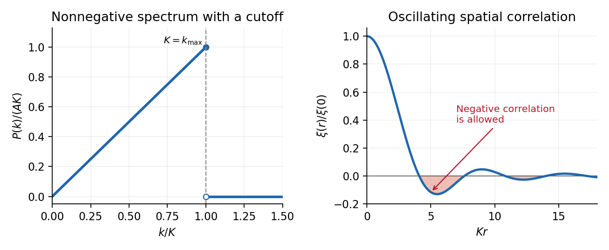

<h1 id="3/iv/solution">Solution</h1>

↑ **Parent:** [Iv](../iv.md)

Apply the [isotropic cosmological correlation-power-spectrum relation](../../../../../../isotropic-cosmological-correlation-power-spectrum-relation.md) and put $K=k_{\max}$, $q=Kr$. The [band-limited linear density correlation](../../../../../../band-limited-linear-density-correlation.md) is

$$
\xi(r)=\frac{A}{2\pi^2r}\int_0^K k^2\sin(kr)\,dk.
$$

Two [integrations by parts](../../../../../../integration-by-parts.md) give the primitive $-k^2\cos(kr)/r+2k\sin(kr)/r^2+2\cos(kr)/r^3$. Evaluating both endpoints yields

$$
\boxed{\xi(r)=\frac{A}{2\pi^2r^4}
[-q^2\cos q+2q\sin q+2(\cos q-1)],\qquad r>0.}
$$

The apparent singularity at the origin is removable. Either the [Taylor series](../../../../../../taylor-series.md) or the original integral gives

$$
\boxed{\xi(0)=\frac{AK^4}{8\pi^2}.}
$$

In fact $\xi(r)=\xi(0)[1-q^2/9+q^4/240+O(q^6)]$. The sharp spectral cutoff produces oscillations and negative correlations at some nonzero separations, even though the [matter power spectrum](../../../../../../matter-power-spectrum.md) is everywhere nonnegative. A [covariance function](../../../../../../covariance-function.md) need not be pointwise nonnegative; its required positivity is that of the covariance quadratic form.

**[Figure 1](#3/iv/image-an-abrupt-cutoff-in-a-nonnegative-density-power-spectrum-produces-an-oscillating-correlation-function). An abrupt cutoff in a nonnegative density power spectrum produces an oscillating correlation function**.

## ↑ Ancestors (11)

1. [Iv](../iv.md)
2. [3](../../3.md)
3. [Paper 41](../../../paper-41-split.md)
4. [Iii](../../../split.md)
5. [2001](../../../../split.md)
6. [Past exam of the mathematics course of the University of Cambridge](../../../../../split.md)
7. [Mathematics course of the University of Cambridge](../../../../../../mathematics-course-of-the-university-of-cambridge.md)
8. [Course of the University of Cambridge](../../../../../../course-of-the-university-of-cambridge.md)
9. [University of Cambridge](../../../../../../university-of-cambridge-split.md)
10. [List of universities](../../../../../../list-of-universities.md)
11. [Codex Wiki](../../../../../../split.md)
