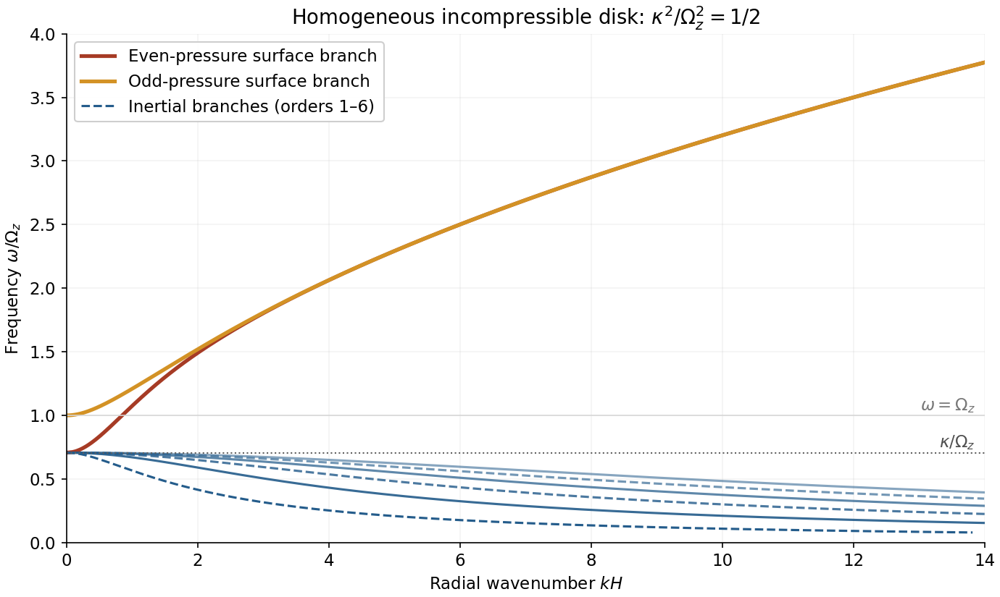

# Paper 42

↑ **Parent:** [Iii](../iii.md)

[https://www.maths.cam.ac.uk/postgrad/part-iii/files/pastpapers/2001/Paper42.pdf](https://www.maths.cam.ac.uk/postgrad/part-iii/files/pastpapers/2001/Paper42.pdf)

**Table of contents**

- [1](#1)
  - [Solution](#1/solution)
- [2](#2)
  - [Solution](#2/solution)
- [3](#3)
  - [Solution](#3/solution)

## 1

↑ **Parent:** [Paper 42](paper-42.md)

<h3 id="1/solution">Solution</h3>

↑ **Parent:** [1](#1)

Assume [axisymmetry](../../../calculus.md#axisymmetric-vector-field) in a [thin disk](../../../astrophysics.md#thin-disk) orbiting a fixed central [mass](../../../classical-mechanics.md#mass) $M$. To leading order in thickness, the [Keplerian rotation](../../../astrophysics.md#keplerian-disk) is independent of height, $\Omega=(GM/r^3)^{1/2}$, with slow radial drift compared with $r\Omega$. Neglect radial [pressure](../../../thermodynamics.md#pressure) support in the orbital balance, changes in the central potential, mass loss through the disk surfaces and applied surface [torques](../../../classical-mechanics.md#torque). The [Cauchy stress tensor](../../../continuum-mechanics.md#cauchy-stress-tensor) can represent viscous or effective turbulent/magnetic transport; only its vertically integrated azimuthal component enters the [conservation of angular momentum](../../../classical-mechanics.md#conservation-of-angular-momentum) equation.

Define the [surface density](../../../astrophysics.md#surface-density-of-a-disk) and its mass-weighted radial [velocity](../../../classical-mechanics.md#velocity) by

$$
\Sigma=\int\rho\,dz,\qquad\Sigma\bar u_r=\int\rho u_r\,dz,
$$

and set $W_{r\phi}=\int T_{r\phi}\,dz$. Integrating [mass conservation](../../../continuum-mechanics.md#mass-conservation) vertically gives

$$
\partial_t\Sigma+\frac1r\partial_r(r\Sigma\bar u_r)=0.
$$

The azimuthal equation in [cylindrical coordinates](../../../calculus.md#cylindrical-coordinate-system), multiplied by $r$ and combined with [mass conservation](../../../continuum-mechanics.md#mass-conservation), is the conservative equation for [specific angular momentum](../../../classical-mechanics.md#specific-angular-momentum) $l=r^2\Omega$. The cylindrical [stress tensor](../../../continuum-mechanics.md#cauchy-stress-tensor) [divergence](../../../calculus.md#divergence) contributes $r^{-1}\partial_r(r^2T_{r\phi})+\partial_z(rT_{\phi z})$. With vanishing surface [torque](../../../classical-mechanics.md#torque), vertical integration therefore gives

$$
\partial_t(\Sigma l)+\frac1r\partial_r(r\Sigma\bar u_r l)
=\frac1r\partial_r(r^2W_{r\phi}).
$$

Because $l(r)$ is fixed in time, subtracting $l$ times the mass equation yields

$$
\Sigma\bar u_r\frac{dl}{dr}=\frac1r\partial_r(r^2W_{r\phi}).
$$

Define the [effective viscosity defined by disk stress](../../../astrophysics.md#effective-viscosity-defined-by-disk-stress) by

$$
\boxed{\bar\nu\Sigma r\frac{d\Omega}{dr}=W_{r\phi},\qquad
\bar\nu=-\frac{2}{3\Sigma\Omega}\int T_{r\phi}\,dz\quad\text{for Keplerian rotation}.}
$$

This sign convention treats $T_{r\phi}$ as the [shear stress](../../../viscous-fluid-flow.md#shear-stress) appearing with $+\nabla\cdot\mathbf T$. For the [Newtonian fluid stress tensor](../../../viscous-fluid-flow.md#newtonian-fluid-stress-tensor) it reduces to the [density-weighted viscosity of a disk](../../../fluid-mechanics.md#density-weighted-viscosity-of-a-disk), $\bar\nu=\Sigma^{-1}\int\rho\nu dz$, rather than an unweighted height average.

Using $l=\sqrt{GMr}$ and $W_{r\phi}=-(3/2)\bar\nu\Sigma\Omega$ in the [conservation of angular momentum](../../../classical-mechanics.md#conservation-of-angular-momentum) equation gives

$$
\bar u_r=-\frac3{\Sigma\sqrt r}\partial_r(\sqrt r\bar\nu\Sigma).
$$

Substitution into [mass conservation](../../../continuum-mechanics.md#mass-conservation) proves the [Keplerian viscous diffusion equation](../../../astrophysics.md#keplerian-viscous-diffusion-equation):

$$
\boxed{\partial_t\Sigma=\frac3r\partial_r\left[\sqrt r\,\partial_r(\sqrt r\bar\nu\Sigma)\right].}
$$

The outward [viscous torque in an accretion disk](../../../astrophysics.md#viscous-torque-in-an-accretion-disk) is $\mathcal G=-2\pi r^2W_{r\phi}=3\pi\sqrt{GM}\sqrt r\bar\nu\Sigma$.

For $\bar\nu=Ar$ with $A>0$, make the [heat-equation transform for linear-radius disk viscosity](../../../astrophysics.md#heat-equation-transform-for-linear-radius-disk-viscosity)

$$
\boxed{x=2\sqrt{\frac r{3A}},\qquad g=\sqrt r\bar\nu\Sigma=Ar^{3/2}\Sigma.}
$$

Writing $y=\sqrt r$, the diffusion equation becomes $g_t=(3A/4)g_{yy}$; the displayed rescaling of $y$ gives exactly $\boxed{g_t=g_{xx}}$, with the original time unchanged. The [torque](../../../classical-mechanics.md#torque) is $3\pi\sqrt{GM}g$, so the [zero-torque inner boundary condition](../../../astrophysics.md#zero-torque-inner-boundary-condition) at the origin becomes $g(0,t)=0$ on the half-line $x>0$.

A positive [similarity solution](../../../partial-differential-equation.md#similarity-solution) obeying this [boundary condition](../../../differential-equation.md#boundary-condition) is

$$
\boxed{g=Cxt^{-3/2}e^{-x^2/(4t)},\qquad
\Sigma=\frac{2C}{A\sqrt{3A}}\frac{t^{-3/2}}r e^{-r/(3At)},\qquad C>0.}
$$

For example, substitution of $g=t^{-1}F(x/\sqrt t)$ reduces the [heat equation](../../../diffusion-equation.md#heat-equation) to $F''+(\eta/2)F'+F=0$, and $F=C\eta e^{-\eta^2/4}$ satisfies it and vanishes at zero. A replacement of $t$ by $t+t_0$ gives a finite-mass initial profile at time zero if desired.

To determine the global integrals, transform the [mass](../../../classical-mechanics.md#mass) and [angular momentum](../../../classical-mechanics.md#angular-momentum):

$$
M_d=2\pi\int_0^\infty\Sigma r\,dr=2\pi\sqrt{\frac3A}\int_0^\infty g\,dx,
\qquad
J_d=2\pi\sqrt{GM}\int_0^\infty\Sigma r^{3/2}dr=3\pi\sqrt{GM}\int_0^\infty xg\,dx.
$$

The [Gaussian integrals](../../../calculus.md#gaussian-integral) give

$$
\boxed{M_d=4\pi C\sqrt{3/A}\,t^{-1/2},\qquad
J_d=6\pi^{3/2}C\sqrt{GM}=\text{constant}.}
$$

Thus the [accreting similarity disk with viscosity proportional to radius](../../../astrophysics.md#accreting-similarity-disk-with-viscosity-proportional-to-radius) loses [mass](../../../classical-mechanics.md#mass) as $t^{-1/2}$ while conserving [angular momentum](../../../classical-mechanics.md#angular-momentum); its characteristic radius grows proportional to $At$. The accretion rate at the origin is $-\dot M_d=2\pi C\sqrt{3/A}\,t^{-3/2}$. Its radial [velocity](../../../classical-mechanics.md#velocity) $\bar u_r=r/t-3A/2$ shows inward flow at small radius and outward spreading at large radius. The integrable inner [density](../../../fluid-mechanics.md#density) singularity is part of the idealized extension to $r=0$.

For the other profile, direct differentiation gives

$$
\frac{g_t}{g}=-\frac1{2t}+\frac{x^2}{4t^2}=\frac{g_{xx}}g,
\qquad g=t^{-1/2}e^{-x^2/(4t)}.
$$

It also satisfies the [heat equation](../../../diffusion-equation.md#heat-equation), but has $g(0,t)=t^{-1/2}\ne0$ and $g_x(0,t)=0$. It therefore has a nonzero inner [torque](../../../classical-mechanics.md#torque) and zero mass flow at the origin, not the previous [zero-torque inner boundary condition](../../../astrophysics.md#zero-torque-inner-boundary-condition). Here

$$
\Sigma=\frac{t^{-1/2}}{Ar^{3/2}}e^{-r/(3At)},\qquad
\bar u_r=\frac rt,
$$

$$
\boxed{M_d=2\pi\sqrt{3\pi/A}=\text{constant},\qquad
J_d=6\pi\sqrt{GM}\,t^{1/2},\qquad
\mathcal G(0,t)=\dot J_d=3\pi\sqrt{GM}\,t^{-1/2}.}
$$

An arbitrary positive amplitude multiplies these quantities. This [constant-mass disk with viscosity proportional to radius](../../../astrophysics.md#constant-mass-disk-with-viscosity-proportional-to-radius) spreads outward under a central [torque](../../../classical-mechanics.md#torque) that supplies [angular momentum](../../../classical-mechanics.md#angular-momentum), with no ongoing central mass supply. It has the reflecting [Neumann boundary condition](../../../differential-equation.md#neumann-boundary-condition) for the [heat equation](../../../diffusion-equation.md#heat-equation) and can be regarded as the spreading of an initially central mass distribution driven by an applied [torque](../../../classical-mechanics.md#torque). It is distinct from the accreting zero-torque solution; the ideal origin does not model a finite stellar surface or a relativistic inner disk.

## 2

↑ **Parent:** [Paper 42](paper-42.md)

<h3 id="2/solution">Solution</h3>

↑ **Parent:** [2](#2)

The [magnetohydrodynamic total pressure](../../../astrophysical-fluid-dynamics.md#magnetohydrodynamic-total-pressure) is

$$
\boxed{\Pi=p+\frac{B^2}{2\mu_0}.}
$$

The [Lorentz force](../../../electromagnetism.md#lorentz-force) has been split into the [gradient](../../../calculus.md#gradient) of [magnetic pressure](../../../astrophysical-fluid-dynamics.md#magnetic-pressure) and the remaining [magnetic tension](../../../astrophysical-fluid-dynamics.md#magnetic-tension) term. An appropriate boundary model is impermeable, perfectly conducting stationary cylindrical walls with no initial normal [magnetic flux](../../../electromagnetism.md#magnetic-flux): $u_r=B_r=0$ at $r=a,b$. In an inviscid fluid this is a slip condition, not a no-slip condition on $u_\phi$ or $u_z$. It also makes the tangential ideal [electric field](../../../electromagnetism.md#electric-field) vanish at the walls. Take [perturbations](../../../analysis.md#perturbation) periodic in $\phi$ and periodic or Fourier-resolved in $z$; the wall reaction supplies the normal [pressure](../../../thermodynamics.md#pressure) force without an extra prescribed [pressure](../../../thermodynamics.md#pressure) value.

Write the steady [velocity](../../../classical-mechanics.md#velocity) and [magnetic field](../../../electromagnetism.md#magnetic-field) as $U(r)\mathbf e_\phi$ and $B(r)\mathbf e_\phi$. They satisfy both [divergence](../../../calculus.md#divergence) constraints. Their material accelerations have only radial curvature terms, and the steady [ideal magnetohydrodynamic induction equation](../../../astrophysical-fluid-dynamics.md#ideal-magnetohydrodynamic-induction-equation) is identically satisfied because the parallel azimuthal flow and field have cancelling curvature terms. The radial momentum equation is

$$
-\rho\frac{U^2}r=-\frac{d\Pi}{dr}-\frac{B^2}{\mu_0r}.
$$

Hence the most general such equilibrium is

$$
\boxed{U(r),B(r)\text{ arbitrary smooth functions},\qquad
\Pi(r)=\Pi_0+\int_{r_0}^r\left(\frac{\rho U(s)^2}s-\frac{B(s)^2}{\mu_0s}\right)ds.}
$$

Its [gas pressure](../../../thermodynamics.md#gas-pressure) is $p=\Pi-B^2/(2\mu_0)$; on a bounded annulus the additive constant can be chosen to keep it positive. Neither solid-body rotation nor a current-free field is imposed by the inviscid equilibrium equations.

For the [linear stability](../../../dynamical-systems.md#linear-stability) calculation, put $\Omega=U/r$, $V=B/\sqrt{\mu_0\rho}$, and define $h=\delta\Pi/\rho$. Use axisymmetric [normal modes](../../../wave-equation.md#normal-mode) proportional to $e^{ikz-i\omega t}$. Denote the [velocity](../../../classical-mechanics.md#velocity) amplitudes by $(u,v,w)$ and the magnetic amplitudes in [velocity](../../../classical-mechanics.md#velocity) units by $(b_r,b_\phi,b_z)=\delta\mathbf B/\sqrt{\mu_0\rho}$. [Linearization](../../../algebra.md#linearization) of the cylindrical momentum equations gives

$$
\begin{aligned}
-i\omega u-2\Omega v&=-h'-\frac{2V}r b_\phi,\\
-i\omega v+(2\Omega+r\Omega')u&=(V'+V/r)b_r,\\
-i\omega w&=-ikh.
\end{aligned}
$$

The linearized [ideal magnetohydrodynamic induction equation](../../../astrophysical-fluid-dynamics.md#ideal-magnetohydrodynamic-induction-equation) and [divergence](../../../calculus.md#divergence) equations are

$$
\begin{aligned}
-i\omega b_r&=0,\\
-i\omega b_\phi&=r\Omega'b_r+(V/r-V')u,\\
-i\omega b_z&=0,\\
\frac{(ru)'}r+ikw&=0,\qquad
\frac{(rb_r)'}r+ikb_z=0.
\end{aligned}
$$

The curvature terms are essential: although the [perturbations](../../../analysis.md#perturbation) have no azimuthal dependence, the cylindrical unit vectors do.

For $\omega\ne0$, $b_r=b_z=0$. Introduce the radial [Lagrangian fluid displacement](../../../continuum-mechanics.md#lagrangian-fluid-displacement) by $u=-i\omega\xi$. The azimuthal amplitudes reduce to

$$
v=-(2\Omega+r\Omega')\xi,\qquad
b_\phi=(V/r-V')\xi.
$$

Consequently the radial and vertical equations, combined with the [incompressible flow](../../../fluid-mechanics.md#incompressible-flow) constraint, give

$$
h'=(\omega^2-\mathcal D)\xi,\qquad
h=\frac{\omega^2}{k^2}\frac{(r\xi)'}r,
$$

where the [Michael criterion for axisymmetric toroidal-field interchange](../../../astrophysical-fluid-dynamics.md#michael-criterion-for-axisymmetric-toroidal-field-interchange) coefficient is

$$
\boxed{\mathcal D(r)=\kappa^2-r\frac{d}{dr}\left(\frac{V^2}{r^2}\right),\qquad
\kappa^2=4\Omega^2+2r\Omega\Omega'.}
$$

For $k\ne0$, the required single displacement equation is therefore

$$
\boxed{\omega^2\left[-\frac{d}{dr}\left(\frac{(r\xi)'}r\right)+k^2\xi\right]
=k^2\mathcal D\xi,\qquad \xi(a)=\xi(b)=0.}
$$

The same differential equation holds for $u$, which is a constant multiple of $\xi$.

Set $y=r\xi$. Multiplication by $y^*$ and [integration by parts](../../../calculus.md#integration-by-parts) with the wall conditions gives the [global variational form of the Michael criterion](../../../astrophysical-fluid-dynamics.md#global-variational-form-of-the-michael-criterion):

$$
\boxed{\omega^2=k^2\frac{\displaystyle\int_a^b\mathcal D\,|y|^2/r\,dr}
{\displaystyle\int_a^b(|y'|^2+k^2|y|^2)/r\,dr}.}
$$

The denominator is strictly positive for a nonzero displacement, so every mode's $\omega^2$ is real. If $\mathcal D\geq0$ everywhere, no exponentially growing mode exists. Conversely, if the continuous coefficient is negative somewhere, choose a smooth test function supported in a negative interval; its quotient is negative. For sufficiency, let $A=-d(r^{-1}d/dr)/dr+k^2/r$ be the positive [Sturm-Liouville operator](../../../analysis.md#sturm-liouville-operator) with [Dirichlet boundary conditions](../../../differential-equation.md#dirichlet-boundary-condition) and let $C$ multiply by $k^2\mathcal D/r$. The generalized mode equation $\omega^2Ay=Cy$ is equivalent to the [compact operator](../../../compact-operator.md) and [self-adjoint operator](../../../linear-operator-theory.md#self-adjoint-operator) problem $A^{-1/2}CA^{-1/2}f=\omega^2f$. The negative test quotient guarantees a negative [eigenvalue](../../../linear-operator-theory.md#eigenvalue) and therefore a growing solution $\omega=i\gamma$. This argument remains valid when the coefficient changes sign, without incorrectly assuming a positive weight in [Sturm-Liouville theory](../../../analysis.md#sturm-liouville-theory).

Thus, for any fixed nonzero vertical [wavenumber](../../../wave-equation.md#wavenumber),

$$
\boxed{\text{axisymmetric exponential instability}\quad\Longleftrightarrow\quad
\kappa^2-r\frac{d}{dr}\left(\frac{B_\phi^2}{\mu_0\rho r^2}\right)<0\ \text{somewhere}.}
$$

Equality is marginal. When $k=0$, the [incompressible flow](../../../fluid-mechanics.md#incompressible-flow) constraint and both rigid-wall conditions force the radial [velocity](../../../classical-mechanics.md#velocity) to vanish, so that special case has no radial interchange mode. When the field vanishes, the coefficient reduces to $\kappa^2=r^{-3}(r^4\Omega^2)'$, recovering the [Rayleigh centrifugal stability criterion](../../../astrophysics.md#rayleigh-centrifugal-stability-criterion).

For a [Keplerian disk](../../../astrophysics.md#keplerian-disk), $\kappa^2=\Omega^2$. If $B_\phi\propto r^p$, the [toroidal interchange field threshold in a thin Keplerian disk](../../../astrophysical-fluid-dynamics.md#toroidal-interchange-field-threshold-in-a-thin-keplerian-disk) is

$$
\mathcal D=\Omega^2-2(p-1)V^2/r^2<0,
\qquad\boxed{p>1,\quad V^2>\frac{r^2\Omega^2}{2(p-1)}.}
$$

For ordinary radial gradients on the scale $r$, the [Alfvén speed](../../../astrophysical-fluid-dynamics.md#alfven-speed) must therefore be comparable to the orbital speed. A field on the [gas pressure](../../../thermodynamics.md#gas-pressure) scale has $V\lesssim c_s\sim H\Omega\ll r\Omega$ in a [thin disk](../../../astrophysics.md#thin-disk), and cannot normally meet this condition. Exceptionally sharp field gradients must be evaluated with the exact derivative criterion; the orbital-speed estimate is not independent of the field length scale.

This is a toroidal magnetic interchange driven by the field/current distribution, opposed by restoration set by the [radial epicyclic frequency](../../../astrophysics.md#radial-epicyclic-frequency). It is **not the usual weak vertical-field [magnetorotational instability](../../../astrophysics.md#magnetorotational-instability)**. In the vertical-field problem, a nonzero $kB_z$ bends [magnetic field lines](../../../electromagnetism.md#magnetic-field-line) and couples displaced fluid elements, allowing decreasing $\Omega$ to supply [rotational kinetic energy](../../../classical-mechanics.md#rotational-kinetic-energy) even when $\kappa^2>0$. Here the axisymmetric [perturbation](../../../analysis.md#perturbation) has no scalar variation along the purely toroidal background field, and no such weak-field coupling: a sufficiently adverse toroidal-field gradient, rather than merely $d\Omega/dr<0$, is required. Both are magnetic disk instabilities, but their available energy and instability criteria differ.

## 3

↑ **Parent:** [Paper 42](paper-42.md)

<h3 id="3/solution">Solution</h3>

↑ **Parent:** [3](#3)

Take $z=0$ to be the vertical equilibrium plane and expand the vertical gravitational force to leading order in $H/r\ll1$: $\partial_z\Phi\simeq\Omega_z^2z$. The vertical [hydrostatic equilibrium](../../../statistical-physics.md#hydrostatic-equilibrium) equation for uniform [density](../../../fluid-mechanics.md#density) is $\partial_zp_0=-\rho\Omega_z^2z$. With vacuum [pressure](../../../thermodynamics.md#pressure) at both [free surfaces](../../../fluid-mechanics.md#free-surface), it gives

$$
\boxed{p_0(r,z)=\frac12\rho\Omega_z(r)^2[H(r)^2-z^2],\qquad |z|\leq H.}
$$

The associated radial [pressure](../../../thermodynamics.md#pressure) correction is small at leading thin-disk order; use the prescribed orbital and [radial epicyclic frequency](../../../astrophysics.md#radial-epicyclic-frequency) at the local radius. Here $\Omega_z$ is the [vertical epicyclic frequency](../../../astrophysics.md#vertical-epicyclic-frequency).

For the [axisymmetric waves of a homogeneous incompressible disk](../../../astrophysics.md#axisymmetric-waves-of-a-homogeneous-incompressible-disk), use a local [WKB approximation](../../../analysis.md#wkb-approximation) proportional to $\exp[i\int k(r)dr-i\omega t]$, with $|kr|\gg1$. Neglect cylindrical curvature and slow radial changes of the background over one [wavelength](../../../wave-equation.md#wavelength), but retain the rotation/shear coupling. Let $(u,v,w)$ be the [velocity](../../../classical-mechanics.md#velocity) [perturbations](../../../analysis.md#perturbation) and $h=p'/\rho$. The leading equations are

$$
\begin{aligned}
-i\omega u-2\Omega v&=-ikh,\\
-i\omega v+\frac{\kappa^2}{2\Omega}u&=0,\\
-i\omega w&=-h_z,\\
iku+w_z&=0.
\end{aligned}
$$

For $\omega\ne0$ and $\omega^2\ne\kappa^2$, these give $u=\omega kh/(\omega^2-\kappa^2)$ and $w=-ih_z/\omega$. The [incompressible flow](../../../fluid-mechanics.md#incompressible-flow) constraint then yields

$$
\boxed{p'_{zz}=\frac{\omega^2}{\omega^2-\kappa^2}k^2p'.}
$$

The vertical [Lagrangian fluid displacement](../../../continuum-mechanics.md#lagrangian-fluid-displacement) satisfies $w=-i\omega\xi_z$, so $\xi_z=p'_z/(\rho\omega^2)$. A displaced vacuum interface must have zero [Lagrangian pressure perturbation](../../../fluid-mechanics.md#lagrangian-pressure-perturbation), not zero [Eulerian fluid perturbation](../../../fluid-mechanics.md#eulerian-fluid-perturbation) of [pressure](../../../thermodynamics.md#pressure) at the old surface. Neglecting the higher-order radial surface-slope contribution,

$$
\Delta p=p'+\xi_z\partial_zp_0=p'-\rho\Omega_z^2z\xi_z=0.
$$

Thus the [free-surface pressure condition of an incompressible disk](../../../astrophysics.md#free-surface-pressure-condition-of-an-incompressible-disk) is

$$
\boxed{p'-\frac{\Omega_z^2}{\omega^2}zp'_z=0\quad\text{at }z=\pm H.}
$$

Because the background and [boundary conditions](../../../differential-equation.md#boundary-condition) are symmetric about the midplane, choose [pressure](../../../thermodynamics.md#pressure) modes of [even function](../../../calculus.md#even-function) or [odd function](../../../calculus.md#odd-function) symmetry in $z$. For $\omega^2>\kappa^2$, put $q=k\omega/\sqrt{\omega^2-\kappa^2}$ and $Q=qH$. The solutions are $p'\propto\cosh(qz)$ or $\sinh(qz)$; substituting the surface condition gives the two [surface modes of an incompressible disk](../../../astrophysics.md#surface-modes-of-an-incompressible-disk):

$$
\boxed{\begin{array}{ll}
\omega^2=\Omega_z^2Q\tanh Q,&\text{even pressure},\\
\omega^2=\Omega_z^2Q\coth Q,&\text{odd pressure},
\end{array}\qquad (kH)^2=Q^2\left(1-\frac{\kappa^2}{\omega^2}\right).}
$$

These are implicit [dispersion relations](../../../wave-equation.md#dispersion-relation), or complete parametric equations with parameter $Q$ and the indicated condition $\omega^2>\kappa^2$.

For $0<\omega^2<\kappa^2$, put $s=k\omega/\sqrt{\kappa^2-\omega^2}$ and $S=sH$. The solutions are $p'\propto\cos(sz)$ or $\sin(sz)$, giving the [inertial modes of an incompressible disk](../../../astrophysics.md#inertial-modes-of-an-incompressible-disk):

$$
\boxed{\begin{array}{ll}
\omega^2=-\Omega_z^2S\tan S,&\text{even pressure},\\
\omega^2=\Omega_z^2S\cot S,&\text{odd pressure},
\end{array}\qquad (kH)^2=S^2\left(\frac{\kappa^2}{\omega^2}-1\right).}
$$

The restrictions $0<\omega^2<\kappa^2$ select the admissible segments of the [trigonometric functions](../../../geometry-and-topology.md#trigonometric-function), producing infinitely many vertical orders. These four parity/frequency formulas exhaust all nonzero-frequency modes: they solve the second-order [pressure](../../../thermodynamics.md#pressure) equation and both [boundary conditions](../../../differential-equation.md#boundary-condition). For finite $k\ne0$, an exactly epicyclic frequency $\omega^2=\kappa^2$ makes the horizontal equations require $p'=0$, then the vertical equation and the [incompressible flow](../../../fluid-mechanics.md#incompressible-flow) constraint force all [velocity](../../../classical-mechanics.md#velocity) components to vanish, so it is not a missing finite-wavenumber branch.

For completeness, the [energy identity for free-surface disk waves](../../../astrophysics.md#energy-identity-for-free-surface-disk-waves) shows why these modes have real stable frequencies when $\kappa^2\geq0$ and $\Omega_z^2>0$. After elimination of the azimuthal [velocity](../../../classical-mechanics.md#velocity), the radial and vertical displacement equations are $(\omega^2-\kappa^2)\xi_r=ikh$ and $\omega^2\xi_z=h_z$, with $ik\xi_r+\xi_{z,z}=0$. Multiply by conjugate displacements, integrate in $z$ and use the [boundary condition](../../../differential-equation.md#boundary-condition) to obtain

$$
\omega^2\int_{-H}^H(|\xi_r|^2+|\xi_z|^2)dz
=\kappa^2\int_{-H}^H|\xi_r|^2dz
+\Omega_z^2H\{|\xi_z(H)|^2+|\xi_z(-H)|^2\}.
$$

The right side is real and nonnegative, excluding additional growing wave branches in this stable case. At zero frequency there can separately be a stationary [geostrophic balance](../../../physics.md#geostrophic-balance): vertically constant $h$, $u=w=0$, $v=ikh/(2\Omega)$, and static interface displacements satisfying $h=\Omega_z^2z\xi_z$ at the surfaces. This neighbouring-equilibrium [perturbation](../../../analysis.md#perturbation) is not a propagating branch omitted by dividing by $\omega$.

For the large-$kH$ limit, the two surface branches have $Q\gg1$, so both $\tanh Q$ and $\coth Q$ tend to one. Eliminating $Q$ gives their common leading surface dispersion,

$$
\boxed{\omega^2\sim\frac12\left[\kappa^2+\sqrt{\kappa^4+4\Omega_z^4(kH)^2}\right]
=\Omega_z^2kH+\frac12\kappa^2+O((kH)^{-1}).}
$$

In particular $\omega\sim\Omega_z\sqrt{kH}$. The effective surface gravity is $g_s=\Omega_z^2H$, and the [pressure](../../../thermodynamics.md#pressure) decays into the interior on a scale $k^{-1}$. These are [surface gravity waves](../../../fluid-mechanics.md#surface-gravity-wave), or surface f-modes, localized near the upper and lower interfaces. Even and odd [pressure](../../../thermodynamics.md#pressure) are their symmetric and antisymmetric combinations; their splitting is exponentially small as the surfaces decouple. Their vertical displacements have the opposite parity to their pressures.

For each fixed inertial vertical order, large $kH$ means $\omega\ll\kappa$. The [boundary condition](../../../differential-equation.md#boundary-condition) then requires $p'_z\simeq0$ at the surfaces, so the limiting vertical [wavenumbers](../../../wave-equation.md#wavenumber) are $S=n\pi/2$, $n=1,2,\ldots$. Thus

$$
\boxed{\omega_n\sim\frac{\kappa n\pi}{2kH}\qquad(kH\to\infty\text{ at fixed }n).}
$$

Even $n$ have even [pressure](../../../thermodynamics.md#pressure), odd $n$ odd [pressure](../../../thermodynamics.md#pressure). These vertically oscillatory, rotation-restored [inertial waves](../../../geophysical-fluid-dynamics.md#inertial-wave) occupy $0<\omega<\kappa$ and approach zero at fixed order as radial [wavenumber](../../../wave-equation.md#wavenumber) increases. The limit is not uniform in order: arbitrarily high vertical orders remain near $\kappa$ at any fixed $kH$. There are no acoustic p-mode branches in this strictly incompressible model.

For $\Omega_z>\kappa>0$, the two surface curves are unique. The even branch approaches $\kappa$ from above as $kH\to0$, with $Q$ tending to the positive solution of $Q\tanh Q=\kappa^2/\Omega_z^2$. The odd branch approaches $\Omega_z$ because $Q\coth Q\to1$ as $Q\to0$. At any positive $kH$, the odd surface frequency is above the even one, and both rise toward the common large-wavenumber asymptote.

The inertial branches all approach $\kappa$ from below as $kH\to0$. For even [pressure](../../../thermodynamics.md#pressure) there is one admissible branch in each interval $((j+1/2)\pi,(j+1)\pi)$, $j\geq0$, terminating at $S=(j+1)\pi$ as $kH\to\infty$. For odd [pressure](../../../thermodynamics.md#pressure) there is one in each interval $(j\pi,(j+1/2)\pi)$, again terminating at its upper endpoint; the first interval is admissible because $\kappa^2/\Omega_z^2<1$. Their curves decrease toward zero as shown in the sketch. The small-$kH$ endpoints are formal local-dispersion limits; the [WKB approximation](../../../analysis.md#wkb-approximation) still requires $kH\gg H/r$ for a finite-thickness disk.

**[Figure 1](#3/image-surface-and-inertial-branches-of-a-homogeneous-incompressible-disk-with-kappa-2-omega-z-2-1-2). Surface and inertial branches of a homogeneous incompressible disk, with $\kappa^2/\Omega_z^2=1/2$**.

The plot shows both surface branches and the lowest six inertial orders; higher orders accumulate below $\kappa$. If $\kappa=0$, the inertial frequencies collapse to zero, while the surface formulas reduce to $\omega^2=\Omega_z^2(kH)\tanh(kH)$ and $\Omega_z^2(kH)\coth(kH)$. A negative $\kappa^2$ instead introduces instability described by the [Rayleigh centrifugal stability criterion](../../../astrophysics.md#rayleigh-centrifugal-stability-criterion) and is outside the real-frequency stable sketch.

## ↑ Ancestors (8)

1. [Iii](../iii.md)
2. [2001](../../2001.md)
3. [Past exam of the mathematics course of the University of Cambridge](../../../past-exam-of-the-mathematics-course-of-the-university-of-cambridge.md)
4. [Mathematics course of the University of Cambridge](../../../university-of-cambridge.md#mathematics-course-of-the-university-of-cambridge)
5. [Course of the University of Cambridge](../../../university-of-cambridge.md#course-of-the-university-of-cambridge)
6. [University of Cambridge](../../../university-of-cambridge.md)
7. [List of universities](../../../README.md#list-of-universities)
8. [Codex Wiki](../../../README.md)
