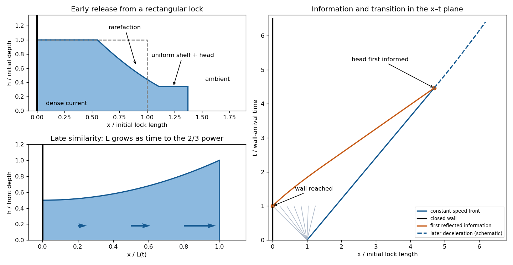

<h1 id="1/b/solution">Solution</h1>

↑ **Parent:** [B](../b.md)

The volume alone does not specify the early release geometry. For a concrete sketch, use a rectangular lock initially occupying $0<x<\ell_0$ with depth $h_0=V/\ell_0$, at rest, and remove its gate at $t=0$. Let $c_0=\sqrt{g'h_0}$ and impose a [gravity-current front condition](../../../../../../gravity-current-front-condition.md) $u_f=F\sqrt{g'h_f}$, with fixed $F$. The [Benjamin deep-ambient front condition](../../../../../../benjamin-deep-ambient-front-condition.md) gives $F=\sqrt2$ for the usual deep-ambient idealization.

A [rarefaction wave](../../../../../../rarefaction-wave.md) propagates back from the release. Before information returns from the closed wall, its invariant is $u+2c=2c_0$. With $s=(x-\ell_0)/t$, the fan has $u=2(c_0+s)/3$, $c=(2c_0-s)/3$. The front-adjacent shelf has

$$
 c_f=\frac{2c_0}{F+2},\qquad u_f=F c_f,\qquad h_f=c_f^2/g'.
$$

The fan extends from $s=-c_0$ to $s=u_f-c_f$; a uniform shelf connects its tail to the finite-depth head at $x=\ell_0+u_ft$. A small nonhydrostatic head displaces ambient fluid; the hydrostatic interior model does not resolve its overturning structure.

The fan head first reaches the rear wall at $t_r=\ell_0/c_0$. The wall condition is $u=0$, and the returned positive [characteristic curve](../../../../../../characteristic-curve.md) begins to alter the interior. In the still-undisturbed fan it solves $dx/dt=(4c_0+(x-\ell_0)/t)/3$, hence

$$
x=\ell_0+2c_0t-3c_0t_r^{2/3}t^{1/3}.
$$

It reaches the fan's uniform shelf at $t_*=t_r[(F+2)/2]^{3/2}$, then propagates with speed $u_f+c_f$ to the head at $t_{\rm hit}=2t_*$. These times refer to this particular initial lock and front closure. After that first arrival, the finite supply influences the front: the constant-speed slumping stage gives way to deceleration and eventually the [finite-volume inertial gravity current](../../../../../../finite-volume-inertial-gravity-current.md) with $L\propto t^{2/3}$, depth proportional to $t^{-2/3}$ and speed proportional to $t^{-1/3}$. The initial fan and reflected signal are shown below; later characteristic trajectories change as the current adjusts.

**[Figure 1](#1/b/image-finite-lock-gravity-current-initial-rarefaction-reflected-information-and-late-time-spreading). Finite-lock gravity current, initial rarefaction, reflected information and late-time spreading**.

## ↑ Ancestors (11)

1. [B](../b.md)
2. [1](../../1.md)
3. [Paper 43](../../../paper-43-split.md)
4. [Iii](../../../split.md)
5. [2001](../../../../split.md)
6. [Past exam of the mathematics course of the University of Cambridge](../../../../../split.md)
7. [Mathematics course of the University of Cambridge](../../../../../../mathematics-course-of-the-university-of-cambridge.md)
8. [Course of the University of Cambridge](../../../../../../course-of-the-university-of-cambridge.md)
9. [University of Cambridge](../../../../../../university-of-cambridge-split.md)
10. [List of universities](../../../../../../list-of-universities.md)
11. [Codex Wiki](../../../../../../split.md)
