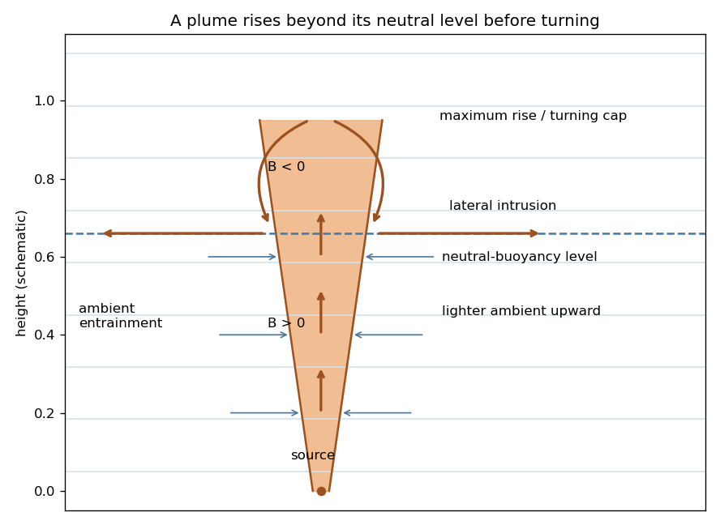

<h1 id="3/b/solution">Solution</h1>

↑ **Parent:** [B](../b.md)

In a stably stratified ambient, entrained fluid is progressively lighter with increasing height. Relative to that ambient, the plume's [buoyancy flux](../../../../../../buoyancy-flux.md) satisfies $B'=-N^2Q<0$. It therefore becomes neutrally buoyant before its upward [momentum](../../../../../../momentum.md) vanishes. It overshoots, becomes negatively buoyant, and eventually turns and spreads laterally near its neutral-buoyancy level. The top-hat ascent equations cease to describe the overturning cap and lateral intrusion.

For constant $N$, the balances give a useful exact relation:

$$
(M^2)'=2BQ,\qquad (B^2/N^2)'=-2BQ,\qquad
M^2+B^2/N^2=B_0^2/N^2
$$

for an ideal zero-momentum source. The rising branch begins at $B=B_0$, attains its largest momentum at $B=0$, and reaches its terminal zero-momentum limit at $B=-B_0$. Entrainment and decreasing buoyancy make the associated rise interval finite.

An estimate follows already from the unstratified [pure plume](../../../../../../pure-plume.md) flux: $N^2\int_0^H Q\,dz\sim B_0$, so $N^2B_0^{1/3}H^{8/3}\sim B_0$. Hence

$$
\boxed{H=C_H(\alpha)\left(\frac{B_0}{N^3}\right)^{1/4}.}
$$

The coefficient depends on the [entrainment coefficient](../../../../../../entrainment-coefficient.md) and the distinction between neutral height, maximum rise and final spreading level. The scaling can also be obtained from the dimensions $[B_0]=L^4T^{-3}$ and $[N]=T^{-1}$. The sketch distinguishes the neutral level from the maximum rise.

**[Figure 2](#3/b/image-entrainment-loss-of-buoyancy-momentum-overshoot-and-lateral-intrusion-of-a-stratified-plume). Entrainment, loss of buoyancy, momentum overshoot and lateral intrusion of a stratified plume**.

## ↑ Ancestors (11)

1. [B](../b.md)
2. [3](../../3.md)
3. [Paper 43](../../../paper-43-split.md)
4. [Iii](../../../split.md)
5. [2001](../../../../split.md)
6. [Past exam of the mathematics course of the University of Cambridge](../../../../../split.md)
7. [Mathematics course of the University of Cambridge](../../../../../../mathematics-course-of-the-university-of-cambridge.md)
8. [Course of the University of Cambridge](../../../../../../course-of-the-university-of-cambridge.md)
9. [University of Cambridge](../../../../../../university-of-cambridge-split.md)
10. [List of universities](../../../../../../list-of-universities.md)
11. [Codex Wiki](../../../../../../split.md)
