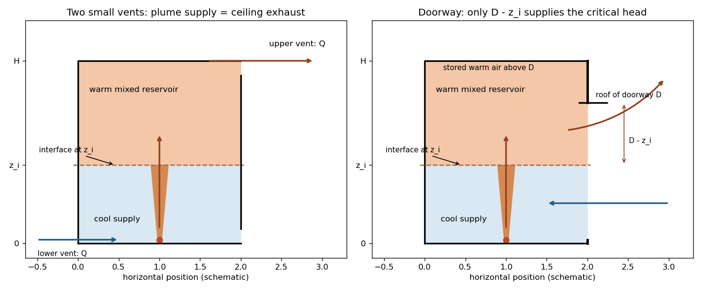

<h1 id="5/b/solution">Solution</h1>

↑ **Parent:** [B](../b.md)

Write $z_i=H-h$ for the height of the warm-layer interface above the heat source. A negligible-volume point heat source supplies a [pure plume](../../../../../../pure-plume.md) with conserved [buoyancy flux](../../../../../../buoyancy-flux.md) $B_0$. The given plume buoyancy implies its [volume flux](../../../../../../volumetric-flow-rate.md) at the interface is

$$
Q_p(z_i)=\frac{B_0}{g'_p(z_i)}=\frac{B_0^{1/3}}\gamma z_i^{5/3}.
$$

At steady [displacement ventilation](../../../../../../displacement-ventilation.md), the plume feeds the warm layer at the same rate it empties through the upper vent: $q_v=Q_p(z_i)$. The upper-layer buoyancy balance gives $q_vg'=B_0$, so

$$
g'=\gamma B_0^{2/3}z_i^{-5/3},\qquad q_v=C_dA\sqrt{g'h}.
$$

Eliminate $q_v$ and $g'$ to get

$$
\boxed{(H-h)^5=\gamma^3C_d^2A^2h,\qquad
\Delta\rho=\frac{\rho_0}{g}\gamma B_0^{2/3}(H-h)^{-5/3}.}
$$

The height equation has one solution with $0<h<H$. Its height is independent of source strength in this ideal pure-plume model, while its warm-layer density contrast increases as $B_0^{2/3}$. The sketch shows cool replacement air below, an entraining plume through that region, and the upper mixed layer feeding the ceiling vent.

**[Figure 3](#5/b/image-plume-fed-displacement-ventilation-through-two-vents-and-through-a-hydraulically-controlled-upper-doorway). Plume-fed displacement ventilation through two vents and through a hydraulically controlled upper doorway**.

## ↑ Ancestors (11)

1. [B](../b.md)
2. [5](../../5.md)
3. [Paper 43](../../../paper-43-split.md)
4. [Iii](../../../split.md)
5. [2001](../../../../split.md)
6. [Past exam of the mathematics course of the University of Cambridge](../../../../../split.md)
7. [Mathematics course of the University of Cambridge](../../../../../../mathematics-course-of-the-university-of-cambridge.md)
8. [Course of the University of Cambridge](../../../../../../course-of-the-university-of-cambridge.md)
9. [University of Cambridge](../../../../../../university-of-cambridge-split.md)
10. [List of universities](../../../../../../list-of-universities.md)
11. [Codex Wiki](../../../../../../split.md)
