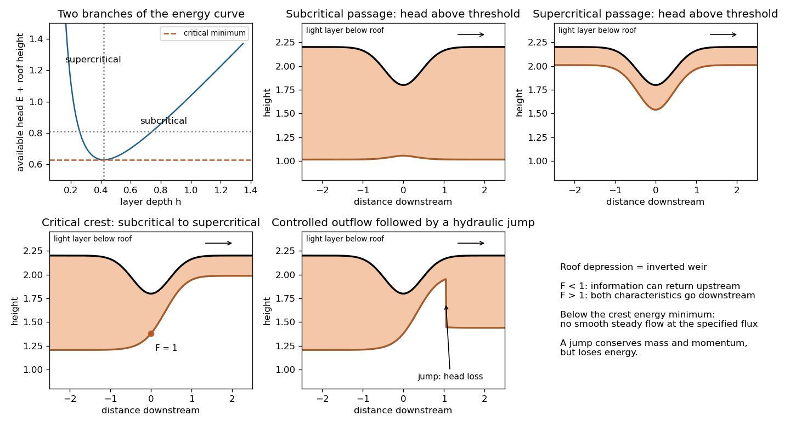

<h1 id="5/d/solution">Solution</h1>

↑ **Parent:** [D](../d.md)

Assume a steady inviscid light layer of constant [reduced gravity](../../../../../../reduced-gravity-split.md) $g'$ under a roof at $z=H(x)$, with depth $h$, interface $z_i=H-h$, and slowly varying width $W(x)$. The ambient is deep and approximately motionless; neglect [entrainment](../../../../../../fluid-entrainment.md), friction and approach variations across the section. Let $p'$ be pressure relative to the ambient hydrostatic pressure. Then $p'_z=\rho_0g'$ in the light layer and $p'=\rho_0g'(z-z_i)$ when the ambient pressure offset is chosen zero. The steady [Bernoulli equation](../../../../../../bernoulli-equation.md) along a light-fluid streamline is $u^2/2+p'/\rho_0-g'z=\mathrm{constant}$. With $Q=Whu$, this becomes the [hydraulic flow in an inverted channel](../../../../../../hydraulic-flow-in-an-inverted-channel.md) energy

$$
\boxed{E=\frac{Q^2}{2W(x)^2h^2}+g'h-g'H(x).}
$$

At fixed $x$ and fixed flux,

$$
\boxed{\frac{\partial E}{\partial h}=g'(1-F^2),\qquad
F^2=\frac{Q^2}{g'W^2h^3}.}
$$

The energy curve has a minimum at $h_c=[Q^2/(g'W^2)]^{1/3}$, with $E_c=3g'h_c/2-g'H$. Above that minimum there are a thin supercritical branch and a thick subcritical branch. A lowered roof increases $E_c$; it is the inverted counterpart of raising a bed crest.

For a single smooth obstruction in a constant-width channel, energy exceeding its largest $E_c$ permits entirely subcritical passage or entirely supercritical passage, depending on the boundary data. At the limiting head a subcritical upstream current can pass through critical flow at the roof minimum and emerge supercritical; this is the usual freely discharging control. A reverse transcritical branch would need suitable imposed downstream data and is not the usual free discharge. If the supplied head is below the required minimum, no smooth steady flow with that flux exists: upstream adjustment changes the discharge or head. A supercritical current encountering deep downstream warm fluid can undergo a [hydraulic jump](../../../../../../hydraulic-jump.md) to the subcritical branch, with an energy loss rather than a second conservative branch switch.

For a rectangular section the jump conserves $h_1u_1=h_2u_2=q$ and $q^2/h+g'h^2/2$. Hence $h_2/h_1=[\sqrt{1+8F_1^2}-1]/2$ for $F_1>1$, and the lost specific energy is $g'(h_2-h_1)^3/(4h_1h_2)$. This remains positive after vertical reflection. The energy and profile sketches label the roof and the lower boundary of the light layer explicitly.

**[Figure 4](#5/d/image-energy-branches-and-subcritical-supercritical-controlled-and-hydraulic-jump-flows-beneath-a-lowered-roof). Energy branches and subcritical, supercritical, controlled and hydraulic-jump flows beneath a lowered roof**.

## ↑ Ancestors (11)

1. [D](../d.md)
2. [5](../../5.md)
3. [Paper 43](../../../paper-43-split.md)
4. [Iii](../../../split.md)
5. [2001](../../../../split.md)
6. [Past exam of the mathematics course of the University of Cambridge](../../../../../split.md)
7. [Mathematics course of the University of Cambridge](../../../../../../mathematics-course-of-the-university-of-cambridge.md)
8. [Course of the University of Cambridge](../../../../../../course-of-the-university-of-cambridge.md)
9. [University of Cambridge](../../../../../../university-of-cambridge-split.md)
10. [List of universities](../../../../../../list-of-universities.md)
11. [Codex Wiki](../../../../../../split.md)
