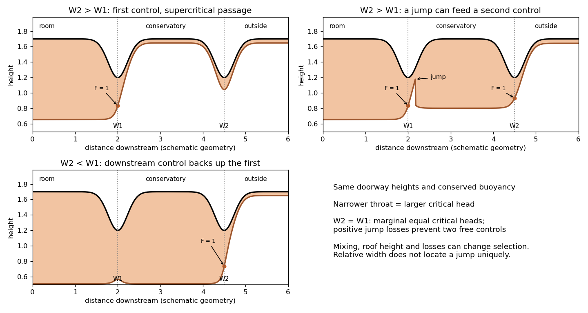

<h1 id="5/f/solution">Solution</h1>

↑ **Parent:** [F](../f.md)

Let $W_1$ be the first doorway width and $W_2$ the conservatory's outer doorway width. For a hydraulic comparison assume the same [reduced gravity](../../../../../../reduced-gravity-split.md) and conserved [volume flux](../../../../../../volumetric-flow-rate.md) through both, negligible losses except at any [hydraulic jump](../../../../../../hydraulic-jump.md), and roofs at the same doorway height $D$. Their critical depths and limiting energies are

$$
h_{cj}=\left(\frac{Q^2}{g'W_j^2}\right)^{1/3},\qquad
E_{cj}=\frac32g'h_{cj}-g'D.
$$

The narrower doorway has the larger minimum required head. This gives the possible [two successive hydraulic controls](../../../../../../two-successive-hydraulic-controls.md) rather than a universal jump location.

If $W_2>W_1$, the first doorway can remain the discharge control. Its supercritical outflow may pass through the wider second doorway without being controlled there. Alternatively, if warm air accumulates in the conservatory, the first jet can undergo an inverted [hydraulic jump](../../../../../../hydraulic-jump.md), feed a subcritical intermediate reservoir, and accelerate to a second critical section at the outer doorway. The wider second throat has a lower critical energy, so the difference can accommodate the positive head loss at the jump. Whether this second configuration occurs, and where its jump stands, depends on conservatory dimensions and downstream head.

If $W_2<W_1$, an outflow set solely by critical flow at the first doorway lacks the energy to pass the narrower second doorway: $E_{c2}>E_{c1}$, and a jump cannot increase energy. Warm air backs up in the conservatory. The downstream doorway becomes the dominant control, and the first doorway is subcritical or submerged by the intermediate layer. During adjustment an upstream-moving bore or jump can propagate towards or through the first doorway. A permanently freely controlled first doorway followed by a narrower same-height control is impossible under the conserved-buoyancy assumptions.

If $W_2=W_1$, the equal-energy idealization is marginal. Both throats can reach critical conditions in a lossless configuration, but any positive interposed jump loss prevents two independent critical sections at the same flux and buoyancy. Small losses or differences in effective discharge geometry select the downstream restriction and can drown the first. A constriction should not be assumed controlled simply because it exists.

The sketches show these admissible regimes. Mixing with cool conservatory air, heat loss, finite return-flow inertia, different roof elevations or aperture losses change the comparison and need additional data. In particular relative widths alone do not determine the actual conservative-room temperature or the position of a jump.

**[Figure 5](#5/f/image-possible-controls-a-jump-fed-intermediate-reservoir-and-downstream-choking-for-two-successive-doorways). Possible controls, a jump-fed intermediate reservoir and downstream choking for two successive doorways**.

## ↑ Ancestors (11)

1. [F](../f.md)
2. [5](../../5.md)
3. [Paper 43](../../../paper-43-split.md)
4. [Iii](../../../split.md)
5. [2001](../../../../split.md)
6. [Past exam of the mathematics course of the University of Cambridge](../../../../../split.md)
7. [Mathematics course of the University of Cambridge](../../../../../../mathematics-course-of-the-university-of-cambridge.md)
8. [Course of the University of Cambridge](../../../../../../course-of-the-university-of-cambridge.md)
9. [University of Cambridge](../../../../../../university-of-cambridge-split.md)
10. [List of universities](../../../../../../list-of-universities.md)
11. [Codex Wiki](../../../../../../split.md)
