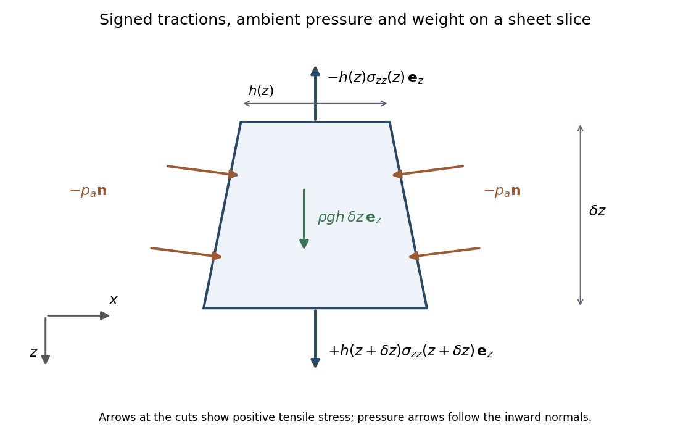

<h1 id="2/solution">Solution</h1>

↑ **Parent:** [2](../2.md)

In a slender symmetric [viscous sheet](../../../../../viscous-sheet.md), the two broad faces have zero tangential traction. A cross-thickness variation of $w$ on the thickness scale would produce leading shear $\mu w_x$, whereas $\mu u_z$ is smaller by the square of the aspect ratio. The leading transverse momentum balance and the shear-free conditions therefore give $w_x=0$: write $w=w(z,t)$.

[Incompressibility](../../../../../incompressible-flow.md) gives $u_x=-w_z$. Symmetry about $x=0$ sets the integration constant to zero, so

$$
\boxed{u=-xw_z.}
$$

The normal traction on either nearly vertical face matches the ambient [hydrostatic pressure](../../../../../hydrostatic-pressure.md), giving $\sigma_{xx}=-p_a$ to leading order. The [Newtonian fluid stress tensor](../../../../../newtonian-fluid-stress-tensor.md) then yields

$$
\sigma_{xx}=-p+2\mu u_x=-p-2\mu w_z=-p_a,
\qquad p=p_a-2\mu w_z,
$$

$$
\boxed{\sigma_{zz}=-p+2\mu w_z=4\mu w_z-p_a.}
$$

The factor four is the planar extensional resistance, as in the [planar viscous-sheet stretching equations](../../../../../planar-viscous-sheet-stretching-equations.md), rather than the factor three for uniaxial extension with two contracting transverse directions.

The following slice diagram shows all axial-force contributions per unit $y$-width; the end arrows indicate positive tensile stress and reverse if that signed stress is negative.

**[Figure 1](#2/image-signed-end-tractions-ambient-side-pressure-and-weight-on-a-widening-viscous-sheet-slice). Signed end tractions, ambient side pressure and weight on a widening viscous-sheet slice**.

The two end tractions have net $z$-component $\partial_z(h\sigma_{zz})\delta z$. The normal [pressure](../../../../../pressure.md) on the inclined side faces contributes $p_a h_z\delta z$, and [gravitational acceleration](../../../../../gravitational-acceleration.md) gives the weight $\rho gh\delta z$. Hence [force balance](../../../../../force-balance.md) is

$$
\partial_z(h\sigma_{zz})+p_a h_z+\rho gh=0.
$$

Substitute the stress expression and $p_a'=\rho_a g$:

$$
\partial_z(4\mu h w_z)-h p_a'+\rho gh=0,
$$

so

$$
\boxed{\frac{4\mu}{h}\partial_z(hw_z)+(\rho-\rho_a)g=0.}
$$

Keeping the side-pressure component is essential: dropping it would retain an incorrect dependence on the arbitrary ambient [pressure](../../../../../pressure.md) level. The remaining equation from [conservation of mass](../../../../../mass-conservation.md) is

$$
\boxed{h_t+(hw)_z=0,\qquad D_th=-hw_z.}
$$

It follows either by integrating [incompressibility](../../../../../incompressible-flow.md) across the moving faces or directly from the face [kinematic boundary condition](../../../../../kinematic-boundary-condition.md).

When effective [gravitational acceleration](../../../../../gravitational-acceleration.md) vanishes, $4\mu h w_z$ is independent of $z$. It equals the applied excess tensile [force](../../../../../force.md) $F(t)$, with ambient [pressure](../../../../../pressure.md) removed from the end loading. Along a material element labeled by its initial position $z_0$,

$$
\frac{Dh}{Dt}=-hw_z=-\frac{F(t)}{4\mu}.
$$

Integration gives [uniform material thinning under planar-sheet tension](../../../../../uniform-material-thinning-under-planar-sheet-tension.md):

$$
\boxed{h(z,t)=h_0(z_0)-\Delta(t),\qquad
\Delta(t)=\frac1{4\mu}\int_0^tF(s)\,ds.}
$$

A material interval conserves its area: $h(z,t)\,dz=h_0(z_0)\,dz_0$. Thus

$$
\boxed{\frac{\partial z_0}{\partial z}=\frac{h(z,t)}{h_0(z_0)},\qquad
\frac{\partial z}{\partial z_0}=\frac{h_0(z_0)}{h_0(z_0)-\Delta}.}
$$

With the specified fixed material origin, integrate the latter relation to obtain

$$
\boxed{z=z_0+\int_0^{z_0}\frac{\Delta\,ds}{h_0(s)-\Delta}.}
$$

These formulas hold while the material thickness remains positive.

For the quadratic initial profile, put $q=H-\Delta>0$. If $k\ne0$, evaluating the integral at $z_0=L_0$ gives

$$
\boxed{L(\Delta)=L_0+
\frac{\Delta}{|k|\sqrt{Hq}}
\tan^{-1}\left(|k|L_0\sqrt{\frac Hq}\right).}
$$

For $k=0$ it instead gives

$$
\boxed{L(\Delta)=\frac{HL_0}{H-\Delta}.}
$$

For a constant positive pulling [force](../../../../../force.md), $\Delta=Ft/(4\mu)$ first reaches the minimum initial thickness $H$ at

$$
\boxed{t^*=\frac{4\mu H}{F}.}
$$

Both expressions for $L$ diverge there. Write $q=F(t^*-t)/(4\mu)$. If $k\ne0$, the inverse tangent tends to $\pi/2$ and $\Delta\to H$, giving

$$
\boxed{\alpha=-\tfrac12,\qquad
A=\frac\pi{|k|}\sqrt{\frac{\mu H}{F}},\qquad
L\sim A(t^*-t)^{-1/2}.}
$$

For $k=0$,

$$
\boxed{\alpha=-1,\qquad A=\frac{4\mu HL_0}{F},\qquad
L\sim A(t^*-t)^{-1}.}
$$

This is [finite-time extension of a quadratically thickened sheet](../../../../../finite-time-extension-of-a-quadratically-thickened-sheet.md). With nonzero $k$, the dominant extension comes from the small material region $|z_0|=O(\sqrt{q/H}/|k|)$ near the thickness minimum, where the integrand is proportional to $1/(q+Hk^2z_0^2)$. Its width shrinks like $\sqrt q$, giving an integrated [divergence](../../../../../divergence.md) $q^{-1/2}$. The fixed ends are asymptotically far away in those local coordinates, so $A$ does not depend on $L_0$. For a uniform sheet the entire material interval has denominator $q$, giving the stronger $q^{-1}$ [divergence](../../../../../divergence.md) and retaining its length in $A$. The singularity is a prediction of the ideal slender-sheet model as its minimum thickness tends to zero.

## ↑ Ancestors (10)

1. [2](../2.md)
2. [Paper 44](../../paper-44-split.md)
3. [Iii](../../split.md)
4. [2001](../../../split.md)
5. [Past exam of the mathematics course of the University of Cambridge](../../../../split.md)
6. [Mathematics course of the University of Cambridge](../../../../../mathematics-course-of-the-university-of-cambridge.md)
7. [Course of the University of Cambridge](../../../../../course-of-the-university-of-cambridge.md)
8. [University of Cambridge](../../../../../university-of-cambridge-split.md)
9. [List of universities](../../../../../list-of-universities.md)
10. [Codex Wiki](../../../../../split.md)
