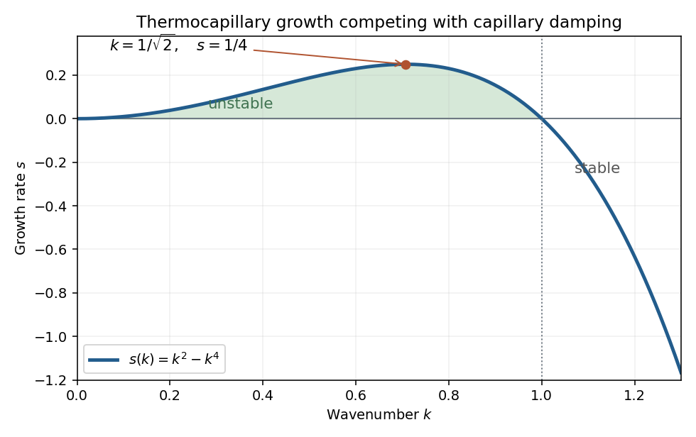

<h1 id="3/solution">Solution</h1>

↑ **Parent:** [3](../3.md)

For a stationary film of uniform thickness, [thermal conduction](../../../../../thermal-conduction.md) gives $T_{zz}=0$, so $T=T_0+cz$. The cooling boundary condition determines $c$:

$$
-\kappa c=\alpha(c h+\Delta T),\qquad
\boxed{T(z)=T_0-\frac{\alpha\Delta T}{\kappa+\alpha h}z.}
$$

Consequently the surface [temperature](../../../../../temperature.md) is

$$
T_s=T_0-\Delta T\frac{\alpha h}{\kappa+\alpha h}
=T_0-\Delta T\frac{\alpha h}{\kappa}
+O\!\left(\Delta T\left(\frac{\alpha h}{\kappa}\right)^2\right).
$$

This is the [quasistatic temperature of a conductively cooled film](../../../../../quasistatic-temperature-of-a-conductively-cooled-film.md), with a weak-cooling expansion when $\alpha h/\kappa\ll1$.

Let the thickness and longitudinal scales be $h_*,L$, with $\epsilon=h_*/L\ll1$. [Incompressibility](../../../../../incompressible-flow.md) gives transverse speed of order $\epsilon U$, and film evolution has the kinematic time scale $L/U$. For the [temperature](../../../../../temperature.md) variation scale $\Theta$, longitudinal [diffusion](../../../../../diffusion.md) divided by transverse [diffusion](../../../../../diffusion.md) is $h_*^2/L^2=\epsilon^2$. Each advective term, and the time derivative on that evolution scale, divided by transverse [diffusion](../../../../../diffusion.md) is

$$
\frac{U\Theta/L}{\kappa\Theta/h_*^2}
=\frac{Uh_*^2}{\kappa L}=Pe.
$$

Thus $\epsilon^2\ll1$ and $Pe\ll1$ make the leading thermal profile locally linear and quasistatic. Retaining the weak-cooling condition gives the same surface-temperature approximation with the local $h(x,t)$. For any independently imposed faster time variation one would also require its thermal relaxation ratio $h_*^2/(\kappa t_{\mathrm{evol}})$ to be small.

Define the positive surface-tension gradient coefficient

$$
B=-\frac{\gamma'\Delta T\alpha}{\kappa}>0.
$$

The weak-cooling approximation gives $\gamma_s\simeq\gamma_0+Bh$, so the [Marangoni stress](../../../../../marangoni-effect.md) is $\gamma_{s,x}=Bh_x$. The [Young–Laplace equation](../../../../../young-laplace-equation.md) gives the leading liquid [pressure](../../../../../pressure.md) $p=p_a-\gamma_0h_{xx}$, with constant ambient [pressure](../../../../../pressure.md). In [lubrication theory](../../../../../lubrication-theory.md), $p_z=0$ and $\mu u_{zz}=p_x$. The [no-slip boundary condition](../../../../../no-slip-boundary-condition.md) at the wall and the tangential surface condition $\mu u_z(h)=\gamma_{s,x}$ give

$$
u(z)=\frac{p_x}{\mu}\left(\frac{z^2}{2}-hz\right)
+\frac{\gamma_{s,x}}\mu z.
$$

Hence the [volume flux](../../../../../volumetric-flow-rate.md) is

$$
Q=\int_0^hu\,dz=-\frac{h^3p_x}{3\mu}+
\frac{h^2\gamma_{s,x}}{2\mu}
=\frac{\gamma_0h^3h_{xxx}}{3\mu}+
\frac{Bh^2h_x}{2\mu}.
$$

[Conservation of mass](../../../../../mass-conservation.md) gives the [thermocapillary thin-film equation](../../../../../thermocapillary-thin-film-equation.md)

$$
\boxed{h_t+\partial_x\left(
\frac{\gamma_0h^3h_{xxx}}{3\mu}
-\frac{\gamma'\Delta T\alpha}{2\kappa\mu}h^2h_x\right)=0.}
$$

The replacement of [surface tension](../../../../../surface-tension.md) by $\gamma_0$ in the capillary term needs $Bh_*/\gamma_0\ll1$. For comparable capillary and thermocapillary fluxes,

$$
\frac{Q_{\mathrm M}}{Q_{\mathrm C}}
\sim\frac{Bh_*}{\gamma_0\epsilon^2}=O(1),
$$

so the fractional tension change is only $O(\epsilon^2)$. Both the tension correction to $\gamma h_{xxx}$ and the differentiated-tension contribution $\gamma_xh_{xx}$ are then higher-order. Weak cooling alone would not justify that replacement if $|\gamma'|\Delta T/\gamma_0$ were allowed to grow without bound.

The capillary term smooths the film: a crest has negative [curvature](../../../../../curvature.md) and higher liquid [pressure](../../../../../pressure.md), causing flow away from it. The thermal term has the opposite effect. A thicker region has a colder surface and therefore higher [surface tension](../../../../../surface-tension.md); [Marangoni stress](../../../../../marangoni-effect.md) pulls surface fluid toward that region, reinforcing the thickness disturbance. These mechanisms give fourth-order damping and second-order growth respectively.

Use $H=h/\widehat h$, $X=\epsilon x/\widehat h$, and $\tau=t/\widehat t$. The two dimensionless flux-divergence coefficients are $B\epsilon^2\widehat t/(2\mu)$ and $\gamma_0\epsilon^4\widehat t/(3\mu\widehat h)$. Setting both equal to one gives the [balanced scales for a thermocapillary film](../../../../../balanced-scales-for-a-thermocapillary-film.md):

$$
\boxed{\epsilon^2=\frac{3B\widehat h}{2\gamma_0}
=-\frac{3\gamma'\Delta T\alpha\widehat h}{2\kappa\gamma_0},\qquad
\widehat t=\frac{4\mu\gamma_0}{3B^2\widehat h}
=\frac{4\mu\gamma_0\kappa^2}{3(\gamma'\Delta T\alpha)^2\widehat h}.}
$$

These choices yield $H_\tau+(H^2H_X)_X+(H^3H_{XXX})_X=0$. The predicted $\epsilon$ must be small for the assumed long-wave approximation.

Linearize about $H=1$ using a [normal mode](../../../../../normal-mode.md) of amplitude $\delta$. The resulting equation is $s-k^2+k^4=0$, so the [dispersion relation](../../../../../dispersion-relation.md) is

$$
\boxed{s(k)=k^2-k^4.}
$$

Modes with $0<|k|<1$ grow, while $|k|>1$ modes decay. Differentiating $s$ gives the most unstable wavenumbers

$$
\boxed{|k|=\frac1{\sqrt2},\qquad s_{\max}=\frac14.}
$$

The physical fastest wavenumber is $\epsilon/(\sqrt2\widehat h)$.

**[Figure 2](#3/image-thermocapillary-film-growth-rate-showing-the-unstable-band-and-fastest-growing-wavenumber). Thermocapillary film growth rate showing the unstable band and fastest-growing wavenumber**.

For a positive steady film with zero [volume flux](../../../../../volumetric-flow-rate.md), $H^2H_X+H^3H_{XXX}=0$. Divide by $H^3$ and integrate once:

$$
H_{XXX}=-\frac{H_X}{H},\qquad H_{XX}+\ln H=C.
$$

Choosing the thickness scale so that $H=1$ when $H_{XX}=0$ sets $C=0$. Multiply $H_{XX}=-\ln H$ by $H_X$ and integrate to obtain the [zero-flux thermocapillary film profiles](../../../../../zero-flux-thermocapillary-film-profiles.md) relation

$$
\boxed{\tfrac12H_X^2+H(\ln H-1)=E.}
$$

Thus the stated potential is $V(H)=H(\ln H-1)$ and the integration constant $E$ is the corresponding first integral.

## ↑ Ancestors (10)

1. [3](../3.md)
2. [Paper 44](../../paper-44-split.md)
3. [Iii](../../split.md)
4. [2001](../../../split.md)
5. [Past exam of the mathematics course of the University of Cambridge](../../../../split.md)
6. [Mathematics course of the University of Cambridge](../../../../../mathematics-course-of-the-university-of-cambridge.md)
7. [Course of the University of Cambridge](../../../../../course-of-the-university-of-cambridge.md)
8. [University of Cambridge](../../../../../university-of-cambridge-split.md)
9. [List of universities](../../../../../list-of-universities.md)
10. [Codex Wiki](../../../../../split.md)
