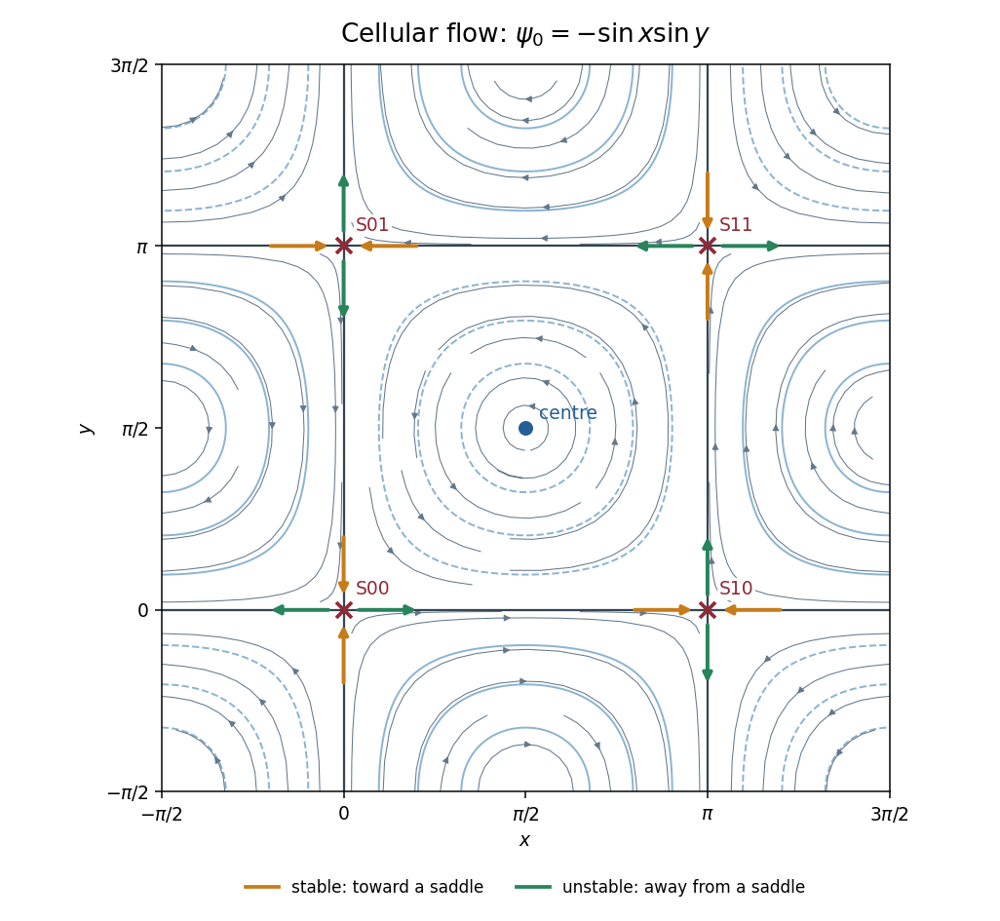

<h1 id="3/i/solution">Solution</h1>

↑ **Parent:** [I](../i.md)

The unperturbed [sinusoidal cellular flow](../../../../../../sinusoidal-cellular-flow.md) has

$$
\mathbf u_0=(\sin x\cos y,-\cos x\sin y),\qquad
\frac{d\psi_0}{dt}=\nabla\psi_0\cdot\mathbf u_0=0.
$$

Its [stream function](../../../../../../stream-function.md) is a [first integral](../../../../../../first-integral.md), so each trajectory lies on a level set of $\psi_0$. This planar autonomous [Hamiltonian flow](../../../../../../hamiltonian-flow.md) has one degree of freedom and its conserved quantity reduces motion on regular levels to a quadrature: this is its integrability. The central cell has closed [streamlines](../../../../../../streamline.md); the zero level is the grid of [separatrices](../../../../../../separatrix.md).

Solving both components of $\mathbf u_0=0$ gives [saddle equilibria](../../../../../../saddle-equilibrium.md) at $(n\pi,m\pi)$ and [center equilibria](../../../../../../center-equilibrium.md) at $(\pi/2+n\pi,\pi/2+m\pi)$. In the specified open square, the saddles are $(0,0),(\pi,0),(0,\pi),(\pi,\pi)$ and the only interior center is $(\pi/2,\pi/2)$. Centers at the outer square's corners are on its excluded boundary.

At a saddle the [Jacobian matrix](../../../../../../jacobian-matrix.md) is $\operatorname{diag}(s,-s)$ with $s=(-1)^{n+m}$. If $n+m$ is even, the horizontal branches are unstable and vertical branches stable; if it is odd, those roles reverse. The branches extend along $y=m\pi$ and $x=n\pi$ and connect neighboring saddles as [heteroclinic orbits](../../../../../../heteroclinic-orbit.md). For example the bottom boundary flows from $(0,0)$ to $(\pi,0)$, the right boundary from $(\pi,0)$ to $(\pi,\pi)$, the top boundary from $(\pi,\pi)$ to $(0,\pi)$, and the left boundary returns to $(0,0)$. A connecting branch is unstable relative to its departing saddle and stable relative to its arriving saddle.

At a center the [Jacobian matrix](../../../../../../jacobian-matrix.md) is $\begin{pmatrix}0&-s\\s&0\end{pmatrix}$, where now $s=\sin x\sin y=\pm1$. Its [eigenvalues](../../../../../../eigenvalue.md) are $\pm i$. The local definite extremum of $\psi_0$ surrounds it by closed [streamlines](../../../../../../streamline.md), giving a neutrally stable center, not an attracting equilibrium. Central circulation is counterclockwise and adjoining cells have alternating circulation.

**[Figure 1](#3/i/image-unperturbed-cellular-streamlines-four-interior-saddles-and-stable-and-unstable-branches). Unperturbed cellular streamlines, four interior saddles, and stable and unstable branches**.

## ↑ Ancestors (11)

1. [I](../i.md)
2. [3](../../3.md)
3. [Paper 46](../../../paper-46-split.md)
4. [Iii](../../../split.md)
5. [2001](../../../../split.md)
6. [Past exam of the mathematics course of the University of Cambridge](../../../../../split.md)
7. [Mathematics course of the University of Cambridge](../../../../../../mathematics-course-of-the-university-of-cambridge.md)
8. [Course of the University of Cambridge](../../../../../../course-of-the-university-of-cambridge.md)
9. [University of Cambridge](../../../../../../university-of-cambridge-split.md)
10. [List of universities](../../../../../../list-of-universities.md)
11. [Codex Wiki](../../../../../../split.md)
