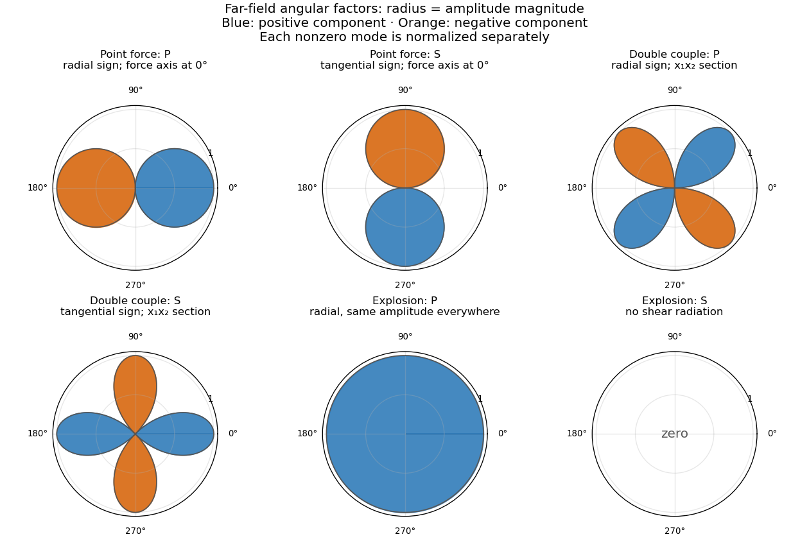

<h1 id="5/solution">Solution</h1>

↑ **Parent:** [5](../5.md)

Write $n=(x-\xi)/R$ for the receiver direction. With the printed time convention $e^{i\omega t}$, an outgoing spherical wave has phase $e^{-i\omega R/v}$. The leading terms of the [elastodynamic Green tensor](../../../../../elastodynamic-green-tensor.md) are of order $1/(\alpha^2R)$ and $1/(\beta^2R)$, while the remaining terms have orders $1/(\omega vR^2)$ and $1/(\omega^2R^3)$. Thus the far-field approximation requires

$$
\boxed{\omega R/\alpha\gg1,\qquad \omega R/\beta\gg1.}
$$

This is an absolute asymptotic comparison of the tensor terms. At an angular node of a leading radiation component, the smaller near field can still dominate that component. The PDF prints an opposite phase sign in the near-field shear exponential; that would be incoming with this time convention. The outgoing leading terms, which determine all the requested far-field patterns, are unambiguous.

For a unit time-harmonic point force in direction $d$, the [far-field P and S radiation from a point force](../../../../../far-field-p-and-s-radiation-from-a-point-force.md) is

$$
u_P=\frac{e^{-i\omega R/\alpha}}{4\pi\alpha^2R}\,n(n\cdot d),\qquad
u_S=\frac{e^{-i\omega R/\beta}}{4\pi\beta^2R}\{d-n(n\cdot d)\}.
$$

The normalization here follows the given [elastodynamic Green tensor](../../../../../elastodynamic-green-tensor.md); a separate force-density convention would include its corresponding density factor. If $\theta$ is the angle between $n$ and $d$, the signed radial [P wave](../../../../../p-wave.md) amplitude is $\cos\theta$, and the magnitude of the [S wave](../../../../../s-wave.md) amplitude is $\sin\theta$. The [P wave](../../../../../p-wave.md) has two oppositely signed lobes and a nodal plane perpendicular to $d$. The [S wave](../../../../../s-wave.md) is polarized in the projection of $d$ onto the receiver's tangent plane, has nodes along $\pm d$, and has its maximum on the perpendicular great circle. Rotating its planar section about $d$ gives the full toroidal [S wave](../../../../../s-wave.md) magnitude pattern.

For a point source with [seismic moment tensor](../../../../../seismic-moment-tensor.md) $M$, convolution with the derivatives of the [Dirac delta function](../../../../../dirac-delta-function.md) gives $u_i=M_{jk}\partial_{\xi_k}G_i^{\,j}$. In the far field, differentiating the outgoing phase contributes $i\omega n_k/v$; differentiating $R^{-1}$ or $n$ is a lower-order effect. Thus the [point-moment elastodynamic displacement](../../../../../point-moment-elastodynamic-displacement.md) is

$$
\boxed{u_P=\frac{i\omega e^{-i\omega R/\alpha}}{4\pi\alpha^3R}\,
n(n^{\mathsf T}Mn),\qquad
u_S=\frac{i\omega e^{-i\omega R/\beta}}{4\pi\beta^3R}\,
(I-nn^{\mathsf T})Mn.}
$$

The double couple has $M=e_1e_2^{\mathsf T}+e_2e_1^{\mathsf T}$. Its [double-couple radiation pattern](../../../../../double-couple-radiation-pattern.md) therefore has signed radial [P wave](../../../../../p-wave.md) factor and tangential [S wave](../../../../../s-wave.md) vector

$$
A_P=2n_1n_2,\qquad
\boldsymbol A_S=(n_2,n_1,0)-2n_1n_2n,\qquad
|\boldsymbol A_S|^2=n_1^2+n_2^2-4n_1^2n_2^2.
$$

In the $x_1x_2$ plane, $n=(\cos\phi,\sin\phi,0)$, giving **$A_P=\sin2\phi$ and $A_S=\cos2\phi$**, where the signed [S wave](../../../../../s-wave.md) component is along $(-\sin\phi,\cos\phi,0)$. The [P wave](../../../../../p-wave.md) nodal planes are $n_1=0$ and $n_2=0$, and the alternating lobes peak on their bisectors. The planar [S wave](../../../../../s-wave.md) lobes peak along the coordinate axes. For the complete three-dimensional pattern, write $n=(\sin\theta\cos\phi,\sin\theta\sin\phi,\cos\theta)$:

$$
A_P=\sin^2\theta\sin2\phi,\qquad
A_{SV}=\sin\theta\cos\theta\sin2\phi,\qquad
A_{SH}=\sin\theta\cos2\phi.
$$

The full [S wave](../../../../../s-wave.md) has additional zeros at $\pm e_3$ as well as at the planar bisectors.

For the explosion source, $M=I$. Then $n^{\mathsf T}Mn=1$ and $(I-nn^{\mathsf T})Mn=0$. The [explosion radiation in an isotropic elastic solid](../../../../../explosion-radiation-in-an-isotropic-elastic-solid.md) is therefore **an [isotropic](../../../../../isotropy.md) radial [P wave](../../../../../p-wave.md), with no [S wave](../../../../../s-wave.md) radiation**. A dilatational point source is a gradient source; its far-field force is parallel to the propagation direction, so the transverse projection vanishes.

**[Figure 1](#5/image-far-field-radiation-sections-for-a-point-force-a-double-couple-and-an-explosion). Far-field radiation sections for a point force, a double couple and an explosion**.

Each radius in the sketch is the magnitude of the angular factor, separately normalized for each mode. Blue and orange distinguish signs of the indicated radial or tangential component. The point-force sections contain its axis; the double-couple sections are in the $x_1x_2$ plane. The formulas above specify the full three-dimensional patterns.

## ↑ Ancestors (10)

1. [5](../5.md)
2. [Paper 47](../../paper-47-split.md)
3. [Iii](../../split.md)
4. [2001](../../../split.md)
5. [Past exam of the mathematics course of the University of Cambridge](../../../../split.md)
6. [Mathematics course of the University of Cambridge](../../../../../mathematics-course-of-the-university-of-cambridge.md)
7. [Course of the University of Cambridge](../../../../../course-of-the-university-of-cambridge.md)
8. [University of Cambridge](../../../../../university-of-cambridge-split.md)
9. [List of universities](../../../../../list-of-universities.md)
10. [Codex Wiki](../../../../../split.md)
