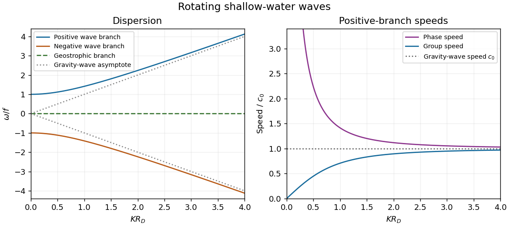

<h1 id="2/solution">Solution</h1>

↑ **Parent:** [2](../2.md)

Let $H=h_{00}+\zeta$ and write the horizontal [shallow water equations](../../../../../shallow-water-equations.md) on the constant [f-plane](../../../../../f-plane.md) as

$$
\frac{D\mathbf u_H}{Dt}+f\widehat{\mathbf z}\times\mathbf u_H=-g\nabla_H\zeta,\qquad H_t+\nabla_H\cdot(H\mathbf u_H)=0.
$$

Keeping only terms linear in the disturbance about rest gives the [linearized shallow water equations](../../../../../linearized-shallow-water-equations.md)

$$
u_t-fv=-g\zeta_x,\qquad v_t+fu=-g\zeta_y,\qquad \zeta_t+h_{00}(u_x+v_y)=0.
$$

Define the horizontal [divergence](../../../../../divergence.md) $\delta=u_x+v_y$ and relative [vorticity](../../../../../vorticity.md) $q=v_x-u_y$. Taking respectively the [divergence](../../../../../divergence.md) and vertical [curl](../../../../../curl.md) of the momentum equation yields

$$
\boxed{\delta_t=fq-g\nabla_H^2\zeta,\qquad q_t=-f\delta.}
$$

Together with $\zeta_t=-h_{00}\delta$, this proves

$$
\boxed{\partial_t\left(\frac q{h_{00}}-\frac{f\zeta}{h_{00}^2}\right)=0.}
$$

The nonlinear [shallow-water potential vorticity](../../../../../shallow-water-potential-vorticity.md) is $Q=(f+q)/H$. The nonlinear vertical [vorticity equation](../../../../../vorticity-equation.md) gives $D(f+q)/Dt=-(f+q)\delta$, while [mass conservation](../../../../../mass-conservation.md) gives $DH/Dt=-H\delta$; their ratio is therefore materially conserved. Expanding about rest,

$$
Q=\frac f{h_{00}}+\frac q{h_{00}}-\frac{f\zeta}{h_{00}^2}+O(\text{disturbance}^2).
$$

Advection of its constant background contributes nothing at first order, explaining why the displayed linear anomaly is conserved at each fixed position.

A further time derivative eliminates $q$ and $\zeta$ from the [divergence](../../../../../divergence.md) equation:

$$
\delta_{tt}+f^2\delta-c_0^2\nabla_H^2\delta=0,\qquad c_0=\sqrt{gh_{00}}.
$$

For a [plane wave](../../../../../plane-wave.md) with horizontal [wavevector](../../../../../wavevector.md) $(k,l)$, write $K=\sqrt{k^2+l^2}$. More directly, substituting the [plane wave](../../../../../plane-wave.md) into the three linear equations gives a coefficient [matrix](../../../../../matrix.md) with [determinant](../../../../../determinant.md) proportional to $\omega[\omega^2-f^2-c_0^2K^2]$. Thus the full [linear rotating shallow-water dispersion relation](../../../../../linear-rotating-shallow-water-dispersion-relation.md) has one balanced branch and two wave branches:

$$
\boxed{\omega=0\quad\hbox{or}\quad\omega=\pm\sqrt{f^2+c_0^2K^2}.}
$$

The latter are [inertia-gravity waves](../../../../../inertia-gravity-wave.md). The positive branch starts at $f$ with zero slope and tends to the straight line $c_0K$; the negative branch is its reflection. The requested sketch, including the stationary branch, is

**[Figure 1](#2/image-rotating-shallow-water-dispersion-and-positive-branch-phase-and-group-speeds). Rotating shallow-water dispersion and positive-branch phase and group speeds**.

For the positive-frequency branch, the magnitudes of the [phase velocity](../../../../../phase-velocity.md) and [group velocity](../../../../../group-velocity.md) are

$$
c_p=\frac\omega K=\sqrt{c_0^2+\frac{f^2}{K^2}},\qquad c_g=\frac{d\omega}{dK}=\frac{c_0^2K}{\omega},\qquad c_pc_g=c_0^2.
$$

The [group velocity](../../../../../group-velocity.md) vector is $c_0^2(k,l)/\omega$; the negative branch reverses its direction. Near $\omega=f$, namely $KR_D\ll1$ with the [Rossby deformation radius](../../../../../rossby-deformation-radius.md) $R_D=c_0/f$, $c_p\sim f/K$ is large while $c_g\sim c_0^2K/f$ is small. The $K=0$ limit is an [inertial oscillation](../../../../../inertial-oscillation.md), for which a spatial phase speed is not defined. Far above $f$, both speeds approach $c_0$, the [shallow water](../../../../../shallow-water-approximation.md) gravity-wave speed, with $c_p>c_0$ and $c_g<c_0$ at finite $K$.

On the zero-frequency branch, [geostrophic balance](../../../../../geostrophic-balance.md) gives

$$
u=-\frac gf\zeta_y,\qquad v=\frac gf\zeta_x,\qquad \boxed{q=\frac gf\nabla_H^2\zeta,\qquad\delta=0.}
$$

For a nonconstant [plane wave](../../../../../plane-wave.md), $\widehat q=-(gK^2/f)\widehat\zeta$: relative [vorticity](../../../../../vorticity.md) and elevation have opposite signs. They can both be nonzero and spatially structured, whereas the horizontal [divergence](../../../../../divergence.md) vanishes identically. A constant elevation is also a zero-frequency solution, with zero velocity and zero relative [vorticity](../../../../../vorticity.md).

For the initially resting ridge, set $\zeta_0(x)=\epsilon h_{00}e^{-x^2/L^2}$ and assume an unbounded domain, uniform in $y$. Initial [potential vorticity](../../../../../potential-vorticity.md) fixes

$$
q-\frac f{h_{00}}\zeta=-\frac f{h_{00}}\zeta_0.
$$

In the balanced remainder, insert $q_s=(g/f)\zeta_s''$ to obtain

$$
\boxed{(1-R_D^2\partial_x^2)\zeta_s=\zeta_0,\qquad u_s=0,\qquad v_s=\frac gf\zeta_s'.}
$$

The decaying [Green's function](../../../../../green-s-function.md) of this [modified Helmholtz equation](../../../../../modified-helmholtz-equation.md) gives the [Geostrophic adjustment of a Gaussian height ridge](../../../../../geostrophic-adjustment-of-a-gaussian-height-ridge.md) explicitly:

$$
\zeta_s(x)=\frac1{2R_D}\int_{-\infty}^{\infty}e^{-|x-x'|/R_D}\zeta_0(x')\,dx'.
$$

The initial outward pressure force creates a cross-ridge current; the [Coriolis acceleration](../../../../../coriolis-acceleration.md) turns that current and builds the along-ridge [geostrophic flow](../../../../../geostrophic-flow.md). The remainder is radiated [inertia-gravity waves](../../../../../inertia-gravity-wave.md), not a dissipative disappearance of energy.

For precision, use the [Fourier transform](../../../../../fourier-transform.md) $\widehat\zeta(k)=\int\zeta(x)e^{-ikx}\,dx$. Initial rest implies $\zeta_t(x,0)=0$, and the conserved anomaly gives

$$
\widehat\zeta_{tt}+(f^2+c_0^2k^2)\widehat\zeta=f^2\widehat\zeta_0.
$$

Consequently

$$
\widehat\zeta_0=\epsilon h_{00}L\sqrt\pi\,e^{-k^2L^2/4},\qquad
\widehat\zeta_s=\frac{\widehat\zeta_0}{1+R_D^2k^2},\qquad
\widehat\zeta(t)=\widehat\zeta_s+(\widehat\zeta_0-\widehat\zeta_s)\cos(\sqrt{f^2+c_0^2k^2}\,t).
$$

These formulas satisfy both initial conditions. They also show that the waves carry no linear [potential vorticity](../../../../../potential-vorticity.md) anomaly: $q=(f/h_{00})(\zeta-\zeta_0)$ and $\delta=-\zeta_t/h_{00}$ reconstruct the remaining fields, with $u$ and $v$ obtained from their derivatives. On the infinite line, dispersive wave packets propagate away and decay locally, leaving the balanced ridge and its oppositely directed flanking currents. [Conservation of energy](../../../../../conservation-of-energy.md) still holds globally. In a reflecting finite basin, standing waves may persist, so a permanent pointwise relaxation is not guaranteed without dissipation.

If $L\gg R_D$, most of the initial elevation remains balanced: $\zeta_s\simeq\zeta_0$ with small smoothing corrections. If $L\ll R_D$, the balanced ridge spreads to width $R_D$, and away from the original narrow core

$$
\zeta_s(x)\simeq\frac{\epsilon h_{00}L\sqrt\pi}{2R_D}e^{-|x|/R_D}.
$$

Thus the final central height is much smaller than the initial one and the wave component is substantial. The integral of the balanced elevation equals the initial integral, since the [Green's function](../../../../../green-s-function.md) has unit integral; the oscillatory component has zero net added volume.

## ↑ Ancestors (10)

1. [2](../2.md)
2. [Paper 48](../../paper-48-split.md)
3. [Iii](../../split.md)
4. [2001](../../../split.md)
5. [Past exam of the mathematics course of the University of Cambridge](../../../../split.md)
6. [Mathematics course of the University of Cambridge](../../../../../mathematics-course-of-the-university-of-cambridge.md)
7. [Course of the University of Cambridge](../../../../../course-of-the-university-of-cambridge.md)
8. [University of Cambridge](../../../../../university-of-cambridge-split.md)
9. [List of universities](../../../../../list-of-universities.md)
10. [Codex Wiki](../../../../../split.md)
