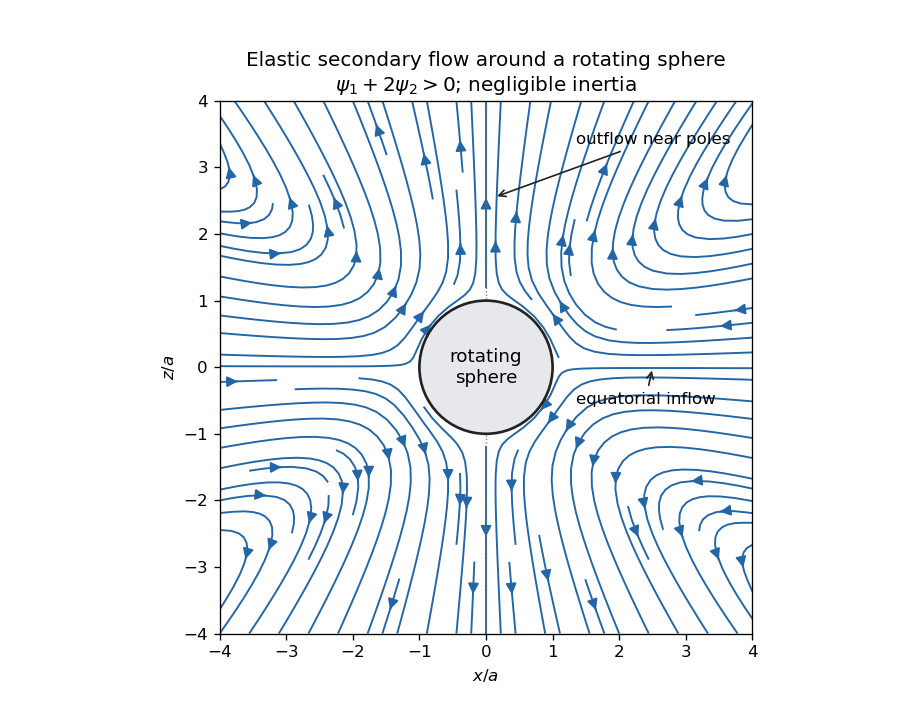

<h1 id="2/solution">Solution</h1>

↑ **Parent:** [2](../2.md)

The usual elastic [secondary flow](../../../../../secondary-flow.md) around a rotating sphere is inward towards the equator, then poleward beside the sphere and outward near both poles. It is superposed on the primary azimuthal [rotating sphere in Stokes flow](../../../../../rotating-sphere-in-stokes-flow.md). Tensile [normal stresses](../../../../../normal-stress.md) along curved azimuthal streamlines act as hoop stresses, pulling liquid towards the rotation axis. Incompressibility supplies the axial return flow. Unlike the primary rotation, this meridional circulation does not reverse when the rotation is reversed.

The direction assumes the usual polymeric sign $c=\psi_1+2\psi_2>0$ and negligible inertia. A general [second-order fluid](../../../../../second-order-fluid.md) has circulation proportional to $c$: a negative value reverses the arrows and $c=0$ eliminates the leading elastic circulation. Inertial secondary circulation is a different contribution, so slow rotation alone does not determine which contribution dominates. The sketch shows the elastic contribution for $c>0$:

**[Figure 1](#2/image-elastic-meridional-circulation-entering-at-the-equator-and-leaving-near-the-poles-of-a-rotating-sphere). Elastic meridional circulation entering at the equator and leaving near the poles of a rotating sphere**.

For a quantitative check of the sketch, take sphere radius $a$, [angular velocity](../../../../../angular-velocity.md) $\Omega$ and $K=\Omega a^3$. The primary azimuthal [velocity](../../../../../velocity.md) is $v_\phi=K\sin\theta/r^2$, with $\theta$ measured from the rotation axis. Its only nonzero strain components in the spherical orthonormal basis are $E_{r\phi}=E_{\phi r}=-3K\sin\theta/(2r^3)$. The leading [elastic secondary circulation around a rotating sphere](../../../../../elastic-secondary-circulation-around-a-rotating-sphere.md) has the [stream function](../../../../../stream-function.md)

$$
\Psi=H(r)\sin^2\theta\cos\theta,\qquad
H(r)=\frac{cK^2}{4\mu a^3}\left[1-3(a/r)^2+2(a/r)^3\right],
$$

with $v_r=H(3\cos^2\theta-1)/r^2$ and $v_\theta=-H'\sin\theta\cos\theta/r$. The bracket is $(1-a/r)^2(1+2a/r)>0$ outside the sphere. Thus $v_r<0$ at the equator and $v_r>0$ near the poles when $c>0$, and both components vanish on the sphere. The diagram uses these velocities, not independently chosen arrows.

Two other manifestations of the same elastic [normal-stress differences](../../../../../normal-stress-difference.md) are [rod climbing](../../../../../weissenberg-effect.md), in which inward hoop stresses raise a free surface around a rotating rod, and [die swell](../../../../../die-swell.md), in which relaxation of the axial stress and stored polymer deformation allows an extrudate to expand sideways after leaving the die. These are not explained by a scalar [shear viscosity](../../../../../dynamic-viscosity.md) alone. A Newtonian extrudate can also swell through velocity-profile rearrangement, so the elastic contribution should not be identified with every instance of swelling.

The [second-order fluid](../../../../../second-order-fluid.md) is a slow, weak-flow expansion of the objective constitutive history of an isotropic [simple fluid](../../../../../simple-fluid.md). [Material frame indifference](../../../../../material-frame-indifference.md) requires objective tensor rates. For an [incompressible flow](../../../../../incompressible-flow.md), the leading isotropic stress is arbitrary [pressure](../../../../../pressure.md), the linear deviatoric term is $2\mu E$, and at the next order the independent contributions can be represented by $E^2$ and an objective rate of $E$. Isotropic scalar contributions are absorbed into the pressure. Their coefficients can be expressed through the two low-rate [normal-stress differences](../../../../../normal-stress-difference.md), giving

$$
\sigma=-pI+2\mu E+4(\psi_1+\psi_2)E^2-\psi_1\overset\triangle E.
$$

Here $\overset\triangle E$ is the [lower-convected derivative](../../../../../lower-convected-derivative.md), not a division by $E$. This local expansion is appropriate when deformation and temporal change over the relevant [viscoelastic relaxation time](../../../../../viscoelastic-relaxation-time.md) are small: both the [Weissenberg number](../../../../../weissenberg-number.md) and the appropriate [Deborah number](../../../../../deborah-number.md) must be small. It captures leading normal stresses in slow flows, but not arbitrary finite-strain history, rapid transients or strongly nonlinear shear thinning. In particular its restrictions are stronger than small-amplitude linear oscillatory response at arbitrary frequency.

For steady [simple shear flow](../../../../../simple-shear-flow.md) $\mathbf v=(\dot\gamma y,0,0)$, use component-first $L_{ij}=\partial_jv_i$, so the paper's $\nabla v$ is $L^T$. The relevant tensors are

$$
E=\frac{\dot\gamma}{2}\begin{pmatrix}0&1&0\\1&0&0\\0&0&0\end{pmatrix},\quad
E^2=\frac{\dot\gamma^2}{4}\operatorname{diag}(1,1,0),\quad
\overset\triangle E=L^TE+EL=\dot\gamma^2\operatorname{diag}(0,1,0).
$$

Substitution gives

$$
\boxed{\sigma=\begin{pmatrix}
-p+(\psi_1+\psi_2)\dot\gamma^2&\mu\dot\gamma&0\\
\mu\dot\gamma&-p+\psi_2\dot\gamma^2&0\\
0&0&-p
\end{pmatrix}.}
$$

Thus the first and second [normal-stress differences](../../../../../normal-stress-difference.md) are $N_1=\psi_1\dot\gamma^2$ and $N_2=\psi_2\dot\gamma^2$, and the shear stress is $\mu\dot\gamma$.

For the velocity-preservation results, the definitions imply $\overset\triangle E=\overset\circ E+2E^2$. Consequently the non-Newtonian stress can be written

$$
S=2(\psi_1+2\psi_2)E^2-\psi_1\overset\circ E,
$$

where $\overset\circ E$ is the [Jaumann derivative](../../../../../jaumann-derivative.md). Let $\mathbf v_N$ solve the steady incompressible [Stokes flow](../../../../../stokes-flow-split.md) problem with the prescribed boundary velocities. The supplied identity says that $\nabla\cdot\overset\circ E_N$ is curl-free. If $\psi_1+2\psi_2=0$, then $\nabla\cdot S_N=\nabla\Phi$ for a scalar $\Phi$ on the ordinary simply connected flow domain. The momentum equation at $\mathbf v_N$ is

$$
-\nabla(p_N+\Phi)+\mu\nabla^2\mathbf v_N+\nabla\Phi=0.
$$

Hence the Newtonian velocity itself is a solution of the second-order constitutive model, with altered pressure $p=p_N+\Phi$. For nontrivial topology one also needs the curl-free force to admit a single-valued pressure; this is implicit in the usual boundary-value problem.

On the regular weakly non-Newtonian branch, [Uniqueness of Stokes flow](../../../../../uniqueness-of-stokes-flow.md) fixes the velocity correction. At first order it solves homogeneous [Stokes flow](../../../../../stokes-flow-split.md), with zero boundary velocity, after the gradient force has been absorbed into pressure. Multiplying its equation by the correction and integrating gives $2\mu\int E_1:E_1\,dV=0$, hence the correction vanishes. Higher perturbative corrections vanish in turn because the previous velocities remain $\mathbf v_N$. **The velocity is $\mathbf v=\mathbf v_N$ in this second-order-fluid solution; only the pressure and stresses change.** This is [Newtonian velocity preservation in a second-order fluid](../../../../../newtonian-velocity-preservation-in-a-second-order-fluid.md). It does not assert global uniqueness of distant nonlinear solution branches or exact equality for a real fluid whose higher-order constitutive terms have been omitted.

For a planar incompressible [velocity](../../../../../velocity.md) $(u(x,y),v(x,y),0)$, the [rate-of-strain tensor](../../../../../strain-rate-tensor.md) has the form

$$
E_N=\begin{pmatrix}a&b&0\\b&-a&0\\0&0&0\end{pmatrix},\qquad
E_N^2=(a^2+b^2)\operatorname{diag}(1,1,0).
$$

All quantities are independent of $z$, so $\nabla\cdot E_N^2=\nabla(a^2+b^2)$. The extra quadratic term is therefore also a pressure gradient. Together with the supplied identity for the [Jaumann derivative](../../../../../jaumann-derivative.md), the entire non-Newtonian force is a gradient for arbitrary $\psi_1,\psi_2$. The same boundary-value and weak-branch argument proves **$\mathbf v=\mathbf v_N$ for every such planar second-order-fluid flow with prescribed boundary velocities**, without requiring $\psi_1+2\psi_2=0$. Specifying stresses or a free surface instead of velocities would not give the same conclusion automatically, because the extra stresses affect those boundary conditions.

## ↑ Ancestors (10)

1. [2](../2.md)
2. [Paper 49](../../paper-49-split.md)
3. [Iii](../../split.md)
4. [2001](../../../split.md)
5. [Past exam of the mathematics course of the University of Cambridge](../../../../split.md)
6. [Mathematics course of the University of Cambridge](../../../../../mathematics-course-of-the-university-of-cambridge.md)
7. [Course of the University of Cambridge](../../../../../course-of-the-university-of-cambridge.md)
8. [University of Cambridge](../../../../../university-of-cambridge-split.md)
9. [List of universities](../../../../../list-of-universities.md)
10. [Codex Wiki](../../../../../split.md)
