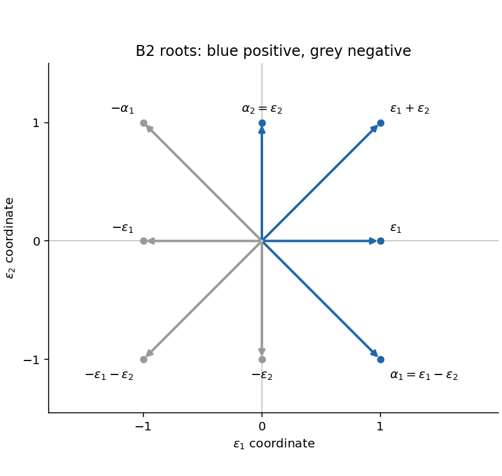
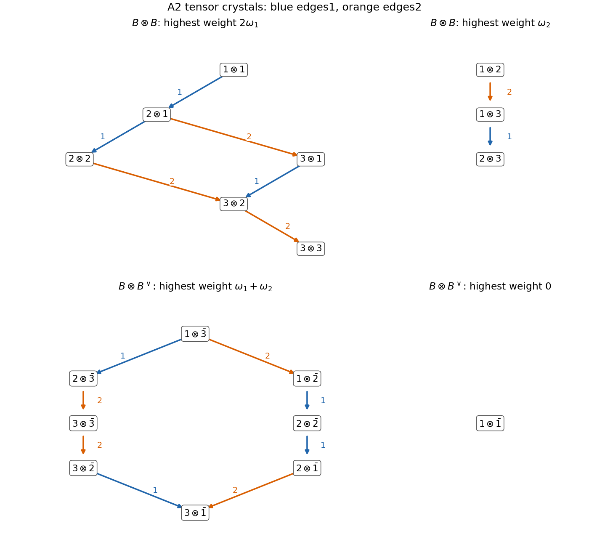

# Paper 5

↑ **Parent:** [Iii](../iii.md)

[https://www.maths.cam.ac.uk/postgrad/part-iii/files/pastpapers/2001/Paper5.pdf](https://www.maths.cam.ac.uk/postgrad/part-iii/files/pastpapers/2001/Paper5.pdf)

**Table of contents**

- [1](#1)
  - [a](#1/a)
    - [Solution](#1/a/solution)
  - [b](#1/b)
    - [Solution](#1/b/solution)
  - [c](#1/c)
    - [Solution](#1/c/solution)
- [2](#2)
  - [a](#2/a)
    - [Solution](#2/a/solution)
  - [b](#2/b)
    - [Solution](#2/b/solution)
  - [c](#2/c)
    - [Solution](#2/c/solution)
  - [d](#2/d)
    - [Solution](#2/d/solution)
- [3](#3)
  - [Solution](#3/solution)
- [4](#4)
  - [Solution](#4/solution)

## 1

↑ **Parent:** [Paper 5](paper-5.md)

<h3 id="1/a">a</h3>

↑ **Parent:** [1](#1)

<h4 id="1/a/solution">Solution</h4>

↑ **Parent:** [A](#1/a)

Work over $\mathbb C$ with a finite-dimensional [semisimple Lie algebra](../../../semisimple-lie-algebra.md) $\mathfrak g$. Choose a [Cartan subalgebra](../../../semisimple-lie-algebra.md#cartan-subalgebra) $\mathfrak h$, its [root system](../../../semisimple-lie-algebra.md#root-system) $R\subset\mathfrak h^*$, a positive system $R^+$ and its [simple roots](../../../semisimple-lie-algebra.md#simple-root). Let $W$ be the [Weyl group](../../../semisimple-lie-algebra.md#weyl-group), generated by the corresponding root reflections, and put $\rho=\tfrac12\sum_{\alpha\in R^+}\alpha$, the [Weyl vector](../../../semisimple-lie-algebra.md#half-sum-of-positive-roots). The finite-dimensional irreducible [highest-weight representation](../../../semisimple-lie-algebra.md#highest-weight-representation) $L(\lambda)$ is indexed by a [dominant integral weight](../../../semisimple-lie-algebra.md#dominant-integral-weight) $\lambda$.

If $P$ is the [weight lattice](../../../semisimple-lie-algebra.md#weight-lattice), its [group ring](../../../commutative-algebra.md#group-ring) has formal symbols $e^\mu$ with multiplication $e^\mu e^\nu=e^{\mu+\nu}$. The [formal character](../../../semisimple-lie-algebra.md#formal-character-of-a-weight-module) is

$$
\operatorname{ch}L(\lambda)=\sum_{\mu\in P}(\dim L(\lambda)_\mu)e^\mu,
$$

where $L(\lambda)_\mu=\{v:Hv=\mu(H)v\text{ for all }H\in\mathfrak h\}$ is a [weight space](../../../semisimple-lie-algebra.md#weight-space). For a weight $\nu$, define the [Weyl alternant](../../../semisimple-lie-algebra.md#weyl-alternant) $A_\nu=\sum_{w\in W}\det(w)e^{w\nu}$; the sign $\det(w)=(-1)^{\ell(w)}$ is the determinant of $w$ on the real root span, equivalently the parity of its expression in simple reflections.

The [Weyl character formula](../../../semisimple-lie-algebra.md#weyl-character-formula) is

$$
\boxed{\operatorname{ch}L(\lambda)=\frac{A_{\lambda+\rho}}{A_\rho}
=\frac{\sum_{w\in W}\det(w)e^{w(\lambda+\rho)}}{e^\rho\prod_{\alpha\in R^+}(1-e^{-\alpha})}.}
$$

The second denominator is the [Weyl denominator formula](../../../semisimple-lie-algebra.md#weyl-denominator-formula). The quotient can initially be taken in the fraction field of the group ring; the formula says it is the finite character on the left, so its apparent singularities are removable. The shifts by $\rho$ make $\lambda+\rho$ strictly dominant.

<h3 id="1/b">b</h3>

↑ **Parent:** [1](#1)

<h4 id="1/b/solution">Solution</h4>

↑ **Parent:** [B](#1/b)

Let $N=|R^+|$ and identify the real weight and Cartan spaces using a [Weyl group](../../../semisimple-lie-algebra.md#weyl-group)-invariant positive [inner product](../../../linear-algebra.md#inner-product). For a regular $H$, meaning $(\alpha,H)\ne0$ for every root, specialize $e^\mu$ to $e^{t(\mu,H)}$. Then the value of the [formal character](../../../semisimple-lie-algebra.md#formal-character-of-a-weight-module) at $t=0$ is $\dim L(\lambda)$, but both [Weyl alternants](../../../semisimple-lie-algebra.md#weyl-alternant) in the [Weyl character formula](../../../semisimple-lie-algebra.md#weyl-character-formula) vanish there. We compute their leading terms instead of substituting into that zero-over-zero expression.

Expand

$$
A_\nu(tH)=\sum_{m\ge0}t^m P_m(\nu,H),\qquad
P_m(\nu,H)=\frac1{m!}\sum_{w\in W}\det(w)(w\nu,H)^m.
$$

For every root reflection $s$, replacing $\nu$ by $s\nu$ changes the sign of $P_m$, by replacing $w$ with $ws$ in the sum. Replacing $H$ by $sH$ also changes its sign, by replacing $w$ with $sw$. Thus the polynomial vanishes whenever $\nu$ or $H$ lies on any reflecting hyperplane. It is divisible by $\prod_{\alpha>0}(\nu,\alpha)$ in its first variables and by $\prod_{\alpha>0}(H,\alpha)$ in its second variables. Distinct positive roots give distinct linear factors; each product has degree $N$.

The polynomial $P_m$ has degree $m$ in each group of variables. Therefore $P_m=0$ for $m<N$, and for $m=N$ it has the form

$$
P_N(\nu,H)=C\prod_{\alpha>0}(\nu,\alpha)\prod_{\alpha>0}(H,\alpha)
$$

with a constant $C$ independent of both variables. At $\nu=\rho$, the [Weyl denominator formula](../../../semisimple-lie-algebra.md#weyl-denominator-formula) gives

$$
A_\rho(tH)=e^{t(\rho,H)}\prod_{\alpha>0}(1-e^{-t(\alpha,H)})
=t^N\prod_{\alpha>0}(\alpha,H)+O(t^{N+1}).
$$

Consequently $C\prod_{\alpha>0}(\rho,\alpha)=1$. For strictly dominant $\nu=\lambda+\rho$, its leading coefficient is nonzero, and the ratio of the two [Weyl alternants](../../../semisimple-lie-algebra.md#weyl-alternant) tends to

$$
\boxed{\dim L(\lambda)=\prod_{\alpha>0}\frac{(\lambda+\rho,\alpha)}{(\rho,\alpha)}
=\prod_{\alpha>0}\frac{\langle\lambda+\rho,\alpha^\vee\rangle}{\langle\rho,\alpha^\vee\rangle}.}
$$

The [coroot](../../../semisimple-lie-algebra.md#coroot) is $\alpha^\vee=2\alpha/(\alpha,\alpha)$, so the root-length factors cancel in each ratio. This proves the [Weyl dimension formula](../../../semisimple-lie-algebra.md#weyl-dimension-formula) by the [lowest-degree alternant proof of the Weyl dimension formula](../../../semisimple-lie-algebra.md#lowest-degree-alternant-proof-of-the-weyl-dimension-formula), including the limiting step.

<h3 id="1/c">c</h3>

↑ **Parent:** [1](#1)

<h4 id="1/c/solution">Solution</h4>

↑ **Parent:** [C](#1/c)

Apply the [Weyl character formula](../../../semisimple-lie-algebra.md#weyl-character-formula) with $\lambda=\rho$. In the [Weyl denominator formula](../../../semisimple-lie-algebra.md#weyl-denominator-formula), replace every formal exponential $e^\mu$ by $e^{2\mu}$. This gives

$$
A_{2\rho}=e^{2\rho}\prod_{\alpha>0}(1-e^{-2\alpha}).
$$

Dividing by $A_\rho=e^\rho\prod_{\alpha>0}(1-e^{-\alpha})$ and cancelling each factor yields

$$
\boxed{\operatorname{ch}L(\rho)=e^\rho\prod_{\alpha>0}(1+e^{-\alpha})
=\prod_{\alpha>0}(e^{\alpha/2}+e^{-\alpha/2}).}
$$

The last expression is a compact way of writing the same character; individual half-root exponentials may need a larger formal lattice, but their full product lies in the group ring of the [weight lattice](../../../semisimple-lie-algebra.md#weight-lattice). Expanding the first expression, a subset $S\subseteq R^+$ contributes the [weight](../../../semisimple-lie-algebra.md#weight-representation-theory) $\rho-\sum_{\alpha\in S}\alpha$. Different subsets with the same sum give that weight's multiplicity. In particular $\dim L(\rho)=2^{|R^+|}$, consistent with the [Weyl dimension formula](../../../semisimple-lie-algebra.md#weyl-dimension-formula). This is the case $k=1$ of the [character of a Weyl-vector multiple](../../../semisimple-lie-algebra.md#character-of-a-weyl-vector-multiple).

## 2

↑ **Parent:** [Paper 5](paper-5.md)

<h3 id="2/a">a</h3>

↑ **Parent:** [2](#2)

<h4 id="2/a/solution">Solution</h4>

↑ **Parent:** [A](#2/a)

The complex [Special orthogonal Lie algebra](../../../semisimple-lie-algebra.md#special-orthogonal-lie-algebra) $\mathfrak{so}_5$ consists of endomorphisms preserving a nondegenerate symmetric [bilinear form](../../../linear-algebra.md#bilinear-form) infinitesimally:

$$
\mathfrak{so}(V,B)=\{X:B(Xu,v)+B(u,Xv)=0\}.
$$

In an orthonormal basis this is $\{X\in M_5(\mathbb C):X^T+X=0\}$, with the [commutator](../../../lie-algebra.md#commutator) bracket and dimension $\binom52=10$. Its compact real form is obtained by taking real skew-symmetric matrices. For diagonal root calculations it is more convenient to use an isotropic basis $v_1,v_2,v_0,v_{-2},v_{-1}$ with $B(v_i,v_j)=\delta_{i,-j}$, including $B(v_0,v_0)=1$.

A [maximal torus](../../../lie-theory.md#maximal-torus) of the complex [special orthogonal group](../../../linear-algebra.md#special-orthogonal-group) is

$$
T=\{\operatorname{diag}(t_1,t_2,1,t_2^{-1},t_1^{-1}):t_1,t_2\in\mathbb C^\times\}.
$$

Its Lie algebra is the [Cartan subalgebra](../../../semisimple-lie-algebra.md#cartan-subalgebra)

$$
\mathfrak h=\{H(h_1,h_2)=\operatorname{diag}(h_1,h_2,0,-h_2,-h_1)\}.
$$

In the compact real form the corresponding torus consists of independent rotations in two orthogonal coordinate planes, fixing the remaining direction. Define $\varepsilon_i(H)=h_i$ for $i=1,2$, and $\varepsilon_{-i}=-\varepsilon_i$, $\varepsilon_0=0$.

Writing $E_{ij}$ for the matrix unit in the isotropic basis, $F_{ij}=E_{ij}-E_{-j,-i}$ lies in $\mathfrak{so}_5$ and satisfies

$$
[H,F_{ij}]=(\varepsilon_i-\varepsilon_j)(H)F_{ij}.
$$

Thus the nonzero [root spaces](../../../semisimple-lie-algebra.md#root-space) are one-dimensional and the [root-space decomposition](../../../semisimple-lie-algebra.md#root-space-decomposition) is

$$
\boxed{\mathfrak{so}_5=\mathfrak h\oplus\bigoplus_{\alpha\in R}\mathfrak g_\alpha,
\qquad R=\{\pm\varepsilon_1,\pm\varepsilon_2,\pm\varepsilon_1\pm\varepsilon_2\}.}
$$

Explicit generators for four positive root spaces are

$$
\begin{array}{c|c}
\alpha&X_\alpha\\\hline
\varepsilon_1-\varepsilon_2&E_{12}-E_{-2,-1}\\
\varepsilon_1+\varepsilon_2&E_{1,-2}-E_{2,-1}\\
\varepsilon_1&E_{10}-E_{0,-1}\\
\varepsilon_2&E_{20}-E_{0,-2}
\end{array}
$$

The transposes of these matrices generate the negative root spaces. Each transpose still satisfies the bilinear-form condition and reverses the displayed diagonal weight. These eight root vectors and the two independent Cartan matrices exhaust the dimension ten; a matrix commuting with every $H$ is diagonal and the form condition makes it lie in $\mathfrak h$. This also proves that the torus has maximal dimension.

<h3 id="2/b">b</h3>

↑ **Parent:** [2](#2)

<h4 id="2/b/solution">Solution</h4>

↑ **Parent:** [B](#2/b)

Give the real root span an [inner product](../../../linear-algebra.md#inner-product) with $\varepsilon_1,\varepsilon_2$ orthonormal. The [B2 root system](../../../semisimple-lie-algebra.md#b2-root-system) consists of four short roots on the coordinate axes and four long roots on the diagonals. Choose the long-first [simple roots](../../../semisimple-lie-algebra.md#simple-root)

$$
\boxed{\alpha_1=\varepsilon_1-\varepsilon_2,\qquad\alpha_2=\varepsilon_2.}
$$

The [positive roots](../../../semisimple-lie-algebra.md#positive-root) are $\alpha_1,\alpha_2,\alpha_1+\alpha_2=\varepsilon_1$, and $\alpha_1+2\alpha_2=\varepsilon_1+\varepsilon_2$. The corresponding simple reflections are

$$
s_1(x,y)=(y,x),\qquad s_2(x,y)=(x,-y).
$$

They generate every signed permutation of the two coordinates. Thus the [Weyl group](../../../semisimple-lie-algebra.md#weyl-group) has order eight and is the symmetry group of a square; every element sends $(x,y)$ to $(\pm x,\pm y)$ or $(\pm y,\pm x)$, with independent signs.

**[Figure 1](#2/b/image-the-b2-root-system-with-long-first-simple-roots-and-all-four-positive-roots). The B2 root system with long-first simple roots and all four positive roots**.

Since $\alpha_1,\alpha_2$ form an integral basis of $\mathbb Z^2$, the [root lattice](../../../semisimple-lie-algebra.md#root-lattice) is $Q=\mathbb Z\varepsilon_1\oplus\mathbb Z\varepsilon_2$. The [simple coroots](../../../semisimple-lie-algebra.md#simple-coroot) are $\alpha_1^\vee=\varepsilon_1-\varepsilon_2$ and $\alpha_2^\vee=2\varepsilon_2$. Therefore the [weight lattice](../../../semisimple-lie-algebra.md#weight-lattice) is

$$
\boxed{P=\{(x,y):x-y\in\mathbb Z,\ 2y\in\mathbb Z\}
=\mathbb Z^2\ \cup\ \big((\mathbb Z+\tfrac12)\times(\mathbb Z+\tfrac12)\big).}
$$

Solving $\langle\Lambda_i,\alpha_j^\vee\rangle=\delta_{ij}$ gives the [fundamental weights](../../../semisimple-lie-algebra.md#fundamental-weight)

$$
\boxed{\Lambda_1=\varepsilon_1,\qquad\Lambda_2=\tfrac12(\varepsilon_1+\varepsilon_2).}
$$

The cone of [dominant weights](../../../semisimple-lie-algebra.md#dominant-weight) is

$$
\boxed{P^+=\{a\Lambda_1+b\Lambda_2:a,b\in\mathbb Z_{\ge0}\}
=\{(x,y)\in P:x\ge y\ge0\}.}
$$

Indeed $a=x-y$ and $b=2y$ are exactly the two simple-coroot pairings. This describes representations of the Lie algebra, or of its simply connected [Spin group](../../../semisimple-lie-algebra.md#spin-group); half-integral weights are allowed. For representations descending to $\operatorname{SO}(5)$ itself, the weight must lie in $\mathbb Z^2$, equivalently $b$ must be even.

<h3 id="2/c">c</h3>

↑ **Parent:** [2](#2)

<h4 id="2/c/solution">Solution</h4>

↑ **Parent:** [C](#2/c)

Every finite-dimensional irreducible [Lie algebra representation](../../../lie-algebra.md#lie-algebra-representation) has [highest weight](../../../semisimple-lie-algebra.md#highest-weight-of-a-representation) $\lambda=a\Lambda_1+b\Lambda_2$ for unique integers $a,b\ge0$. The [Weyl vector](../../../semisimple-lie-algebra.md#half-sum-of-positive-roots) is

$$
\rho=\frac12\big((\varepsilon_1-\varepsilon_2)+\varepsilon_2+\varepsilon_1+(\varepsilon_1+\varepsilon_2)\big)
=\frac32\varepsilon_1+\frac12\varepsilon_2,
$$

so $\lambda+\rho=(a+b/2+3/2,\,b/2+1/2)$. In the [Weyl dimension formula](../../../semisimple-lie-algebra.md#weyl-dimension-formula), the factors for the four positive roots, ordered as $\varepsilon_1-\varepsilon_2,\varepsilon_2,\varepsilon_1,\varepsilon_1+\varepsilon_2$, are respectively

$$
a+1,\qquad b+1,\qquad\frac{2a+b+3}{3},\qquad\frac{a+b+2}{2}.
$$

Hence

$$
\boxed{\dim L(a\Lambda_1+b\Lambda_2)=\frac{(a+1)(b+1)(a+b+2)(2a+b+3)}6.}
$$

In particular the two fundamental representations have dimensions five and four. The highest root is $\theta=\varepsilon_1+\varepsilon_2=2\Lambda_2$, so the [Adjoint representation](../../../lie-algebra.md#adjoint-representation-of-a-lie-algebra) has dimension ten. These also fix the dimensions of the crystals below. Our numbering places the long root first; interchanging a B2/C2 numbering without interchanging the associated fundamental-weight labels would give the wrong dimension formula.

<h3 id="2/d">d</h3>

↑ **Parent:** [2](#2)

<h4 id="2/d/solution">Solution</h4>

↑ **Parent:** [D](#2/d)

Use directed color-$i$ edges $u\xrightarrow{i}v$ for the [Kashiwara operator](../../../semisimple-lie-algebra.md#kashiwara-operator) $\widetilde f_i$, so every edge subtracts $\alpha_i$ from the [weight](../../../semisimple-lie-algebra.md#weight-representation-theory). The defining [crystal of the defining odd-orthogonal representation](../../../semisimple-lie-algebra.md#crystal-of-the-defining-odd-orthogonal-representation) is

$$
\boxed{\varepsilon_1\xrightarrow{1}\varepsilon_2\xrightarrow{2}0\xrightarrow{2}-\varepsilon_2\xrightarrow{1}-\varepsilon_1.}
$$

The defining module has highest weight $\Lambda_1$ and precisely these five weights, all of multiplicity one. The color-two string through zero has length two, since $\langle\varepsilon_2,\alpha_2^\vee\rangle=2$. The other indicated strings have length one. Restriction to each simple-root [sl2 Lie algebra](../../../semisimple-lie-algebra.md#sl2-lie-algebra) and the [root-string property of a crystal](../../../semisimple-lie-algebra.md#root-string-property-of-a-crystal) justify the edges; no other weight difference is the relevant simple root.

For the [B2 spin crystal](../../../semisimple-lie-algebra.md#b2-spin-crystal) $B(\Lambda_2)$, denote the four weights $\tfrac12(\pm\varepsilon_1\pm\varepsilon_2)$ by their sign pairs. Its graph is

$$
\boxed{++\xrightarrow{2}+-\xrightarrow{1}-+\xrightarrow{2}--.}
$$

The [fundamental weight](../../../semisimple-lie-algebra.md#fundamental-weight) $\Lambda_2$ is a [minuscule weight](../../../semisimple-lie-algebra.md#minuscule-weight): its pairings with all positive coroots are zero or one. Its Weyl orbit has four weights, and the dimension formula gives four, so each occurs once and there are no additional weights. All simple-root strings have length one. Subtracting $\alpha_1$ or $\alpha_2$ where another weight is present gives exactly this graph.

For the [B2 adjoint crystal](../../../semisimple-lie-algebra.md#b2-adjoint-crystal), write $x_\beta$ for the vertex of root weight $\beta$, and use two distinct zero-weight vertices $z_1,z_2$. There are eight root vertices and two zero vertices because the zero-weight space is the two-dimensional [Cartan subalgebra](../../../semisimple-lie-algebra.md#cartan-subalgebra). The complete lists of colored strings are

$$
\begin{array}{c|l}
1&x_{\varepsilon_1}\to x_{\varepsilon_2},\quad
x_{\alpha_1}\to z_1\to x_{-\alpha_1},\quad
x_{-\varepsilon_2}\to x_{-\varepsilon_1}\\[2pt]
2&x_{\varepsilon_1+\varepsilon_2}\to x_{\varepsilon_1}\to x_{\varepsilon_1-\varepsilon_2},\quad
x_{\varepsilon_2}\to z_2\to x_{-\varepsilon_2},\quad
x_{-\varepsilon_1+\varepsilon_2}\to x_{-\varepsilon_1}\to x_{-\varepsilon_1-\varepsilon_2}.
\end{array}
$$

Every arrow in a given row has that row's color; the reverse arrows are the raising operators, and all unlisted lowering operations vanish. In particular the two zero vertices must not be merged.

For a constructive justification, let $V=\mathbb C^5$ with the invariant symmetric form from part(a). The map

$$
v\wedge w\longmapsto\big[u\mapsto B(w,u)v-B(v,u)w\big]
$$

is an equivariant isomorphism $\Lambda^2V\cong\mathfrak{so}_5$, identifying the highest weight as $\varepsilon_1+\varepsilon_2$. Compute its crystal as the highest-weight component starting at $1\otimes2$ in $B(\Lambda_1)\otimes B(\Lambda_1)$, with labels $1,2,0,\bar2,\bar1$ for the defining chain. The [crystal tensor-product rule](../../../semisimple-lie-algebra.md#crystal-tensor-product-rule) is

$$
\widetilde f_i(u\otimes v)=\begin{cases}\widetilde f_i u\otimes v,&\varphi_i(u)>\varepsilon_i(v),\\u\otimes\widetilde f_i v,&\varphi_i(u)\le\varepsilon_i(v),\end{cases}
$$

where $\varepsilon_i$ counts available raising steps and $\varphi_i$ counts lowering steps in the color-$i$ string. It generates the following ten vertices:

$$
\begin{array}{c|c}
\text{weight/vertex}&\text{tensor label}\\\hline
\varepsilon_1+\varepsilon_2&1\otimes2\\
\varepsilon_1&1\otimes0\\
\alpha_1&1\otimes\bar2\\
\varepsilon_2&2\otimes0\\
z_1&2\otimes\bar2\\
z_2&0\otimes0\\
-\alpha_1&2\otimes\bar1\\
-\varepsilon_2&0\otimes\bar2\\
-\varepsilon_1&0\otimes\bar1\\
-\varepsilon_1-\varepsilon_2&\bar2\otimes\bar1
\end{array}
$$

Applying the displayed rule to these labels gives precisely the listed strings, proving the entire diagram rather than only its weight multiplicities. Tensor labels here are crystal vertices in the combinatorial limit, not an assertion that a bare ordinary tensor such as $v_0\otimes v_0$ lies in $\Lambda^2V$.

**[Figure 2](#2/d/image-the-two-b2-fundamental-crystals-and-the-ten-vertex-adjoint-crystal-with-distinct-zero-weight-vertices). The two B2 fundamental crystals and the ten-vertex adjoint crystal, with distinct zero-weight vertices**.

## 3

↑ **Parent:** [Paper 5](paper-5.md)

<h3 id="3/solution">Solution</h3>

↑ **Parent:** [3](#3)

Take the diagonal [Cartan subalgebra](../../../semisimple-lie-algebra.md#cartan-subalgebra) of $\mathfrak{sl}_3$ and let $\varepsilon_i$ select its $i$th diagonal entry, so $\varepsilon_1+\varepsilon_2+\varepsilon_3=0$ on it. Use [simple roots](../../../semisimple-lie-algebra.md#simple-root) $\alpha_1=\varepsilon_1-\varepsilon_2$, $\alpha_2=\varepsilon_2-\varepsilon_3$. The [fundamental weights](../../../semisimple-lie-algebra.md#fundamental-weight) are $\omega_1=\varepsilon_1$ and $\omega_2=-\varepsilon_3=\varepsilon_1+\varepsilon_2$. The defining representation $V$ has highest vector $e_1$ and the dual has highest vector $e_3^*$. Thus

$$
\boxed{\operatorname{hw}(V)=\omega_1,\qquad\operatorname{hw}(V^*)=\omega_2.}
$$

Their [crystal basis](../../../semisimple-lie-algebra.md#crystal-basis) diagrams are $B:1\xrightarrow{1}2\xrightarrow{2}3$ and $B^\vee:\bar3\xrightarrow{2}\bar2\xrightarrow{1}\bar1$, with weights $\varepsilon_i$ and $-\varepsilon_i$ respectively. Use the same [crystal tensor-product rule](../../../semisimple-lie-algebra.md#crystal-tensor-product-rule) as in2(d): lowering acts on the first factor when $\varphi_i(u)>\varepsilon_i(v)$; otherwise on the second. Raising uses the first factor when $\varphi_i(u)\ge\varepsilon_i(v)$, so it reverses each lowering arrow. An edge is absent if the selected factor operation is zero.

For $B\otimes B$, abbreviate $i\otimes j$ by $ij$. The complete color-one edge list is $11\to21\to22$, $31\to32$, $13\to23$; the complete color-two list is $21\to31$, $22\to32\to33$, $12\to13$. There are two connected components:

$$
\begin{array}{c|c|c}
\text{highest vertex}&\text{all vertices}&\text{highest weight}\\\hline
11&11,21,22,31,32,33&2\omega_1\\
12&12,13,23&\omega_2
\end{array}
$$

For example $\widetilde f_1(1\otimes1)=2\otimes1$ because $\varphi_1(1)=1>\varepsilon_1(1)=0$, whereas $\widetilde f_1(1\otimes2)=0$ because equality selects the second factor and $\widetilde f_1(2)=0$. This explains which ordered tensor labels lie in each component. At the representation level, the two components are the six-dimensional [symmetric square](../../../linear-algebra.md#symmetric-square) and the three-dimensional [exterior square](../../../linear-algebra.md#exterior-square):

$$
\boxed{V\otimes V\cong L(2\omega_1)\oplus L(\omega_2).}
$$

For $B\otimes B^\vee$, abbreviate $i\otimes\bar j$ by $i\bar j$. The complete color-one edge list is $1\bar3\to2\bar3$, $1\bar2\to2\bar2\to2\bar1$, $3\bar2\to3\bar1$; the complete color-two list is $1\bar3\to1\bar2$, $2\bar3\to3\bar3\to3\bar2$, $2\bar1\to3\bar1$. The isolated vertex is $1\bar1$. Thus the two highest vertices are $1\bar3$ of weight $\varepsilon_1-\varepsilon_3=\omega_1+\omega_2$, and $1\bar1$ of weight zero. Lowering from the former visits all eight other vertices. Consequently

$$
\boxed{V\otimes V^*\cong L(\omega_1+\omega_2)\oplus L(0).}
$$

This also follows concretely from $V\otimes V^*\cong\operatorname{End}(V)=\mathfrak{sl}_3\oplus\mathbb C I$: the first term is the [Adjoint representation](../../../lie-algebra.md#adjoint-representation-of-a-lie-algebra), with highest weight the highest root, and the second is the [trivial Lie algebra representation](../../../lie-algebra.md#trivial-lie-algebra-representation). The ordinary invariant vector is $\sum_i e_i\otimes e_i^*$, not the bare tensor suggested by the singleton's crystal label. The explicit edge lists and the diagrams exhibit all eighteen tensor vertices and justify the four highest weights.

**[Figure 3](#3/image-all-components-of-the-defining-a2-tensor-square-and-defining-tensor-dual-crystals-with-every-lowering-edge-labeled-by-its-simple-root-color). All components of the defining A2 tensor square and defining tensor dual crystals, with every lowering edge labeled by its simple-root color**.

## 4

↑ **Parent:** [Paper 5](paper-5.md)

<h3 id="4/solution">Solution</h3>

↑ **Parent:** [4](#4)

Assume $0\le k\le n$. Let $V=L_{n-1}$ be the $n$-dimensional irreducible [sl2 Lie algebra](../../../semisimple-lie-algebra.md#sl2-lie-algebra) representation. Choose a weight basis $v_0,\ldots,v_{n-1}$ with weights $2j-(n-1)$; this lists the usual irreducible weight string in increasing order. Its [exterior power](../../../linear-algebra.md#exterior-power) $\Lambda^kV$ has basis $v_{j_1}\wedge\cdots\wedge v_{j_k}$ for $0\le j_1<\cdots<j_k<n$, so its [formal character](../../../semisimple-lie-algebra.md#formal-character-of-a-weight-module) is

$$
\operatorname{ch}\Lambda^kV
=\sum_{j_1<\cdots<j_k}q^{2(j_1+\cdots+j_k)-k(n-1)}
=q^{-N}\sum_{j_1<\cdots<j_k}(q^2)^{j_1+\cdots+j_k-k(k-1)/2},\quad N=k(n-k).
$$

The last sum is the [Gaussian binomial coefficient](../../../combinatorics.md#gaussian-binomial-coefficient) $G_{n,k}(q^2)$. To verify the product identity, splitting the subsets according to whether they contain $n-1$ gives

$$
G_{n,k}(t)=G_{n-1,k}(t)+t^{n-k}G_{n-1,k-1}(t),\qquad G_{n,0}=G_{n,n}=1.
$$

The product $\prod_{j=1}^k(1-t^{n-k+j})/(1-t^j)$ satisfies the same recurrence, after putting both terms over their common denominator. Thus induction identifies it with the subset sum, proving it is a polynomial with nonnegative integer coefficients.

The [quantum integer](../../../algebra.md#quantum-integer) convention in the PDF has

$$
[m]_q=\frac{q^m-q^{-m}}{q-q^{-1}}=q^{1-m}\frac{1-q^{2m}}{1-q^2}.
$$

Multiplying these factors in the factorial quotient gives

$$
\boxed{\begin{bmatrix}n\\k\end{bmatrix}_q=q^{-N}G_{n,k}(q^2)=\operatorname{ch}\Lambda^kL_{n-1}.}
$$

This establishes the required representation-theoretic interpretation.

By the [Weyl complete reducibility theorem](../../../semisimple-lie-algebra.md#weyl-complete-reducibility-theorem), write $\Lambda^kV\cong\bigoplus_{m\ge0}r_mL_m$, where $r_m$ are nonnegative integers. The [classification of finite-dimensional sl2 representations](../../../semisimple-lie-algebra.md#classification-of-finite-dimensional-sl2-representations) gives

$$
\operatorname{ch}L_m=q^m+q^{m-2}+\cdots+q^{-m}.
$$

Every exterior-power weight has parity $N$ and lies between $-N$ and $N$. Therefore only $m\le N$ with $m\equiv N\pmod2$ occur. For $j\ge0$ with that parity, the coefficient $c_j$ of $q^j$ is

$$
c_j=\sum_{\substack{m\ge j\\m\equiv N\ (2)}}r_m,\qquad c_j=c_{-j},\qquad c_j-c_{j+2}=r_j\ge0.
$$

The coefficients consequently increase toward the middle of the occupied weight string and decrease afterward. If $G_{n,k}(t)=\sum_{s=0}^N a_st^s$, then $a_s=c_{-N+2s}$. Hence

$$
\boxed{a_0\le a_1\le\cdots\le a_{\lfloor N/2\rfloor},\qquad a_s=a_{N-s}.}
$$

This is the [unimodality of Gaussian binomial coefficients](../../../combinatorics.md#unimodality-of-gaussian-binomial-coefficients), proved through [parity unimodality of an sl2 character](../../../semisimple-lie-algebra.md#parity-unimodality-of-an-sl2-character). It includes $k=0,n$, when the character is one.

There is a normalization qualification in the printed wording. The symmetric quantum-binomial quotient is a [Laurent polynomial](../../../polynomial.md#laurent-polynomial) in $q$, with exponents spaced by two; the unimodality just proved is for that occupied parity, or equivalently for the ordinary polynomial $G_{n,k}(t)$ after setting $t=q^2$ and removing the monomial shift. If one instead includes every integer exponent of $q$, the literal coefficient claim is false: $\begin{bmatrix}2\\1\end{bmatrix}_q=q+q^{-1}$ has coefficients $1,0,1$. **The representation-theoretic conclusion is unimodality on the parity string, and ordinary unimodality of the Gaussian polynomial.**

## ↑ Ancestors (8)

1. [Iii](../iii.md)
2. [2001](../../2001.md)
3. [Past exam of the mathematics course of the University of Cambridge](../../../past-exam-of-the-mathematics-course-of-the-university-of-cambridge.md)
4. [Mathematics course of the University of Cambridge](../../../university-of-cambridge.md#mathematics-course-of-the-university-of-cambridge)
5. [Course of the University of Cambridge](../../../university-of-cambridge.md#course-of-the-university-of-cambridge)
6. [University of Cambridge](../../../university-of-cambridge.md)
7. [List of universities](../../../README.md#list-of-universities)
8. [Codex Wiki](../../../README.md)
