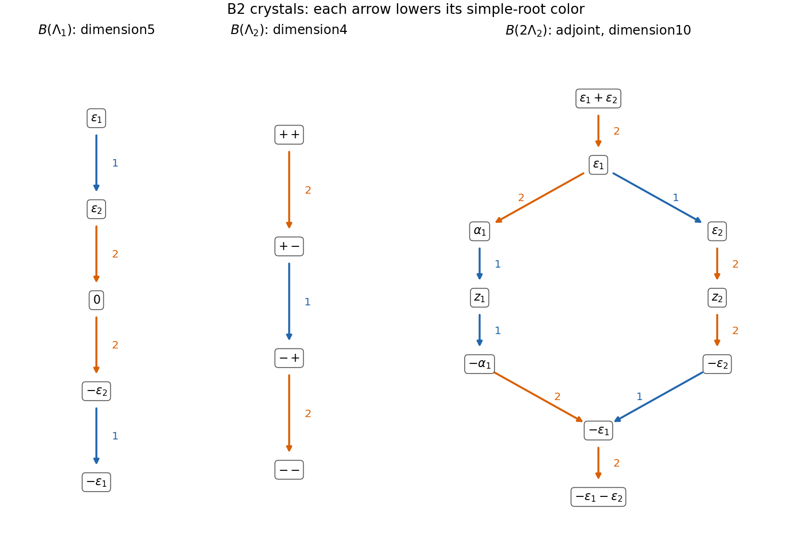

<h1 id="2/d/solution">Solution</h1>

↑ **Parent:** [D](../d.md)

Use directed color-$i$ edges $u\xrightarrow{i}v$ for the [Kashiwara operator](../../../../../../kashiwara-operator.md) $\widetilde f_i$, so every edge subtracts $\alpha_i$ from the [weight](../../../../../../weight-representation-theory.md). The defining [crystal of the defining odd-orthogonal representation](../../../../../../crystal-of-the-defining-odd-orthogonal-representation.md) is

$$
\boxed{\varepsilon_1\xrightarrow{1}\varepsilon_2\xrightarrow{2}0\xrightarrow{2}-\varepsilon_2\xrightarrow{1}-\varepsilon_1.}
$$

The defining module has highest weight $\Lambda_1$ and precisely these five weights, all of multiplicity one. The color-two string through zero has length two, since $\langle\varepsilon_2,\alpha_2^\vee\rangle=2$. The other indicated strings have length one. Restriction to each simple-root [sl2 Lie algebra](../../../../../../sl2-lie-algebra.md) and the [root-string property of a crystal](../../../../../../root-string-property-of-a-crystal.md) justify the edges; no other weight difference is the relevant simple root.

For the [B2 spin crystal](../../../../../../b2-spin-crystal.md) $B(\Lambda_2)$, denote the four weights $\tfrac12(\pm\varepsilon_1\pm\varepsilon_2)$ by their sign pairs. Its graph is

$$
\boxed{++\xrightarrow{2}+-\xrightarrow{1}-+\xrightarrow{2}--.}
$$

The [fundamental weight](../../../../../../fundamental-weight.md) $\Lambda_2$ is a [minuscule weight](../../../../../../minuscule-weight.md): its pairings with all positive coroots are zero or one. Its Weyl orbit has four weights, and the dimension formula gives four, so each occurs once and there are no additional weights. All simple-root strings have length one. Subtracting $\alpha_1$ or $\alpha_2$ where another weight is present gives exactly this graph.

For the [B2 adjoint crystal](../../../../../../b2-adjoint-crystal.md), write $x_\beta$ for the vertex of root weight $\beta$, and use two distinct zero-weight vertices $z_1,z_2$. There are eight root vertices and two zero vertices because the zero-weight space is the two-dimensional [Cartan subalgebra](../../../../../../cartan-subalgebra.md). The complete lists of colored strings are

$$
\begin{array}{c|l}
1&x_{\varepsilon_1}\to x_{\varepsilon_2},\quad
x_{\alpha_1}\to z_1\to x_{-\alpha_1},\quad
x_{-\varepsilon_2}\to x_{-\varepsilon_1}\\[2pt]
2&x_{\varepsilon_1+\varepsilon_2}\to x_{\varepsilon_1}\to x_{\varepsilon_1-\varepsilon_2},\quad
x_{\varepsilon_2}\to z_2\to x_{-\varepsilon_2},\quad
x_{-\varepsilon_1+\varepsilon_2}\to x_{-\varepsilon_1}\to x_{-\varepsilon_1-\varepsilon_2}.
\end{array}
$$

Every arrow in a given row has that row's color; the reverse arrows are the raising operators, and all unlisted lowering operations vanish. In particular the two zero vertices must not be merged.

For a constructive justification, let $V=\mathbb C^5$ with the invariant symmetric form from part(a). The map

$$
v\wedge w\longmapsto\big[u\mapsto B(w,u)v-B(v,u)w\big]
$$

is an equivariant isomorphism $\Lambda^2V\cong\mathfrak{so}_5$, identifying the highest weight as $\varepsilon_1+\varepsilon_2$. Compute its crystal as the highest-weight component starting at $1\otimes2$ in $B(\Lambda_1)\otimes B(\Lambda_1)$, with labels $1,2,0,\bar2,\bar1$ for the defining chain. The [crystal tensor-product rule](../../../../../../crystal-tensor-product-rule.md) is

$$
\widetilde f_i(u\otimes v)=\begin{cases}\widetilde f_i u\otimes v,&\varphi_i(u)>\varepsilon_i(v),\\u\otimes\widetilde f_i v,&\varphi_i(u)\le\varepsilon_i(v),\end{cases}
$$

where $\varepsilon_i$ counts available raising steps and $\varphi_i$ counts lowering steps in the color-$i$ string. It generates the following ten vertices:

$$
\begin{array}{c|c}
\text{weight/vertex}&\text{tensor label}\\\hline
\varepsilon_1+\varepsilon_2&1\otimes2\\
\varepsilon_1&1\otimes0\\
\alpha_1&1\otimes\bar2\\
\varepsilon_2&2\otimes0\\
z_1&2\otimes\bar2\\
z_2&0\otimes0\\
-\alpha_1&2\otimes\bar1\\
-\varepsilon_2&0\otimes\bar2\\
-\varepsilon_1&0\otimes\bar1\\
-\varepsilon_1-\varepsilon_2&\bar2\otimes\bar1
\end{array}
$$

Applying the displayed rule to these labels gives precisely the listed strings, proving the entire diagram rather than only its weight multiplicities. Tensor labels here are crystal vertices in the combinatorial limit, not an assertion that a bare ordinary tensor such as $v_0\otimes v_0$ lies in $\Lambda^2V$.

**[Figure 2](#2/d/image-the-two-b2-fundamental-crystals-and-the-ten-vertex-adjoint-crystal-with-distinct-zero-weight-vertices). The two B2 fundamental crystals and the ten-vertex adjoint crystal, with distinct zero-weight vertices**.

## ↑ Ancestors (11)

1. [D](../d.md)
2. [2](../../2.md)
3. [Paper 5](../../../paper-5-split.md)
4. [Iii](../../../split.md)
5. [2001](../../../../split.md)
6. [Past exam of the mathematics course of the University of Cambridge](../../../../../split.md)
7. [Mathematics course of the University of Cambridge](../../../../../../mathematics-course-of-the-university-of-cambridge.md)
8. [Course of the University of Cambridge](../../../../../../course-of-the-university-of-cambridge.md)
9. [University of Cambridge](../../../../../../university-of-cambridge-split.md)
10. [List of universities](../../../../../../list-of-universities.md)
11. [Codex Wiki](../../../../../../split.md)
