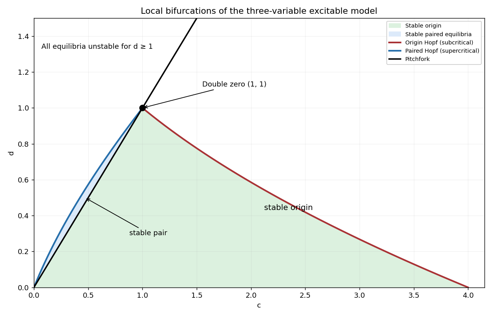

<h1 id="1/c/solution">Solution</h1>

↑ **Parent:** [C](../c.md)

A simple zero [eigenvalue](../../../../../../eigenvalue.md) occurs on $c=d$, except at $(1,1)$. The odd symmetry of the [vector field](../../../../../../vector-field.md) gives a [pitchfork bifurcation](../../../../../../pitchfork-bifurcation-normal-form.md). Near this curve the critical [eigenvalue](../../../../../../eigenvalue.md) is

$$
m={d-c\over2(1-d)}+O((c-d)^2).
$$

For $0<d<1$ the other two [eigenvalues](../../../../../../eigenvalue.md) are stable: this is a [supercritical pitchfork bifurcation](../../../../../../supercritical-pitchfork-bifurcation.md) as $c$ decreases through $d$. For $d>1$ it is a [subcritical pitchfork bifurcation](../../../../../../subcritical-pitchfork-bifurcation.md) in the center direction, with an already unstable transverse direction.

For a [Hopf bifurcation](../../../../../../hopf-bifurcation.md), factor the [characteristic polynomial](../../../../../../characteristic-polynomial.md) as $(m+\tau)(m^2+\omega^2)$. Comparing coefficients gives

$$
\tau=2-d/2,\qquad\omega^2=1-d,\qquad{c-d\over2}=(2-d/2)(1-d).
$$

Thus **the trivial branch has the local bifurcation curves**

$$
\boxed{c=d\quad(d>0),\qquad c=(d-2)^2\quad(0<d<1).}
$$

The second curve is a [Hopf bifurcation](../../../../../../hopf-bifurcation.md) with a stable third [eigenvalue](../../../../../../eigenvalue.md). The [Routh-Hurwitz stability criterion](../../../../../../routh-hurwitz-stability-criterion.md) gives the stable trivial region $0<d<1$, $d<c<(d-2)^2$. Its [Hopf bifurcation](../../../../../../hopf-bifurcation.md) is subcritical. To check the sign, normalize the critical right [eigenvector](../../../../../../eigenvector.md) by $q_x=1$ and put

$$
G={i\omega-d/2\over2i\omega(\tau+i\omega)}.
$$

The second component of the normalized left projection is $G$. There is no quadratic term at the origin, and the cubic derivative in the second component is $C_2(q,q,\bar q)=2$. The cubic Hopf coefficient is therefore $l_1=\operatorname{Re}G/\omega=4/[\omega((4-d)^2+4\omega^2)]>0$. A small repelling [periodic orbit](../../../../../../periodic-orbit.md) lies on the stable-origin side. The diagram also includes the nonzero-branch information derived next.

**[Figure 1](#1/c/image-local-bifurcation-curves-and-equilibrium-stability-in-the-positive-c-d-plane). Local bifurcation curves and equilibrium stability in the positive c-d plane**.

## ↑ Ancestors (11)

1. [C](../c.md)
2. [1](../../1.md)
3. [Paper 51](../../../paper-51-split.md)
4. [Iii](../../../split.md)
5. [2001](../../../../split.md)
6. [Past exam of the mathematics course of the University of Cambridge](../../../../../split.md)
7. [Mathematics course of the University of Cambridge](../../../../../../mathematics-course-of-the-university-of-cambridge.md)
8. [Course of the University of Cambridge](../../../../../../course-of-the-university-of-cambridge.md)
9. [University of Cambridge](../../../../../../university-of-cambridge-split.md)
10. [List of universities](../../../../../../list-of-universities.md)
11. [Codex Wiki](../../../../../../split.md)
