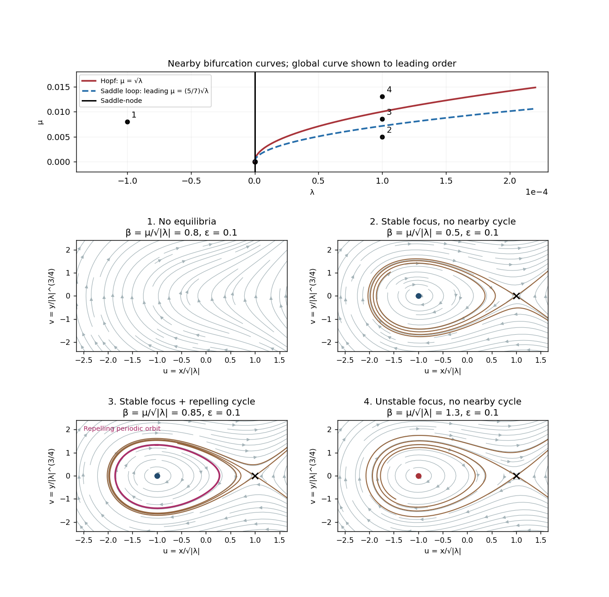

<h1 id="3/a/solution">Solution</h1>

↑ **Parent:** [A](../a.md)

The [equilibrium points](../../../../../../equilibrium-point-of-a-dynamical-system.md) satisfy $y=0$, $x^2=\lambda$. For $\lambda<0$ there are none. For $\lambda>0$ set $a=\sqrt\lambda$. The [Jacobian matrix](../../../../../../jacobian-matrix.md) is

$$
L(x_*)=\begin{pmatrix}0&1\\2x_*&\mu+x_*\end{pmatrix},\qquad\det L=-2x_*,\quad\operatorname{tr}L=\mu+x_*.
$$

The positive [equilibrium point](../../../../../../equilibrium-point-of-a-dynamical-system.md) $(a,0)$ is always a [saddle equilibrium](../../../../../../saddle-equilibrium.md). At $(-a,0)$ the [determinant](../../../../../../determinant.md) is $2a$, so it is stable for $\mu<a$ and unstable for $\mu>a$. The discriminant $(\mu-a)^2-8a$ distinguishes a node from a focus; its zero does not destroy hyperbolicity and is not another local bifurcation curve.

**The local bifurcation curves are**

$$
\boxed{\lambda=0\text{ (saddle-node, }\mu\ne0\text{)},\qquad\mu=\sqrt\lambda\text{ (Hopf, }\lambda>0\text{)}.}
$$

At $(0,0)$ the [linearization](../../../../../../linearization.md) has a double zero [eigenvalue](../../../../../../eigenvalue.md) and is nilpotent, giving a [Bogdanov–Takens bifurcation](../../../../../../bogdanov-takens-bifurcation.md). For $\mu\ne0$ on $\lambda=0$, solving the local [center manifold](../../../../../../center-manifold.md) gives $\dot x=(\lambda-x^2)/\mu+\cdots$, displaying the [saddle-node bifurcation](../../../../../../saddle-node-bifurcation.md). For $\mu<0$ the nonsaddle branch born at positive $\lambda$ is attracting; for $\mu>0$ it is repelling. On the Hopf curve the angular [frequency](../../../../../../frequency.md) is $\sqrt{2a}$. The permitted [subcritical Hopf bifurcation](../../../../../../subcritical-hopf-bifurcation.md) creates a repelling [periodic orbit](../../../../../../periodic-orbit.md) on the stable-focus side $\mu<a$.

A local analysis alone does not say how far that [periodic orbit](../../../../../../periodic-orbit.md) extends. The global calculation below supplies the additional division of the stable-focus region. The complete nearby [phase portraits](../../../../../../phase-portrait.md) and the leading global curve are shown together here. The $lambda<0$ flow has no closed [periodic orbit](../../../../../../periodic-orbit.md), since a closed orbit would have index one and hence enclose an [equilibrium point](../../../../../../equilibrium-point-of-a-dynamical-system.md).

**[Figure 2](#3/a/image-local-and-saddle-loop-bifurcation-curves-with-four-nearby-phase-portraits). Local and saddle-loop bifurcation curves with four nearby phase portraits**.

## ↑ Ancestors (11)

1. [A](../a.md)
2. [3](../../3.md)
3. [Paper 51](../../../paper-51-split.md)
4. [Iii](../../../split.md)
5. [2001](../../../../split.md)
6. [Past exam of the mathematics course of the University of Cambridge](../../../../../split.md)
7. [Mathematics course of the University of Cambridge](../../../../../../mathematics-course-of-the-university-of-cambridge.md)
8. [Course of the University of Cambridge](../../../../../../course-of-the-university-of-cambridge.md)
9. [University of Cambridge](../../../../../../university-of-cambridge-split.md)
10. [List of universities](../../../../../../list-of-universities.md)
11. [Codex Wiki](../../../../../../split.md)
