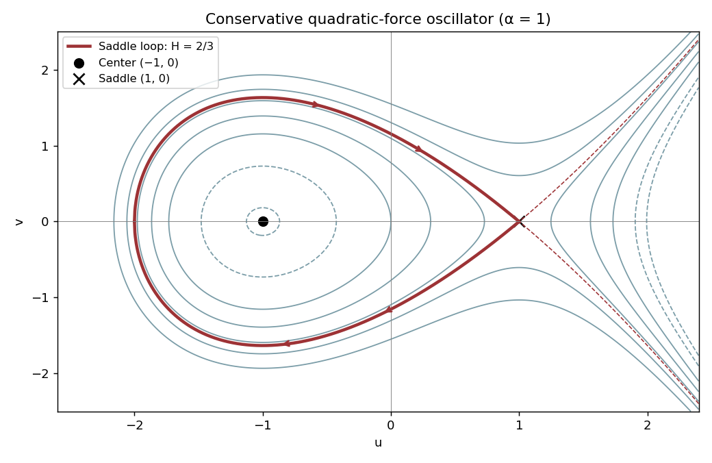

<h1 id="3/b/solution">Solution</h1>

↑ **Parent:** [B](../b.md)

Substitution of the weighted scaling and $\tau=\varepsilon t$ gives

$$
\boxed{u'=v,\qquad v'=u^2-\alpha+\varepsilon(\beta+u)v.}
$$

The derivative of the candidate [Hamiltonian](../../../../../../hamiltonian.md) is

$$
H'=v[u^2-\alpha+\varepsilon(\beta+u)v]+(\alpha-u^2)v=\varepsilon(\beta+u)v^2.
$$

Thus $H$ is a [conserved quantity](../../../../../../conserved-quantity.md) at $\varepsilon=0$. For $\alpha>0$ put $a=\sqrt\alpha$. The conservative [equilibrium point](../../../../../../equilibrium-point-of-a-dynamical-system.md) $(-a,0)$ is a center with $H=-2a^3/3$, and $(a,0)$ is a [saddle equilibrium](../../../../../../saddle-equilibrium.md) with **saddle-loop energy**

$$
\boxed{H_s={2\over3}\alpha^{3/2}.}
$$

The closed component of a level between these energies surrounds the center. At $H=H_s$,

$$
v^2={2\over3}(u-a)^2(u+2a),\qquad -2a\le u\le a,
$$

is the [homoclinic orbit](../../../../../../homoclinic-orbit.md), with left turning point $u=-2a$. The upper branch is traversed to the right and the lower branch to the left. Levels above the barrier have escaping trajectories; the saddle level also has unbounded branches to the right. For $\alpha=0$ the two critical points coalesce; for $\alpha<0$ the potential is monotone and there is no center or saddle loop.

**[Figure 3](#3/b/image-hamiltonian-level-curves-and-the-conservative-saddle-loop-for-alpha-equal-to-one). Hamiltonian level curves and the conservative saddle loop for alpha equal to one**.

## ↑ Ancestors (11)

1. [B](../b.md)
2. [3](../../3.md)
3. [Paper 51](../../../paper-51-split.md)
4. [Iii](../../../split.md)
5. [2001](../../../../split.md)
6. [Past exam of the mathematics course of the University of Cambridge](../../../../../split.md)
7. [Mathematics course of the University of Cambridge](../../../../../../mathematics-course-of-the-university-of-cambridge.md)
8. [Course of the University of Cambridge](../../../../../../course-of-the-university-of-cambridge.md)
9. [University of Cambridge](../../../../../../university-of-cambridge-split.md)
10. [List of universities](../../../../../../list-of-universities.md)
11. [Codex Wiki](../../../../../../split.md)
