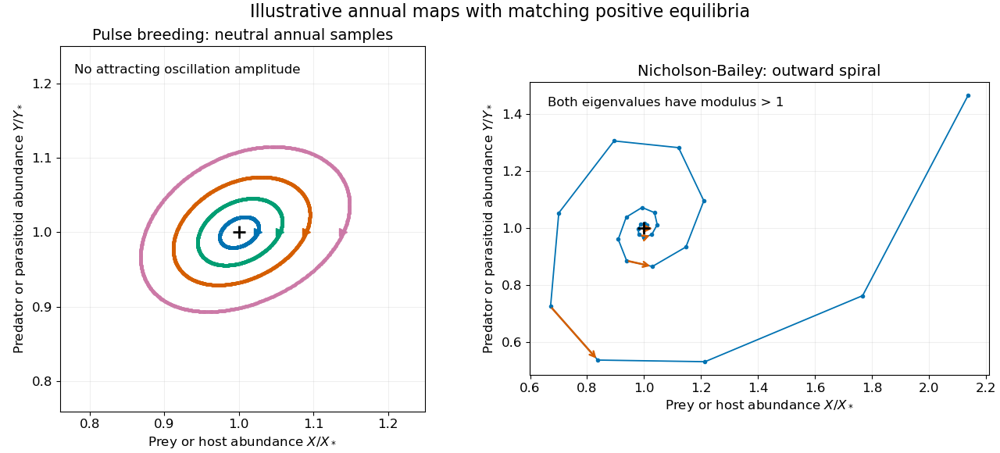
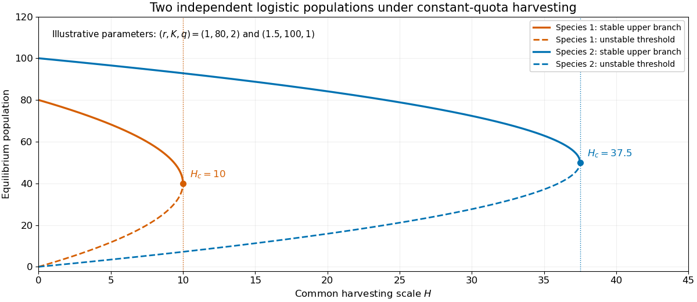

# Paper 52

↑ **Parent:** [Iii](../iii.md)

[https://www.maths.cam.ac.uk/postgrad/part-iii/files/pastpapers/2001/Paper52.pdf](https://www.maths.cam.ac.uk/postgrad/part-iii/files/pastpapers/2001/Paper52.pdf)

The payoff-table area for Question 6 on page 3 is blank in the Part III PDF and [PostScript edition](https://www.maths.cam.ac.uk/postgrad/part-iii/files/pastpapers/2001/Paper52.ps), and in the [MPhil PDF](https://www.maths.cam.ac.uk/postgrad/mphil/files/stats/2001/Paper52.pdf) and [MPhil PostScript edition](https://www.maths.cam.ac.uk/postgrad/mphil/files/stats/2001/Paper52.ps). All four copies have been checked visually. The solution therefore keeps the [payoffs](../../../game-theory.md#payoff) symbolic.

**Table of contents**

- [1](#1)
  - [Solution](#1/solution)
  - [a](#1/a)
    - [Solution](#1/a/solution)
  - [b](#1/b)
    - [Solution](#1/b/solution)
- [2](#2)
  - [Solution](#2/solution)
- [3](#3)
  - [Solution](#3/solution)
- [4](#4)
  - [a](#4/a)
    - [Solution](#4/a/solution)
  - [b](#4/b)
    - [Solution](#4/b/solution)
  - [c](#4/c)
    - [Solution](#4/c/solution)
- [5](#5)
  - [a](#5/a)
    - [Solution](#5/a/solution)
  - [b](#5/b)
    - [Solution](#5/b/solution)
- [6](#6)
  - [a](#6/a)
    - [Solution](#6/a/solution)
  - [b](#6/b)
    - [Solution](#6/b/solution)

## 1

↑ **Parent:** [Paper 52](paper-52.md)

<h3 id="1/solution">Solution</h3>

↑ **Parent:** [1](#1)

Let $X,Y$ be [prey](../../../biology.md#prey) and [predator](../../../biology.md#predator) abundances. With constant positive demographic and [predation](../../../biology.md#predation) coefficients, the [Lotka-Volterra equations](../../../dynamical-systems.md#lotka-volterra-equations) are

$$
\dot X=X(\alpha-\beta Y),\qquad
\dot Y=Y(\delta X-\gamma).
$$

Their positive [equilibrium](../../../dynamical-systems.md#equilibrium-point-of-a-dynamical-system) is $X_* =\gamma/\delta$, $Y_* =\alpha/\beta$. Its [Jacobian matrix](../../../calculus.md#jacobian-matrix) and [eigenvalues](../../../linear-operator-theory.md#eigenvalue) are

$$
\boxed{J_*=
\begin{pmatrix}0&-\beta\gamma/\delta\\\delta\alpha/\beta&0\end{pmatrix},
\qquad \lambda_\pm=\pm i\sqrt{\alpha\gamma}.}
$$

The linearized populations oscillate with period $2\pi/\sqrt{\alpha\gamma}$, with the [predator](../../../biology.md#predator) peak following the [prey](../../../biology.md#prey) peak. This is a [center equilibrium](../../../dynamical-systems.md#center-equilibrium), not an attracting [equilibrium](../../../dynamical-systems.md#equilibrium-point-of-a-dynamical-system). The conclusion is supported beyond [linearization](../../../algebra.md#linearization) by the [Logarithmic first integral of the Lotka-Volterra equations](../../../dynamical-systems.md#logarithmic-first-integral-of-the-lotka-volterra-equations): in these units one may use

$$
V=\delta X-\gamma\log X+\beta Y-\alpha\log Y.
$$

Direct differentiation gives $\dot V=0$. Its [Hessian matrix](../../../calculus.md#hessian-matrix) is a [positive-definite matrix](../../../linear-algebra.md#positive-definite-matrix) in the [positive quadrant](../../../linear-algebra.md#positive-quadrant), and its minimum is at $(X_*,Y_*)$. Nearby level curves are closed [periodic orbits](../../../dynamical-systems.md#periodic-orbit), so there is no damping toward a preferred oscillation amplitude.

<h3 id="1/a">a</h3>

↑ **Parent:** [1](#1)

<h4 id="1/a/solution">Solution</h4>

↑ **Parent:** [A](#1/a)

Use an [annual pulse-breeding predator-prey model](../../../mathematical-biology.md#annual-pulse-breeding-predator-prey-model). Let $X_n,Y_n$ be the abundances just after reproduction, and let the year have length $T$. Between breeding pulses, assume mass-action [predation](../../../biology.md#predation), natural mortality rates $\mu_X,\mu_Y>0$, and no reproduction:

$$
\dot X=-\mu_XX-\beta XY,\qquad \dot Y=-\mu_YY.
$$

Solving the [predator](../../../biology.md#predator) equation and inserting it into the [prey](../../../biology.md#prey) equation gives the pre-breeding abundances

$$
Y^-_n=e^{-\mu_YT}Y_n,
\qquad
X^-_n=X_n\exp\!\left[-\mu_XT-
\frac{\beta(1-e^{-\mu_YT})}{\mu_Y}Y_n\right].
$$

Suppose reproduction multiplies surviving [prey](../../../biology.md#prey) by $R$ and adds $qX^-_n$ offspring per surviving [predator](../../../biology.md#predator). Retaining the surviving adults gives $X_{n+1}=RX^-_n$, $Y_{n+1}=Y^-_n(1+qX^-_n)$. Define $r=Re^{-\mu_XT}$, $s=e^{-\mu_YT}$, $\kappa=\beta(1-s)/\mu_Y$ and $b=q/R$. The resulting [difference equations](../../../real-analysis.md#difference-equation) are

$$
\boxed{X_{n+1}=rX_ne^{-\kappa Y_n},\qquad
Y_{n+1}=sY_n(1+bX_{n+1}).}
$$

Thus offspring depend on [prey](../../../biology.md#prey) available at the end of the year, not on the number killed during the year. The adult-survival convention is part of the model; if breeding replaces all adults, use $Y_{n+1}=sbY_nX_{n+1}$ instead. Both are consistent pulse models under their respective life-history assumptions.

<h3 id="1/b">b</h3>

↑ **Parent:** [1](#1)

<h4 id="1/b/solution">Solution</h4>

↑ **Parent:** [B](#1/b)

For the adult-survival [annual pulse-breeding predator-prey model](../../../mathematical-biology.md#annual-pulse-breeding-predator-prey-model), a positive annual [fixed point](../../../function.md#fixed-point) exists when $r>1$ and $0<s<1$:

$$
X_* =\frac{1-s}{sb},\qquad Y_* =\frac{\log r}{\kappa}.
$$

At this point the [Jacobian matrix](../../../calculus.md#jacobian-matrix) is

$$
J_*=
\begin{pmatrix}
1&-\kappa X_*\\sbY_*&1-(1-s)\log r
\end{pmatrix},
\qquad
\boxed{\det J_*=1,\quad \operatorname{tr}J_*=2-(1-s)\log r.}
$$

If $0<(1-s)\log r<4$, the two [eigenvalues](../../../linear-operator-theory.md#eigenvalue) are a [complex conjugate](../../../complex-analysis.md#complex-conjugate) pair of [moduli](../../../complex-analysis.md#modulus) one. The annual samples show linearly neutral seasonal oscillations. If $(1-s)\log r>4$, they form a reciprocal negative real pair and the [fixed point](../../../function.md#fixed-point) is a [saddle fixed point of a map](../../../dynamical-systems.md#saddle-fixed-point-of-a-map). Equality at four is a degenerate boundary needing nonlinear analysis. For replacement rather than surviving adults the same calculation gives [trace](../../../linear-algebra.md#matrix-trace) $2-\log r$ and [determinant](../../../linear-algebra.md#determinant) one.

The absence of an attracting annual cycle is stronger than a linear observation. Put $u=\log X$, $v=\log Y$. The update becomes

$$
u'=u+\log r-\kappa e^v,
\qquad v'=v+\log s+\log(1+be^{u'}).
$$

It is the composition of two [nonlinear shear maps](../../../dynamical-systems.md#nonlinear-shear-map), each of [determinant](../../../linear-algebra.md#determinant) one: an [area-preserving seasonal predator-prey map](../../../mathematical-biology.md#area-preserving-seasonal-predator-prey-map). No isolated positive [periodic orbit](../../../dynamical-systems.md#periodic-orbit) has an open attracting basin. Neutral linear oscillations alone also do not prove nonlinear stability at every resonance. In particular, this density-independent model does not select an [asymptotically stable](../../../dynamical-systems.md#asymptotic-stability) oscillation amplitude.

The [Nicholson-Bailey model](../../../mathematical-biology.md#nicholson-bailey-model) instead counts [parasitoid](../../../biology.md#parasitoid) offspring from attacked [hosts](../../../biology.md#host-biology):

$$
X'=rXe^{-\kappa Y},\qquad Y'=cX(1-e^{-\kappa Y}).
$$

Its positive [equilibrium](../../../dynamical-systems.md#equilibrium-point-of-a-dynamical-system) has $Y_*=\log r/\kappa$ and $X_*=Y_*/[c(1-1/r)]$. Its [Jacobian matrix](../../../calculus.md#jacobian-matrix) has

$$
\det J_* =\frac{r\log r}{r-1}>1,
\qquad \operatorname{tr}J_*=1+\frac{\log r}{r-1}<2.
$$

Since the [determinant](../../../linear-algebra.md#determinant) exceeds one while the positive [trace](../../../linear-algebra.md#matrix-trace) is below two, the [eigenvalues](../../../linear-operator-theory.md#eigenvalue) are complex with [moduli](../../../complex-analysis.md#modulus) greater than one: [instability of the Nicholson-Bailey equilibrium](../../../mathematical-biology.md#instability-of-the-nicholson-bailey-equilibrium) produces outward oscillations near it. The two maps share an exponential prey-survival factor but have different reproduction laws and stability properties.

**[Figure 1](#1/b/image-neutral-seasonal-predator-prey-oscillations-compared-with-the-unstable-nicholson-bailey-equilibrium). Neutral seasonal predator-prey oscillations compared with the unstable Nicholson-Bailey equilibrium**.

## 2

↑ **Parent:** [Paper 52](paper-52.md)

<h3 id="2/solution">Solution</h3>

↑ **Parent:** [2](#2)

Let $q_i>0$ measure the relative trapping vulnerability and use fixed species-specific catches $q_iH$. With no natural interaction, the two populations satisfy independent [constant-quota harvested logistic growth](../../../mathematical-biology.md#constant-quota-harvested-logistic-growth) equations,

$$
\dot N_i=r_iN_i\left(1-\frac{N_i}{K_i}\right)-q_iH,
\qquad i=1,2.
$$

This treats $H$ as a common harvest scale: a total fixed quota can equivalently be allocated in fixed fractions $q_1+q_2=1$. Catches are not reassigned after one species disappears. [Carrying capacity](../../../mathematical-biology.md#carrying-capacity) and intrinsic growth differ between species; greater trapping vulnerability alone therefore does not determine which species disappears first.

The maximum natural surplus occurs at $N_i=K_i/2$. Define the critical harvesting level

$$
\boxed{H_{c,i}=\frac{r_iK_i}{4q_i}.}
$$

For $0<H<H_{c,i}$ there are two positive [equilibria](../../../dynamical-systems.md#equilibrium-point-of-a-dynamical-system),

$$
\boxed{N_{i,\pm}=\frac{K_i}{2}
\left(1\pm\sqrt{1-H/H_{c,i}}\right).}
$$

The [derivative](../../../calculus.md#derivative) of the population vector field is negative at the upper branch and positive at the lower branch. The upper branch is attracting; the lower is an unstable survival threshold. An initial abundance above the lower branch approaches the upper branch, whereas one below it reaches extinction. At $H=0$, positive populations approach $K_i$, while zero remains zero.

At $H=H_{c,i}$ the branches meet in a [saddle-node bifurcation](../../../dynamical-systems.md#saddle-node-bifurcation) and

$$
\dot N_i=-\frac{r_i}{K_i}(N_i-K_i/2)^2.
$$

Initial abundances above $K_i/2$ approach it algebraically from above; those below decline to extinction. For $H>H_{c,i}$ there is no positive [equilibrium](../../../dynamical-systems.md#equilibrium-point-of-a-dynamical-system) and the [derivative](../../../calculus.md#derivative) of abundance is everywhere negative. In fact $\dot N_i\le-q_i(H-H_{c,i})$, giving finite extinction time. At zero the biological model stops harvesting and keeps the population extinct rather than extending the constant-quota equation to negative abundance.

Order the thresholds as $H_{c,1}<H_{c,2}$. Below the first threshold, both species can persist if each starts above its own survival threshold; either or both can still disappear from inadequate initial abundance. Between the thresholds only species 2 can persist. Above the second, neither can persist. At each threshold use the one-sided critical behaviour just derived. Equal thresholds give simultaneous loss of both positive branches. Because the equations are independent, there are no sustained oscillations or competitive replacements in this model.

**[Figure 2](#2/image-stable-and-unstable-equilibrium-branches-of-two-independently-harvested-logistic-populations). Stable and unstable equilibrium branches of two independently harvested logistic populations**.

## 3

↑ **Parent:** [Paper 52](paper-52.md)

<h3 id="3/solution">Solution</h3>

↑ **Parent:** [3](#3)

A [microparasite](../../../biology.md#microparasite) typically multiplies within an infected [host](../../../biology.md#host-biology) on a much shorter time scale than between-host transmission. A useful first model classifies [hosts](../../../biology.md#host-biology) by infection status. A [macroparasite](../../../biology.md#macroparasite), such as an adult parasitic worm, instead requires a count of [parasites](../../../biology.md#parasite) per [host](../../../biology.md#host-biology): two infected [hosts](../../../biology.md#host-biology) can carry very different [within-host parasite burdens](../../../biology.md#within-host-parasite-burden). These are modelling distinctions rather than a rule determined only by an organism's physical size.

For a [microparasite](../../../biology.md#microparasite) with no lasting [immunity](../../../biology.md#immunity-medical), a homogeneous [SIS model](../../../mathematical-biology.md#sis-model) is

$$
\dot I=\beta\frac{SI}{N}-\gamma I,
\qquad S+I=N.
$$

The [basic reproduction number](../../../mathematical-biology.md#basic-reproduction-number) is $\beta/\gamma$, and the [prevalence](../../../mathematical-biology.md#prevalence) $I/N$ describes the infected-host fraction. A [SIR model](../../../mathematical-biology.md#sir-model) adds an immune class, and a [SEIR model](../../../mathematical-biology.md#seir-model) adds a latent class. Contact structure, age, susceptibility, [recovery rate](../../../mathematical-biology.md#recovery-rate) and infectiousness can require several such classes. Then a [next-generation matrix](../../../mathematical-biology.md#next-generation-matrix) or operator, rather than a single averaged contact rate, sets the invasion threshold. [Stochastic epidemic models](../../../mathematical-biology.md#stochastic-epidemic-model) are relevant to early extinction and finite populations; network or spatial models represent nonuniform contact opportunities.

For a simple [macroparasite burden model](../../../mathematical-biology.md#macroparasite-burden-model), let $p_j$ be the fraction of [hosts](../../../biology.md#host-biology) carrying $j$ adult worms. Assume acquisitions at rate $\lambda=\beta L$, independent adult-worm losses at rate $\mu j$, and a number $L$ of infective stages in a well-mixed environmental reservoir. The [immigration-death worm-burden model](../../../mathematical-biology.md#immigration-death-worm-burden-model) has

$$
\dot p_j=\lambda p_{j-1}+\mu(j+1)p_{j+1}-(\lambda+\mu j)p_j,
\qquad p_{-1}=0.
$$

This [birth-death process](../../../markov-process.md#birth-death-process) needs the burden distribution or its [probability generating function](../../../probability-theory.md#probability-generating-function), not just an infected/not-infected partition. Its [mean](../../../probability-theory.md#expected-value) $m=\sum_jjp_j$ satisfies $\dot m=\beta L-\mu m$. With [host](../../../biology.md#host-biology) number $N$ fixed and each adult producing infective stages at rate $\sigma$, one possible environmental closure is

$$
\dot L=\sigma Nm-(d_L+\beta N)L.
$$

For this asexual, unsaturated transmission approximation, one worm's [basic reproduction number](../../../mathematical-biology.md#basic-reproduction-number) is $(\sigma/\mu)\,\beta N/(d_L+\beta N)$. Growth above the invasion threshold requires additional density regulation if a finite endemic burden is sought. Sex-dependent mating would change this closure.

With constant external exposure $\lambda$, the [equilibrium](../../../dynamical-systems.md#equilibrium-point-of-a-dynamical-system) burden follows a [Poisson distribution](../../../discrete-probability-distribution.md#poisson-distribution) with [mean](../../../probability-theory.md#expected-value) $m=\lambda/\mu$, giving infected-host [prevalence](../../../mathematical-biology.md#prevalence) $1-e^{-m}$. If exposure rates vary across [hosts](../../../biology.md#host-biology) as a [gamma distribution](../../../continuous-probability-distribution.md#gamma-distribution), the [Poisson-gamma mixture](../../../discrete-probability-distribution.md#poisson-gamma-mixture) gives a [negative binomial distribution](../../../discrete-probability-distribution.md#negative-binomial-distribution) with [mean](../../../probability-theory.md#expected-value) $m$ and aggregation parameter $k$:

$$
\operatorname{Var}(j)=m+\frac{m^2}{k},
\qquad \Pr(j>0)=1-\left(1+\frac{m}{k}\right)^{-k}.
$$

The same [mean](../../../probability-theory.md#expected-value) burden can therefore coexist with very different [prevalence](../../../mathematical-biology.md#prevalence) and highly infected subgroups. [Aggregation of macroparasite burdens](../../../mathematical-biology.md#aggregation-of-macroparasite-burdens) affects treatment coverage, burden-dependent [host](../../../biology.md#host-biology) mortality, [immunity](../../../biology.md#immunity-medical) and [parasite](../../../biology.md#parasite) fecundity. For sexually reproducing worms, [hosts](../../../biology.md#host-biology) need both sexes for fertile output; a [mean](../../../probability-theory.md#expected-value) alone may not determine it. With independent equally likely sexes and Poisson burden, the [probability](../../../probability-theory.md#probability) of both sexes is $(1-e^{-m/2})^2$, illustrating [mating-limited macroparasite transmission](../../../mathematical-biology.md#mating-limited-macroparasite-transmission) and its low-burden bottleneck.

Both [microparasite](../../../biology.md#microparasite) and [macroparasite](../../../biology.md#macroparasite) models need heterogeneous exposure and [host](../../../biology.md#host-biology) responses. The special extra difficulty for [macroparasites](../../../biology.md#macroparasite) is translating a distributed worm burden, and possibly worm sex or developmental stage, into transmission and [host](../../../biology.md#host-biology) harm. Conversely, complicated within-host [microparasite](../../../biology.md#microparasite) processes can also require more than a binary [host](../../../biology.md#host-biology) state when the simple fast-within-host approximation fails.

## 4

↑ **Parent:** [Paper 52](paper-52.md)

<h3 id="4/a">a</h3>

↑ **Parent:** [4](#4)

<h4 id="4/a/solution">Solution</h4>

↑ **Parent:** [A](#4/a)

Let $i=I/N$ be the infectious proportion in a closed population. With homogeneous frequency-dependent transmission rate $\beta$ and [recovery rate](../../../mathematical-biology.md#recovery-rate) $\gamma>0$, the [SIS model](../../../mathematical-biology.md#sis-model) is

$$
\boxed{\dot i=\beta i(1-i)-\gamma i.}
$$

The [basic reproduction number](../../../mathematical-biology.md#basic-reproduction-number) is the expected number of secondary infections produced by a typical newly infected individual in an otherwise susceptible population under the specified contact conditions. Here the infectious duration has [mean](../../../probability-theory.md#expected-value) $1/\gamma$, so $R_0=\beta/\gamma$.

For $R_0>1$ the attracting [endemic equilibrium](../../../mathematical-biology.md#endemic-equilibrium) has $i_*=1-\gamma/\beta$. The [homogeneous SIS susceptible fraction](../../../mathematical-biology.md#homogeneous-sis-susceptible-fraction) is therefore

$$
\boxed{s_* =1-i_* =\frac1{R_0}.}
$$

For $R_0\le1$ the physical [equilibrium](../../../dynamical-systems.md#equilibrium-point-of-a-dynamical-system) is disease-free, $i_*=0$, $s_*=1$. At equality approach to zero is algebraic. Thus $s_*=1/R_0$ is an endemic relation, not a formula demanding more than one susceptible person per person below the invasion threshold.

<h3 id="4/b">b</h3>

↑ **Parent:** [4](#4)

<h4 id="4/b/solution">Solution</h4>

↑ **Parent:** [B](#4/b)

Use an [assortatively mixed two-risk-group SIS model](../../../mathematical-biology.md#assortatively-mixed-two-risk-group-sis-model) with equal per-person [recovery rate](../../../mathematical-biology.md#recovery-rate) $\gamma$. Let $x,y$ be infectious proportions in groups of sizes $pN,(1-p)N$. Let $c_H\gg c_L$ be their fixed contact rates and $\tau$ the transmission [probability](../../../probability-theory.md#probability) per contact. Suppose a small fixed fraction $\epsilon<1/2$ of high-risk contacts is with the low-risk group. [Contact reciprocity in a two-group epidemic](../../../mathematical-biology.md#contact-reciprocity-in-a-two-group-epidemic) requires

$$
pNc_H\epsilon=(1-p)Nc_L\epsilon_L,
\qquad \epsilon_L=\frac{pc_H\epsilon}{(1-p)c_L}.
$$

For sufficiently small $p$, both groups make most contacts within their own group, and the total cross-group contacts are of order $pN$. Define $A=\tau c_H(1-\epsilon)$, $B=\tau c_H\epsilon$, $D=\tau c_L$ and $C(p)=Bp/(1-p)$. The [forces of infection](../../../mathematical-biology.md#force-of-infection) give

$$
\boxed{\begin{aligned}
\dot x&=(1-x)(Ax+By)-\gamma x,\\
\dot y&=(1-y)[C(p)x+(D-C(p))y]-\gamma y.
\end{aligned}}
$$

Here $C(p)<D$ and $\epsilon_L<1/2$ hold in the small-$p$ regime. High-risk per-person cross contact is order one but its group size is order $p$; low-risk per-person cross contact is order $p$. These distinctions are needed to count each cross-group partnership consistently.

Linearize about the disease-free state. In infectious fractions the transmission [matrix](../../../vector-space.md#matrix) is

$$
M(p)=\begin{pmatrix}A&B\\C(p)&D-C(p)\end{pmatrix}.
$$

In infected-individual counts the [next-generation matrix](../../../mathematical-biology.md#next-generation-matrix) is instead

$$
K=\frac1\gamma\begin{pmatrix}A&C(p)\\B&D-C(p)\end{pmatrix}.
$$

The count and fraction formulations are related by a diagonal change of coordinates, so their [eigenvalues](../../../linear-operator-theory.md#eigenvalue) coincide. The [basic reproduction number](../../../mathematical-biology.md#basic-reproduction-number) is the [spectral radius](../../../analysis.md#spectral-radius) $R_0=\rho(M)/\gamma$, not an average of the two group reproduction numbers. The larger real [eigenvalue](../../../linear-operator-theory.md#eigenvalue) is

$$
\lambda_+(p)=\frac{A+D-C(p)+\sqrt{[A-D+C(p)]^2+4BC(p)}}2.
$$

This model makes a particular reciprocal mixing convention explicit; different defensible contact laws can change the first-order coefficients.

<h3 id="4/c">c</h3>

↑ **Parent:** [4](#4)

<h4 id="4/c/solution">Solution</h4>

↑ **Parent:** [C](#4/c)

The high-contact assumptions give $A>D$ away from a degeneracy. Since $C(p)=Bp+O(p^2)$, perturbing the larger [eigenvalue](../../../linear-operator-theory.md#eigenvalue) in the [assortatively mixed two-risk-group SIS model](../../../mathematical-biology.md#assortatively-mixed-two-risk-group-sis-model) gives

$$
\boxed{R_0=\frac A\gamma+
\frac{B^2}{\gamma(A-D)}p+O(p^2).}
$$

For the biologically useful high-risk-core regime $A>\gamma>D$, put $x_0=1-\gamma/A$. Substituting $x=x_0+px_1+O(p^2)$ and $y=py_1+O(p^2)$ into the two [equilibrium](../../../dynamical-systems.md#equilibrium-point-of-a-dynamical-system) equations gives

$$
0=Bx_0+(D-\gamma)y_1,
\qquad
0=-(A-\gamma)x_1+\frac{\gamma B}{A}y_1.
$$

Thus the group susceptible fractions and their population-weighted total are

$$
\boxed{\begin{aligned}
s_H&=\frac\gamma A-\frac{B^2\gamma}{A^2(\gamma-D)}p+O(p^2),\\
s_L&=1-\frac{Bx_0}{\gamma-D}p+O(p^2),\\
s_{\rm total}&=1-px_0\left(1+\frac B{\gamma-D}\right)+O(p^2).
\end{aligned}}
$$

The [small-core SIS endemic expansion](../../../mathematical-biology.md#small-core-sis-endemic-expansion) shows why the [homogeneous SIS susceptible fraction](../../../mathematical-biology.md#homogeneous-sis-susceptible-fraction) relation fails for a mixed population: as the high-risk fraction tends to zero, $s_{\rm total}\to1$ while $R_0\to A/\gamma>1$. A small high-risk core sustains infection even though almost everyone in the population remains susceptible. Even $s_H$ need not equal $1/R_0$ at first order.

For completeness, if $A,D<\gamma$ with a fixed gap from threshold, small $p$ gives disease-free [equilibrium](../../../dynamical-systems.md#equilibrium-point-of-a-dynamical-system) and total susceptibility one. If $D>\gamma$, the low-risk group already sustains infection. Put $y_0=1-\gamma/D$ and let $x_0\in(0,1)$ be the positive root of $(1-x_0)(Ax_0+By_0)=\gamma x_0$. The first-order coefficients are

$$
y_1=\frac{B\gamma(x_0-y_0)}{D(D-\gamma)},\quad
x_1=\frac{B(1-x_0)y_1}{\gamma-A(1-2x_0)+By_0},\quad
s_{\rm total}=1-y_0+p(y_0-x_0-y_1)+O(p^2).
$$

Again it tends to $\gamma/D$ rather than $\gamma/A=1/R_0(0)$. These regular expansions require fixed nonzero gaps. At $A=D$ the spectral splitting is generally order $\sqrt p$; at $D=\gamma<A$, low-risk infection is also order $\sqrt p$, so a regular first-order Taylor expansion is inappropriate. An exact endemic replacement for the scalar identity is that the [susceptible-weighted next-generation matrix](../../../mathematical-biology.md#susceptible-weighted-next-generation-matrix) has [spectral radius](../../../analysis.md#spectral-radius) one.

## 5

↑ **Parent:** [Paper 52](paper-52.md)

<h3 id="5/a">a</h3>

↑ **Parent:** [5](#5)

<h4 id="5/a/solution">Solution</h4>

↑ **Parent:** [A](#5/a)

Let $u$ be the [allele frequency](../../../biology.md#allele-frequency) of $A$, with [random mating](../../../biology.md#panmixia) and sufficiently large population size to neglect [genetic drift](../../../biology.md#genetic-drift). The [Hardy-Weinberg proportions](../../../biology.md#hardy-weinberg-principle) before selection are $u^2,2u(1-u),(1-u)^2$. Write the three [genotype fitnesses](../../../biology.md#genotype-fitness) as $w_{AA},w_{Aa},w_{aa}$, with $w_{Aa}$ smaller than either [homozygote](../../../biology.md#homozygote) value. After one viability-selection generation,

$$
u'=\frac{w_{AA}u^2+w_{Aa}u(1-u)}{\bar w},
\qquad \bar w=w_{AA}u^2+2w_{Aa}u(1-u)+w_{aa}(1-u)^2.
$$

Consequently

$$
u'-u=\frac{u(1-u)}{\bar w}
\left[(w_{AA}-w_{Aa})u-(w_{aa}-w_{Aa})(1-u)\right].
$$

Put $a=w_{AA}-w_{Aa}>0$, $b=w_{aa}-w_{Aa}>0$. The [underdominant allele-frequency dynamics](../../../biology.md#underdominant-allele-frequency-dynamics) has stable fixation states zero and one, separated by the unstable threshold

$$
\boxed{u_c=\frac b{a+b}.}
$$

Below it $A$ decreases to [allele fixation](../../../biology.md#allele-fixation) of $a$; above it $A$ increases to fixation. Exactly at the threshold the deterministic frequency remains balanced, but any perturbation selects a side. This is [underdominance](../../../biology.md#underdominance), or [heterozygote disadvantage](../../../biology.md#underdominance), rather than balancing selection from [heterozygote advantage](../../../biology.md#heterozygote-advantage).

In a continuous-time weak-selection or selection-rate convention, the corresponding equation is $\dot u=u(1-u)[(a+b)u-b]$. Equal [homozygote](../../../biology.md#homozygote) fitness gives $\dot u=su(1-u)(2u-1)$ for a positive selection strength $s$. The next part uses this explicitly stated continuous-time convention; $s$ and migration then have the same time units.

<h3 id="5/b">b</h3>

↑ **Parent:** [5](#5)

<h4 id="5/b/solution">Solution</h4>

↑ **Parent:** [B](#5/b)

Use a [globally coupled underdominant metapopulation](../../../mathematical-biology.md#globally-coupled-underdominant-metapopulation) with equal habitat sizes:

$$
\dot u_i=f(u_i)+\sigma(\bar u-u_i),
\qquad f(u)=su(1-u)(2u-1),\qquad
\bar u=\frac1N\sum_i u_i.
$$

Symmetry preserves a common frequency $x$ in the initially $AA$ habitats and $y$ in the initially $aa$ habitats. With $q=m/N$, the equations reduce exactly to

$$
\dot x=f(x)-\sigma(1-q)(x-y),\qquad
\dot y=f(y)+\sigma q(x-y),\qquad (x(0),y(0))=(1,0).
$$

The maximum positive selection rate is $f(u_m)=s/(6\sqrt3)$ at $u_m=(3+\sqrt3)/6$. Comparing it with the worst outward migration flux gives a sufficient barrier condition $\sigma\max(q,1-q)<f(u_m)/u_m$. A slightly stronger optimized condition follows from maximizing the per-capita restoring term $f(u)/u=s(1-u)(2u-1)$ over $u>1/2$: its maximum is $s/8$ at $u=3/4$.

Indeed, on $x=3/4$, with $0\le y\le1/4$, $\dot x\ge3s/32-(3/4)\sigma(1-q)>0$. On $y=1/4$, with $3/4\le x\le1$, $\dot y\le-3s/32+(3/4)\sigma q<0$. The other two edges point inward as well. The [invariant-rectangle criterion for underdominant coexistence](../../../mathematical-biology.md#invariant-rectangle-criterion-for-underdominant-coexistence) therefore gives the explicit robust conditions

$$
\boxed{0<m<N,\qquad
\sigma<\frac{s}{8\max(m/N,1-m/N)}.}
$$

Starting from the specified pure habitats, the populations then remain in $x\ge3/4$, $y\le1/4$. Their global frequency lies between $3q/4$ and $q+(1-q)/4$, so neither [allele](../../../biology.md#allele) fixes. This is a sufficient condition, not a claim that the bound is sharp. If $m=0$ or $m=N$, the population is already fixed; if $\sigma=0$, any mixture of the two pure habitat types persists.

The exactly balanced case illustrates why robustness and the prescribed trajectory differ. When $q=1/2$, symmetry forces $y=1-x$ and

$$
\dot x=(2x-1)[sx(1-x)-\sigma/2].
$$

For $\sigma<s/2$ its heterogeneous limiting state is

$$
x_* =\frac{1+\sqrt{1-2\sigma/s}}2,\qquad y_*=1-x_*.
$$

Here $f'(x_*)=f'(y_*)=-s+3\sigma$, so the full [Jacobian matrix](../../../calculus.md#jacobian-matrix) has diagonal entries $f'(x_*)-\sigma/2$ and off-diagonal entries $\sigma/2$. Its two full-system [eigenvalues](../../../linear-operator-theory.md#eigenvalue) are $-s+3\sigma$ and $-s+2\sigma$: the [symmetric underdominant two-cluster equilibrium](../../../mathematical-biology.md#symmetric-underdominant-two-cluster-equilibrium) is robustly attracting only for $\sigma<s/3$. For larger migration the exactly symmetric initial condition can still avoid fixation, eventually approaching the spatially uniform frequency $1/2$ when $\sigma\ge s/2$, but the symmetry-broken mean-frequency mode is unstable. A finite population with [genetic drift](../../../biology.md#genetic-drift) need not maintain deterministic coexistence indefinitely.

## 6

↑ **Parent:** [Paper 52](paper-52.md)

<h3 id="6/a">a</h3>

↑ **Parent:** [6](#6)

<h4 id="6/a/solution">Solution</h4>

↑ **Parent:** [A](#6/a)

The [payoff](../../../game-theory.md#payoff) table is blank in the original PDF, so denote its four row-player [payoffs](../../../game-theory.md#payoff) by $R,S,T,P$ for $CC,CD,DC,DD$, with the [prisoner's dilemma](../../../game-theory.md#prisoner-s-dilemma) ordering $T>R>P>S$. No numerical entries are inferred. Let the two [reactive strategies](../../../game-theory.md#reactive-strategy-game-theory) be $(p_1,q_1)$ and $(p_2,q_2)$, where $p_i$ is cooperation after the opponent's cooperation and $q_i$ cooperation after defection.

The joint action states form a four-state [Markov chain](../../../markov-process.md#markov-chain). In state order $CC,CD,DC,DD$, its transition [matrix](../../../vector-space.md#matrix) is

$$
\begin{pmatrix}
p_1p_2&p_1(1-p_2)&(1-p_1)p_2&(1-p_1)(1-p_2)\\
q_1p_2&q_1(1-p_2)&(1-q_1)p_2&(1-q_1)(1-p_2)\\
p_1q_2&p_1(1-q_2)&(1-p_1)q_2&(1-p_1)(1-q_2)\\
q_1q_2&q_1(1-q_2)&(1-q_1)q_2&(1-q_1)(1-q_2)
\end{pmatrix}.
$$

The prescribed initial memories give [independent](../../../random-variable.md#independent-random-variables) first actions with cooperation [probabilities](../../../probability-theory.md#probability) $p_1,p_2$. Same-round actions remain [independent](../../../random-variable.md#independent-random-variables): each player's next action uses the other player's previous action and its own [independent](../../../random-variable.md#independent-random-variables) random draw. Thus their marginal cooperation [probabilities](../../../probability-theory.md#probability) obey

$$
x_{t+1}=q_1+(p_1-q_1)y_t,
\qquad y_{t+1}=q_2+(p_2-q_2)x_t.
$$

Put $a_i=p_i-q_i$. If $|a_1a_2|<1$, the two-step recurrences contract and the [long-run payoff of reactive strategies](../../../game-theory.md#long-run-payoff-of-reactive-strategies) follows from

$$
\boxed{x_*=\frac{q_1+a_1q_2}{1-a_1a_2},\qquad
y_*=\frac{q_2+a_2q_1}{1-a_1a_2}.}
$$

The joint [stationary distribution](../../../markov-process.md#stationary-distribution) is $(x_*y_*,x_*(1-y_*),(1-x_*)y_*,(1-x_*)(1-y_*))$. Player 1's [mean](../../../probability-theory.md#expected-value) [payoff](../../../game-theory.md#payoff) is $Rx_*y_*+Sx_*(1-y_*)+T(1-x_*)y_*+P(1-x_*)(1-y_*)$; exchange $S,T$ for player 2.

The deterministic boundaries must retain the initial memories rather than divide by zero. Two [Tit for tat](../../../game-theory.md#tit-for-tat) players cooperate forever and earn $R$. Two players who always do the opposite of the opponent's previous action alternate $DD,CC$ and average $(P+R)/2$. One of each cycles through all four states and each averages $(R+S+T+P)/4$. These are the only cases with $|a_1a_2|=1$. A periodic [Markov chain](../../../markov-process.md#markov-chain) need not have convergent state [probabilities](../../../probability-theory.md#probability), but its long-time average [payoff](../../../game-theory.md#payoff) is defined by its cycle frequencies.

<h3 id="6/b">b</h3>

↑ **Parent:** [6](#6)

<h4 id="6/b/solution">Solution</h4>

↑ **Parent:** [B](#6/b)

Under the standard [two-condition criterion for evolutionary stability](../../../game-theory.md#two-condition-criterion-for-evolutionary-stability), the strict claim fails. [Tit for tat](../../../game-theory.md#tit-for-tat) and [always cooperate](../../../game-theory.md#always-cooperate) both cooperate in every round when playing either each other or their own type under the specified initial memories. Hence

$$
e({\rm TFT},{\rm TFT})=e({\rm ALLC},{\rm TFT})
=e({\rm TFT},{\rm ALLC})=e({\rm ALLC},{\rm ALLC})=R.
$$

Both stability comparisons tie. The [neutrality between Tit for tat and unconditional cooperation](../../../game-theory.md#neutrality-between-tit-for-tat-and-unconditional-cooperation) proves that **Tit for tat is not an evolutionarily stable strategy in the stated strategy space**, and cannot strictly invade every strategy. The final differently spelled name is interpreted as the same $(1,0)$ rule, since no second strategy is defined.

There is a useful qualified invasion result. For a resident $M=(p,q)$ with $|p-q|<1$, put $z=q/(1-p+q)$. The [long-run payoff of reactive strategies](../../../game-theory.md#long-run-payoff-of-reactive-strategies) gives

$$
e({\rm TFT},M)=e(M,{\rm TFT})=e(M,M)
=g(z)=Rz^2+(S+T)z(1-z)+P(1-z)^2.
$$

Thus, if the fraction of [Tit for tat](../../../game-theory.md#tit-for-tat) players is $\varepsilon$, their [payoff](../../../game-theory.md#payoff) advantage is

$$
\boxed{w_{\rm TFT}-w_M=\varepsilon[R-g(z)].}
$$

Moreover $R-g(z)=(1-z)[R-P+(R+P-S-T)z]$. Under the additional cooperative-efficiency condition $2R\ge S+T$, this is positive whenever $z<1$. [Tit for tat invasion of a reactive resident](../../../game-theory.md#tit-for-tat-invasion-of-a-reactive-resident) then occurs from every positive frequency, although its invasion exponent at frequency zero vanishes. The [replicator equation](../../../game-theory.md#replicator-equation) is $\dot\varepsilon=[R-g(z)]\varepsilon^2(1-\varepsilon)$, so the initial increase is slow and frequency-dependent. Residents with $p=1$ remain cooperative on all reached histories and tie instead. If $S+T>2R$, some almost-cooperative residents have $g(z)>R$, and even this qualified invasion conclusion fails.

For the exceptional opposite-response resident $(0,1)$, its self-payoff is $h=(R+P)/2$ while its [payoff](../../../game-theory.md#payoff) in either order against [Tit for tat](../../../game-theory.md#tit-for-tat) is $g=(R+S+T+P)/4$. The advantage is $(1-\varepsilon)(g-h)+\varepsilon(R-g)$. Under $2R\ge S+T$, invasion at arbitrarily small frequency requires $S+T\ge R+P$; otherwise it needs

$$
\boxed{\varepsilon>\frac{R+P-S-T}{2(2R-S-T)}.}
$$

Finally, taking an infinite undiscounted average before the rare-mutant [limit](../../../calculus.md#limit-of-a-function) is essential. In an $L$-round match against [always defect](../../../game-theory.md#always-defect), the first round contributes $S$ to [Tit for tat](../../../game-theory.md#tit-for-tat) and $T$ to the defector, followed by $L-1$ rounds of [payoff](../../../game-theory.md#payoff) $P$. The [finite-horizon invasion threshold of Tit for tat against unconditional defection](../../../game-theory.md#finite-horizon-invasion-threshold-of-tit-for-tat-against-unconditional-defection) is

$$
\boxed{\varepsilon>\frac{P-S}{L(R-P)-(T+S-2P)}},
$$

provided the denominator is positive and the threshold is below one. Thus a finite horizon generally prevents invasion from an arbitrarily rare introduction. The source's absent [payoff](../../../game-theory.md#payoff) table prevents choosing which extra [payoff](../../../game-theory.md#payoff) inequalities were intended, but the symbolic cases and the strict-ESS counterexample do not depend on guessing it.

## ↑ Ancestors (8)

1. [Iii](../iii.md)
2. [2001](../../2001.md)
3. [Past exam of the mathematics course of the University of Cambridge](../../../past-exam-of-the-mathematics-course-of-the-university-of-cambridge.md)
4. [Mathematics course of the University of Cambridge](../../../university-of-cambridge.md#mathematics-course-of-the-university-of-cambridge)
5. [Course of the University of Cambridge](../../../university-of-cambridge.md#course-of-the-university-of-cambridge)
6. [University of Cambridge](../../../university-of-cambridge.md)
7. [List of universities](../../../README.md#list-of-universities)
8. [Codex Wiki](../../../README.md)
