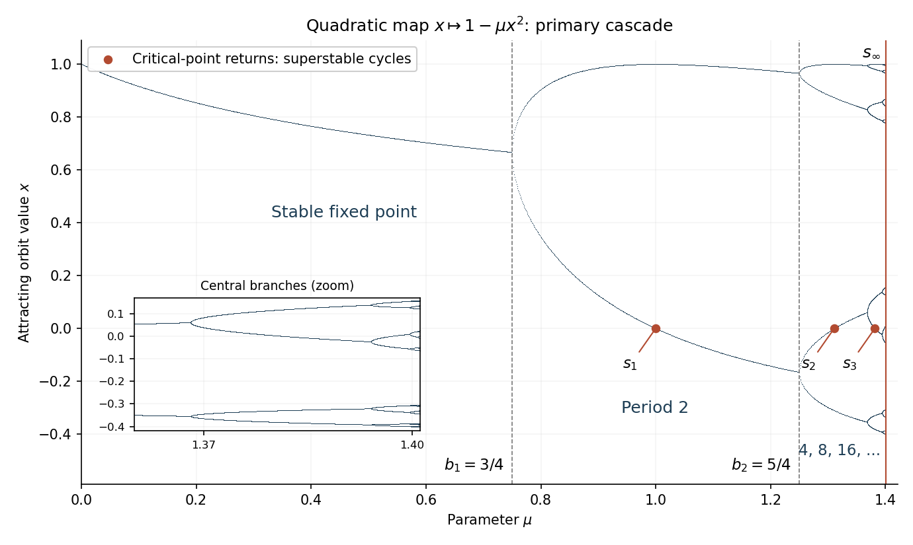

<h1 id="2/a/solution">Solution</h1>

↑ **Parent:** [A](../a.md)

For the quadratic [unimodal map](../../../../../../unimodal-interval-map.md), an attracting [fixed point](../../../../../../fixed-point.md) lies on the positive branch

$$
x_*(\mu)=\frac{2}{1+\sqrt{1+4\mu}},\qquad
f_\mu'(x_*)=1-\sqrt{1+4\mu}.
$$

Its multiplier has modulus less than one for $0\leq\mu<3/4$ and reaches $-1$ at the first [period-doubling bifurcation](../../../../../../period-doubling-bifurcation.md) $b_1=3/4$. The resulting two-cycle has points

$$
x_\pm=\frac{1\pm\sqrt{4\mu-3}}{2\mu},\qquad
f_\mu(x_+)=x_-,\quad f_\mu(x_-)=x_+.
$$

Its [periodic-orbit multiplier](../../../../../../multiplier-of-a-periodic-orbit-of-an-iteration.md) is $4\mu^2x_+x_-=4(1-\mu)$, so it is attracting for $3/4<\mu<5/4$ and doubles at $b_2=5/4$. Successive attracting periods are $4,8,16,\ldots$, with their parameter intervals shrinking toward $s_\infty\simeq1.401155189$.

A [superstable periodic orbit](../../../../../../superstable-periodic-orbit.md) contains the [critical point](../../../../../../critical-point.md) zero, so its [derivative](../../../../../../derivative.md) product vanishes. Along the first [period-doubling cascade](../../../../../../period-doubling-cascade.md), $s_n$ is the first-cascade parameter with a critical orbit of exact period $2^n$, satisfying $f_{s_n}^{2^n}(0)=0$. For example, $s_1=1$, $s_2\simeq1.310702641$, and $s_3\simeq1.381547484$. These are interior points of stability intervals, distinct from the bifurcation parameters $b_n$.

The following [bifurcation diagram](../../../../../../bifurcation-diagram.md) shows attracting orbit values, including the first bifurcations and superstable points. At the accumulation parameter the limiting critical orbit is not a finite attracting cycle; its closure is the period-doubling limit set.

**[Figure 1](#2/a/image-attracting-quadratic-map-orbits-and-the-first-period-doubling-cascade). Attracting quadratic-map orbits and the first period-doubling cascade**.

The [Feigenbaum constants](../../../../../../feigenbaum-constants.md) use the positive spatial-scaling convention. Their parameter definition is

$$
\boxed{\delta=\lim_{n\to\infty}\frac{s_n-s_{n-1}}{s_{n+1}-s_n}\simeq4.669201609.}
$$

The same limit is obtained from successive bifurcation parameters. To define spatial scaling without ambiguity about signs, let

$$
d_n=f_{s_n}^{2^{n-1}}(0),\qquad n\geq1.
$$

This is the signed central return separation in the superstable $2^n$ orbit; its sign alternates between successive levels of the primary cascade. Then

$$
\boxed{\alpha=-\lim_{n\to\infty}\frac{d_n}{d_{n+1}}\simeq2.502907875.}
$$

Equivalently, the ratio of the corresponding unsigned separations tends to $\alpha$. Some conventions call the signed ratio itself $\alpha$; here the spatial scale of the [Feigenbaum renormalization fixed point](../../../../../../feigenbaum-renormalization-fixed-point.md) is $a=-1/\alpha<0$, matching the orientation reversal in the [doubling operator](../../../../../../period-doubling-renormalization-operator.md).

## ↑ Ancestors (11)

1. [A](../a.md)
2. [2](../../2.md)
3. [Paper 53](../../../paper-53-split.md)
4. [Iii](../../../split.md)
5. [2001](../../../../split.md)
6. [Past exam of the mathematics course of the University of Cambridge](../../../../../split.md)
7. [Mathematics course of the University of Cambridge](../../../../../../mathematics-course-of-the-university-of-cambridge.md)
8. [Course of the University of Cambridge](../../../../../../course-of-the-university-of-cambridge.md)
9. [University of Cambridge](../../../../../../university-of-cambridge-split.md)
10. [List of universities](../../../../../../list-of-universities.md)
11. [Codex Wiki](../../../../../../split.md)
