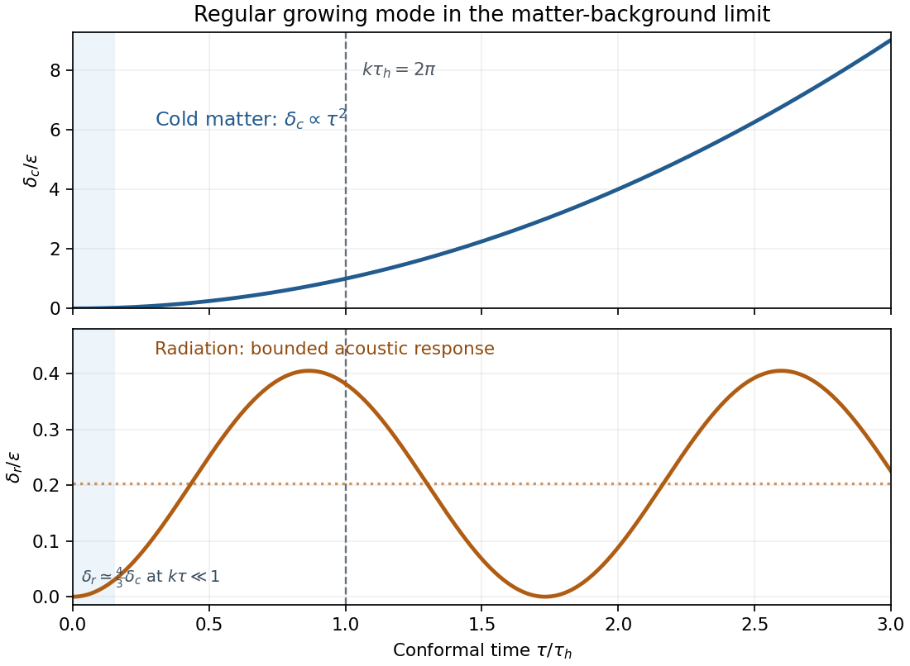

<h1 id="4/ii/solution">Solution</h1>

↑ **Parent:** [Ii](../ii.md)

In deep [matter domination](../../../../../../matter-domination.md), the [scale factor](../../../../../../scale-factor-cosmology.md) is $a\propto\tau^2$, so $a'/a=2/\tau$. Neglect radiation in the gravity source, including its backreaction, to obtain

$$
\delta_c''+\frac2\tau\delta_c'-\frac6{\tau^2}\delta_c=0.
$$

For a power $\tau^p$ the [Euler-Cauchy equation](../../../../../../euler-cauchy-equation.md) becomes $p(p-1)+2p-6=(p-2)(p+3)=0$. Its two independent [matter-era growing and decaying density modes](../../../../../../matter-era-growing-and-decaying-density-modes.md) give the full approximate solution

$$
\boxed{\delta_c=A(\mathbf k)(\tau/\tau_i)^2+
B(\mathbf k)(\tau/\tau_i)^{-3}.}
$$

There is no $k$-dependent pressure term for [cold dark matter](../../../../../../cold-dark-matter.md). Thus this leading equation is valid both outside and inside the horizon in the stated comoving [synchronous gauge](../../../../../../synchronous-gauge-in-cosmology.md), as long as the perturbations remain linear and the omitted radiation gravity is negligible. A different time slicing would give a different density variable.

For $k>0$, put $\omega=k/\sqrt3$, $C_g=A/\tau_i^2$ and $C_d=B\tau_i^3$. The remaining radiation equation is a forced [harmonic oscillator](../../../../../../simple-harmonic-motion.md):

$$
\delta_r''+\omega^2\delta_r=\frac43\delta_c''
=\frac83C_g+16C_d\tau^{-5}.
$$

The [matter-era forced radiation response](../../../../../../matter-era-forced-radiation-response.md) can be written exactly within the matter-background approximation as

$$
\delta_r=C_1\cos(\omega\tau)+C_2\sin(\omega\tau)
+\frac{8C_g}{3\omega^2}
+\frac{16C_d}{\omega}\int_{\tau_*}^{\tau}s^{-5}
\sin[\omega(\tau-s)]\,ds.
$$

The last term is a [Green's function](../../../../../../green-s-function.md) particular solution; changing its lower limit only changes the two oscillatory constants. For the decaying source, a slowly varying particular solution obeys $\delta_{r,p}\simeq(4/3)\delta_c''/\omega^2$, since a second time derivative is smaller than $\omega^2\delta_{r,p}$ by order $(k\tau)^{-2}$. Consequently the subhorizon asymptotic form is

$$
\boxed{\delta_r=C_1\cos(k\tau/\sqrt3)+C_2\sin(k\tau/\sqrt3)
+\frac{8A}{k^2\tau_i^2}
+\frac{48B\tau_i^3}{k^2\tau^5}
+O\!\left(\frac{B\tau_i^3}{k^4\tau^7}\right).}
$$

For a pure growing mode, the constant offset and acoustic terms are an exact solution of this reduced radiation equation. In particular, the late radiation contrast does not follow the ever-growing $\delta_c$.

Before crossing, a regular growing [adiabatic cosmological perturbation](../../../../../../adiabatic-initial-conditions.md) has both contrasts proportional to $\tau^2$, with $\delta_r=(4/3)\delta_c$ to leading order. Afterwards [cold dark matter](../../../../../../cold-dark-matter.md) keeps this quadratic growth, whereas radiation undergoes [subhorizon radiation acoustic oscillations](../../../../../../subhorizon-radiation-acoustic-oscillations.md) about a constant forced offset. To make the requested sketch concrete, one regular leading matter-era solution on both sides is

$$
\delta_c=\varepsilon(\tau/\tau_h)^2,\qquad
\delta_r=\frac{8\varepsilon}{k^2\tau_h^2}
[1-\cos(k\tau/\sqrt3)],\qquad k\tau_h=2\pi.
$$

Its small-$k\tau$ expansion gives $\delta_r=(4/3)\delta_c+O((k\tau)^4)$, and its oscillation frequency is the radiation sound frequency. The sketch plots amplitudes in units of $\varepsilon$; $\varepsilon$ can be chosen small enough that the whole plotted interval remains linear. The line at $\tau_h$ uses the wavelength-to-particle-horizon convention in the question, rather than asserting that the smooth transition occurs at a sharp surface.

**[Figure 1](#4/ii/image-growing-cold-matter-and-forced-radiation-contrasts-through-horizon-crossing). Growing cold-matter and forced radiation contrasts through horizon crossing**.

## ↑ Ancestors (11)

1. [Ii](../ii.md)
2. [4](../../4.md)
3. [Paper 67](../../../paper-67-split.md)
4. [Iii](../../../split.md)
5. [2001](../../../../split.md)
6. [Past exam of the mathematics course of the University of Cambridge](../../../../../split.md)
7. [Mathematics course of the University of Cambridge](../../../../../../mathematics-course-of-the-university-of-cambridge.md)
8. [Course of the University of Cambridge](../../../../../../course-of-the-university-of-cambridge.md)
9. [University of Cambridge](../../../../../../university-of-cambridge-split.md)
10. [List of universities](../../../../../../list-of-universities.md)
11. [Codex Wiki](../../../../../../split.md)
