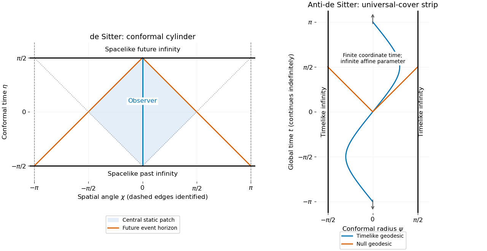

<h1 id="4/solution">Solution</h1>

↑ **Parent:** [4](../4.md)

The local [metric tensors](../../../../../metric-tensor.md) do not determine the global coordinate identifications. The usual complete [two-dimensional de Sitter spacetime](../../../../../two-dimensional-de-sitter-spacetime.md) is the hyperboloid $(X^0)^2-(X^1)^2-(X^2)^2=-1$ in ambient signature $(+--)$, with

$$
X^0=\sinh t,\qquad
X^1=\cosh t\cos\chi,\qquad X^2=\cosh t\sin\chi.
$$

Pulling back the ambient [metric tensor](../../../../../metric-tensor.md) gives $dt^2-\cosh^2t\,d\chi^2$, with

$$
\boxed{t\in\mathbb R,\qquad \chi\in\mathbb R/(2\pi\mathbb Z).}
$$

Unwrapping $\chi$ gives the [universal cover of two-dimensional de Sitter spacetime](../../../../../universal-cover-of-two-dimensional-de-sitter-spacetime.md) instead. The usual embedded [two-dimensional anti-de Sitter spacetime](../../../../../two-dimensional-anti-de-sitter-spacetime.md) has $(X^0)^2+(X^1)^2-(X^2)^2=1$ in signature $(++-)$ and

$$
X^0=\cosh r\cos t,\qquad
X^1=\cosh r\sin t,\qquad X^2=\sinh r.
$$

Here $r\in\mathbb R$ and $t$ is initially periodic modulo $2\pi$. The time circles are [closed timelike curves](../../../../../closed-timelike-curve.md). Its physically standard [universal cover](../../../../../universal-cover.md) removes that identification:

$$
\boxed{r\in\mathbb R,\qquad t\in\mathbb R.}
$$

The two signs of $r$ describe two spatial ends; imposing $r\ge0$ would retain only half of this complete model.

Both spacetimes have constant [curvature](../../../../../curvature.md) and are [geodesically complete](../../../../../geodesic-completeness.md). In the paper's convention their [Ricci scalars](../../../../../ricci-scalar.md) are respectively $+2$ and $-2$. Their embeddings show that [geodesics](../../../../../geodesic.md) are intersections with planes through the ambient origin. They nevertheless have very different causal structures.

For the [geodesics of two-dimensional de Sitter spacetime](../../../../../geodesics-of-two-dimensional-de-sitter-spacetime.md), use an [affine parameter](../../../../../affine-parameter.md) $\lambda$, normalization $\kappa=\dot t^2-\cosh^2t\,\dot\chi^2\in\{1,0,-1\}$ and conserved momentum $L=\cosh^2t\,\dot\chi$. Then

$$
\dot t^2=\kappa+\frac{L^2}{\cosh^2t}.
$$

[Timelike geodesics](../../../../../timelike-geodesic.md) extend to both infinite [proper times](../../../../../proper-time.md); $\chi=\text{constant}$ is a simple example. [Null geodesics](../../../../../null-geodesic.md) obey $\sinh t=\pm|L|(\lambda-\lambda_0)$, so their [affine parameter](../../../../../affine-parameter.md) is also infinite at either temporal end. [Spacelike geodesics](../../../../../spacelike-geodesic.md) have $|L|\ge1$, obey $\sinh t=\sqrt{L^2-1}\sin(\lambda-\lambda_0)$ and are closed curves on the embedded cylinder; $t=0$ is its simplest [spacelike geodesic](../../../../../spacelike-geodesic.md) circle. Unwrapping the spatial circle removes closure but not completeness.

For the [geodesics of two-dimensional anti-de Sitter spacetime](../../../../../geodesics-of-two-dimensional-anti-de-sitter-spacetime.md), the timelike [Killing vector](../../../../../killing-vector-field.md) $\partial_t$ gives $E=\cosh^2r\,\dot t$. The normalization is $\kappa=\cosh^2r\,\dot t^2-\dot r^2$, hence

$$
\dot r^2=\frac{E^2}{\cosh^2r}-\kappa.
$$

Choose a future-directed [timelike geodesic](../../../../../timelike-geodesic.md), so $E\ge1$ and

$$
\sinh r=\sqrt{E^2-1}\sin(\lambda-\lambda_0).
$$

For $E>1$, it oscillates radially with proper period $2\pi$; $E=1$ gives the central [geodesic](../../../../../geodesic.md) $r=0$. In both cases, global time advances by $2\pi$ over a [proper time](../../../../../proper-time.md) interval $2\pi$. The curve is closed on the original hyperboloid, while its lift on the universal cover is nonclosed and future-directed. [Null geodesics](../../../../../null-geodesic.md) have $\sinh r=\pm E(\lambda-\lambda_0)$ and reach either spatial end only at infinite [affine parameter](../../../../../affine-parameter.md). [Spacelike geodesics](../../../../../spacelike-geodesic.md) satisfy $\sinh r=\sqrt{E^2+1}\sinh(\lambda-\lambda_0)$ and also have infinite [proper length](../../../../../proper-length.md) toward either end. Thus the finite coordinate time discussed below does not imply physical [geodesic](../../../../../geodesic.md) incompleteness.

The [conformal cylinder of two-dimensional de Sitter spacetime](../../../../../conformal-cylinder-of-two-dimensional-de-sitter-spacetime.md) follows by setting $\eta=\arctan(\sinh t)$:

$$
ds^2=\sec^2\eta(d\eta^2-d\chi^2),\qquad
-\frac\pi2<\eta<\frac\pi2.
$$

Its past and future [conformal boundaries](../../../../../conformal-boundary.md) are spacelike circles. [Null geodesics](../../../../../null-geodesic.md) have $d\chi/d\eta=\pm1$ and can travel only a finite angular distance over the entire infinite proper-time history. For the complete observer $\chi=0$, an event can send a signal to that observer precisely when its shortest angular distance $d(\chi,0)$ is less than $\pi/2-\eta$. The [observer horizons in two-dimensional de Sitter spacetime](../../../../../observer-horizons-in-two-dimensional-de-sitter-spacetime.md) are therefore the null curves $d(\chi,0)=\pi/2-\eta$; its past signal horizon has $d(\chi,0)=\eta+\pi/2$. These are observer horizons, without [curvature](../../../../../curvature.md) singularities. Their intersection bounds a static patch with [metric tensor](../../../../../metric-tensor.md)

$$
ds^2=(1-\rho^2)dT^2-\frac{d\rho^2}{1-\rho^2},\qquad |\rho|<1.
$$

The horizons at $\rho=\pm1$ are regular [Killing horizons](../../../../../killing-horizon.md) beyond which this static chart fails, while the global coordinates remain smooth.

For the [conformal strip of two-dimensional anti-de Sitter spacetime](../../../../../conformal-strip-of-two-dimensional-anti-de-sitter-spacetime.md), set $\psi=\arctan(\sinh r)$. On its universal cover,

$$
ds^2=\sec^2\psi(dt^2-d\psi^2),\qquad
-\frac\pi2<\psi<\frac\pi2,\qquad t\in\mathbb R.
$$

The two conformal boundaries are timelike. A null ray from the center approaches a boundary after coordinate time $\pi/2$, though its [affine parameter](../../../../../affine-parameter.md) diverges. Every interior event can signal to the complete central static observer in finite global time, so that observer has no event horizon. A [Poincaré horizon](../../../../../poincare-horizon.md) concerns a restricted coordinate patch, and accelerated observers can have different causal horizons.

Finally, the global de Sitter cylinder and its spatial cover are [globally hyperbolic](../../../../../globally-hyperbolic-spacetime.md): constant-time slices are [Cauchy hypersurfaces](../../../../../cauchy-surface.md). The anti-de Sitter universal cover is not globally hyperbolic, because timelike infinity admits incoming signals within finite global time. A field's evolution therefore requires [boundary conditions](../../../../../boundary-condition.md) at its two conformal boundaries in addition to [initial data](../../../../../initial-data-in-general-relativity.md). The opposite placement of the conformal boundaries explains why de Sitter observers have cosmological horizons despite global hyperbolicity, while the central anti-de Sitter observer has no event horizon despite the failure of global hyperbolicity.

**[Figure 1](#4/image-conformal-cylinder-and-observer-horizons-of-de-sitter-spacetime-compared-with-the-timelike-boundaries-of-the-anti-de-sitter-universal-cover). Conformal cylinder and observer horizons of de Sitter spacetime compared with the timelike boundaries of the anti-de Sitter universal cover**.

## ↑ Ancestors (10)

1. [4](../4.md)
2. [Paper 68](../../paper-68-split.md)
3. [Iii](../../split.md)
4. [2001](../../../split.md)
5. [Past exam of the mathematics course of the University of Cambridge](../../../../split.md)
6. [Mathematics course of the University of Cambridge](../../../../../mathematics-course-of-the-university-of-cambridge.md)
7. [Course of the University of Cambridge](../../../../../course-of-the-university-of-cambridge.md)
8. [University of Cambridge](../../../../../university-of-cambridge-split.md)
9. [List of universities](../../../../../list-of-universities.md)
10. [Codex Wiki](../../../../../split.md)
