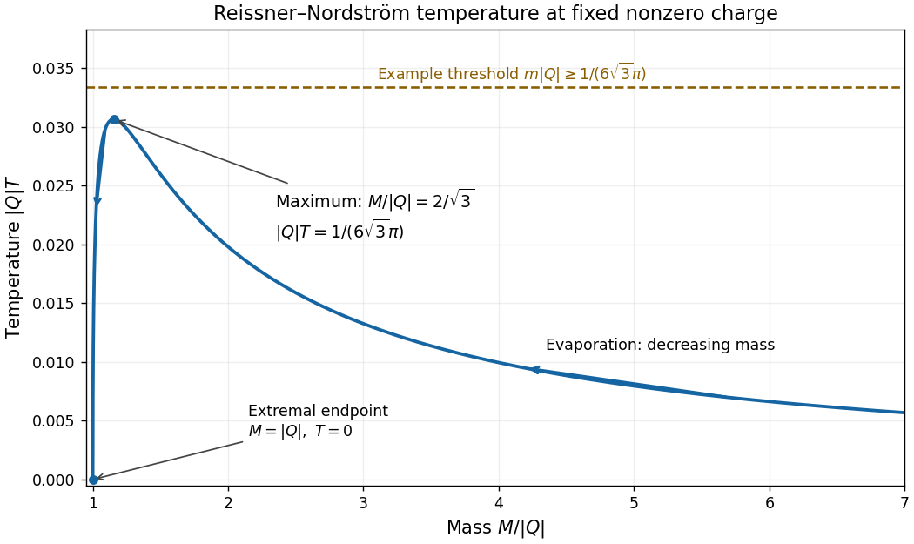

<h1 id="4/solution">Solution</h1>

↑ **Parent:** [4](../4.md)

Assume an asymptotically flat [Reissner-Nordstrom spacetime](../../../../../reissner-nordstrom-spacetime.md), with $M>|Q|$, time normalized at infinity, and $G=\hbar=c_{\rm light}=k_B=1$. Put

$$
q=|Q|,\qquad r_\pm=M\pm\sqrt{M^2-q^2},\qquad
f(r)=\frac{(r-r_+)(r-r_-)}{r^2}.
$$

Near $r_+$, the Euclidean radial-time metric is $f'(r_+)(r-r_+)\,d\tau^2+dr^2/[f'(r_+)(r-r_+)]$. With $\rho=2\sqrt{(r-r_+)/f'(r_+)}$, it becomes

$$
d\rho^2+\left(\frac{f'(r_+)}2\right)^2\rho^2d\tau^2.
$$

The [Euclidean black-hole regularity condition](../../../../../euclidean-black-hole-regularity-condition.md) removes a conical defect only if $\tau$ has period $4\pi/f'(r_+)$. Therefore the [Reissner-Nordstrom Hawking temperature](../../../../../reissner-nordstrom-hawking-temperature.md) is

$$
\boxed{T=\frac{f'(r_+)}{4\pi}
=\frac{r_+-r_-}{4\pi r_+^2}
=\frac{\sqrt{M^2-q^2}}{2\pi(M+\sqrt{M^2-q^2})^2}.}
$$

Equivalently this is the [Reissner-Nordstrom horizon surface gravity](../../../../../reissner-nordstrom-horizon-surface-gravity.md) divided by $2\pi$. The derivation assumes a nondegenerate horizon; the value zero at $M=q$ is obtained by the nonextremal limit, not by imposing conical regularity directly on the degenerate geometry.

For fixed nonzero $q$, write $y=r_+/q\geq1$. The horizon equation gives

$$
\frac Mq=\frac12(y+y^{-1}),\qquad
qT=\frac1{4\pi}(y^{-1}-y^{-3}).
$$

The [mass](../../../../../mass.md) is increasing with $y>1$, and

$$
\frac{d(qT)}{dy}=\frac{3-y^2}{4\pi y^4}.
$$

Thus the [fixed-charge Reissner-Nordstrom temperature maximum](../../../../../fixed-charge-reissner-nordstrom-temperature-maximum.md) occurs at

$$
\boxed{r_+=\sqrt3\,q,\qquad
M_{\max}=\frac{2q}{\sqrt3},\qquad
T_{\max}=\frac1{6\sqrt3\,\pi q}.}
$$

The curve starts at zero at $M=q$, rises to this maximum, then falls as $1/(8\pi M)$ for large [mass](../../../../../mass.md). During evaporation from $M_0\gg q$, the [mass](../../../../../mass.md) moves from right to left: the [temperature](../../../../../temperature.md) initially increases, reaches its maximum, and then decreases towards zero.

**[Figure 1](#4/image-reissner-nordstrom-temperature-at-fixed-charge-its-maximum-and-the-evaporation-direction). Reissner-Nordstrom temperature at fixed charge, its maximum and the evaporation direction**.

Under the printed thermal-emission cutoff, charged emission is absent throughout precisely when the entire [mass](../../../../../mass.md) path remains at or below the threshold:

$$
\boxed{m\geq T_{\max}\quad\Longleftrightarrow\quad
m|Q|\geq\frac1{6\sqrt3\,\pi}.}
$$

Equality is allowed because emission is assumed to require $T>m$, not merely $T=m$. The initial large [mass](../../../../../mass.md) ensures that the path includes the maximum.

With charge then conserved, neutral [Hawking radiation](../../../../../hawking-radiation.md) lowers the [mass](../../../../../mass.md) until the system approaches the [charge-preserving Reissner-Nordstrom evaporation endpoint](../../../../../charge-preserving-reissner-nordstrom-evaporation-endpoint.md):

$$
\boxed{M_{\rm final}=|Q|,\qquad T_{\rm final}=0,\qquad
A_{\rm final}=4\pi Q^2.}
$$

The limiting state is an [extremal black hole](../../../../../extremal-black-hole.md), rather than a neutral zero-mass endpoint. Exact attainment in finite time is not established: near extremality $T\sim\sqrt{M-q}/(\sqrt2\pi q^{3/2})$, and the ideal radiation rate tends to zero. The conclusion is within the assumed thermal cutoff model, which omits nonthermal charge creation and other quantum corrections. For $Q=0$, the Schwarzschild [temperature](../../../../../temperature.md) instead grows without bound in the extrapolated model, so no finite $m$ satisfies the stated all-the-way [temperature](../../../../../temperature.md) bound.

## ↑ Ancestors (10)

1. [4](../4.md)
2. [Paper 69](../../paper-69-split.md)
3. [Iii](../../split.md)
4. [2001](../../../split.md)
5. [Past exam of the mathematics course of the University of Cambridge](../../../../split.md)
6. [Mathematics course of the University of Cambridge](../../../../../mathematics-course-of-the-university-of-cambridge.md)
7. [Course of the University of Cambridge](../../../../../course-of-the-university-of-cambridge.md)
8. [University of Cambridge](../../../../../university-of-cambridge-split.md)
9. [List of universities](../../../../../list-of-universities.md)
10. [Codex Wiki](../../../../../split.md)
