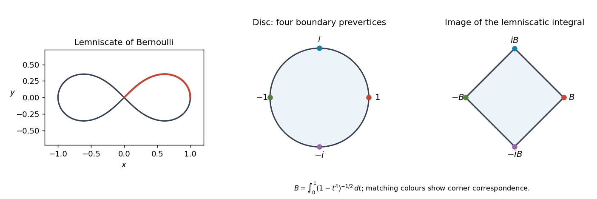

<h1 id="1/iii/solution">Solution</h1>

↑ **Parent:** [Iii](../iii.md)

Let $h(\zeta)=i(1+\zeta)/(1-\zeta)$, the inverse [Cayley transform between the half-plane and disk](../../../../../../cayley-transform-between-the-half-plane-and-disk.md). Direct calculation gives

$$
h'\!(\zeta)=\frac{2i}{(1-\zeta)^2},\qquad
h(\zeta)(1-h(\zeta)^2)=\frac{2i(1+\zeta)(1+\zeta^2)}{(1-\zeta)^3},
$$

so

$$
\left((F_1\circ h)'(\zeta)\right)^2=\frac{2i}{1-\zeta^4}.
$$

On the [unit disc](../../../../../../unit-disc.md), choose the [holomorphic square root](../../../../../../holomorphic-square-root.md) of $1-\zeta^4$ equal to one at zero. Both sides define nonvanishing [holomorphic](../../../../../../complex-differentiability-at-a-point.md) [derivatives](../../../../../../derivative.md), and their quotient has constant square. The branch chosen in part ii gives $(F_1\circ h)'(0)=1+i$. Consequently

$$
F_1(h(\zeta))=F_1(i)+(1+i)F(\zeta).
$$

An affine change of image coordinate preserves [conformality](../../../../../../conformality.md), so the [lemniscatic integral](../../../../../../lemniscatic-integral.md) maps the disc bijectively onto a [square](../../../../../../square.md).

The normalization specifies the [square](../../../../../../square.md) exactly. Put $B=F(1)=\int_0^1dt/\sqrt{1-t^4}$. The substitution $x=t^2$ gives $A=2B$. The integral satisfies $F(-z)=-F(z)$ and $F(iz)=iF(z)$, so its four corner values are $B,iB,-B,-iB$. Thus

$$
\boxed{F(\mathbb D)=\{u+iv:|u|+|v|<B\}}.
$$

In particular the image is a [square](../../../../../../square.md) rotated through $\pi/4$ relative to the one in part ii, and its side length is $\sqrt2B$. These symmetries also give $F_1(i)=(1+i)B$ from the affine identity.

**[Figure 1](#1/iii/image-the-lemniscate-and-the-four-corner-boundary-correspondence-of-the-lemniscatic-disc-to-square-map). The lemniscate and the four-corner boundary correspondence of the lemniscatic disc-to-square map**.

## ↑ Ancestors (11)

1. [Iii](../iii.md)
2. [1](../../1.md)
3. [Paper 8](../../../paper-8-split.md)
4. [Iii](../../../split.md)
5. [2001](../../../../split.md)
6. [Past exam of the mathematics course of the University of Cambridge](../../../../../split.md)
7. [Mathematics course of the University of Cambridge](../../../../../../mathematics-course-of-the-university-of-cambridge.md)
8. [Course of the University of Cambridge](../../../../../../course-of-the-university-of-cambridge.md)
9. [University of Cambridge](../../../../../../university-of-cambridge-split.md)
10. [List of universities](../../../../../../list-of-universities.md)
11. [Codex Wiki](../../../../../../split.md)
