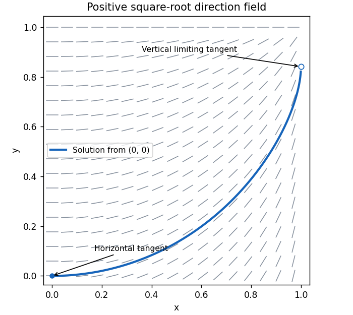
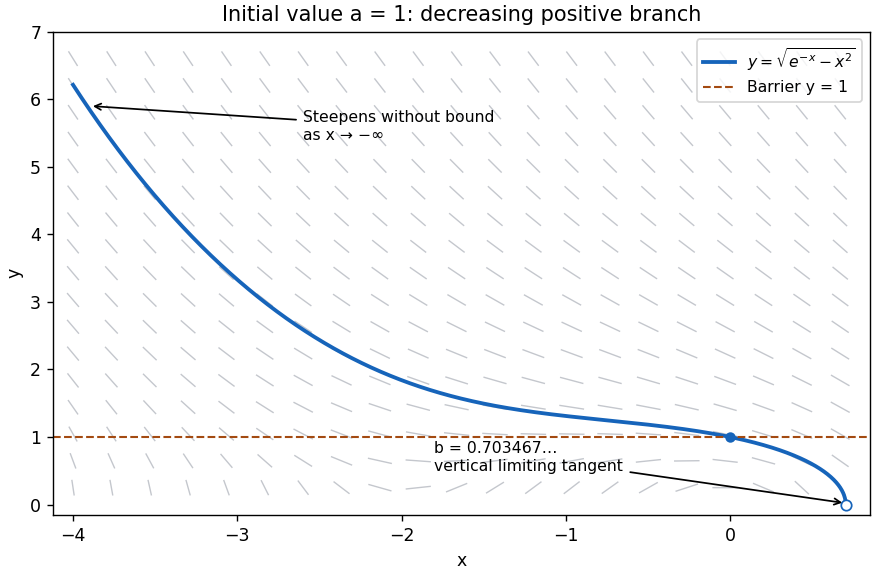
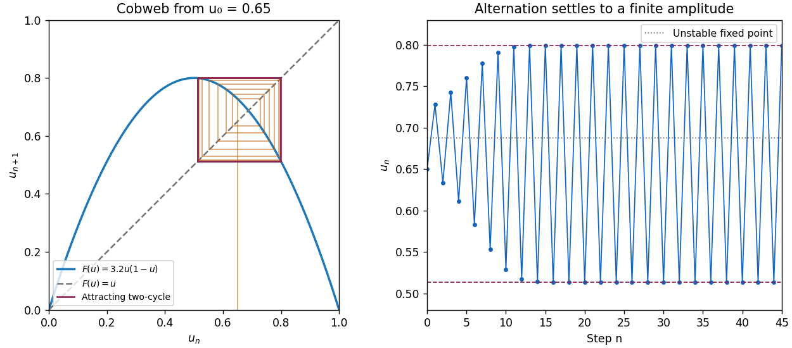
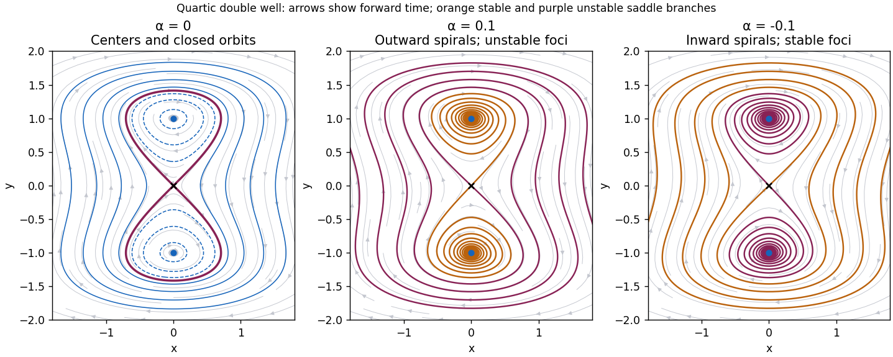

# Paper 2

↑ **Parent:** [Ia](../ia.md)

[https://www.maths.cam.ac.uk/undergrad/pastpapers/files/2002/PaperIA_2.pdf](https://www.maths.cam.ac.uk/undergrad/pastpapers/files/2002/PaperIA_2.pdf)

**Table of contents**

- [1D](#1d)
  - [Solution](#1d/solution)
- [2D](#2d)
  - [Solution](#2d/solution)
- [3F](#3f)
  - [Solution](#3f/solution)
- [4F](#4f)
  - [Solution](#4f/solution)
- [5D](#5d)
  - [Solution](#5d/solution)
- [6D](#6d)
  - [Solution](#6d/solution)
- [7D](#7d)
  - [Solution](#7d/solution)
- [8D](#8d)
  - [Solution](#8d/solution)
- [9F](#9f)
  - [a](#9f/a)
    - [Solution](#9f/a/solution)
  - [b](#9f/b)
    - [Solution](#9f/b/solution)
  - [c](#9f/c)
    - [Solution](#9f/c/solution)
  - [d](#9f/d)
    - [Solution](#9f/d/solution)
- [10F](#10f)
  - [a](#10f/a)
    - [Solution](#10f/a/solution)
  - [b](#10f/b)
    - [Solution](#10f/b/solution)
  - [c](#10f/c)
    - [Solution](#10f/c/solution)
- [11F](#11f)
  - [a](#11f/a)
    - [Solution](#11f/a/solution)
  - [b](#11f/b)
    - [Solution](#11f/b/solution)
  - [c](#11f/c)
    - [Solution](#11f/c/solution)
  - [d](#11f/d)
    - [Solution](#11f/d/solution)
- [12F](#12f)
  - [a](#12f/a)
    - [Solution](#12f/a/solution)
  - [b](#12f/b)
    - [Solution](#12f/b/solution)
  - [c](#12f/c)
    - [Solution](#12f/c/solution)
  - [d](#12f/d)
    - [Solution](#12f/d/solution)

## 1D

↑ **Parent:** [Paper 2](paper-2.md)

<h3 id="1d/solution">Solution</h3>

↑ **Parent:** [1D](#1d)

The [characteristic equation](../../../differential-equation.md#characteristic-equation-of-a-constant-coefficient-differential-equation) of the [homogeneous linear differential equation](../../../differential-equation.md#homogeneous-linear-differential-equation) is $m^2+m-2=(m-1)(m+2)=0$, giving the [homogeneous solution](../../../differential-equation.md#homogeneous-solution) $Ae^t+Be^{-2t}$. For the first forcing, a [particular solution](../../../differential-equation.md#particular-solution) of the form $Ce^{-t}$ gives $-2C=1$, so

$$
y=Ae^t+Be^{-2t}-\tfrac12e^{-t}.
$$

The [initial conditions](../../../differential-equation.md#initial-condition) impose $A+B=1/2$ and $A-2B=-1/2$, whence $A=1/6$, $B=1/3$. Thus **the first solution is**

$$
\boxed{y(t)=\tfrac16e^t+\tfrac13e^{-2t}-\tfrac12e^{-t}.}
$$

For the second forcing, $e^t$ is already a [homogeneous solution](../../../differential-equation.md#homogeneous-solution), so the usual exponential trial must be multiplied by $t$. Substitution of the [particular solution](../../../differential-equation.md#particular-solution) $Cte^t$ gives $3Ce^t=e^t$, hence $C=1/3$. Now $y=Ae^t+Be^{-2t}+te^t/3$, and the [initial conditions](../../../differential-equation.md#initial-condition) give $A+B=0$, $A-2B=-1/3$. Therefore **the resonant solution is**

$$
\boxed{y(t)=\left(\tfrac t3-\tfrac19\right)e^t+\tfrac19e^{-2t}.}
$$

The additional factor $t$ reflects [resonance in a differential equation](../../../differential-equation.md#resonance-in-a-differential-equation).

## 2D

↑ **Parent:** [Paper 2](paper-2.md)

<h3 id="2d/solution">Solution</h3>

↑ **Parent:** [2D](#2d)

This is a [separable differential equation](../../../differential-equation.md#separable-differential-equation). On the solution with $y<1$, integration from the [initial condition](../../../differential-equation.md#initial-condition) gives

$$
\int_0^y\frac{dv}{\sqrt{1-v^2}}=\int_0^x\frac{u\,du}{\sqrt{1-u^2}},\qquad \arcsin y=1-\sqrt{1-x^2}.
$$

The right side lies in $[0,1)$, so taking its sine stays on the required branch. **The solution is**

$$
\boxed{y(x)=\sin\left(1-\sqrt{1-x^2}\right),\quad 0\le x<1.}
$$

Near the origin, $1-\sqrt{1-x^2}=x^2/2+O(x^4)$, so $y=x^2/2+O(x^4)$ and the [tangent line](../../../calculus.md#tangent-line) is horizontal. At the other end, $y\to\sin1$, while

$$
y'=\frac{x\cos(1-\sqrt{1-x^2})}{\sqrt{1-x^2}}\longrightarrow+\infty.
$$

Thus the curve has a vertical limiting [tangent line](../../../calculus.md#tangent-line) as $x\uparrow1$, even though $x=1$ is excluded from the domain.

For the [direction field](../../../differential-equation.md#direction-field), the slope is nonnegative everywhere in the square. The segments are horizontal on $x=0$ and on $y=1$, become steeper as $x$ increases at fixed $y<1$, and become flatter as $y$ increases at fixed $x$. Near $x=1$ they are almost vertical unless $y$ is correspondingly close to one. The excluded corner $(1,1)$ has no single limiting slope: the ratio $(1-y^2)/(1-x^2)$ depends on the path of approach.

**[Figure 1](#2d/image-positive-slope-field-and-the-solution-from-the-origin-with-its-horizontal-and-vertical-limiting-tangents). Positive slope field and the solution from the origin, with its horizontal and vertical limiting tangents**.

## 3F

↑ **Parent:** [Paper 2](paper-2.md)

<h3 id="3f/solution">Solution</h3>

↑ **Parent:** [3F](#3f)

The [indicator function](../../../measure-theory.md#indicator-function) $I_A$ equals one when the [event](../../../probability-theory.md#event) $A$ occurs and zero otherwise. Its [expected value](../../../probability-theory.md#expected-value) is $\mathbb E I_A=\mathbb P(A)$. By [linearity of expectation](../../../probability-theory.md#linearity-of-expectation), no [independence](../../../random-variable.md#independent-random-variables) assumption is needed to obtain

$$
\boxed{\mathbb E N=\sum_{i=1}^n p_i.}
$$

Since $I_iI_j=I_{A_i\cap A_j}$, including $p_{ii}=p_i$, the [variance](../../../variance.md) is

$$
\boxed{\operatorname{Var}N=\sum_{i,j=1}^n(p_{ij}-p_ip_j)=\sum_i p_i(1-p_i)+2\sum_{i<j}(p_{ij}-p_ip_j).}
$$

In particular, correlations between the [events](../../../probability-theory.md#event) cannot simply be discarded.

Write $\mu=\mathbb E N$. If $\mu>0$, then $N=0$ implies $|N-\mu|\ge\mu$. Applying [Chebyshev's inequality](../../../probability-inequality.md#chebyshev-inequality) therefore gives

$$
\boxed{\mathbb P(N=0)\le\frac{\operatorname{Var}N}{\mu^2}.}
$$

Equivalently, the contribution of $N=0$ to $\mathbb E[(N-\mu)^2]$ is $\mu^2\mathbb P(N=0)$. **A positive mean is necessary for the displayed ratio to be defined.** If $\mu=0$, nonnegativity instead gives $N=0$ almost surely, and the printed ratio would be $0/0$.

## 4F

↑ **Parent:** [Paper 2](paper-2.md)

<h3 id="4f/solution">Solution</h3>

↑ **Parent:** [4F](#4f)

After $n+1$ independent tosses, an even count arises in exactly two disjoint ways: an even count after $n$ tosses followed by a tail, or an odd count followed by a head. [Independence](../../../random-variable.md#independent-random-variables) of the last toss from the preceding ones therefore gives

$$
\pi_{n+1}=(1-p)\pi_n+p(1-\pi_n)=p+(1-2p)\pi_n.
$$

Subtracting the [fixed point](../../../function.md#fixed-point) $1/2$ turns this into the [linear recurrence](../../../algebra.md#linear-recurrence-relation)

$$
\pi_{n+1}-\tfrac12=(1-2p)(\pi_n-\tfrac12).
$$

As zero is even, $\pi_0=1$, so **the probability is**

$$
\boxed{\pi_n=\frac{1+(1-2p)^n}{2}.}
$$

For $p=1/2$ this is $1/2$ for every $n\ge1$; for $p=0$ it is always one; for $p=1$ it alternates between one and zero according to the parity of $n$.

## 5D

↑ **Parent:** [Paper 2](paper-2.md)

<h3 id="5d/solution">Solution</h3>

↑ **Parent:** [5D](#5d)

An [integrating factor for a differential one-form](../../../differential-equation.md#integrating-factor-for-a-differential-one-form) is a nonzero function $\mu(x,y)$ for which $\mu(dy+f\,dx)$ is an [exact differential](../../../differential-form.md#exact-differential), say $dF$. Then solutions lie on [level sets](../../../topology.md#level-set) $F=\text{constant}$. Locally, the compatibility condition is $\partial_x\mu=\partial_y(\mu f)$.

Here multiplication by $2ye^x$, which is nonzero for $y>0$, produces

$$
2ye^x\,dy+e^x(2x+x^2+y^2)\,dx=d\left[e^x(x^2+y^2)\right].
$$

The [initial condition](../../../differential-equation.md#initial-condition) makes this [first integral](../../../differential-equation.md#first-integral) equal to $a^2$. Taking the positive branch yields **the solution**

$$
\boxed{y(x)=\sqrt{a^2e^{-x}-x^2},}
$$

on the connected interval containing zero where the radicand is positive. This domain restriction matters because the original [differential equation](../../../differential-equation.md) is singular at $y=0$.

Completing the square gives $2x+x^2=(x+1)^2-1\ge-1$. As $y>0$, the [differential equation](../../../differential-equation.md) consequently implies

$$
y'=-\frac{2x+x^2+y^2}{2y}\le\frac{1-y^2}{2y}.
$$

At $x=0$, $y'=-a/2<0$. Thus, moving a little to the left from $y(0)=a\ge1$, the curve rises above $a$. Throughout $y>1$ every segment of the [direction field](../../../differential-equation.md#direction-field) points downwards as $x$ increases, by the inequality above. Tracing backwards therefore makes $y$ rise further, so it cannot return to $y=1$. This graphical barrier argument proves $y>a\ge1$ and $y'<0$ for every $x<0$ on the solution. The explicit [first integral](../../../differential-equation.md#first-integral) also shows this branch extends throughout $x<0$: writing $t=-x>0$, the minimum of $e^t/t^2$ is $e^2/4>1$, so $a^2e^t-t^2>0$ for $a\ge1$. Including the initial point, **$y'<0$ for all $x\le0$.**

For $a=1$ the curve is $y=\sqrt{e^{-x}-x^2}$ on $(-\infty,b)$, where the strictly increasing function $x^2e^x$ has the unique positive root $x^2e^x=1$ at $b\simeq0.703467$. The curve decreases through $(0,1)$ with slope $-1/2$ and reaches $(b,0)$ only as a limiting endpoint. Its derivative is

$$
y'=\frac{-e^{-x}-2x}{2\sqrt{e^{-x}-x^2}}.
$$

As $x\to-\infty$, $y\sim e^{-x/2}$ and $y'\sim-\tfrac12e^{-x/2}\to-\infty$. As $x\uparrow b$, the numerator tends to $-b^2-2b<0$ and the denominator to zero from above, so again $y'\to-\infty$. More precisely, $y\sim\sqrt{b(b+2)(b-x)}$ at the endpoint. **Both ends have the requested unbounded negative slope.**

**[Figure 2](#5d/image-the-positive-solution-for-initial-value-one-with-the-horizontal-barrier-and-the-steep-limiting-endpoint). The positive solution for initial value one, with the horizontal barrier and the steep limiting endpoint**.

## 6D

↑ **Parent:** [Paper 2](paper-2.md)

<h3 id="6d/solution">Solution</h3>

↑ **Parent:** [6D](#6d)

For the [logistic differential equation](../../../differential-equation.md#logistic-differential-equation), separate variables to obtain $\log|y/(1-ay)|=rt+C$ away from the constant solutions. Applying the positive [initial condition](../../../differential-equation.md#initial-condition) gives

$$
\boxed{y(t)=\frac{1}{a+(y_0^{-1}-a)e^{-rt}}=\frac{y_0e^{rt}}{1+ay_0(e^{rt}-1)},\quad t\ge0.}
$$

The formula also includes the constant solution $y_0=1/a$. Below $1/a$ positive solutions increase; above $1/a$ they decrease. They approach $1/a$ as $t\to\infty$. Equivalently, linearizing $F(y)=ry(1-ay)$ gives $F'(0)=r>0$ and $F'(1/a)=-r<0$. Thus **zero is unstable and $1/a$ is asymptotically stable.**

The [Forward Euler method](../../../numerical-analysis.md#euler-method) gives $y_{n+1}=(1+r\delta t)y_n-ra\delta t\,y_n^2$. Set $\lambda=1+r\delta t$ and $u_n=a(\lambda-1)y_n/\lambda$; multiplying the recurrence by this scaling factor gives the [logistic map](../../../dynamical-systems.md#logistic-map)

$$
\boxed{u_{n+1}=\lambda u_n(1-u_n).}
$$

Its [fixed points](../../../function.md#fixed-point) are $u=0$ and $u_*=1-1/\lambda$. The [fixed-point multipliers](../../../dynamical-systems.md#multiplier-of-a-periodic-orbit-of-an-iteration) are $F'(0)=\lambda$ and $F'(u_*)=2-\lambda$. Since $\lambda>1$, zero is always unstable. The positive [fixed point](../../../function.md#fixed-point) is stable for $1<\lambda<3$ and unstable for $\lambda>3$. For $\lambda>3$, a small displacement obeys $\epsilon_{n+1}\simeq(2-\lambda)\epsilon_n$: its sign alternates and its amplitude grows, giving an oscillatory instability whose period is **$2\delta t$**.

This is an artifact of [Euler discretization of logistic growth](../../../differential-equation.md#euler-discretization-of-logistic-growth). Exact small perturbations decay by the positive factor $e^{-r\delta t}$ per time step; a one-dimensional autonomous [differential equation](../../../differential-equation.md) cannot have a nonconstant [periodic orbit](../../../dynamical-systems.md#periodic-orbit), since its solutions move monotonically between [equilibrium points](../../../dynamical-systems.md#equilibrium-point-of-a-dynamical-system). The artificial instability occurs when $r\delta t>2$, beyond the stable step range of this discretization.

For $\lambda=3.2$, remove the [fixed point](../../../function.md#fixed-point) factors from $F(F(u))-u$ to obtain $\lambda^2u^2-\lambda(\lambda+1)u+\lambda+1=0$. The resulting [logistic map two-cycle](../../../dynamical-systems.md#logistic-map-two-cycle) is

$$
\boxed{u_-\simeq0.5130445,\quad u_+\simeq0.7994555,\qquad u_\pm=\frac{\lambda+1\pm\sqrt{(\lambda-3)(\lambda+1)}}{2\lambda}.}
$$

These points map to each other. Their [periodic-orbit multiplier](../../../dynamical-systems.md#multiplier-of-a-periodic-orbit-of-an-iteration) is $F'(u_-)F'(u_+)=4+2\lambda-\lambda^2=0.16$, so the two-cycle attracts nearby iterates. The cobweb shows a small initial departure from $u_*=0.6875$ growing with alternating sign and then settling into the finite rectangle between $u_-$ and $u_+$. The time trace shows the corresponding finite-amplitude oscillation.

**[Figure 3](#6d/image-logistic-map-cobweb-and-alternating-iterates-approaching-the-stable-two-cycle-at-parameter-3-2). Logistic-map cobweb and alternating iterates approaching the stable two-cycle at parameter 3.2**.

## 7D

↑ **Parent:** [Paper 2](paper-2.md)

<h3 id="7d/solution">Solution</h3>

↑ **Parent:** [7D](#7d)

Two functions are [linearly dependent](../../../vector-space.md#linear-dependence) if constants $c_1,c_2$, not both zero, satisfy $c_1y_1+c_2y_2=0$ identically. Differentiating also gives $c_1\dot y_1+c_2\dot y_2=0$. Since the determinant of these two equations is the nonzero [Wronskian](../../../differential-equation.md#wronskian) $W$, both constants must vanish. Hence **the two solutions are linearly independent.**

Differentiating the [Wronskian](../../../differential-equation.md#wronskian) and substituting the [homogeneous linear differential equation](../../../differential-equation.md#homogeneous-linear-differential-equation) gives

$$
\dot W=y_1\ddot y_2-y_2\ddot y_1=-p(t)(y_1\dot y_2-y_2\dot y_1)=-p(t)W.
$$

Integrating proves [Abel's identity](../../../differential-equation.md#abel-s-identity):

$$
\boxed{W(t)=W(t_0)\exp\left[-\int_{t_0}^t p(s)\,ds\right].}
$$

For [variation of parameters](../../../differential-equation.md#variation-of-parameters), impose $\dot a_1y_1+\dot a_2y_2=0$ on the proposed [particular solution](../../../differential-equation.md#particular-solution). Then $\dot y=a_1\dot y_1+a_2\dot y_2$, and substitution into the inhomogeneous [differential equation](../../../differential-equation.md) leaves $\dot a_1\dot y_1+\dot a_2\dot y_2=f$. Solving this two-by-two [linear system](../../../linear-algebra.md#system-of-linear-equations) gives

$$
\dot a_1=-\frac{fy_2}{W},\qquad \dot a_2=\frac{fy_1}{W},\qquad \boxed{a_1=-\int_{t_0}^t\frac{f(s)y_2(s)}{W(s)}\,ds,\quad a_2=\int_{t_0}^t\frac{f(s)y_1(s)}{W(s)}\,ds.}
$$

Arbitrary constants of integration merely add a [homogeneous solution](../../../differential-equation.md#homogeneous-solution).

For the constant positive coefficient $q=\omega^2$, take $\omega>0$. Direct differentiation verifies that $y_1=\cos\omega t$ and $y_2=\sin\omega t$ solve the [homogeneous linear differential equation](../../../differential-equation.md#homogeneous-linear-differential-equation); their [Wronskian](../../../differential-equation.md#wronskian) is $W=\omega$. The requested integrands are

$$
\frac{fy_1}{W}=\frac{\sin(2\omega t)}{2\omega},\qquad \frac{fy_2}{W}=\frac{1-\cos(2\omega t)}{2\omega}.
$$

Taking $t_0=0$ yields

$$
a_1=-\frac{t}{2\omega}+\frac{\sin(2\omega t)}{4\omega^2},\qquad a_2=\frac{1-\cos(2\omega t)}{4\omega^2}.
$$

Thus **$|a_1(t)|\sim t/(2\omega)$ grows with power one, whereas $a_2$ is bounded.** Their combination simplifies to $y_p=-t\cos(\omega t)/(2\omega)+\sin(\omega t)/(2\omega^2)$; the final sine term is itself a [homogeneous solution](../../../differential-equation.md#homogeneous-solution). The secular term is the response to [resonance in a differential equation](../../../differential-equation.md#resonance-in-a-differential-equation).

## 8D

↑ **Parent:** [Paper 2](paper-2.md)

<h3 id="8d/solution">Solution</h3>

↑ **Parent:** [8D](#8d)

Introduce $H=x^2-y^2+y^4/2$. Along a solution,

$$
\dot H=2x(\alpha x-y+y^3)+(-2y+2y^3)(-x)=\boxed{2\alpha x^2}.
$$

At $\alpha=0$, $H$ is a [first integral](../../../differential-equation.md#first-integral). The identity $H+1/2=x^2+(y^2-1)^2/2$ shows its [level sets](../../../topology.md#level-set) are bounded: neither $x$ nor $y$ can escape to infinity on a fixed level. Consequently **trajectories remain bounded as $t\to\infty$**, including those starting far from the origin. This bound also prevents finite-time escape; no explicit solution is needed.

The [equilibrium points](../../../dynamical-systems.md#equilibrium-point-of-a-dynamical-system) are $(0,0)$ and $(0,\pm1)$. The [Jacobian matrix](../../../calculus.md#jacobian-matrix) at $(0,y_*)$ is

$$
J=\begin{pmatrix}\alpha&3y_*^2-1\\-1&0\end{pmatrix}.
$$

At the origin its [eigenvalues](../../../linear-operator-theory.md#eigenvalue) are $(\alpha\pm\sqrt{\alpha^2+4})/2$, with opposite signs, so the origin is a [saddle point](../../../analysis.md#saddle-point) in all three cases. An [eigenvector](../../../linear-operator-theory.md#eigenvector) for $\lambda$ lies on $y=-x/\lambda$; the stable direction has positive slope and the unstable direction negative slope. At $(0,\pm1)$ the [eigenvalues](../../../linear-operator-theory.md#eigenvalue) are $(\alpha\pm\sqrt{\alpha^2-8})/2$.

When $\alpha=0$, these latter [eigenvalues](../../../linear-operator-theory.md#eigenvalue) are $\pm i\sqrt2$. The nonlinear classification follows from the strict minima of $H$ at the two points: nearby [level sets](../../../topology.md#level-set) are closed curves without other equilibria, and the nonvanishing vector field makes them [periodic orbits](../../../dynamical-systems.md#periodic-orbit). Thus the two points are [center equilibria](../../../dynamical-systems.md#center-equilibrium). For $-1/2<H<0$, there are two separate closed ovals, one around each [center equilibrium](../../../dynamical-systems.md#center-equilibrium). The level $H=0$ consists of the [saddle point](../../../analysis.md#saddle-point) and two [homoclinic orbits](../../../dynamical-systems.md#homoclinic-orbit) forming a figure eight, explicitly

$$
x=\pm y\sqrt{1-y^2/2},\qquad |y|\le\sqrt2.
$$

For $H>0$, a single outer closed orbit encloses all three [equilibrium points](../../../dynamical-systems.md#equilibrium-point-of-a-dynamical-system). Motion is clockwise, as the vector points downwards wherever $x>0$. The upper [homoclinic orbit](../../../dynamical-systems.md#homoclinic-orbit) leaves the origin into $x<0,y>0$ and returns through $x>0,y>0$; the lower one has the reflected orientation.

When $\alpha=0.1$, the two nonzero [equilibrium points](../../../dynamical-systems.md#equilibrium-point-of-a-dynamical-system) have [eigenvalues](../../../linear-operator-theory.md#eigenvalue) $0.05\pm i\sqrt{7.99}/2$ and are unstable [foci](../../../dynamical-systems.md#focus-dynamical-systems). Nearby paths spiral outward clockwise. The [first integral](../../../differential-equation.md#first-integral) becomes a strictly increasing energy along every nonconstant trajectory: although $\dot H$ can momentarily vanish when $x=0$, it cannot vanish on an interval unless the solution is an equilibrium. Thus there are no [periodic orbits](../../../dynamical-systems.md#periodic-orbit) or [homoclinic orbits](../../../dynamical-systems.md#homoclinic-orbit). The two stable separatrices of the [saddle point](../../../analysis.md#saddle-point), traced backwards, spiral towards the corresponding unstable [foci](../../../dynamical-systems.md#focus-dynamical-systems). Its unstable separatrices move onto positive energy and escape outwards. All other nonequilibrium trajectories outside the [stable manifold](../../../dynamical-systems.md#stable-manifold) are unbounded forwards: a bounded forward limit set would have to lie in $x=0$, whose only invariant points are the three equilibria; the two unstable [foci](../../../dynamical-systems.md#focus-dynamical-systems) cannot attract a nonconstant trajectory, and convergence to the saddle occurs only on its [stable manifold](../../../dynamical-systems.md#stable-manifold). Escape is not finite-time blow-up, since $\dot H\le2\alpha(H+1/2)$ bounds the energy on every finite interval.

When $\alpha=-0.1$, the [eigenvalues](../../../linear-operator-theory.md#eigenvalue) at the nonzero points are $-0.05\pm i\sqrt{7.99}/2$, so they are [stable foci](../../../dynamical-systems.md#stable-spiral). The energy decreases, keeping all forward trajectories in compact sublevel sets. A bounded limit set must lie in the invariant part of $x=0$, so trajectories converge to equilibria: generically to one of the two [stable foci](../../../dynamical-systems.md#stable-spiral), exceptionally to the saddle along its [stable manifold](../../../dynamical-systems.md#stable-manifold). The saddle's unstable separatrices spiral into the two [stable foci](../../../dynamical-systems.md#stable-spiral); its [stable manifold](../../../dynamical-systems.md#stable-manifold) separates their attraction basins. Again, energy monotonicity excludes [periodic orbits](../../../dynamical-systems.md#periodic-orbit) and [homoclinic orbits](../../../dynamical-systems.md#homoclinic-orbit). These three cases give the [quartic double-well phase portrait with linear damping](../../../dynamical-systems.md#quartic-double-well-phase-portrait-with-linear-damping) below.

**[Figure 4](#8d/image-conservative-double-well-closed-orbits-and-the-outward-or-inward-spirals-produced-by-positive-or-negative-alpha). Conservative double-well closed orbits and the outward or inward spirals produced by positive or negative alpha**.

## 9F

↑ **Parent:** [Paper 2](paper-2.md)

<h3 id="9f/a">a</h3>

↑ **Parent:** [9F](#9f)

<h4 id="9f/a/solution">Solution</h4>

↑ **Parent:** [A](#9f/a)

For $\mathbb P(B)>0$, the [conditional probability](../../../probability-theory.md#conditional-probability) is $\mathbb P(A\mid B)=\mathbb P(A\cap B)/\mathbb P(B)$. Since the [events](../../../probability-theory.md#event) $B_i$ partition the [sample space](../../../probability-theory.md#sample-space), their intersections with $A$ are disjoint and exhaust $A$. The [law of total probability](../../../probability-theory.md#law-of-total-probability) therefore gives $\mathbb P(A)=\sum_j\mathbb P(A\mid B_j)\mathbb P(B_j)$. Substituting this and $\mathbb P(A\cap B_i)=\mathbb P(A\mid B_i)\mathbb P(B_i)$ into the definition proves [Bayes' theorem](../../../probability-theory.md#bayes-theorem):

$$
\boxed{\mathbb P(B_i\mid A)=\frac{\mathbb P(A\mid B_i)\mathbb P(B_i)}{\sum_j\mathbb P(A\mid B_j)\mathbb P(B_j)}.}
$$

The denominator is positive by the given hypothesis on $A$.

<h3 id="9f/b">b</h3>

↑ **Parent:** [9F](#9f)

<h4 id="9f/b/solution">Solution</h4>

↑ **Parent:** [B](#9f/b)

Every urn contains $n-1$ balls. Let $k=n-r$ be its number of blue balls; choosing an urn uniformly makes $k$ uniform on $0,\ldots,n-1$. Conditional on that urn, the [probability](../../../probability-theory.md#probability) of a blue first draw is $k/(n-1)$, so the [law of total probability](../../../probability-theory.md#law-of-total-probability) gives

$$
\boxed{\mathbb P(B_1)=\frac1n\sum_{k=0}^{n-1}\frac{k}{n-1}=\frac12.}
$$

Drawing twice without replacement requires $n\ge3$. Given $k$, the [probability](../../../probability-theory.md#probability) that both draws are blue is $k(k-1)/((n-1)(n-2))$, and hence

$$
\mathbb P(B_1\cap B_2)=\frac{\sum_{k=0}^{n-1}k(k-1)}{n(n-1)(n-2)}=\frac13.
$$

Taking the ratio defining [conditional probability](../../../probability-theory.md#conditional-probability) gives **the second requested probability**

$$
\boxed{\mathbb P(B_2\mid B_1)=\frac{1/3}{1/2}=\frac23.}
$$

Although a blue first draw removes a blue ball from its urn, it also makes an urn rich in blue balls more likely. Averaging with this changed conditional distribution is essential.

<h3 id="9f/c">c</h3>

↑ **Parent:** [9F](#9f)

<h4 id="9f/c/solution">Solution</h4>

↑ **Parent:** [C](#9f/c)

Two [independent events](../../../probability-theory.md#independent-events) satisfy **$\mathbb P(A\cap B)=\mathbb P(A)\mathbb P(B)$**. If $\mathbb P(B)>0$, this is equivalent to $\mathbb P(A\mid B)=\mathbb P(A)$: learning that $B$ occurred does not change the [probability](../../../probability-theory.md#probability) of $A$. The product definition also covers zero-probability events without dividing by zero.

<h3 id="9f/d">d</h3>

↑ **Parent:** [9F](#9f)

<h4 id="9f/d/solution">Solution</h4>

↑ **Parent:** [D](#9f/d)

The 36 ordered outcomes are equiprobable. For $2\le s\le12$, let $c_s=6-|s-7|$ count outcomes with sum $s$. Then $\mathbb P(A_s)=c_s/36$ and $\mathbb P(B_i)=1/6$ for $1\le i\le6$. Their joint [probability](../../../probability-theory.md#probability) is $1/36$ if $1\le s-i\le6$, and zero otherwise.

If the joint [probability](../../../probability-theory.md#probability) is zero, independence is impossible in these ranges because both marginal probabilities are positive. If it is $1/36$, the [independent events](../../../probability-theory.md#independent-events) condition requires $1/36=c_s/216$, or $c_s=6$. This happens only for $s=7$, and then all six values of $i$ allow the partner $7-i$. Therefore **within the possible sums and faces**

$$
\boxed{s=7,\qquad i\in\{1,2,3,4,5,6\}.}
$$

If arbitrary integer labels outside these ranges are included, an impossible sum or face defines an empty [event](../../../probability-theory.md#event), which is trivially independent of every [event](../../../probability-theory.md#event).

## 10F

↑ **Parent:** [Paper 2](paper-2.md)

<h3 id="10f/a">a</h3>

↑ **Parent:** [10F](#10f)

<h4 id="10f/a/solution">Solution</h4>

↑ **Parent:** [A](#10f/a)

Conditional on $N=n$, the $n$ type indicators are [independent random variables](../../../random-variable.md#independent-random-variables) with the [Bernoulli distribution](../../../discrete-probability-distribution.md#bernoulli-distribution) of parameter $p$. Thus $F\mid N=n$ has the [binomial distribution](../../../discrete-probability-distribution.md#binomial-distribution) and its [probability generating function](../../../probability-theory.md#probability-generating-function) is $(1-p+ps)^n$. The general rule used here is that for a nonnegative integer-valued [random variable](../../../random-variable.md) $X$, $G_X(s)=\mathbb E[s^X]$; for a sum of independent such variables, their [probability generating functions](../../../probability-theory.md#probability-generating-function) multiply, since the [expected value](../../../probability-theory.md#expected-value) of the product $s^{X_1}\cdots s^{X_n}$ factors. The [law of total expectation](../../../measure-theory.md#law-of-total-expectation) then averages the conditional result:

$$
G_F(s)=\mathbb E[\mathbb E(s^F\mid N)]=\mathbb E[(1-p+ps)^N]=\boxed{G_N(1-p+ps)},\qquad 0\le s\le1.
$$

This calculation uses the given independent labeling of objects, including conditional on their number.

<h3 id="10f/b">b</h3>

↑ **Parent:** [10F](#10f)

<h4 id="10f/b/solution">Solution</h4>

↑ **Parent:** [B](#10f/b)

A [Poisson distribution](../../../discrete-probability-distribution.md#poisson-distribution) with parameter $\mu$ has [probability generating function](../../../probability-theory.md#probability-generating-function) $G_N(s)=e^{\mu(s-1)}$. The preceding part gives $G_F(s)=e^{\mu p(s-1)}$, the [probability generating function](../../../probability-theory.md#probability-generating-function) of a [Poisson distribution](../../../discrete-probability-distribution.md#poisson-distribution) with parameter $\mu p$. To prove [independence](../../../random-variable.md#independent-random-variables), retain both counts:

$$
\mathbb E[s^Ft^S\mid N]=(ps+(1-p)t)^N.
$$

Consequently the joint [probability generating function](../../../probability-theory.md#probability-generating-function) factors as

$$
\mathbb E[s^Ft^S]=e^{\mu(ps+(1-p)t-1)}=e^{\mu p(s-1)}e^{\mu(1-p)(t-1)}.
$$

Comparing the coefficients of $s^ft^k$ proves that the joint [probabilities](../../../probability-theory.md#probability) are the products of the marginal [probabilities](../../../probability-theory.md#probability). Hence **$F$ and $S$ are independent, with distributions $\operatorname{Poisson}(\mu p)$ and $\operatorname{Poisson}(\mu(1-p))$**. This is [Poisson thinning](../../../probability-theory.md#poisson-thinning), including the degenerate counts when $p=0$ or $p=1$.

<h3 id="10f/c">c</h3>

↑ **Parent:** [10F](#10f)

<h4 id="10f/c/solution">Solution</h4>

↑ **Parent:** [C](#10f/c)

With equal type probabilities, $F$ and $S$ have the same marginal [probability generating function](../../../probability-theory.md#probability-generating-function), namely $G_N((1+s)/2)$. Their assumed [independence](../../../random-variable.md#independent-random-variables), together with $N=F+S$, gives

$$
\boxed{G_N(s)=G_F(s)G_S(s)=G_N\left(\frac{1+s}{2}\right)^2.}
$$

Set $H(t)=G_N(1-t)$ for $0\le t\le1$. The identity becomes $H(t)=H(t/2)^2$ and, after $k$ iterations,

$$
H(t)=H(t/2^k)^{2^k}.
$$

The finite [expected value](../../../probability-theory.md#expected-value) gives $G_N(1-h)=1-\mu h+o(h)$ as $h\downarrow0$. To justify this without any analyticity assumption at the endpoint, note that $(1-(1-h)^N)/h\to N$ and is bounded above by $N$; [dominated convergence](../../../measure-theory.md#dominated-convergence-theorem) gives the derivative $G_N'(1-)=\mu$. Substituting the expansion into the iterated identity yields

$$
H(t)=\left(1-\frac{\mu t}{2^k}+o(2^{-k})\right)^{2^k}\longrightarrow e^{-\mu t}.
$$

The left side is independent of $k$, so it equals the limit. Thus $G_N(s)=e^{\mu(s-1)}$ on $[0,1]$ and uniqueness of the power-series coefficients proves **$N\sim\operatorname{Poisson}(\mu)$**. Only finite [expected value](../../../probability-theory.md#expected-value) was needed; the given finite [variance](../../../variance.md) is stronger. This proves the [Poisson characterization by independent binomial splitting](../../../probability-theory.md#poisson-characterization-by-independent-binomial-splitting) rather than assuming the original count distribution.

## 11F

↑ **Parent:** [Paper 2](paper-2.md)

<h3 id="11f/a">a</h3>

↑ **Parent:** [11F](#11f)

<h4 id="11f/a/solution">Solution</h4>

↑ **Parent:** [A](#11f/a)

For [independent random variables](../../../random-variable.md#independent-random-variables), the [probability density function](../../../continuous-probability-distribution.md#probability-density-function) of a sum is the [convolution of probability densities](../../../probability-theory.md#convolution-of-independent-random-variables). Since each density is one on $[0,1]$ and zero elsewhere,

$$
f_{X+Y}(u)=\int_{\mathbb R}\mathbf1_{[0,1]}(x)\mathbf1_{[0,1]}(u-x)\,dx.
$$

This is the length of $[0,1]\cap[u-1,u]$. Therefore **the density is**

$$
\boxed{f_{X+Y}(u)=\begin{cases}u&0\le u\le1,\\2-u&1\le u\le2,\\0&\text{otherwise}.\end{cases}}
$$

The two triangular areas sum to one, as a [probability density function](../../../continuous-probability-distribution.md#probability-density-function) must.

<h3 id="11f/b">b</h3>

↑ **Parent:** [11F](#11f)

<h4 id="11f/b/solution">Solution</h4>

↑ **Parent:** [B](#11f/b)

Conditioning on $U=X+Y$, [independence](../../../random-variable.md#independent-random-variables) of $Z$ gives $\mathbb P(Z>u)=1-u$ for $0\le u\le1$ and zero for $u>1$. Using the preceding [probability density function](../../../continuous-probability-distribution.md#probability-density-function),

$$
\boxed{\mathbb P(Z>X+Y)=\int_0^1(1-u)u\,du=\frac12-\frac13=\frac16.}
$$

<h3 id="11f/c">c</h3>

↑ **Parent:** [11F](#11f)

<h4 id="11f/c/solution">Solution</h4>

↑ **Parent:** [C](#11f/c)

Three positive lengths form a nondegenerate [triangle](../../../geometry-and-topology.md#triangle) precisely when each is less than the sum of the other two. Necessity is the [triangle inequality](../../../topological-analysis.md#triangle-inequality). For sufficiency, two circles centered at the ends of one side intersect off that side whenever the remaining lengths satisfy these strict inequalities, giving the third vertex.

Failure thus occurs when $X\ge Y+Z$, $Y\ge X+Z$, or $Z\ge X+Y$. Two such inequalities cannot hold together for strictly positive lengths. Zero lengths and equality cases have [probability](../../../probability-theory.md#probability) zero because the variables have continuous [probability density functions](../../../continuous-probability-distribution.md#probability-density-function). By symmetry each failure event has the [probability](../../../probability-theory.md#probability) $1/6$ just calculated. Hence **the probability of forming a triangle is**

$$
\boxed{1-3\cdot\frac16=\frac12.}
$$

<h3 id="11f/d">d</h3>

↑ **Parent:** [11F](#11f)

<h4 id="11f/d/solution">Solution</h4>

↑ **Parent:** [D](#11f/d)

Another [convolution of probability densities](../../../probability-theory.md#convolution-of-independent-random-variables) gives, for $0\le s\le1$,

$$
\boxed{f_{X+Y+Z}(s)=\int_0^s f_{X+Y}(u)\,du=\int_0^s u\,du=\frac{s^2}{2}.}
$$

Only this part of the density is needed because the fourth length is at most one.

Four positive lengths $a,b,c,d$ can form a nondegenerate [quadrilateral](../../../geometry-and-topology.md#quadrilateral) if and only if every length is less than the sum of the other three. Necessity follows by following the other three sides between the endpoints of the longest side and applying the [triangle inequality](../../../topological-analysis.md#triangle-inequality). For sufficiency, select a diagonal length $r$ in the intersection

$$
(|a-b|,a+b)\cap(|c-d|,c+d).
$$

Both intervals are nonempty, and their intersection is nonempty exactly when $|a-b|<c+d$ and $|c-d|<a+b$. These are precisely the four strict length inequalities. Construct [triangles](../../../geometry-and-topology.md#triangle) with sides $(a,b,r)$ and $(c,d,r)$ on opposite sides of their common diagonal. Their union has the required simple, nondegenerate [quadrilateral](../../../geometry-and-topology.md#quadrilateral) as boundary.

The failure events, in which one length is at least the sum of the others, are disjoint except on sets of [probability](../../../probability-theory.md#probability) zero. For the specified length $W$, [independence](../../../random-variable.md#independent-random-variables) and the density above give

$$
\mathbb P(W\ge X+Y+Z)=\int_0^1(1-s)\frac{s^2}{2}\,ds=\frac1{24}.
$$

There are four symmetric choices of the overly long side, so **the probability is**

$$
\boxed{1-4\cdot\frac1{24}=\frac56.}
$$

This is the four-sided case of the [polygon probability for independent uniform rods](../../../probability-theory.md#polygon-probability-for-independent-uniform-rods).

## 12F

↑ **Parent:** [Paper 2](paper-2.md)

<h3 id="12f/a">a</h3>

↑ **Parent:** [12F](#12f)

<h4 id="12f/a/solution">Solution</h4>

↑ **Parent:** [A](#12f/a)

A [branching process](../../../stochastic-process.md#branching-process) models reproduction through successive generations. In the [Galton-Watson process](../../../probability-and-statistics.md#galton-watson-process) used here, every individual independently produces a nonnegative integer number of offspring with a common [offspring distribution](../../../probability-and-statistics.md#offspring-distribution-of-a-branching-process); these reproduction counts are independent across individuals and generations. If $X_n$ is the generation size, then

$$
X_{n+1}=\sum_{j=1}^{X_n}\xi_{n,j},
$$

where the $\xi_{n,j}$ have that distribution and the empty sum is zero. Thus **zero is absorbing**: once a generation is empty, every subsequent generation is empty.

<h3 id="12f/b">b</h3>

↑ **Parent:** [12F](#12f)

<h4 id="12f/b/solution">Solution</h4>

↑ **Parent:** [B](#12f/b)

Given $X_n=k$, the next size is a sum of $k$ independent reproduction counts. Multiplication of their [probability generating functions](../../../probability-theory.md#probability-generating-function) gives $\mathbb E[s^{X_{n+1}}\mid X_n=k]=G(s)^k$. Averaging this [conditional expectation](../../../measure-theory.md#conditional-expectation) proves

$$
\boxed{G_{n+1}(s)=\mathbb E[G(s)^{X_n}]=G_n(G(s)).}
$$

With one initial individual, $G_0(s)=s$ and $G_1(s)=G(s)$, so $G_n$ is the $n$-fold composition of $G$ with itself.

<h3 id="12f/c">c</h3>

↑ **Parent:** [12F](#12f)

<h4 id="12f/c/solution">Solution</h4>

↑ **Parent:** [C](#12f/c)

The [binomial series](../../../real-analysis.md#binomial-series) gives

$$
1-\alpha(1-s)^\beta=(1-\alpha)+\sum_{k\ge1}\alpha(-1)^{k+1}\binom\beta k\,s^k.
$$

Thus $p_0=1-\alpha>0$ and, for $k\ge1$,

$$
\boxed{p_k=\frac{\alpha\beta(1-\beta)(2-\beta)\cdots(k-1-\beta)}{k!}>0,}
$$

with the factors after $\beta$ omitted for $k=1$. The signs follow from $0<\beta<1$. As $s\uparrow1$, the series has nonnegative terms and its sum increases to $G(1)=1$, so [monotone convergence](../../../measure-theory.md#monotone-convergence-theorem) gives $\sum_{k\ge0}p_k=1$. These are therefore genuine [probabilities](../../../probability-theory.md#probability) on the nonnegative integers, proving that $G$ is a [probability generating function](../../../probability-theory.md#probability-generating-function). Its [expected value](../../../probability-theory.md#expected-value) is infinite, since $G'(s)=\alpha\beta(1-s)^{\beta-1}\to\infty$; finiteness of the mean is not required for this [branching process](../../../stochastic-process.md#branching-process).

Write $G_n(s)=1-A_n(1-s)^{\beta^n}$. The composition formula gives $A_{n+1}=A_n\alpha^{\beta^n}$, with $A_0=1$. Consequently $A_n=\alpha^{1+\beta+\cdots+\beta^{n-1}}$, and summing the [geometric series](../../../real-analysis.md#geometric-series) yields **the explicit generation generating function**

$$
\boxed{G_n(s)=1-\alpha^{(1-\beta^n)/(1-\beta)}(1-s)^{\beta^n},\quad n\ge0.}
$$

This is the [fractional-power offspring generating function](../../../probability-and-statistics.md#fractional-power-offspring-generating-function) and its iterates.

<h3 id="12f/d">d</h3>

↑ **Parent:** [12F](#12f)

<h4 id="12f/d/solution">Solution</h4>

↑ **Parent:** [D](#12f/d)

Evaluation of the [probability generating function](../../../probability-theory.md#probability-generating-function) at zero selects the constant coefficient, so

$$
\boxed{\mathbb P(X_n=0)=G_n(0)=1-\alpha^{(1-\beta^n)/(1-\beta)}\longrightarrow1-\alpha^{1/(1-\beta)}.}
$$

To identify this limit with ultimate extinction, let $E_n=\{X_n=0\}$. The absorbing-zero property of the [branching process](../../../stochastic-process.md#branching-process) gives $E_n\subseteq E_{n+1}$. Ultimate extinction means that some finite generation is empty, namely $E=\bigcup_{n\ge0}E_n$. Continuity of [probability](../../../probability-theory.md#probability) on increasing [events](../../../probability-theory.md#event) therefore gives

$$
\boxed{\mathbb P(E)=\lim_{n\to\infty}\mathbb P(E_n)=1-\alpha^{1/(1-\beta)}.}
$$

This set argument is essential: it uses absorption, rather than inferring extinction merely from a numerical limit of generation probabilities.

## ↑ Ancestors (8)

1. [Ia](../ia.md)
2. [2002](../../2002.md)
3. [Past exam of the mathematics course of the University of Cambridge](../../../past-exam-of-the-mathematics-course-of-the-university-of-cambridge.md)
4. [Mathematics course of the University of Cambridge](../../../university-of-cambridge.md#mathematics-course-of-the-university-of-cambridge)
5. [Course of the University of Cambridge](../../../university-of-cambridge.md#course-of-the-university-of-cambridge)
6. [University of Cambridge](../../../university-of-cambridge.md)
7. [List of universities](../../../README.md#list-of-universities)
8. [Codex Wiki](../../../README.md)
