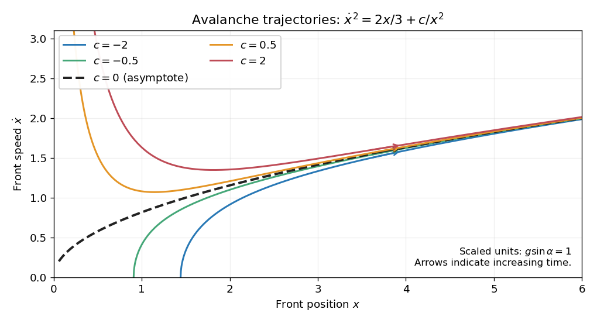

<h1 id="3e/solution">Solution</h1>

↑ **Parent:** [3E](../3e.md)

Put $A=g\sin\alpha>0$ and $v=\dot x$. Multiplying the equation by $xv$ gives

$$
\frac d{dt}\frac{(xv)^2}2=Ax^2\dot x=\frac d{dt}\frac{Ax^3}3,
$$

so its [first integral](../../../../../first-integral.md) is

$$
\boxed{x^2v^2=\frac{2A}3x^3+c},\qquad v=\sqrt{\frac{2A}3x+\frac c{x^2}}.
$$

These level curves give the positive [phase plane](../../../../../phase-plane.md) for the [avalanche front with linear mass entrainment](../../../../../avalanche-front-with-linear-mass-entrainment.md). For $c<0$, the curve starts at $v=0$, $x=(-3c/(2A))^{1/3}$ and rises. For $c>0$, it diverges as $x\downarrow0$, has a minimum at $x=(3c/A)^{1/3}$, and then rises. The $c=0$ curve is $v=\sqrt{2Ax/3}$. Forward-time arrows have increasing $x$; at a zero-velocity endpoint the equation gives $\ddot x=A>0$.

**[Figure 1](#3e/image-avalanche-phase-trajectories-approaching-the-linear-entrainment-asymptote). Avalanche phase trajectories approaching the linear-entrainment asymptote**.

Every forward-moving trajectory has $x\to\infty$: after it has entered $v>0$, a bounded limiting $x$ would force a zero of the displayed positive-branch speed ahead of it, but its only possible zero is the lower endpoint. For large $x$,

$$
\frac{v}{\sqrt{2Ax/3}}=\sqrt{1+\frac{3c}{2Ax^3}}\longrightarrow1,\qquad v-\sqrt{2Ax/3}\longrightarrow0.
$$

Expanding the equation as $x\ddot x+v^2=Ax$ and substituting the [first integral](../../../../../first-integral.md) gives

$$
\boxed{\ddot x=\frac A3-\frac c{x^3}\longrightarrow\frac13g\sin\alpha}.
$$

Thus both the asymptotic [phase plane](../../../../../phase-plane.md) trajectory and the limiting [acceleration](../../../../../acceleration.md) are independent of the initial data.

## ↑ Ancestors (10)

1. [3E](../3e.md)
2. [Paper 4](../../paper-4-split.md)
3. [Ia](../../split.md)
4. [2002](../../../split.md)
5. [Past exam of the mathematics course of the University of Cambridge](../../../../split.md)
6. [Mathematics course of the University of Cambridge](../../../../../mathematics-course-of-the-university-of-cambridge.md)
7. [Course of the University of Cambridge](../../../../../course-of-the-university-of-cambridge.md)
8. [University of Cambridge](../../../../../university-of-cambridge-split.md)
9. [List of universities](../../../../../list-of-universities.md)
10. [Codex Wiki](../../../../../split.md)
