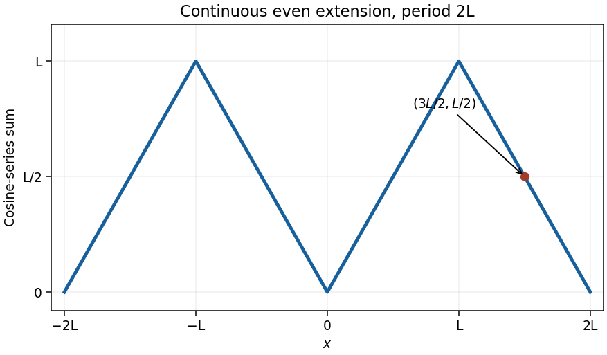

<h1 id="2a/solution">Solution</h1>

↑ **Parent:** [2A](../2a.md)

The [Fourier sine series](../../../../../fourier-sine-series.md) has coefficients

$$
b_n=\frac2L\int_0^Lx\sin\frac{n\pi x}{L}\,dx=\frac{2L}{n\pi}(-1)^{n+1},
$$

by [integration by parts](../../../../../integration-by-parts.md). Thus

$$
\boxed{x\sim\frac{2L}{\pi}\sum_{n=1}^{\infty}\frac{(-1)^{n+1}}n\sin\frac{n\pi x}{L}}.
$$

Its odd extension is $x$ on $(-L,L)$, continued with period $2L$. The usual Fourier convergence result for a piecewise smooth periodic function gives the value at a continuous point and the mean of one-sided limits at a jump. At $x=3L/2$, subtracting one period gives $-L/2$, a continuous point of this extension. Therefore the sine series converges to **$-L/2$** there.

For the [Fourier cosine series](../../../../../fourier-cosine-series.md), the even extension is $|x|$ on $[-L,L]$, continued with period $2L$. Its [triangular wave](../../../../../triangular-wave.md) is continuous even at the joining points, so the cosine series converges to that extension everywhere. On the requested interval its graph is

$$
g(x)=\begin{cases}2L+x,&-2L\leq x\leq-L,\\-x,&-L\leq x\leq0,\\x,&0\leq x\leq L,\\2L-x,&L\leq x\leq2L.\end{cases}
$$

The vertices are $(-2L,0),(-L,L),(0,0),(L,L),(2L,0)$. In particular, its value at $3L/2$ is **$L/2$**.

**[Figure 1](#2a/image-the-even-periodic-extension-represented-by-the-cosine-series). The even periodic extension represented by the cosine series**.

## ↑ Ancestors (10)

1. [2A](../2a.md)
2. [Paper 1](../../paper-1-split.md)
3. [Ib](../../split.md)
4. [2002](../../../split.md)
5. [Past exam of the mathematics course of the University of Cambridge](../../../../split.md)
6. [Mathematics course of the University of Cambridge](../../../../../mathematics-course-of-the-university-of-cambridge.md)
7. [Course of the University of Cambridge](../../../../../course-of-the-university-of-cambridge.md)
8. [University of Cambridge](../../../../../university-of-cambridge-split.md)
9. [List of universities](../../../../../list-of-universities.md)
10. [Codex Wiki](../../../../../split.md)
