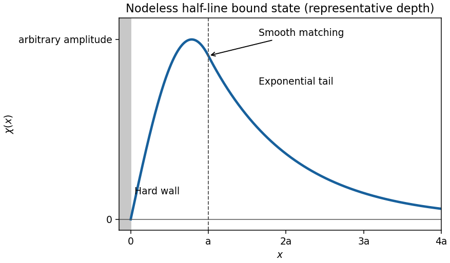

<h1 id="9d/solution">Solution</h1>

↑ **Parent:** [9D](../9d.md)

A normalizable [bound state](../../../../../bound-state.md) has $0<E<V_0$: the potential is nonnegative, while exponential decay is needed on the infinite right-hand region. Set $k=\sqrt{2mE}/\hbar$ and $\kappa=\sqrt{2m(V_0-E)}/\hbar$. The hard-wall condition and decay select

$$
\chi(x)=\begin{cases}0,&x\leq0,\\C\sin(kx),&0<x<a,\\C\sin(ka)e^{-\kappa(x-a)},&x\geq a.\end{cases}
$$

[Continuity](../../../../../continuous-function.md) at $a$ has already been used. Since the finite step contains no delta interaction, integrating the [Schrödinger equation](../../../../../schrodinger-equation.md) across it also requires derivative [continuity](../../../../../continuous-function.md). Thus $k\cos(ka)=-\kappa\sin(ka)$, giving

$$
\boxed{E=\frac{\hbar^2k^2}{2m},\qquad\tan(ka)=-\frac{k}{\sqrt{2mV_0/\hbar^2-k^2}}}.
$$

The ground-state solution uses the first branch $\pi/2<ka<\pi$ and has no internal node. It starts at zero, rises to one maximum inside the well, decreases to a positive value at $a$, and joins smoothly onto a decaying exponential tail.

**[Figure 2](#9d/image-nodeless-bound-state-in-a-finite-well-with-a-hard-wall). Nodeless bound state in a finite well with a hard wall**.

To see the precise existence condition, set $z=ka$ and $K=a\sqrt{2mV_0}/\hbar$. The first-branch matching equation gives $K=z/\sin z$ on $\pi/2<z<\pi$. This increases strictly from $\pi/2$ to infinity, since its derivative is $(\sin z-z\cos z)/\sin^2z>0$. Thus the bound ground state exists exactly when $a\sqrt{2mV_0}/\hbar>\pi/2$, or $V_0>\pi^2\hbar^2/(8ma^2)$, as in the [bound-state thresholds for a square well with one hard wall](../../../../../bound-state-thresholds-for-a-square-well-with-one-hard-wall.md). At equality $\kappa=0$ and the exterior solution is not square-integrable. Below it there is no normalizable energy eigenfunction of the requested ground-state type. The sketch assumes the binding condition and uses one representative solution, not a specified numerical well depth.

## ↑ Ancestors (10)

1. [9D](../9d.md)
2. [Paper 1](../../paper-1-split.md)
3. [Ib](../../split.md)
4. [2002](../../../split.md)
5. [Past exam of the mathematics course of the University of Cambridge](../../../../split.md)
6. [Mathematics course of the University of Cambridge](../../../../../mathematics-course-of-the-university-of-cambridge.md)
7. [Course of the University of Cambridge](../../../../../course-of-the-university-of-cambridge.md)
8. [University of Cambridge](../../../../../university-of-cambridge-split.md)
9. [List of universities](../../../../../list-of-universities.md)
10. [Codex Wiki](../../../../../split.md)
