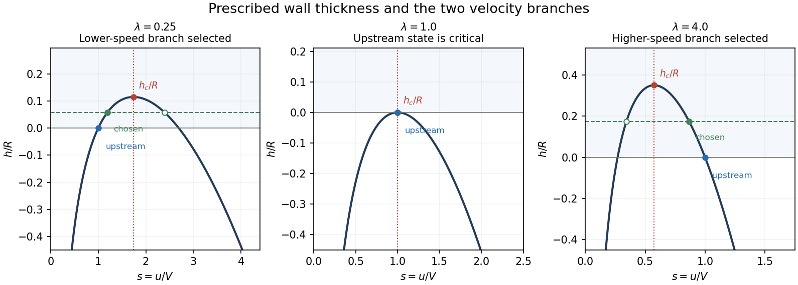

# Paper 3

↑ **Parent:** [Ib](../ib.md)

[https://www.maths.cam.ac.uk/undergrad/pastpapers/files/2002/PaperIB_3.pdf](https://www.maths.cam.ac.uk/undergrad/pastpapers/files/2002/PaperIB_3.pdf)

**Table of contents**

- [1E](#1e)
  - [Solution](#1e/solution)
- [2A](#2a)
  - [Solution](#2a/solution)
- [3G](#3g)
  - [a](#3g/a)
    - [Solution](#3g/a/solution)
  - [b](#3g/b)
    - [Solution](#3g/b/solution)
- [4E](#4e)
  - [Solution](#4e/solution)
- [5H](#5h)
  - [Solution](#5h/solution)
- [6B](#6b)
  - [Solution](#6b/solution)
- [7F](#7f)
  - [a](#7f/a)
    - [Solution](#7f/a/solution)
  - [b](#7f/b)
    - [Solution](#7f/b/solution)
  - [c](#7f/c)
    - [Solution](#7f/c/solution)
  - [d](#7f/d)
    - [Solution](#7f/d/solution)
- [8C](#8c)
  - [Solution](#8c/solution)
  - [i](#8c/i)
    - [Solution](#8c/i/solution)
  - [ii](#8c/ii)
    - [Solution](#8c/ii/solution)
- [9F](#9f)
  - [Solution](#9f/solution)
- [10D](#10d)
  - [Solution](#10d/solution)
- [11E](#11e)
  - [Solution](#11e/solution)
- [12A](#12a)
  - [Solution](#12a/solution)
- [13G](#13g)
  - [a](#13g/a)
    - [Solution](#13g/a/solution)
  - [b](#13g/b)
    - [Solution](#13g/b/solution)
  - [c](#13g/c)
    - [Solution](#13g/c/solution)
- [14E](#14e)
  - [Solution](#14e/solution)
- [15H](#15h)
  - [Solution](#15h/solution)
- [16B](#16b)
  - [a](#16b/a)
    - [Solution](#16b/a/solution)
  - [b](#16b/b)
    - [Solution](#16b/b/solution)
- [17F](#17f)
  - [Solution](#17f/solution)
- [18C](#18c)
  - [Solution](#18c/solution)
- [19F](#19f)
  - [Solution](#19f/solution)
- [20D](#20d)
  - [a](#20d/a)
    - [Solution](#20d/a/solution)
  - [b](#20d/b)
    - [Solution](#20d/b/solution)
  - [c](#20d/c)
    - [Solution](#20d/c/solution)

## 1E

↑ **Parent:** [Paper 3](paper-3.md)

<h3 id="1e/solution">Solution</h3>

↑ **Parent:** [1E](#1e)

For $t\ne0$, ordinary differentiation of the two smooth components gives

$$
\boxed{f'(t)=\bigl(2t\sin(1/t)-\cos(1/t),\ 2t\cos(1/t)+\sin(1/t)\bigr)}.
$$

At zero, use the definition of the [derivative](../../../calculus.md#derivative) in the [Euclidean norm](../../../functional-analysis.md#euclidean-norm):

$$
\left\|\frac{f(h)-f(0)}h\right\|=\|h(\sin(1/h),\cos(1/h))\|=|h|\longrightarrow0.
$$

Thus $f$ has [differentiability](../../../analysis.md#differentiability) everywhere and $\boxed{f'(0)=(0,0)}$. The two vectors $(\sin(1/t),\cos(1/t))$ and $(-\cos(1/t),\sin(1/t))$ are orthogonal unit vectors, so the squared [norm](../../../functional-analysis.md#norm) of the displayed derivative is $4t^2+1$. Consequently

$$
\boxed{\|f'(a)-f'(0)\|=\sqrt{1+4a^2}>1\qquad(a\ne0)}.
$$

This [discontinuous derivative of a differentiable plane curve](../../../analysis.md#discontinuous-derivative-of-a-differentiable-plane-curve) also shows why componentwise scalar [mean value theorem](../../../calculus.md#mean-value-theorem) conclusions do not supply a single intermediate point reproducing an entire vector-valued difference quotient.

## 2A

↑ **Parent:** [Paper 3](paper-3.md)

<h3 id="2a/solution">Solution</h3>

↑ **Parent:** [2A](#2a)

Let the mass per unit length be $m$ and the constant tension be $T$. Small transverse displacement obeys the [wave equation](../../../wave-equation.md)

$$
\boxed{m y_{tt}=T y_{xx},\qquad y_{tt}=c^2y_{xx},\quad c=\sqrt{T/m}}.
$$

With characteristic coordinates $\xi=x+ct$ and $\eta=x-ct$, the equation becomes $y_{\xi\eta}=0$. Integrating once in each variable gives [D'Alembert's formula](../../../wave-equation.md#d-alembert-s-formula)

$$
\boxed{y(x,t)=f(x+ct)+g(x-ct)}.
$$

For a smooth solution with vanishing endpoint [energy](../../../classical-mechanics.md#energy) flux, multiplication by $y_t$ and integration by parts give

$$
\frac{dE}{dt}=\int_0^\infty y_t(y_{tt}-c^2y_{xx})\,dx+[c^2y_ty_x]_0^\infty=0.
$$

The fixed endpoint has $y_t(0,t)=0$. Decay of displacement alone does not guarantee either a pointwise derivative-flux limit or finiteness of the [energy](../../../classical-mechanics.md#energy) integral; the conservation statement is understood in the usual finite-[energy](../../../classical-mechanics.md#energy) class. The profile formula below proves it directly there without requiring such a pointwise limit at infinity.

The endpoint condition gives $g(-ct)=-f(ct)$, allowing the reflected wave to be expressed through one profile:

$$
y(x,t)=f(x+ct)-f(ct-x).
$$

For forward time one may define the negative-argument part of this profile using the original $g$; no restriction on the independent initial waves is lost. Differentiation gives $y_t=c[f'(x+ct)-f'(ct-x)]$ and $y_x=f'(x+ct)+f'(ct-x)$. Hence

$$
\boxed{E=c^2\int_0^\infty\bigl[f'(x+ct)^2+f'(ct-x)^2\bigr]dx
=c^2\int_{-\infty}^{\infty}f'(s)^2\,ds}.
$$

The two substitutions partition the real line at $ct$, making [conservation of energy](../../../physics.md#conservation-of-energy) explicit.

## 3G

↑ **Parent:** [Paper 3](paper-3.md)

<h3 id="3g/a">a</h3>

↑ **Parent:** [3G](#3g)

<h4 id="3g/a/solution">Solution</h4>

↑ **Parent:** [A](#3g/a)

Take $(x_0,y_0)$ outside the [graph of a function](../../../function.md#graph-of-a-function), so $y_0\ne f(x_0)$. Since $Y$ is a [Hausdorff space](../../../topology.md#hausdorff-space), choose disjoint open neighborhoods $V$ of $y_0$ and $W$ of $f(x_0)$. [Continuity](../../../calculus.md#continuous-function) makes $U=f^{-1}(W)$ an open neighborhood of $x_0$. The product neighborhood $U\times V$ contains $(x_0,y_0)$ and cannot meet the graph, because every $f(x)$ with $x\in U$ belongs to $W$. The complement is therefore open in the [product topology](../../../geometry-and-topology.md#product-topology), proving

$$
\boxed{G_f\text{ is closed in }X\times Y}.
$$

This is the [closed graph of a map into a Hausdorff space](../../../function.md#closed-graph-of-a-map-into-a-hausdorff-space) property; no separation assumption on $X$ is required.

<h3 id="3g/b">b</h3>

↑ **Parent:** [3G](#3g)

<h4 id="3g/b/solution">Solution</h4>

↑ **Parent:** [B](#3g/b)

The map $h:X\to X\times Y$, $h(x)=(x,f(x))$, is continuous: the inverse image of a basic open set $U\times V$ is $U\cap f^{-1}(V)$. Its image is exactly the [graph of a function](../../../function.md#graph-of-a-function) $G_f$. The continuous image of a [compact space](../../../topology.md#compact-space) is compact, so

$$
\boxed{G_f=h(X)\text{ is compact}}.
$$

The [compact graph of a continuous map](../../../function.md#compact-graph-of-a-continuous-map) conclusion does not need $Y$ to be Hausdorff. In fact projection onto $X$ is a continuous inverse of $h:X\to G_f$, so the graph is homeomorphic to $X$.

## 4E

↑ **Parent:** [Paper 3](paper-3.md)

<h3 id="4e/solution">Solution</h3>

↑ **Parent:** [4E](#4e)

For a connected cellular embedding on the sphere, the [Euler formula for a connected planar graph](../../../graph-theory.md#euler-formula-for-a-connected-planar-graph) is

$$
\boxed{V-E+F=2}.
$$

The boundary graph of a convex polyhedron has such an embedding. Counting edge ends at vertices and edge sides at faces gives $\sum_{m\ge3}mV_m=2E=\sum_{n\ge3}nF_n$. Therefore

$$
\begin{aligned}
\sum_{n\ge3}(6-n)F_n&=6F-2E\\
&=6(2-V+E)-2E\\
&=12+\sum_{m\ge3}(2m-6)V_m\ge12.
\end{aligned}
$$

Faces of size six contribute zero, and larger faces contribute negatively. The contribution of each triangle, quadrilateral or pentagon is at most three, so

$$
12\le3F_3+2F_4+F_5\le3(F_3+F_4+F_5).
$$

Thus the [small faces of a spherical polyhedral graph](../../../graph-theory.md#small-faces-of-a-spherical-polyhedral-graph) bound is

$$
\boxed{F_3+F_4+F_5\ge4}.
$$

The tetrahedron shows that four is attainable. Connectedness and cellular faces are the standard hypotheses in this Euler formula; an arbitrary disconnected embedded graph has a different count.

## 5H

↑ **Parent:** [Paper 3](paper-3.md)

<h3 id="5h/solution">Solution</h3>

↑ **Parent:** [5H](#5h)

Against the two pure column strategies, player one's expected payoffs are $L_1(p)=5-2p$ and $L_2(p)=2+(b-2)p$. A [mixed strategy](../../../game-theory.md#mixed-strategy) of the opponent cannot give a smaller expectation than their minimum. The [zero-sum game](../../../game-theory.md#zero-sum-game) optimization is therefore

$$
\boxed{\max_{0\le p\le1}\min\{5-2p,\ 2+(b-2)p\}}.
$$

The first line decreases. If $0<b<2$, the second also decreases, and their minimum is maximized at $p=0$ with value $2$. If $b=2$, the second line is constantly $2$ and the first is at least $3$, so every $p$ is optimal. For $2<b\le3$, the intersection $p=3/b$ lies at or beyond the right endpoint; the minimum increases throughout $[0,1]$ and is maximized at $p=1$ with value $b$. If $b>3$, the intersection lies inside the interval; the minimum increases before it and decreases afterwards. Thus

$$
\boxed{\begin{array}{c|c|c}
b&\text{optimal }p&\text{game value}\\\hline
0<b<2&0&2\\
b=2&\text{any }p\in[0,1]&2\\
2<b\le3&1&b\\
b>3&3/b&5-6/b
\end{array}}.
$$

For the interior case the opponent can equalize row payoffs with first-column probability $(b-2)/b$, confirming the [minimax theorem](../../../game-theory.md#minimax-theorem) value.

## 6B

↑ **Parent:** [Paper 3](paper-3.md)

<h3 id="6b/solution">Solution</h3>

↑ **Parent:** [6B](#6b)

Let $p(x)=\prod_{i=0}^n(x-x_i)$ be the monic node [polynomial](../../../polynomial.md). Suppose first that the quadrature is exact through degree $2n+1$. For any [polynomial](../../../polynomial.md) $r$ of degree at most $n$, $pr$ has degree at most $2n+1$, while every sampled value is zero. Exactness gives

$$
\int_a^b p(x)r(x)\,dx=\sum_i a_i p(x_i)r(x_i)=0.
$$

Thus $p$ is an [orthogonal polynomial](../../../numerical-analysis.md#orthogonal-polynomial) of degree $n+1$, proving necessity in the [orthogonal-node criterion for Gaussian quadrature](../../../numerical-analysis.md#orthogonal-node-criterion-for-gaussian-quadrature).

Conversely, suppose the nodes are the zeros of such a [polynomial](../../../polynomial.md). Rescale it to be monic without changing its zeros or orthogonality. For any $f$ of degree at most $2n+1$, [polynomial](../../../polynomial.md) division gives

$$
f=pq+r,\qquad\deg q\le n,\quad\deg r\le n.
$$

Orthogonality makes $\int pq=0$; the quadrature of $pq$ is zero because $p(x_i)=0$. The assumed degree-$n$ exactness applies to $r$, so

$$
\int_a^b f=\int_a^b r=\sum_i a_i r(x_i)=\sum_i a_i f(x_i).
$$

Hence **degree-$2n+1$ exactness is equivalent to orthogonal nodes**. The given distinct-zero property ensures the $n+1$ node values are independent interpolation data; the degree-$n$ exactness fixes the corresponding interpolatory weights. This is the construction of [Gaussian quadrature](../../../numerical-analysis.md#gaussian-quadrature).

## 7F

↑ **Parent:** [Paper 3](paper-3.md)

<h3 id="7f/a">a</h3>

↑ **Parent:** [7F](#7f)

<h4 id="7f/a/solution">Solution</h4>

↑ **Parent:** [A](#7f/a)

**True**. Both [vector subspaces](../../../vector-space.md#vector-subspace) contain zero, and if $u,v\in U\cap W$, every [linear combination](../../../vector-space.md#linear-combination) $\alpha u+\beta v$ belongs to each of $U$ and $W$. Thus it belongs to their intersection. This proves the [intersection of vector subspaces](../../../vector-space.md#intersection-of-vector-subspaces) is a [vector subspace](../../../vector-space.md#vector-subspace).

<h3 id="7f/b">b</h3>

↑ **Parent:** [7F](#7f)

<h4 id="7f/b/solution">Solution</h4>

↑ **Parent:** [B](#7f/b)

**False**. Distinct [vector subspaces](../../../vector-space.md#vector-subspace) may be nested: in $V=\mathbb R^2$, take $U=\{0\}$ and $W=\operatorname{span}(1,0)$. Their union is $W$, a subspace. More precisely, $U\cup W$ is a subspace exactly when one is contained in the other. If neither contains the other, choose $u\in U\setminus W$ and $w\in W\setminus U$. Were $u+w$ in the union, subtracting $u$ or $w$ in the appropriate subspace would contradict those choices.

<h3 id="7f/c">c</h3>

↑ **Parent:** [7F](#7f)

<h4 id="7f/c/solution">Solution</h4>

↑ **Parent:** [C](#7f/c)

**False**. In $\mathbb R^2$ let $U=\operatorname{span}(1,1)$, $W=\operatorname{span}(1,0)$ and $X=\operatorname{span}(0,1)$. Then $W+X=\mathbb R^2$, so $U\cap(W+X)=U$, but $U\cap W=U\cap X=\{0\}$ and their sum is zero. Thus intersection need not distribute over the [sum of vector subspaces](../../../vector-space.md#sum-of-vector-subspaces). The right side is always contained in the left; this example makes the inclusion strict.

<h3 id="7f/d">d</h3>

↑ **Parent:** [7F](#7f)

<h4 id="7f/d/solution">Solution</h4>

↑ **Parent:** [D](#7f/d)

**True**. Choose a [basis](../../../vector-space.md#basis) $u_1,\ldots,u_r$ of $U$ and extend it to a [basis](../../../vector-space.md#basis) $u_1,\ldots,u_r,w_1,\ldots,w_s$ of the finite-dimensional [vector space](../../../vector-space.md) $V$. Put $W=\operatorname{span}(w_1,\ldots,w_s)$. Every [basis](../../../vector-space.md#basis) vector belongs to $U+W$, so $U+W=V$. [Linear independence](../../../vector-space.md#linear-independence) of the complete [basis](../../../vector-space.md#basis) makes a vector belonging to both spans necessarily zero. Therefore

$$
\boxed{U\cap W=\{0\},\qquad V=U\oplus W}.
$$

This constructs a [direct-sum complement](../../../vector-space.md#direct-sum-complement); it need not be unique.

## 8C

↑ **Parent:** [Paper 3](paper-3.md)

<h3 id="8c/solution">Solution</h3>

↑ **Parent:** [8C](#8c)

[Kelvin's circulation theorem](../../../fluid-mechanics.md#kelvin-s-circulation-theorem) states that a smooth inviscid barotropic fluid subject to a conservative body force preserves [circulation](../../../fluid-mechanics.md#circulation-physics) around every closed [material curve](../../../fluid-mechanics.md#material-curve). Write the [pressure](../../../thermodynamics.md#pressure) term as $\nabla w$ with $dw=dp/\rho$, and the body force per mass as $-\nabla\Phi$. Then the [Euler equations](../../../fluid-mechanics.md#euler-equations-for-an-inviscid-fluid) give $D\mathbf u/Dt=-\nabla(w+\Phi)$. For a moving parametrization $\mathbf x(s,t)$ with $\partial_t\mathbf x=\mathbf u$,

$$
\begin{aligned}
\frac d{dt}\oint_{C(t)}\mathbf u\cdot d\mathbf x
&=\oint_{C(t)}\frac{D\mathbf u}{Dt}\cdot d\mathbf x
+\oint_{C(t)}\mathbf u\cdot d\mathbf u\\
&=\oint_{C(t)}\nabla\left(\frac12u^2-w-\Phi\right)\cdot d\mathbf x=0.
\end{aligned}
$$

The last integral is the increment of a single-valued scalar around a closed curve. Consequently

$$
\boxed{\Gamma(C(t))=\Gamma(C(0))}.
$$

Constant density is a special barotropic case with $w=p/\rho$. Viscosity, nonconservative forcing or baroclinic [pressure](../../../thermodynamics.md#pressure) gradients can invalidate this conservation law; the exterior-cylinder conclusions use the smooth inviscid hypotheses.

<h3 id="8c/i">i</h3>

↑ **Parent:** [8C](#8c)

<h4 id="8c/i/solution">Solution</h4>

↑ **Parent:** [I](#8c/i)

A simple closed loop that does not surround the cylinder bounds a surface wholly in the fluid. At time zero, [Stokes theorem](../../../calculus.md#stokes-theorem) gives zero [circulation](../../../fluid-mechanics.md#circulation-physics) because its [vorticity](../../../fluid-mechanics.md#vorticity) is zero. The smooth impermeable exterior flow transports this loop without changing its winding about the obstacle. Pulling a loop at time $t$ back to time zero and using [Kelvin's circulation theorem](../../../fluid-mechanics.md#kelvin-s-circulation-theorem) therefore gives

$$
\boxed{\Gamma=0\quad\text{on nonenclosing loops}}.
$$

This is the contractible-loop case of [irrotational circulation in an exterior domain](../../../fluid-mechanics.md#irrotational-circulation-in-an-exterior-domain). Equivalently, the initially vanishing [vorticity](../../../fluid-mechanics.md#vorticity) remains zero under the inviscid barotropic [vorticity](../../../fluid-mechanics.md#vorticity) equation.

<h3 id="8c/ii">ii</h3>

↑ **Parent:** [8C](#8c)

<h4 id="8c/ii/solution">Solution</h4>

↑ **Parent:** [Ii](#8c/ii)

An enclosing loop has no spanning disk wholly inside the fluid, so initial zero [vorticity](../../../fluid-mechanics.md#vorticity) does not force its [circulation](../../../fluid-mechanics.md#circulation-physics) to vanish. [Kelvin's circulation theorem](../../../fluid-mechanics.md#kelvin-s-circulation-theorem) says only that the initial [circulation](../../../fluid-mechanics.md#circulation-physics) is retained:

$$
\boxed{\Gamma(C(t))=\Gamma(C(0)),\quad\text{possibly nonzero}}.
$$

For example $\mathbf u=\Gamma_0\mathbf e_\theta/(2\pi r)$ has zero [vorticity](../../../fluid-mechanics.md#vorticity) outside the cylinder but [circulation](../../../fluid-mechanics.md#circulation-physics) $\Gamma_0$ around a once-enclosing positively oriented loop. Any two such loops have equal [circulation](../../../fluid-mechanics.md#circulation-physics), since their difference bounds an annulus in the fluid and [Stokes theorem](../../../calculus.md#stokes-theorem) gives zero over it. More generally a loop with winding number $m$ has [circulation](../../../fluid-mechanics.md#circulation-physics) $m\Gamma_0$. Thus [irrotational flow](../../../fluid-mechanics.md#irrotational-flow) need not have a single-valued velocity potential on the whole exterior domain.

## 9F

↑ **Parent:** [Paper 3](paper-3.md)

<h3 id="9f/solution">Solution</h3>

↑ **Parent:** [9F](#9f)

A nonzero residue class $a\pmod p$ is a [quadratic residue](../../../number-theory.md#quadratic-residue) if $a\equiv x^2\pmod p$ for some nonzero $x$. If it is a square, [Fermat's little theorem](../../../number-theory.md#fermat-little-theorem) gives $a^{(p-1)/2}=x^{p-1}\equiv1$. Conversely, the map $x\mapsto x^2$ on the nonzero classes identifies exactly the pairs $\{x,-x\}$, giving $(p-1)/2$ distinct squares. They are all roots of $X^{(p-1)/2}-1$ over the field $\mathbb F_p$; a [polynomial](../../../polynomial.md) of this degree has at most that many roots. Its roots are therefore precisely the squares. This proves [Euler's criterion](../../../number-theory.md#euler-s-criterion)

$$
\boxed{a\text{ is a nonzero quadratic residue }\iff a^{(p-1)/2}\equiv1\pmod p}.
$$

Applying it to $-1$ gives $\boxed{(-1/p)=1\iff p\equiv1\pmod4}$. The exclusion of $a=0$ is the usual nonzero-residue convention needed for this equivalence.

For distinct odd [primes](../../../number-theory.md#prime-number) $p,q$, [quadratic reciprocity](../../../number-theory.md#quadratic-reciprocity) states

$$
\boxed{\left(\frac pq\right)\left(\frac qp\right)=(-1)^{(p-1)(q-1)/4}}.
$$

Using the multiplicativity of the [Legendre symbol](../../../number-theory.md#legendre-symbol), and the supplementary law $(2/p)=(-1)^{(p^2-1)/8}$,

$$
\left(\frac{73}{127}\right)=\left(\frac{127}{73}\right)
=\left(\frac{54}{73}\right)
=\left(\frac2{73}\right)\left(\frac3{73}\right).
$$

The first factor is $1$ because $73\equiv1\pmod8$; the second is $(73/3)=(1/3)=1$ because the reciprocity sign is positive. Thus $\boxed{73\text{ is a quadratic residue modulo }127}$.

## 10D

↑ **Parent:** [Paper 3](paper-3.md)

<h3 id="10d/solution">Solution</h3>

↑ **Parent:** [10D](#10d)

For a primed inertial frame moving at speed $v$ along the positive $x$ direction relative to the unprimed frame, a [Lorentz transformation](../../../special-relativity.md#lorentz-transformation) is

$$
\boxed{x'=\gamma_v(x-vt),\qquad t'=\gamma_v\left(t-\frac{vx}{c^2}\right),\qquad
\gamma_v=(1-v^2/c^2)^{-1/2}}.
$$

The inverse has the opposite velocity. To avoid confusing the train speed with the ball speed, now use the primed frame for the train and write the inverse boost with train speed $u$:

$$
x=\gamma_u(x'+ut'),\qquad t=\gamma_u(t'+ux'/c^2).
$$

The ball has $dx'/dt'=v$ on the train, so differentiation along its worldline gives the [velocity-addition formula](../../../special-relativity.md#velocity-addition-formula)

$$
\boxed{\frac{dx}{dt}=\frac{u+v}{1+uv/c^2}}.
$$

The time transformation is essential; simply adding the two speeds uses the Galilean rather than Lorentz relation. For positive subluminal $u,v$, the result remains below $c$, since $1+uv/c^2-(u+v)/c=(1-u/c)(1-v/c)>0$.

## 11E

↑ **Parent:** [Paper 3](paper-3.md)

<h3 id="11e/solution">Solution</h3>

↑ **Parent:** [11E](#11e)

The function $\phi(t)=t/(1+t)$ increases for $t\ge0$, and

$$
\phi(b)+\phi(c)=\frac b{1+b}+\frac c{1+c}
\ge\frac b{1+b+c}+\frac c{1+b+c}=\phi(b+c).
$$

Thus $a\le b+c$ implies $\boxed{\phi(a)\le\phi(b)+\phi(c)}$. Applying this to the triangle inequality for a [metric](../../../topological-analysis.md#metric) proves the triangle inequality for the [bounded metric transform](../../../topological-analysis.md#bounded-metric-transform) $d_b=\phi\circ d$. Symmetry and nonnegativity are immediate, and $d_b(x,y)=0$ exactly when $d(x,y)=0$, so $\boxed{d_b\text{ is a metric}}$.

Each $K_n$ is compact and lies inside $D$, so the [supremum norm](../../../functional-analysis.md#supremum-norm) $\|f-g\|_n$ is finite for continuous $f,g$. Every summand of $\sigma$ lies between zero and $2^{-n}$, giving absolute convergence and $0\le\sigma\le1/2$. Symmetry is inherited from these norms. If $\sigma(f,g)=0$, all the nonnegative summands vanish, hence $f=g$ on every $K_n$; their union is $D$, so $f=g$ everywhere. Finally

$$
\|f-h\|_n\le\|f-g\|_n+\|g-h\|_n
$$

and the subadditivity already proved give the triangle inequality term by term and then after summation. Therefore $\boxed{\sigma\text{ is a metric on }\mathcal F}$. This is a [weighted metric for local uniform convergence](../../../real-analysis.md#weighted-metric-for-local-uniform-convergence), representing the [compact-open topology](../../../real-analysis.md#compact-open-topology).

The geometric-series sum is $s(z)=1/(1-z)$ and its remainder is $s-s_k=z^{k+1}/(1-z)$. Writing $r_n=1-1/n$, the triangle inequality gives

$$
\left|\frac{z^{k+1}}{1-z}\right|\le\frac{r_n^{k+1}}{1-r_n}=n r_n^{k+1}\qquad(|z|\le r_n).
$$

Equality occurs at the positive real point $z=r_n$. Thus

$$
\boxed{\|s_k-s\|_n=n(1-1/n)^{k+1}}.
$$

For every integer $N\ge2$, split the defining sum into a finite head and its tail. Since $\phi(t)\le t$ and $\phi(t)\le1$,

$$
\boxed{\sigma(s_k,s)\le\sum_{n=2}^{N}\|s_k-s\|_n+\sum_{n>N}2^{-n}
=\sum_{n=2}^{N}\|s_k-s\|_n+2^{-N}}.
$$

Given $\varepsilon>0$, choose $N$ with $2^{-N}<\varepsilon/2$. For that fixed $N$, each of the finitely many displayed norms tends to zero, so their sum is below $\varepsilon/2$ for sufficiently large $k$. Hence $\boxed{\sigma(s_k,s)\to0}$, even though convergence is not uniform on the whole open disk.

## 12A

↑ **Parent:** [Paper 3](paper-3.md)

<h3 id="12a/solution">Solution</h3>

↑ **Parent:** [12A](#12a)

Use the weighted [inner product](../../../linear-algebra.md#inner-product) $\langle u,v\rangle_r=\int_a^b r(x)u(x)v(x)\,dx$. For real [eigenfunctions](../../../linear-operator-theory.md#eigenfunction), integration by parts with the zero endpoint values gives

$$
\int_a^b y_m\mathcal Ly_n\,dx
=\int_a^b[p y_m'y_n'+q y_my_n]dx
=\int_a^b y_n\mathcal Ly_m\,dx.
$$

Thus $(\lambda_n-\lambda_m)\langle y_m,y_n\rangle_r=0$. The regular separated [Sturm-Liouville problem](../../../analysis.md#sturm-liouville-problem) has simple [eigenvalues](../../../linear-operator-theory.md#eigenvalue): for a fixed [eigenvalue](../../../linear-operator-theory.md#eigenvalue), prescribing $y(a)=0$ leaves only the initial flux $p(a)y'(a)$ free, so uniqueness of the associated first-order system makes any two [eigenfunctions](../../../linear-operator-theory.md#eigenfunction) proportional. Distinct [eigenfunctions](../../../linear-operator-theory.md#eigenfunction) are therefore orthogonal, and choosing their signs and scales so that $\int r y_n^2=1$ gives

$$
\boxed{\langle y_m,y_n\rangle_r=\delta_{mn}}.
$$

The positive [energy](../../../classical-mechanics.md#energy) form $\int(p y'^2+q y^2)$ realizes $r^{-1}\mathcal L$ as a positive self-adjoint operator in this weighted space, with compact inverse on the bounded interval. The [spectral theorem for compact self-adjoint operators](../../../compact-operator.md#spectral-theorem-for-compact-hermitian-operators) supplies a complete eigenbasis. This is the standard regular [Sturm-Liouville eigenfunction expansion](../../../analysis.md#sturm-liouville-eigenfunction-expansion), also valid with continuous $p$ by working with the continuous flux $py'$.

For a source $F$, expand a zero-endpoint solution of $(\mathcal L-\mu r)y=F$ in that [basis](../../../vector-space.md#basis). Multiplication by $y_n$ and unweighted integration give

$$
(\lambda_n-\mu)\langle y_n,y\rangle_r=\int_a^b y_n(\xi)F(\xi)\,d\xi.
$$

Since $\mu$ is not an [eigenvalue](../../../linear-operator-theory.md#eigenvalue), every coefficient is determined. The [spectral Green function of a regular Sturm-Liouville problem](../../../analysis.md#spectral-green-function-of-a-regular-sturm-liouville-problem) is consequently

$$
\boxed{G_\mu(x,\xi)=\sum_{n=1}^\infty\frac{y_n(x)y_n(\xi)}{\lambda_n-\mu}}.
$$

Weighted completeness means $r(x)\sum_n y_n(x)y_n(\xi)=\delta(x-\xi)$ as a distribution, so applying $\mathcal L-\mu r$ to this series produces the required delta source. The source integration is with $d\xi$, explaining the absence of an additional factor $r(\xi)$ in the stated kernel.

For the subsequent operator $L=d^2/dx^2$ the sign is explicitly reversed: $y_n=\sqrt{2/\pi}\sin(nx)$ and $\lambda_n=-n^2$. To cover every real non-[eigenvalue](../../../linear-operator-theory.md#eigenvalue) $\mu$, define the homogeneous solution

$$
S_\mu(x)=\begin{cases}\sinh(\sqrt\mu\,x)/\sqrt\mu,&\mu>0,\\x,&\mu=0,\\\sin(\sqrt{-\mu}\,x)/\sqrt{-\mu},&\mu<0.\end{cases}
$$

It satisfies $S_\mu(0)=0$, $S_\mu'(0)=1$ and $S_\mu''=\mu S_\mu$. Matching the two endpoint solutions continuously at $x=\xi$ with derivative jump $G_x(\xi^+,\xi)-G_x(\xi^-,\xi)=1$ yields

$$
\boxed{G_\mu(x,\xi)=-\frac{S_\mu(x_<)S_\mu(\pi-x_>)}{S_\mu(\pi)},\qquad
x_<=\min(x,\xi),\quad x_>=\max(x,\xi)}.
$$

The denominator is nonzero precisely off the Dirichlet [eigenvalues](../../../linear-operator-theory.md#eigenvalue) $\mu=-n^2$. In particular $G_0=-x_<(\pi-x_>)/\pi$. At $x=\xi=\pi/2$, its spectral expansion gives

$$
-\frac\pi4=-\frac2\pi\sum_{n=1}^\infty\frac{\sin^2(n\pi/2)}{n^2}
=-\frac2\pi\sum_{j=0}^\infty\frac1{(2j+1)^2}.
$$

This [odd reciprocal-square sum from a Dirichlet Green function](../../../analysis.md#odd-reciprocal-square-sum-from-a-dirichlet-green-function) proves $\boxed{\sum_{j=0}^\infty(2j+1)^{-2}=\pi^2/8}$.

## 13G

↑ **Parent:** [Paper 3](paper-3.md)

<h3 id="13g/a">a</h3>

↑ **Parent:** [13G](#13g)

<h4 id="13g/a/solution">Solution</h4>

↑ **Parent:** [A](#13g/a)

For $0\le t\le1$, put $F_t=f+tg$. On the curve, $|F_t|\ge|f|-t|g|>0$, so no member of this homotopy has a boundary zero. The [argument principle](../../../complex-analysis.md#argument-principle) counts the interior zeros, with [multiplicity](../../../polynomial.md#multiplicity-mathematics), by its winding number $N(t)=\operatorname{wind}(F_t\circ\gamma,0)$. For a piecewise smooth curve this is

$$
N(t)=\frac1{2\pi i}\int_\gamma\frac{F_t'(z)}{F_t(z)}\,dz.
$$

There are no poles, and the null-homotopy of the Jordan curve in the domain permits this interior count. The loops $F_t\circ\gamma$ form a continuous homotopy avoiding zero, so their integer winding number stays constant. Equivalently, for a piecewise smooth curve the integral varies continuously with $t$ and is integer-valued. In particular

$$
\boxed{N(f)=N(f+g)}.
$$

This proves [Rouché's theorem](../../../complex-analysis.md#rouche-s-theorem). The counting is with [multiplicity](../../../polynomial.md#multiplicity-mathematics) and assumes the usual positive orientation; reversing orientation reverses both winding counts without changing the conclusion.

<h3 id="13g/b">b</h3>

↑ **Parent:** [13G](#13g)

<h4 id="13g/b/solution">Solution</h4>

↑ **Parent:** [B](#13g/b)

The function is holomorphic on a neighborhood of the closed unit disk. On $|z|=1$, the mapping assumption gives $|g(z)|<1=|z|$. Apply [Rouché's theorem](../../../complex-analysis.md#rouche-s-theorem) to $z$ and $-g(z)$. Their sum $z-g(z)$ has the same number of interior zeros as $z$, namely one counting [multiplicity](../../../polynomial.md#multiplicity-mathematics). Thus

$$
\boxed{g\text{ has exactly one fixed point in }|z|<1}.
$$

The zero is simple since its total [multiplicity](../../../polynomial.md#multiplicity-mathematics) is one. No boundary [fixed point](../../../function.md#fixed-point) is possible because $g$ maps the boundary strictly inside.

<h3 id="13g/c">c</h3>

↑ **Parent:** [13G](#13g)

<h4 id="13g/c/solution">Solution</h4>

↑ **Parent:** [C](#13g/c)

For nonnegative integers $m,n$, put $B(z)=z^m[(z-a)/(1-\bar a z)]^n$. Since $|a|<1$, the denominator has no zero on or inside the unit circle. On $|z|=1$,

$$
|z-a|^2=1-z\bar a-\bar z a+|a|^2=|1-\bar a z|^2,
$$

so $|B(z)|=1$. Consequently $|-a|<|B(z)|$, and [Rouché's theorem](../../../complex-analysis.md#rouche-s-theorem) gives the same interior zero count for $B-a$ as for $B$. The latter has $m$ zeros at zero and $n$ at $a$, with the multiplicities combining when $a=0$. Therefore

$$
\boxed{B(z)-a\text{ has }m+n\text{ zeros in }|z|<1\text{, counting multiplicity}}.
$$

This is the [interior zero count for a finite Blaschke product minus a constant](../../../complex-analysis.md#interior-zero-count-for-a-finite-blaschke-product-minus-a-constant). If $m+n=0$, the nonzero constant $1-a$ has zero zeros, so the same conclusion includes that endpoint case.

## 14E

↑ **Parent:** [Paper 3](paper-3.md)

<h3 id="14e/solution">Solution</h3>

↑ **Parent:** [14E](#14e)

Let $b=f(0)$ and $g(x)=f(x)-b$. Distance preservation and polarization give $\langle g(x),g(y)\rangle=\langle x,y\rangle$. The vectors $g(e_1),g(e_2),g(e_3)$ form an orthonormal [basis](../../../vector-space.md#basis), and $\langle g(x),g(e_i)\rangle=x_i$. Hence $g(x)=\sum_i x_i g(e_i)=Qx$ for an orthogonal [matrix](../../../vector-space.md#matrix) $Q$. Every [Euclidean isometry](../../../riemannian-geometry.md#euclidean-isometry) is therefore $f(x)=Qx+b$.

To decompose $Q$, if $Qe_1\ne e_1$ reflect in the origin plane normal to $Qe_1-e_1$. This reflection sends $Qe_1$ to $e_1$. The remaining orthogonal transformation fixes $e_1$ and acts on its two-dimensional orthogonal complement; repeat with $e_2$, and then on the last one-dimensional complement. At most three plane [reflections](../../../linear-algebra.md#reflection-mathematics) are needed. A translation $x\mapsto x+b$ is itself a product of two reflections in parallel planes: for $\mathbf n=b/|b|$, reflecting first in $\mathbf n\cdot x=0$ and then in $\mathbf n\cdot x=|b|/2$ gives that translation. Thus every isometry is a finite composition of plane reflections, the [finite reflection decomposition of a Euclidean isometry](../../../riemannian-geometry.md#finite-reflection-decomposition-of-a-euclidean-isometry).

For an isometry fixing zero, the preceding construction gives $N\le3$. A plane reflection's linear part has $\operatorname{rank}(I-R)=1$. The identity $I-AB=(I-A)+A(I-B)$ implies that a product of $m$ such linear parts has rank of $I-Q$ at most $m$, even if the reflecting planes are affine. For central inversion $Q=-I$, this rank is three. The [reflection length of a Euclidean orthogonal map](../../../riemannian-geometry.md#reflection-length-of-a-euclidean-orthogonal-map) therefore gives

$$
\boxed{N=3,\qquad x\mapsto-x\text{ requires three reflections}}.
$$

For the regular tetrahedron, center it at zero. Every permutation of its four vertices determines an isometry, and the orientation-reversing ones correspond to odd permutations in $S_4$: six transpositions and six four-cycles. Each transposition is a plane reflection fixing the two unswapped vertices; its plane contains their edge and the midpoint of the opposite edge. These give six distinct mirror planes.

The other six are rotoreflections: rotate by $+\pi/2$ or $-\pi/2$ about an axis through the midpoints of a pair of opposite edges, and then reflect in the plane through the center perpendicular to that axis. There are three axes and two senses. For vertices $(1,1,1),(1,-1,-1),(-1,1,-1),(-1,-1,1)$, the map $(x,y,z)\mapsto(-y,x,-z)$ is one such four-cycle; the other axes and inverse rotations give all six. Hence the complete orientation-reversing [tetrahedral symmetry](../../../finite-group-theory.md#tetrahedral-symmetry) list is **six mirror reflections and six quarter-turn rotoreflections**.

## 15H

↑ **Parent:** [Paper 3](paper-3.md)

<h3 id="15h/solution">Solution</h3>

↑ **Parent:** [15H](#15h)

Introduce surplus variables $s_1,s_2$, slack $s_3$, and artificial variables $a_1,a_2$, all nonnegative. The [two-phase simplex](../../../mathematical-optimization.md#two-phase-simplex) standard-form equations are

$$
x_1-x_2-s_1+a_1=1,\qquad
4x_1-x_2-s_2+a_2=10,\qquad x_2+s_3=6.
$$

Phase I maximizes $w=-a_1-a_2$. An initial [basic feasible solution](../../../mathematical-optimization.md#basic-feasible-solution) has basic variables $(a_1,a_2,s_3)=(1,10,6)$ and all others zero. Its [simplex dictionary](../../../numerical-analysis.md#simplex-dictionary) is

$$
a_1=1-x_1+x_2+s_1,\qquad a_2=10-4x_1+x_2+s_2,\qquad s_3=6-x_2,
\qquad w=-11+5x_1-2x_2-s_1-s_2.
$$

Let $x_1$ enter. The [simplex ratio test](../../../mathematical-optimization.md#simplex-ratio-test) gives $1$ from the $a_1$ row and $10/4$ from the $a_2$ row, so $a_1$ leaves. After this pivot,

$$
x_1=1+x_2+s_1-a_1,\quad a_2=6-3x_2-4s_1+4a_1+s_2,\quad s_3=6-x_2,
\quad w=-6+3x_2+4s_1-5a_1-s_2.
$$

Choose $x_2$ to enter; the limiting ratios are $6/3=2$ and $6$, so $a_2$ leaves. The resulting dictionary is

$$
\begin{aligned}
x_1&=3-\tfrac13s_1+\tfrac13s_2+\tfrac13a_1-\tfrac13a_2,\\
x_2&=2-\tfrac43s_1+\tfrac13s_2+\tfrac43a_1-\tfrac13a_2,\\
s_3&=4+\tfrac43s_1-\tfrac13s_2-\tfrac43a_1+\tfrac13a_2,\\
w&=-a_1-a_2.
\end{aligned}
$$

Thus $\boxed{w_{\max}=0}$, attained at $(x_1,x_2,s_3)=(3,2,4)$ with $s_1=s_2=a_1=a_2=0$. Since $w\le0$ for every feasible Phase I point, this proves feasibility and completes Phase I.

Delete the artificial variables and restore the original objective $z=-2x_1+3x_2$. The resulting Phase II dictionary is

$$
x_1=3-\tfrac13s_1+\tfrac13s_2,\quad x_2=2-\tfrac43s_1+\tfrac13s_2,
\quad s_3=4+\tfrac43s_1-\tfrac13s_2,\quad z=-\tfrac{10}3s_1+\tfrac13s_2.
$$

Let $s_2$ enter; only $s_3$ decreases, and it reaches zero at $s_2=12$. Pivoting gives

$$
\boxed{x_1=7+s_1-s_3,\quad x_2=6-s_3,\quad s_2=12+4s_1-3s_3,\quad z=4-2s_1-s_3}.
$$

An optimal [simplex tableau](../../../mathematical-optimization.md#simplex-tableau), with each row recording its equality, is

$$
\begin{array}{c|rrrrr|r}
\text{basic}&x_1&x_2&s_1&s_2&s_3&\text{right side}\\\hline
x_1&1&0&-1&0&1&7\\
x_2&0&1&0&0&1&6\\
s_2&0&0&-4&1&3&12\\\hline
z&0&0&2&0&1&4
\end{array}.
$$

Both reduced costs in the maximization dictionary are negative. Setting nonbasic $s_1=s_3=0$ therefore gives

$$
\boxed{(x_1,x_2)=(7,6),\qquad z_{\max}=4}.
$$

As a direct optimality check, $x_1\ge1+x_2$ implies $z\le-2+x_2\le4$; the displayed point attains both equalities.

## 16B

↑ **Parent:** [Paper 3](paper-3.md)

<h3 id="16b/a">a</h3>

↑ **Parent:** [16B](#16b)

<h4 id="16b/a/solution">Solution</h4>

↑ **Parent:** [A](#16b/a)

Since every [eigenvalue](../../../linear-operator-theory.md#eigenvalue) has modulus less than one, $1$ is not an [eigenvalue](../../../linear-operator-theory.md#eigenvalue) and $I-H$ is invertible. Hence the iteration has a unique [fixed point](../../../function.md#fixed-point) $\widehat x=(I-H)^{-1}v$. The stated consistency implication gives $A\widehat x=b$, and nonsingularity of $A$ identifies $\widehat x=x^*$. This justifies using the fixed-point relation even though consistency was stated in only one direction.

Expand the initial error in the eigenvector [basis](../../../vector-space.md#basis), $x^0-x^*=\sum_i c_iw_i$. Subtract the fixed-point equation from the [stationary iterative method for a linear system](../../../numerical-analysis.md#stationary-iterative-method-for-a-linear-system) and iterate:

$$
x^k-x^*=H^k(x^0-x^*)=\sum_{i=1}^n c_i\lambda_i^k w_i.
$$

With $q=\max_i|\lambda_i|<1$, any [norm](../../../functional-analysis.md#norm) obeys $\|x^k-x^*\|\le q^k\sum_i|c_i|\|w_i\|\to0$. Thus

$$
\boxed{x^k\longrightarrow x^*\quad\text{for every initial vector}}.
$$

The argument uses the given diagonalizable eigenbasis; the more general convergence criterion is [spectral radius](../../../analysis.md#spectral-radius) less than one.

<h3 id="16b/b">b</h3>

↑ **Parent:** [16B](#16b)

<h4 id="16b/b/solution">Solution</h4>

↑ **Parent:** [B](#16b/b)

Write $A=D+L+U$, with $D$ diagonal, and use only old iterates on the right side. The [Jacobi method](../../../numerical-analysis.md#jacobi-method) is

$$
\boxed{x_i^{k+1}=\frac1{a_{ii}}\left(b_i-\sum_{j\ne i}a_{ij}x_j^k\right),\qquad
x^{k+1}=-D^{-1}(L+U)x^k+D^{-1}b}.
$$

Strict row diagonal dominance ensures every $a_{ii}\ne0$. The exact solution satisfies the same coordinate relation. For $e^k=x^k-x^*$, subtraction gives

$$
|e_i^{k+1}|\le\frac{\sum_{j\ne i}|a_{ij}|}{|a_{ii}|}\|e^k\|_\infty
\le\gamma\|e^k\|_\infty.
$$

Taking the maximum and iterating proves

$$
\boxed{\|x^k-x^*\|_\infty\le\gamma^k\|x^0-x^*\|_\infty\longrightarrow0}.
$$

This direct contraction proof requires no eigenvector assumption and applies to every strictly diagonally dominant [matrix](../../../vector-space.md#matrix) with the stated uniform $\gamma<1$.

## 17F

↑ **Parent:** [Paper 3](paper-3.md)

<h3 id="17f/solution">Solution</h3>

↑ **Parent:** [17F](#17f)

Over a commutative field, define the [determinant](../../../linear-algebra.md#determinant) by the signed permutation sum

$$
\boxed{\det A=\sum_{\sigma\in S_n}\operatorname{sgn}(\sigma)\prod_{i=1}^n a_{i,\sigma(i)}}.
$$

It is linear in each row separately. Swapping two rows reindexes the permutations by a transposition and reverses the sign; thus a [matrix](../../../vector-space.md#matrix) with two equal rows has [determinant](../../../linear-algebra.md#determinant) zero. Adding $c$ times row $i$ to a different row $j$ consequently gives

$$
\det A'=\det A+c\det(\text{matrix with row }j\text{ replaced by row }i)=\det A.
$$

These are immediate consequences of the definition, not assumptions about elementary row operations.

For the block upper-triangular [matrix](../../../vector-space.md#matrix), a nonzero permutation term must assign every bottom row to one of the last $n$ columns, because its first $n$ entries are zero. Those rows use all the last columns; the top rows must use all the first columns. The sign and products factor into two independent $n$-permutations, giving

$$
\boxed{\det\begin{pmatrix}A&B\\0&C\end{pmatrix}=\det A\det C}.
$$

In particular $X_0=\begin{pmatrix}B&I\\0&A\end{pmatrix}$ has [determinant](../../../linear-algebra.md#determinant) $\det B\det A$. For each bottom row $n+i$, subtract $a_{ij}$ times top row $j$ for $j=1,\ldots,n$. The top rows remain unchanged, so these additions produce

$$
X_1=\begin{pmatrix}B&I\\-AB&0\end{pmatrix}
$$

without changing the [determinant](../../../linear-algebra.md#determinant). Exchange its first and last blocks of $n$ columns; the permutation has sign $(-1)^{n^2}$ and gives $\begin{pmatrix}I&B\\0&-AB\end{pmatrix}$. Hence

$$
(-1)^{n^2}\det X_1=\det(-AB)=(-1)^n\det(AB).
$$

Since $n^2$ and $n$ have the same parity, $\det X_1=\det(AB)$. Combining the two evaluations proves

$$
\boxed{\det(AB)=\det A\det B}.
$$

No invertibility of $A$ or $B$ was used, so the proof includes singular [matrices](../../../vector-space.md#matrix).

## 18C

↑ **Parent:** [Paper 3](paper-3.md)

<h3 id="18c/solution">Solution</h3>

↑ **Parent:** [18C](#18c)

For steady uniform-density inviscid flow with no body force, the [Euler equations](../../../fluid-mechanics.md#euler-equations-for-an-inviscid-fluid) read $(\mathbf u\cdot\nabla)\mathbf u=-\nabla p/\rho$. Dotting with $\mathbf u$ gives

$$
\mathbf u\cdot\nabla\left(\frac12u^2+\frac p\rho\right)=0.
$$

Thus the [Bernoulli equation](../../../fluid-mechanics.md#bernoulli-equation) states that $u^2/2+p/\rho$ is constant along each [streamline](../../../fluid-mechanics.md#streamline); the constants need not be the same on unrelated [streamlines](../../../fluid-mechanics.md#streamline).

In the slowly varying tube approximation, mass conservation gives $\pi(r-h)^2u=\pi R^2V$, so $r-h=R\sqrt{V/u}$. The upstream Bernoulli constant and the wall [pressure](../../../thermodynamics.md#pressure) law give

$$
p-p_0=\frac\rho2(V^2-u^2)=k(r-R),\qquad
\frac rR=1+\frac\lambda4\left[1-(u/V)^2\right],\quad\lambda=\frac{2\rho V^2}{kR}.
$$

Subtracting the internal radius obtains

$$
\boxed{\frac hR=H(s)=1-s^{-1/2}+\frac\lambda4(1-s^2),\qquad s=u/V>0}.
$$

This is [choking by wall thickness in an elastic tube](../../../fluid-mechanics.md#choking-by-wall-thickness-in-an-elastic-tube). The function tends to $-\infty$ as either $s\downarrow0$ or $s\to\infty$, and $H(1)=0$. Its derivative is

$$
H'(s)=\frac12s^{-3/2}-\frac\lambda2s,
\qquad H'(s)=0\iff s=s_c=\lambda^{-2/5}.
$$

It is positive before $s_c$ and negative afterwards, so the unique maximum is

$$
\boxed{\frac{h_c(\lambda)}R=H(s_c)=1+\frac\lambda4-\frac54\lambda^{1/5},\qquad
u_c=V\lambda^{-2/5}}.
$$

The maximum is nonnegative because the arithmetic-geometric mean inequality gives $4+\lambda\ge5\lambda^{1/5}$; it is zero only at $\lambda=1$. If any prescribed thickness exceeds $h_c$, no positive velocity can satisfy the mass/Bernoulli conditions there, so no flow of this assumed form is possible. Equality is the double-root critical case.

For each $h<h_c$, strict monotonicity on $(0,s_c)$ and $(s_c,\infty)$, together with the two negative-infinite limits, gives exactly two positive roots. The upstream condition is $s\to1$ as $h\to0$. Therefore

$$
\boxed{\begin{array}{c|c|c}
\lambda&\text{selected root}&\text{response to increasing }h\\\hline
0<\lambda<1&s<s_c&u>V\text{ increases}\\
\lambda>1&s>s_c&u<V\text{ decreases}
\end{array}}.
$$

For $\lambda<1$, the upstream value $1$ lies on the rising branch; for $\lambda>1$, it lies on the falling branch. Smooth continuation preserves this choice because the branches meet only at $h_c$, which is excluded by the strict bound. At $\lambda=1$ the upstream state is already critical: $h_c=0$, so the requirement $0\le h<h_c$ cannot hold, and any positive wall thickness is incompatible with the approximation. With $h=0$ the critical root is $u=V$.

**[Figure 1](#18c/image-velocity-branches-and-critical-wall-thickness-for-steady-flow-through-an-elastic-tube). Velocity branches and critical wall thickness for steady flow through an elastic tube**.

The graph shows the unique maximum and the upstream point $(s,H)=(1,0)$ on the three parameter regimes. Only the portion with $H\ge0$ represents nonnegative wall thickness. The vertical maximum line separates the two roots when the prescribed thickness lies strictly below the maximum.

## 19F

↑ **Parent:** [Paper 3](paper-3.md)

<h3 id="19f/solution">Solution</h3>

↑ **Parent:** [19F](#19f)

Use the standard reduced-form convention $|b|\le a\le c$, with $b\ge0$ when $|b|=a$ or $a=c$. To reduce a positive definite integral [binary quadratic form](../../../number-theory.md#binary-quadratic-form), choose a primitive integer vector at which the positive integer value is least. Complete that vector to a unimodular [basis](../../../vector-space.md#basis); it makes the leading coefficient $a$ that least value. A shear of the second [basis](../../../vector-space.md#basis) vector by an integer multiple of the first replaces $b$ by $b+2ka$, allowing $|b|\le a$. The new $c$ is the value at another primitive vector, hence $c\ge a$. If $b=-a$, a shear makes $b=a$ without changing $a,c$; if $a=c$ and $b<0$, the [determinant](../../../linear-algebra.md#determinant)-one swap $(x,y)\mapsto(-y,x)$ reverses its sign. Thus every form is properly equivalent to a [reduced positive definite binary quadratic form](../../../number-theory.md#reduced-positive-definite-binary-quadratic-form). This argument also gives the [reduction algorithm for a positive definite binary quadratic form](../../../number-theory.md#reduction-algorithm-for-a-positive-definite-binary-quadratic-form) by successively decreasing its positive leading coefficient.

For a negative integral discriminant $d\equiv0$ or $1\pmod4$, a [prime](../../../number-theory.md#prime-number) $p$ is represented by some integral form of discriminant $d$ exactly when

$$
\boxed{b^2\equiv d\pmod{4p}\text{ is soluble}}.
$$

Indeed a representing vector is primitive, since a common divisor of its coordinates would have its square divide $p$. A unimodular change takes it to the first [basis](../../../vector-space.md#basis) vector, giving a form $[p,b,c]$ and $d=b^2-4pc$. Conversely a solution $b$ gives the positive definite form $[p,b,(b^2-d)/(4p)]$, which represents $p$ at $(1,0)$. For odd $p$ this is the [discriminant criterion for prime representation by a binary quadratic form](../../../number-theory.md#discriminant-criterion-for-prime-representation-by-a-binary-quadratic-form): $d$ must be a square modulo $p$, with parity chosen to satisfy the modulo-four condition.

For $d=-32$ and odd $p$, the [Legendre symbol](../../../number-theory.md#legendre-symbol) is $(-32/p)=(-2/p)=(-1/p)(2/p)$. The supplementary laws make it positive exactly for $p\equiv1,3\pmod8$. The [prime](../../../number-theory.md#prime-number) $2$ also works directly, since $[2,0,4]$ has discriminant $-32$ and represents $2$. Therefore

$$
\boxed{p\text{ is represented by some form of discriminant }-32
\iff p\equiv1,2,3\pmod8}.
$$

The class $2\pmod8$ here consists only of the [prime](../../../number-theory.md#prime-number) $2$.

For a reduced form, $32=4ac-b^2\ge3a^2$, so $a\le3$. The integer checks yield the [reduced forms of discriminant minus thirty-two](../../../number-theory.md#reduced-forms-of-discriminant-minus-thirty-two):

$$
\boxed{[1,0,8],\qquad[2,0,4],\qquad[3,2,3]}.
$$

If one omits the boundary sign convention, $[3,-2,3]$ also appears, but is properly equivalent to $[3,2,3]$. The middle form is imprimitive and represents no odd integer. An odd integer represented by $x^2+8y^2$ has $x$ odd and is $1\pmod8$. For $3x^2+2xy+3y^2$ to be odd, one of $x,y$ must be odd and the other even; substitution modulo eight gives $3\pmod8$ in either case. If both are odd or both even, the value is even. Thus a [prime](../../../number-theory.md#prime-number) represented by the last form is necessarily $3\pmod8$.

Conversely, a [prime](../../../number-theory.md#prime-number) $p\equiv3\pmod8$ is represented by some discriminant-$-32$ form, which reduces to one of the three displayed forms without changing its represented integers. The first and second cannot represent it, so the third must. Consequently

$$
\boxed{p=3x^2+2xy+3y^2\text{ for integers }x,y\iff p\equiv3\pmod8}.
$$

The [prime](../../../number-theory.md#prime-number) $2$ is not an exception for this particular form: its minimum positive value is $3$, as also follows from $3x^2+2xy+3y^2=2(x^2+y^2)+(x+y)^2$.

## 20D

↑ **Parent:** [Paper 3](paper-3.md)

<h3 id="20d/a">a</h3>

↑ **Parent:** [20D](#20d)

<h4 id="20d/a/solution">Solution</h4>

↑ **Parent:** [A](#20d/a)

The [Time-dependent Schrödinger equation](../../../physics.md#time-dependent-schrodinger-equation) is $i\hbar\partial_t\Psi=H\Psi$. The normalized eigenstates of the Hermitian [Hamiltonian](../../../classical-mechanics.md#hamiltonian) $H_3$ with distinct [eigenvalues](../../../linear-operator-theory.md#eigenvalue) are orthogonal, so they form an orthonormal [basis](../../../vector-space.md#basis) of this two-state system. Substitute the expansion of $\Psi$ and compare the two coefficients:

$$
\boxed{i\hbar\dot a_0=-a_0,\qquad i\hbar\dot a_1=a_1}.
$$

Hence $a_0(t)=a_0(0)e^{it/\hbar}$ and $a_1(t)=a_1(0)e^{-it/\hbar}$. For the normalized test state $\phi=\alpha\chi_0+\beta\chi_1$, the [Born rule](../../../quantum-mechanics.md#born-rule) gives

$$
\boxed{P_\phi(t)=|\langle\phi,\Psi(t)\rangle|^2
=|\bar\alpha a_0(t)+\bar\beta a_1(t)|^2}.
$$

The complex conjugates are essential; relative phases can affect this probability even though the [energy](../../../classical-mechanics.md#energy)-state populations remain constant under $H_3$.

<h3 id="20d/b">b</h3>

↑ **Parent:** [20D](#20d)

<h4 id="20d/b/solution">Solution</h4>

↑ **Parent:** [B](#20d/b)

In the ordered eigenbasis, $H_1=\begin{pmatrix}0&1\\1&0\end{pmatrix}$, a [Pauli matrix](../../../algebra.md#pauli-matrices). The coefficient equations are $i\hbar\dot a_0=a_1$ and $i\hbar\dot a_1=a_0$, with $a_0(0)=1$, $a_1(0)=0$. Differentiating the first gives $\ddot a_0=-a_0/\hbar^2$, and its initial derivative vanishes. Thus

$$
\boxed{a_0(t)=\cos(t/\hbar),\qquad a_1(t)=-i\sin(t/\hbar)}.
$$

The population of $\chi_1$ is $\sin^2(t/\hbar)$. To be an $H_3$ eigenstate of [eigenvalue](../../../linear-operator-theory.md#eigenvalue) $+1$, the coefficient of $\chi_0$ must vanish. Its first positive zero is

$$
\boxed{T=\frac{\pi\hbar}{2},\qquad\Psi(T)=-i\chi_1}.
$$

The [global phase](../../../quantum-mechanics.md#global-phase) does not change its eigenstate or measurement probabilities.

<h3 id="20d/c">c</h3>

↑ **Parent:** [20D](#20d)

<h4 id="20d/c/solution">Solution</h4>

↑ **Parent:** [C](#20d/c)

Here $H_2=\begin{pmatrix}0&i\\-i&0\end{pmatrix}$ and $H_2^2=I$. Its time evolution for an additional interval $\tau$ is

$$
U_2(\tau)=e^{-iH_2\tau/\hbar}
=I\cos(\tau/\hbar)-iH_2\sin(\tau/\hbar).
$$

At $\tau=T=\pi\hbar/2$, $U_2(T)=-iH_2$. Acting on the state from the previous part gives

$$
\boxed{\Psi(2T)=(-iH_2)(-i\chi_1)=-i\chi_0}.
$$

It differs from the initial state only by a [global phase](../../../quantum-mechanics.md#global-phase). For every observable or projection the phase cancels between bra and ket, so **the final state is observationally indistinguishable from the original isolated state**. A relative phase between two components or between coherently controlled alternatives would be observable; this overall phase of the entire state is not.

## ↑ Ancestors (8)

1. [Ib](../ib.md)
2. [2002](../../2002.md)
3. [Past exam of the mathematics course of the University of Cambridge](../../../past-exam-of-the-mathematics-course-of-the-university-of-cambridge.md)
4. [Mathematics course of the University of Cambridge](../../../university-of-cambridge.md#mathematics-course-of-the-university-of-cambridge)
5. [Course of the University of Cambridge](../../../university-of-cambridge.md#course-of-the-university-of-cambridge)
6. [University of Cambridge](../../../university-of-cambridge.md)
7. [List of universities](../../../README.md#list-of-universities)
8. [Codex Wiki](../../../README.md)
