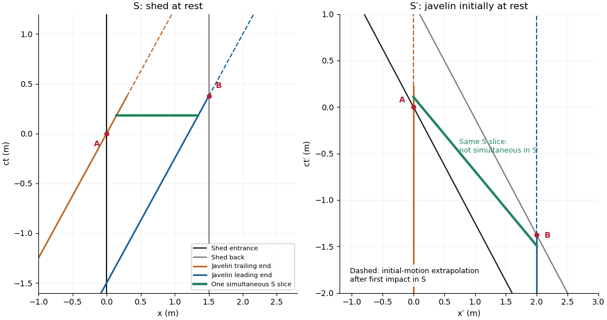

# Paper 4

↑ **Parent:** [Ib](../ib.md)

[https://www.maths.cam.ac.uk/undergrad/pastpapers/files/2002/PaperIB_4.pdf](https://www.maths.cam.ac.uk/undergrad/pastpapers/files/2002/PaperIB_4.pdf)

**Table of contents**

- [1E](#1e)
  - [a](#1e/a)
    - [Solution](#1e/a/solution)
  - [b](#1e/b)
    - [Solution](#1e/b/solution)
- [2A](#2a)
  - [Solution](#2a/solution)
- [3H](#3h)
  - [Solution](#3h/solution)
- [4G](#4g)
  - [a](#4g/a)
    - [Solution](#4g/a/solution)
  - [b](#4g/b)
    - [Solution](#4g/b/solution)
- [5H](#5h)
  - [Solution](#5h/solution)
- [6F](#6f)
  - [Solution](#6f/solution)
- [7C](#7c)
  - [Solution](#7c/solution)
- [8B](#8b)
  - [Solution](#8b/solution)
- [9D](#9d)
  - [Solution](#9d/solution)
- [10E](#10e)
  - [a](#10e/a)
    - [Solution](#10e/a/solution)
  - [b](#10e/b)
    - [Solution](#10e/b/solution)
- [11A](#11a)
  - [Solution](#11a/solution)
- [12H](#12h)
  - [Solution](#12h/solution)
- [13G](#13g)
  - [a](#13g/a)
    - [Solution](#13g/a/solution)
  - [b](#13g/b)
    - [Solution](#13g/b/solution)
  - [c](#13g/c)
    - [Solution](#13g/c/solution)
  - [d](#13g/d)
    - [Solution](#13g/d/solution)
- [14H](#14h)
  - [Solution](#14h/solution)
- [15F](#15f)
  - [Solution](#15f/solution)
- [16C](#16c)
  - [Solution](#16c/solution)
- [17B](#17b)
  - [a](#17b/a)
    - [Solution](#17b/a/solution)
  - [b](#17b/b)
    - [Solution](#17b/b/solution)
- [18D](#18d)
  - [a](#18d/a)
    - [Solution](#18d/a/solution)
  - [b](#18d/b)
    - [Solution](#18d/b/solution)
  - [c](#18d/c)
    - [Solution](#18d/c/solution)
  - [d](#18d/d)
    - [Solution](#18d/d/solution)

## 1E

↑ **Parent:** [Paper 4](paper-4.md)

<h3 id="1e/a">a</h3>

↑ **Parent:** [1E](#1e)

<h4 id="1e/a/solution">Solution</h4>

↑ **Parent:** [A](#1e/a)

**Neither assertion holds for a general [metric space](../../../topological-analysis.md#metric-space).** Take $X=\{0,1\}$ with $d(0,1)=1$ and center $0$. This is a [discrete topology](../../../topology.md#discrete-space): both singleton sets are open and closed. The [open ball](../../../topology.md#open-ball) is $U=\{0\}$, whereas the [closed ball](../../../topological-analysis.md#closed-ball) is $K=X$. Thus the [interior](../../../topology.md#interior-topology) of $K$ is $X$, strictly larger than $U$, and the [closure](../../../topology.md#closure-topology) of $U$ is $\{0\}$, strictly smaller than $K$. In general $U\subseteq\operatorname{int}K$ and $\overline U\subseteq K$, but the inclusions need not be equalities.

<h3 id="1e/b">b</h3>

↑ **Parent:** [1E](#1e)

<h4 id="1e/b/solution">Solution</h4>

↑ **Parent:** [B](#1e/b)

**Both assertions hold for a [normed vector space](../../../functional-analysis.md#normed-vector-space).** The [norm](../../../functional-analysis.md#norm) is continuous, so $U$ is open and $K$ is closed. If $\|x\|=1$, then $x_n=(1+1/n)x$ lies outside $K$ and converges to $x$. Hence no such boundary point belongs to the [interior](../../../topology.md#interior-topology) of $K$, giving $\operatorname{int}K=U$. Conversely, $(1-1/n)x\in U$ converges to every unit vector $x$, so $K\subseteq\overline U$. Closedness gives the reverse inclusion, and $\overline U=K$. Points already in $U$ cause no difficulty. In the zero-dimensional space $U=K=X$, so the conclusions still hold. This is the [interior and closure of norm balls](../../../functional-analysis.md#interior-and-closure-of-norm-balls); radial scaling supplies what a general [metric space](../../../topological-analysis.md#metric-space) lacks.

## 2A

↑ **Parent:** [Paper 4](paper-4.md)

<h3 id="2a/solution">Solution</h3>

↑ **Parent:** [2A](#2a)

Take $a,b,c>0$ as the semiaxis lengths. For a centered axis-aligned box with positive half-edge lengths $x,y,z$, the [volume](../../../geometry-and-topology.md#volume) is $V=8xyz$. Maximize $xyz$ under $g=x^2/a^2+y^2/b^2+z^2/c^2=1$. The [Lagrange multiplier](../../../mathematical-optimization.md#lagrange-multiplier) equations are

$$
yz=2\lambda x/a^2,\qquad xz=2\lambda y/b^2,\qquad xy=2\lambda z/c^2.
$$

Multiplying by $x,y,z$, respectively, shows that $x^2/a^2=y^2/b^2=z^2/c^2$. The constraint makes each value $1/3$. All boundary boxes with a zero edge have zero volume, while the positive stationary box exists. [Compactness](../../../topology.md#compact-space) therefore gives the [maximum box volume in an ellipsoid](../../../mathematical-optimization.md#maximum-box-volume-in-an-ellipsoid)

$$
\boxed{x=a/\sqrt3,\quad y=b/\sqrt3,\quad z=c/\sqrt3,\qquad V_{\max}=\frac{8abc}{3\sqrt3}.}
$$

Allowing a displaced or differently oriented rectangular box cannot improve this result. Let $A=\operatorname{diag}(a,b,c)$, let $c_0$ be its center, and let $u_1,u_2,u_3$ be its perpendicular half-edge vectors. Averaging $|A^{-1}(c_0+\sum\varepsilon_i u_i)|^2\le1$ over the eight signs gives $|A^{-1}c_0|^2+\sum|A^{-1}u_i|^2\le1$. The determinant bound $|\det(A^{-1}u_1,A^{-1}u_2,A^{-1}u_3)|\le\prod|A^{-1}u_i|$, followed by the [arithmetic-geometric mean inequality](../../../mathematical-optimization.md#arithmetic-geometric-mean-inequality), makes its volume at most $8abc/(3\sqrt3)$. The box found above attains the bound.

## 3H

↑ **Parent:** [Paper 4](paper-4.md)

<h3 id="3h/solution">Solution</h3>

↑ **Parent:** [3H](#3h)

Let $X_j$ be the number of failures in mix $j$. The total observed failures are $32+2(12)+3(2)+4(1)=66$ among $600$ blocks. Equal marginal failure [probabilities](../../../probability-theory.md#probability) give $E(X_j)=6p$, regardless of dependence within a mix. Thus the [unbiased estimator](../../../statistical-modelling.md#unbiased-estimator) based on [grouped Bernoulli failure counts](../../../discrete-probability-distribution.md#grouped-bernoulli-failure-counts) is

$$
\boxed{\widehat p=\frac{\sum_{j=1}^{100}X_j}{600}=0.11.}
$$

For a conventional binomial [confidence interval](../../../statistical-inference.md#confidence-interval), additionally assume independent block outcomes. Then the total $S$ has [binomial distribution](../../../discrete-probability-distribution.md#binomial-distribution) $\operatorname{Bin}(600,p)$ and the estimated [standard error](../../../statistical-inference.md#standard-error) is $\sqrt{\widehat p(1-\widehat p)/600}=0.01277$. The [normal approximation](../../../convergence-of-random-variables.md#normal-approximation) gives the approximate 95 percent interval

$$
\boxed{0.11\pm1.96(0.01277)\simeq(0.0850,0.1350).}
$$

One can instead obtain an exact, generally conservative binomial interval by solving $P_{p_L}(S\ge66)=0.025$ and $P_{p_U}(S\le66)=0.025$ for the two endpoints. These equations invert binomial tail tests.

Equal marginal [probabilities](../../../probability-theory.md#probability) alone do not imply independent blocks. If the mixes are independent but blocks within a mix can be dependent, use the [sample variance](../../../statistical-inference.md#sample-variance) of the 100 counts. Here $\sum X_j^2=114$ and $\overline X=0.66$, so $s_X^2=(114-100(0.66)^2)/99=0.7115$. The estimated [variance](../../../variance.md) of $\widehat p=\overline X/6$ is $s_X^2/(100\times36)$; its [standard error](../../../statistical-inference.md#standard-error) is $0.01406$, giving the large-sample interval approximately $(0.0824,0.1376)$. If even between-mix independence is absent, no stated model justifies either numerical coverage claim. The estimate remains unbiased, but the uncertainty calculation needs its sampling assumptions.

## 4G

↑ **Parent:** [Paper 4](paper-4.md)

<h3 id="4g/a">a</h3>

↑ **Parent:** [4G](#4g)

<h4 id="4g/a/solution">Solution</h4>

↑ **Parent:** [A](#4g/a)

The sets $Y\cap C$ and $Y\cap D$ are relatively open in the [subspace topology](../../../topology.md#subspace-topology) on $Y$. They are disjoint and their union is $Y$. If both were nonempty, they would be a separation of $Y$, contradicting its [connectedness](../../../geometry-and-topology.md#connected-space). Therefore at least one is empty, and **$Y$ lies entirely in $C$ or entirely in $D$**. The assertion also holds for empty $Y$.

<h3 id="4g/b">b</h3>

↑ **Parent:** [4G](#4g)

<h4 id="4g/b/solution">Solution</h4>

↑ **Parent:** [B](#4g/b)

Let $A=\bigcup_{n\ge1}A_n$, and suppose $A=P\cup Q$ were a separation into disjoint nonempty relatively open sets. Each [connected subset](../../../geometry-and-topology.md#connected-subset) $A_n$ lies wholly in $P$ or wholly in $Q$, by the argument just proved. Since $A_n\cap A_{n+1}\ne\varnothing$, consecutive subsets must lie on the same side. Induction puts every $A_n$ on the side containing $A_1$. The other side is then empty, a contradiction. Hence **$A$ is connected**. This is the [connected chain of overlapping subsets](../../../geometry-and-topology.md#connected-chain-of-overlapping-subsets) argument; it does not require all the subsets to share one common point.

## 5H

↑ **Parent:** [Paper 4](paper-4.md)

<h3 id="5h/solution">Solution</h3>

↑ **Parent:** [5H](#5h)

Consider a finite directed [flow network](../../../graph-theory.md#flow-network) with source $s$, sink $t$, and nonnegative finite [flow network edge capacities](../../../graph-theory.md#flow-network-edge-capacity) $c_e$. A feasible [flow](../../../graph-theory.md#flow) assigns $0\le f_e\le c_e$ to each arc and satisfies [flow conservation](../../../graph-theory.md#flow-conservation) at every vertex except $s,t$. Its value $|f|$ is net outflow from $s$, equivalently net inflow to $t$. A maximal flow here means a flow of greatest value, also called a [maximum flow](../../../graph-theory.md#maximum-flow-problem). A source–sink [cut of a flow network](../../../graph-theory.md#cut-of-a-flow-network) is a partition $(S,S^c)$ with $s\in S$, $t\notin S$; its [cut capacity](../../../graph-theory.md#cut-capacity) is $c(S,S^c)=\sum_{u\in S,v\notin S}c_{uv}$, summing directed arcs from $S$ to its complement.

The [max-flow min-cut theorem](../../../graph-theory.md#max-flow-min-cut-theorem) states

$$
\boxed{\max_f|f|=\min_{S:s\in S,\ t\notin S}c(S,S^c).}
$$

For any feasible flow and cut, summing [flow conservation](../../../graph-theory.md#flow-conservation) over vertices in $S$ cancels internal arcs and gives $|f|=\sum_{S\to S^c}f_e-\sum_{S^c\to S}f_e\le c(S,S^c)$. This proves the upper bound by every cut.

For the reverse bound, a maximum exists: the feasible set is a nonempty closed subset of the bounded product $\prod_e[0,c_e]$, hence compact, and $|f|$ is continuous. Choose a maximizing flow $f$. Its [residual network](../../../graph-theory.md#residual-network) has a forward arc for unused capacity $c_e-f_e$ and a reverse arc for cancellable flow $f_e$, retaining original-arc identities if necessary. If a residual path joined $s$ to $t$, the minimum of its positive residual capacities would be positive. Increasing forward flows and cancelling reverse flows by this amount would preserve all constraints while increasing $|f|$, a contradiction.

Let $S$ consist of vertices reachable from $s$ through positive residual arcs. Then $t\notin S$. An original arc from $S$ to $S^c$ must be saturated, since otherwise its forward residual arc would make its endpoint reachable. An original arc from $S^c$ to $S$ must carry zero flow, since a positive reverse residual arc would again extend reachability. Thus

$$
|f|=\sum_{S\to S^c}c_e-0=c(S,S^c).
$$

The upper bound and this equality prove the theorem and exhibit a [residual reachability certificate for maximum flow](../../../graph-theory.md#residual-reachability-certificate-for-maximum-flow). The argument works for real capacities and does not assume that an arbitrary augmenting-path algorithm terminates in finitely many steps.

## 6F

↑ **Parent:** [Paper 4](paper-4.md)

<h3 id="6f/solution">Solution</h3>

↑ **Parent:** [6F](#6f)

For a [linear map](../../../vector-space.md#linear-map) $T:U\to V$, its [rank of a linear map](../../../vector-space.md#rank-of-a-linear-map) is $\dim\operatorname{im}T$, and its [nullity](../../../linear-algebra.md#nullity-of-a-linear-map) is $\dim\ker T$. The [rank-nullity theorem](../../../linear-algebra.md#rank-nullity-theorem) states $\dim U=\operatorname{rank}T+\operatorname{nullity}T$. One obtains it by extending a [basis](../../../vector-space.md#basis) of the kernel to a [basis](../../../vector-space.md#basis) of $U$; the images of the added vectors form a [basis](../../../vector-space.md#basis) of the image.

Restrict $\beta$ to $A=\operatorname{im}\alpha$. Its image is $\operatorname{im}(\beta\alpha)$ and its kernel is $A\cap\ker\beta$. Thus

$$
\operatorname{rank}(\beta\alpha)=\operatorname{rank}\alpha-\dim(A\cap\ker\beta).
$$

The intersection dimension is at most $\dim\ker\beta=\dim V-\operatorname{rank}\beta$, proving the lower bound. It is nonnegative, proving the upper bound by $\operatorname{rank}\alpha$, while $\operatorname{im}(\beta\alpha)\subseteq\operatorname{im}\beta$ proves the other upper bound. Consequently the [rank inequality for a composition](../../../linear-algebra.md#rank-inequality-for-a-composition) is

$$
\boxed{\operatorname{rank}\alpha+\operatorname{rank}\beta-\dim V\le\operatorname{rank}(\beta\alpha)\le\min(\operatorname{rank}\alpha,\operatorname{rank}\beta).}
$$

## 7C

↑ **Parent:** [Paper 4](paper-4.md)

<h3 id="7c/solution">Solution</h3>

↑ **Parent:** [7C](#7c)

Direct differentiation of the [velocity field](../../../fluid-mechanics.md#velocity-field) gives $(\mathbf u\cdot\nabla)\mathbf u=(-\Omega^2x,-\Omega^2y,0)$. Since $u^2=\Omega^2(x^2+y^2)$, this equals $\nabla(-u^2/2)$ as required.

In cylindrical coordinates, steady rigid rotation has $u_r=u_z=0$, $u_\theta=\Omega r$. The radial and vertical [Euler equations](../../../fluid-mechanics.md#euler-equations-for-an-inviscid-fluid) for constant-density fluid are $p_r=\rho\Omega^2r$ and $p_z=-\rho g$, hence $p=\rho(\Omega^2r^2/2-gz)+C$. Constant atmospheric pressure on the [free surface](../../../fluid-mechanics.md#free-surface) gives $z_s(r)=H+\Omega^2r^2/(2g)$. Conservation of fluid volume determines $H$:

$$
\pi a^2h=2\pi\int_0^a z_s(r)r\,dr=\pi a^2H+\frac{\pi\Omega^2a^4}{4g}.
$$

Therefore

$$
\boxed{z_s(r)=h+\frac{\Omega^2}{2g}\left(r^2-\frac{a^2}{2}\right).}
$$

The lowest point is the axis, where $z_s(0)=h-\Omega^2a^2/(4g)$. The [free surface](../../../fluid-mechanics.md#free-surface) first meets the bottom when

$$
\boxed{|\Omega|=\frac{2\sqrt{gh}}a.}
$$

This assumes no overflow and uses the full disk of wetted bottom until first contact. Once a dry central region forms, the volume constraint and geometry must be modified.

## 8B

↑ **Parent:** [Paper 4](paper-4.md)

<h3 id="8b/solution">Solution</h3>

↑ **Parent:** [8B](#8b)

Use $\widehat f(t)=\int f(x)e^{-itx}\,dx$ and its extension to [square-integrable functions](../../../measure-theory.md#square-integrable-function). For $T_kf(x)=f(x+k)$, changing variables gives $\widehat{T_kf}(t)=e^{ikt}\widehat f(t)$. The [Plancherel theorem](../../../fourier-analysis.md#plancherel-theorem) therefore gives

$$
\int_{\mathbb R}f(x+k)\overline{f(x+l)}\,dx=\frac1{2\pi}\int_{\mathbb R}|\widehat f(t)|^2e^{i(k-l)t}\,dt.
$$

For an arbitrary square-integrable $f$, the translation identity follows by approximation by integrable square-integrable functions: translations are isometries in $L^2$ and the [Fourier transform](../../../analysis.md#fourier-transform) is continuous in the Plancherel [norm](../../../functional-analysis.md#norm). The [Cauchy-Schwarz inequality](../../../probability-and-statistics.md#cauchy-schwarz-inequality) makes the product on the left integrable, and $|\widehat f|^2$ is integrable on the right.

Put $m=l-k$. Every unequal integer pair gives a nonzero integer $m$, and every nonzero integer arises, for example with $k=0,l=m$. The identity thus proves **both directions of the requested equivalence**. It is the [orthogonality of integer translates](../../../fourier-analysis.md#orthogonality-of-integer-translates) criterion. A different Fourier normalization changes only the nonzero constant factor, not the vanishing conditions.

## 9D

↑ **Parent:** [Paper 4](paper-4.md)

<h3 id="9d/solution">Solution</h3>

↑ **Parent:** [9D](#9d)

Work in the parent's rest frame. [Momentum conservation](../../../classical-mechanics.md#momentum-conservation) makes the final spatial momenta equal and opposite: $\mathbf p_m=-\mathbf p_0$ with magnitude $p$. The massless energy is $E_0=pc$, while the massive [energy–momentum relation](../../../special-relativity.md#energy-momentum-relation) is $E_m^2=m^2c^4+p^2c^2$. [Conservation of energy](../../../physics.md#conservation-of-energy) gives $E_m+pc=Mc^2$. Squaring $E_m=Mc^2-pc$ and cancelling the $p^2c^2$ terms gives

$$
\boxed{p=\frac{M^2-m^2}{2M}c,\qquad E_0=\frac{M^2-m^2}{2M}c^2,\qquad E_m=\frac{M^2+m^2}{2M}c^2.}
$$

The two directions are arbitrary but opposite in this frame. These are total energies, including the massive daughter's rest energy, as required for [relativistic two-body decay](../../../special-relativity.md#relativistic-two-body-decay).

## 10E

↑ **Parent:** [Paper 4](paper-4.md)

<h3 id="10e/a">a</h3>

↑ **Parent:** [10E](#10e)

<h4 id="10e/a/solution">Solution</h4>

↑ **Parent:** [A](#10e/a)

By [equivalent norms](../../../functional-analysis.md#equivalent-norms), choose $c,C>0$ with $c\|h\|_1\le\|h\|_2\le C\|h\|_1$. Differentiability in the first [norm](../../../functional-analysis.md#norm) means that there is a bounded [linear map](../../../vector-space.md#linear-map) $L:V\to\mathbb R$ with $f(a+h)-f(a)-Lh=r(h)$ and $|r(h)|/\|h\|_1\to0$. The same $L$ is bounded in the second [norm](../../../functional-analysis.md#norm), since $|Lh|\le K\|h\|_1\le Kc^{-1}\|h\|_2$. Moreover,

$$
\frac{|r(h)|}{\|h\|_2}\le\frac1c\frac{|r(h)|}{\|h\|_1}\longrightarrow0.
$$

The two [norms](../../../functional-analysis.md#norm) define the same approach $h\to0$, so this proves differentiability with the same [Fréchet derivative](../../../calculus.md#frechet-derivative) in the second [norm](../../../functional-analysis.md#norm). Reversing the [norms](../../../functional-analysis.md#norm) proves the converse.

For completeness, the [derivative](../../../calculus.md#derivative) is unique: if $L_1,L_2$ both work, fix $v$ and take $h=tv$. The two remainder estimates imply $|(L_1-L_2)v|=o(1)$ as $t\to0$, so $(L_1-L_2)v=0$ for every $v$. Thus **differentiability and its [derivative](../../../calculus.md#derivative) are independent of the chosen [norm](../../../functional-analysis.md#norm)**. This is [differentiability under equivalent norms](../../../calculus.md#differentiability-under-equivalent-norms), not merely invariance of continuity.

<h3 id="10e/b">b</h3>

↑ **Parent:** [10E](#10e)

<h4 id="10e/b/solution">Solution</h4>

↑ **Parent:** [B](#10e/b)

Continuity on the compact product of unit spheres bounds the [bilinear map](../../../linear-algebra.md#bilinear-map): there is $C$ such that $\|f(h,k)\|_3\le C\|h\|_1\|k\|_2$. This follows by scaling each nonzero vector to unit [norm](../../../functional-analysis.md#norm); if one factor space is zero, the map and the relevant assertion are trivial.

Bilinearity gives the exact expansion

$$
f(a+h,b+k)-f(a,b)=f(h,b)+f(a,k)+f(h,k).
$$

The proposed [derivative](../../../calculus.md#derivative) $L(h,k)=f(h,b)+f(a,k)$ is linear and bounded, with $\|L(h,k)\|_3\le C(\|b\|_2\|h\|_1+\|a\|_1\|k\|_2)$. Set $\rho=(\|h\|_1^2+\|k\|_2^2)^{1/2}$. Its remainder obeys

$$
\frac{\|f(h,k)\|_3}{\rho}\le C\frac{\|h\|_1\|k\|_2}{\rho}\le\frac C2\rho\longrightarrow0.
$$

Thus the [derivative of a continuous bilinear map](../../../linear-algebra.md#derivative-of-a-continuous-bilinear-map) is the [Fréchet derivative](../../../calculus.md#frechet-derivative)

$$
\boxed{Df(a,b)(h,k)=f(h,b)+f(a,k).}
$$

## 11A

↑ **Parent:** [Paper 4](paper-4.md)

<h3 id="11a/solution">Solution</h3>

↑ **Parent:** [11A](#11a)

Take an admissible variation $y+\varepsilon\eta$ with $\eta=\eta'=0$ at both regular endpoints. Its [first variation](../../../calculus-of-variations.md#first-variation) is $\delta I=\int(f_y\eta+f_{y'}\eta'+f_{y''}\eta'')\,dx$. Integrating the second term once and the third twice gives the boundary term $[f_{y'}\eta+f_{y''}\eta'-(d f_{y''}/dx)\eta]_a^b$, which vanishes. The [fundamental lemma of the calculus of variations](../../../calculus-of-variations.md#fundamental-lemma-of-the-calculus-of-variations) therefore yields the [higher-order Euler-Lagrange equation](../../../analysis.md#higher-order-euler-lagrange-equation)

$$
\boxed{f_y-\frac d{dx}f_{y'}+\frac{d^2}{dx^2}f_{y''}=0.}
$$

Here $f_y=8yy'$, $f_{y'}=4y^2$, and $f_{y''}=2x^4y''$. The first two contributions cancel, leaving $(x^4y'')''=0$. For $x>0$, integrate twice to obtain $x^4y''=Ax+B$, and then

$$
y(x)=\frac A{2x}+\frac B{6x^2}+Cx+D.
$$

The two singular-endpoint limits give $B=0$ and $A=2$. The conditions at one give $C=1$ and $D=0$. Hence the unique solution of the stated differential equation and limiting data is

$$
\boxed{y(x)=x+\frac1x\qquad(0<x\le1).}
$$

There is a genuine distinction between solving this equation and stationarity of a finite improper action. Substitution gives $f=4x^2+4-4x^{-4}$, whose [integral](../../../calculus.md#integral) at zero diverges to $-\infty$. The displayed Euler-Lagrange equation remains valid for compactly supported variations on $(0,1)$, or on regular cut-off intervals, but the literal unregularized action is not a finite stationary functional on this solution. These [singular endpoints in higher-order variational problems](../../../analysis.md#singular-endpoints-in-higher-order-variational-problems) require a regularization or an admissible-space convention if a global variational claim is intended.

## 12H

↑ **Parent:** [Paper 4](paper-4.md)

<h3 id="12h/solution">Solution</h3>

↑ **Parent:** [12H](#12h)

A [prior distribution](../../../statistical-inference.md#prior-probability) assigns uncertainty to a parameter before observing data. Multiplying its density by the [likelihood](../../../statistical-modelling.md#likelihood-function) and normalizing gives the [posterior distribution](../../../statistical-inference.md#bayesian-posterior). A [Bayes estimator](../../../statistical-inference.md#bayes-estimator) minimizes the posterior expected [loss function](../../../foundations-of-mathematics.md#loss-function) for each observed sample, and therefore minimizes integrated Bayes risk when the expectations exist.

For [quadratic loss](../../../statistical-inference.md#squared-error-loss) $(d-\theta)^2$, the conditional risk is $\operatorname{Var}(\theta\mid x)+(d-E(\theta\mid x))^2$, so its minimizer is the posterior mean. For [absolute loss](../../../statistical-inference.md#absolute-error-loss) $|d-\theta|$, the one-sided derivatives or subgradients show that a minimizer is any posterior median, characterized by $P(\theta<d\mid x)\le1/2$ and $P(\theta>d\mid x)\le1/2$.

For the stated [uniform distribution](../../../continuous-probability-distribution.md#continuous-uniform-distribution) sampling model, let $x_{\min}=\min_i x_i$, $x_{\max}=\max_i x_i$. The [likelihood](../../../statistical-modelling.md#likelihood-function) is $2^{-n}$ on $x_{\max}-1<\theta<x_{\min}+1$ and zero elsewhere. Intersecting this interval with the [uniform prior](../../../statistical-inference.md#uniform-prior) gives

$$
A=\max(20,x_{\max}-1),\qquad B=\min(50,x_{\min}+1).
$$

When $A<B$, the [bounded uniform-location posterior](../../../statistical-inference.md#bounded-uniform-location-posterior) is

$$
\boxed{\pi(\theta\mid\mathbf x)=\frac1{B-A}\mathbf1_{(A,B)}(\theta),\qquad \widehat\theta_{\rm quadratic}=\widehat\theta_{\rm absolute}=\frac{A+B}{2}.}
$$

The posterior is symmetric, so its mean and unique median coincide. If $A\ge B$, the data have zero marginal [likelihood](../../../statistical-modelling.md#likelihood-function) under the stipulated prior/sampling model and this posterior density cannot be normalized. An empty or singleton intersection is not an ordinary uniform posterior of positive width.

## 13G

↑ **Parent:** [Paper 4](paper-4.md)

<h3 id="13g/a">a</h3>

↑ **Parent:** [13G](#13g)

<h4 id="13g/a/solution">Solution</h4>

↑ **Parent:** [A](#13g/a)

Use the local coordinate $w=1/z$ around infinity. A [pole](../../../isolated-singularity.md#pole) at $w=0$ is isolated: for some $\varepsilon>0$, $g(w)=f(1/w)$ is holomorphic at every point $0<|w|<\varepsilon$. Taking $r=1/\varepsilon$, the change of variable maps this punctured disk to $r<|z|<\infty$. Therefore **there are no finite [poles](../../../isolated-singularity.md#pole) outside that disk**. This is a property of the local meromorphic chart at infinity, not an assertion that infinity itself is regular.

<h3 id="13g/b">b</h3>

↑ **Parent:** [13G](#13g)

<h4 id="13g/b/solution">Solution</h4>

↑ **Parent:** [B](#13g/b)

At every regular point of the [Riemann sphere](../../../complex-analysis.md#riemann-sphere), there is a neighborhood containing no [poles](../../../isolated-singularity.md#pole); at each [pole](../../../isolated-singularity.md#pole), there is a neighborhood containing no other [poles](../../../isolated-singularity.md#pole). These neighborhoods cover the sphere. Its [compactness](../../../topology.md#compact-space) gives a finite subcover, each member containing at most one [pole](../../../isolated-singularity.md#pole). Hence **the total number of [poles](../../../isolated-singularity.md#pole), including a possible [pole](../../../isolated-singularity.md#pole) at infinity, is finite**. Equivalently, an infinite [pole](../../../isolated-singularity.md#pole) set would have an accumulation point on the compact sphere, contrary to local regularity or isolation there.

<h3 id="13g/c">c</h3>

↑ **Parent:** [13G](#13g)

<h4 id="13g/c/solution">Solution</h4>

↑ **Parent:** [C](#13g/c)

Let the finite [poles](../../../isolated-singularity.md#pole) be $a_1,\ldots,a_N$. Their [Laurent series](../../../analysis.md#laurent-series) have finite principal parts $P_j(z)=\sum_{k=1}^{m_j}c_{jk}(z-a_j)^{-k}$. Subtracting them removes all finite singularities: $h=f-\sum_jP_j$ is entire. Each $P_j$ tends to zero at infinity, so $h$ still has at most a finite-order [pole](../../../isolated-singularity.md#pole) at infinity.

The Laurent expansion of $h(1/w)$ near $w=0$ has only finitely many negative powers. Thus $h(z)=P(z)+c+O(z^{-1})$ for large $|z|$, with $P$ a [polynomial](../../../polynomial.md). The entire function $h-P$ is bounded outside a large disk and, by continuity, on that disk. [Liouville's theorem](../../../complex-analysis.md#liouville-theorem) makes it constant. Consequently

$$
f(z)=P(z)+c+\sum_{j=1}^N\sum_{k=1}^{m_j}\frac{c_{jk}}{(z-a_j)^k}.
$$

Combining denominators gives **a [rational function](../../../isolated-singularity.md#rational-function) $p/q$**. This proves that [meromorphic functions on the sphere are rational](../../../isolated-singularity.md#meromorphic-functions-on-the-sphere-are-rational) without assuming rationality at the start.

<h3 id="13g/d">d</h3>

↑ **Parent:** [13G](#13g)

<h4 id="13g/d/solution">Solution</h4>

↑ **Parent:** [D](#13g/d)

Write the nonconstant bijective map as $p/q$ with coprime [polynomials](../../../polynomial.md) and set $d=\max(\deg p,\deg q)$. For a finite value $w$, its finite preimages solve $p(z)-wq(z)=0$. Except for a possible leading-coefficient cancellation value, this [polynomial](../../../polynomial.md) has degree $d$.

Multiple roots can occur only at zeros of $p'q-pq'$, since at a root $q\ne0$ by coprimality. This [derivative](../../../calculus.md#derivative) numerator is a nonzero [polynomial](../../../polynomial.md) for a nonconstant rational map. There are therefore only finitely many finite critical values to exclude. Choose $w$ outside them and outside the leading cancellation value. The [fundamental theorem of algebra](../../../algebra.md#fundamental-theorem-of-algebra) then gives exactly $d$ distinct finite preimages. Bijectivity forces $d=1$.

Hence

$$
\boxed{f(z)=\frac{az+b}{cz+d_0},\qquad ad_0-bc\ne0,}
$$

which is a [Möbius transformation](../../../group-theory.md#mobius-transformation). Conversely, the inverse is $(d_0w-b)/(a-cw)$, interpreted at its [pole](../../../isolated-singularity.md#pole) and at infinity, proving bijectivity on the [Riemann sphere](../../../complex-analysis.md#riemann-sphere). The argument also establishes the generic-preimage interpretation of the [degree of a rational map of the Riemann sphere](../../../complex-analysis.md#degree-of-a-rational-map-of-the-riemann-sphere).

## 14H

↑ **Parent:** [Paper 4](paper-4.md)

<h3 id="14h/solution">Solution</h3>

↑ **Parent:** [14H](#14h)

First take $s_i>0$, the hypothesis required for the printed ratios and their optimization formula to be well-defined. Since $\sum p_i=1$,

$$
\sum_i\frac{p_ix_i}{s_i+x_i}=1-\sum_i\frac{p_is_i}{s_i+x_i}.
$$

The maximizing and minimizing problems therefore have exactly the same solutions.

Let $\tau>0$ and minimize the separable [optimization Lagrangian](../../../mathematical-optimization.md#optimization-lagrangian)

$$
L(x,\tau)=\sum_i\frac{p_is_i}{s_i+x_i}+\tau\left(\sum_i x_i-b\right),\qquad x_i\ge0.
$$

Each summand is convex, and its [derivative](../../../calculus.md#derivative) is $-p_is_i/(s_i+x_i)^2+\tau$. Its minimizer is $x_i(\tau)=(\sqrt{p_is_i/\tau}-s_i)^+$. The sum of these coordinates is continuous in $\tau$, decreases from infinity to zero, and is strictly decreasing wherever positive. Thus there is a unique $\tau$ for which the sum is $b$. For every feasible $y$, coordinatewise minimization gives $L(y,\tau)\ge L(x(\tau),\tau)$; both constraint terms vanish. The [Lagrangian sufficiency theorem](../../../mathematical-optimization.md#lagrange-sufficiency-theorem) proves global optimality, not just a necessary stationary condition.

Put $r_i=p_i/s_i$ in decreasing order. A positive bet occurs exactly when $r_i>\tau$. Hence the positive bets form an initial block. To interpret the maximal index in the question, one may include any subsequent indices tied at $r_i=\tau$: their bets are zero but their marginal-return equality still holds. Take $k=\max\{i:r_i\ge\tau\}$. Then

$$
\boxed{\frac{p_1s_1}{(s_1+x_1)^2}=\cdots=\frac{p_ks_k}{(s_k+x_k)^2}=\tau,\qquad x_i=0\ (i>k).}
$$

For this block, $\sqrt\tau=(\sum_{i\le k}\sqrt{p_is_i})/(b+\sum_{i\le k}s_i)$, with the threshold inequalities determining $k$. Zero-[probability](../../../probability-theory.md#probability) horses receive zero bets.

Let $H$ be the set attaining $\rho=\max r_i$, and write $S_H=\sum_{i\in H}s_i$, $P_H=\sum_{i\in H}p_i=\rho S_H$. For sufficiently small $b$, the solution uses only $H$, with $x_i=bs_i/S_H$ there and $\tau=\rho[S_H/(S_H+b)]^2$. If the next ratio is $r_*<\rho$, this remains valid when $b\le S_H(\sqrt{\rho/r_*}-1)$; if all outside ratios are zero there is no finite threshold. Put $S=\sum_i s_i$. The fixed pool is $S+b$, so the expected gross payout and net gain are

$$
\boxed{E(\text{payout})=(S+b)\frac{P_Hb}{S_H+b},\qquad E(\text{net gain})=(S+b)\frac{P_Hb}{S_H+b}-b.}
$$

Tied best horses receive bets proportional to their existing stakes; betting all on one tied horse is not generally optimal for finite $b$. This is [pari-mutuel expected-return allocation](../../../convex-optimization.md#pari-mutuel-expected-return-allocation).

The literal allowance $s_i=0$ needs qualification. At $s_i=x_i=0$ the printed objective contains $0/0$ and the ordered ratios are undefined. Even defining an unbacked horse's payout to be zero does not always yield an attained optimum. For example, take $b=1$, $p_1=p_2=1/2$, $s_1=0$, $s_2=1$. For $x_1>0$, the normalized expected payout is $1/2+(1/2)(1-x_1)/(2-x_1)$, tending to $3/4$ as $x_1\downarrow0$ but never attaining it; at $x_1=0$ that zero-payout convention gives $1/4$. Thus **the proved allocation formula requires positive existing stakes, or an explicitly modified market model**. The zero-stake case cannot be justified by silently dividing by zero.

## 15F

↑ **Parent:** [Paper 4](paper-4.md)

<h3 id="15f/solution">Solution</h3>

↑ **Parent:** [15F](#15f)

The [dual space](../../../linear-algebra.md#dual-space) $V^*$ consists of all real [linear functionals](../../../linear-algebra.md#linear-functional) on $V$. If $v_1,\ldots,v_d$ is a [basis](../../../vector-space.md#basis), its [dual basis](../../../linear-algebra.md#dual-basis) $\varepsilon^1,\ldots,\varepsilon^d$ is characterized by $\varepsilon^i(v_j)=\delta_{ij}$; explicitly $\varepsilon^i$ extracts the $i$th coordinate. The natural map $J:V\to V^{**}$ is $J(v)(\phi)=\phi(v)$. It is linear and injective, because the coordinate functionals separate nonzero vectors, and both spaces have dimension $d$. Hence it is an isomorphism. Its definition uses no choice of [basis](../../../vector-space.md#basis), which is the meaning of “naturally” here.

Evaluation $e_x(p)=p(x)$ is linear, so belongs to $V_n^*$. For distinct nodes $x_i$, define the [Lagrange interpolation polynomials](../../../numerical-analysis.md#lagrange-polynomial)

$$
\ell_i(t)=\prod_{j\ne i}\frac{t-x_j}{x_i-x_j}.
$$

They lie in $V_n$ and obey $e_{x_j}(\ell_i)=\delta_{ij}$. Applying a putative relation $\sum a_ie_{x_i}=0$ to $\ell_j$ gives $a_j=0$, so the $n+1$ evaluations are independent and form a [basis](../../../vector-space.md#basis) of $V_n^*$. The [polynomials](../../../polynomial.md) $\ell_i$ give their dual [basis](../../../vector-space.md#basis) in $V_n$, using the canonical identification with $V_n^{**}$.

Every $p\in V_n$ has the interpolation expansion $p(t)=\sum_i p(x_i)\ell_i(t)$: the difference has $n+1$ distinct roots but degree at most $n$. Integrate to get the [numerical integration](../../../numerical-analysis.md#numerical-integration) weights $\lambda_i=\int_{-1}^1\ell_i(t)dt$. For the specified symmetric five nodes, symmetry gives weights $(a,b,c,b,a)$. Exactness on $1,t^2,t^4$ gives

$$
2a+2b+c=2,\qquad 2a+\frac b2=\frac23,\qquad 2a+\frac b8=\frac25.
$$

Odd moments vanish automatically. Solving yields [Boole's rule](../../../numerical-analysis.md#boole-s-rule)

$$
\boxed{(\lambda_1,\ldots,\lambda_5)=\frac1{45}(7,32,12,32,7).}
$$

## 16C

↑ **Parent:** [Paper 4](paper-4.md)

<h3 id="16c/solution">Solution</h3>

↑ **Parent:** [16C](#16c)

Use the standard constant-density [incompressible flow](../../../fluid-mechanics.md#incompressible-flow) model, with conservative body force. Write $\mathbf u=(u,v,0)$ independent of $z$, and $\omega=v_x-u_y$. Differentiate the $y$-momentum [Euler equations](../../../fluid-mechanics.md#euler-equations-for-an-inviscid-fluid) with respect to $x$ and subtract the $y$-derivative of the $x$-momentum equation. Mixed pressure derivatives and the curl of a conservative body force cancel, giving

$$
\omega_t+u\omega_x+v\omega_y+(u_x+v_y)\omega=0.
$$

The last term vanishes by [incompressibility](../../../fluid-mechanics.md#incompressible-flow), so the material derivative of [vorticity](../../../fluid-mechanics.md#vorticity) is zero. Thus **$D\omega/Dt=0$**. [Incompressibility](../../../fluid-mechanics.md#incompressible-flow) is important: inviscidness alone does not suffice; in a compressible barotropic planar flow the equation is $D\omega/Dt=-\omega\nabla\cdot\mathbf u$, conserving $\omega/\rho$ instead.

Take vortex strength $\kappa$ to denote [circulation](../../../fluid-mechanics.md#circulation-physics), positive counterclockwise. A [point vortex](../../../fluid-mechanics.md#line-vortex) at $\mathbf x_0$ generates

$$
\mathbf u(\mathbf x)=\frac{\kappa}{2\pi}\frac{J(\mathbf x-\mathbf x_0)}{|\mathbf x-\mathbf x_0|^2},\qquad J(x,y)=(-y,x).
$$

It has zero [vorticity](../../../fluid-mechanics.md#vorticity) away from its core, with circulation $\kappa$ around the core. Each vortex moves with the other's regular induced [velocity](../../../classical-mechanics.md#velocity), not its own singular field. With $\mathbf d=\mathbf x_1-\mathbf x_2$,

$$
\dot{\mathbf x}_1=\frac{\kappa_2}{2\pi|\mathbf d|^2}J\mathbf d,\qquad \dot{\mathbf x}_2=-\frac{\kappa_1}{2\pi|\mathbf d|^2}J\mathbf d.
$$

Multiplication by the two strengths proves $\dot{\mathbf q}=\kappa_1\dot{\mathbf x}_1+\kappa_2\dot{\mathbf x}_2=0$. Also $\dot{\mathbf d}=(\kappa_1+\kappa_2)J\mathbf d/(2\pi|\mathbf d|^2)$, so $d|\mathbf d|^2/dt=2\mathbf d\cdot\dot{\mathbf d}=0$.

For equal strengths $\kappa$ and the specified initial positions, $\mathbf q=0$ and $|\mathbf d|=2a$. The [motion of two point vortices](../../../fluid-mechanics.md#motion-of-two-point-vortices) is rotation with angular [velocity](../../../classical-mechanics.md#velocity) $\Omega_v=\kappa/(4\pi a^2)$:

$$
\boxed{\mathbf x_1(t)=a(\cos\Omega_vt,\sin\Omega_vt),\qquad \mathbf x_2(t)=-\mathbf x_1(t).}
$$

Negative circulation reverses the rotation. If vortex strength is defined instead as the coefficient of $1/r$ [velocity](../../../classical-mechanics.md#velocity), absorb the factor $2\pi$ consistently into its definition.

## 17B

↑ **Parent:** [Paper 4](paper-4.md)

<h3 id="17b/a">a</h3>

↑ **Parent:** [17B](#17b)

<h4 id="17b/a/solution">Solution</h4>

↑ **Parent:** [A](#17b/a)

Set $M_R=\max_{0\le\theta\le\pi}|f(Re^{i\theta})|$. The complex limit at infinity gives $M_R\to0$. Parametrizing the semicircle and using $|e^{i\lambda Re^{i\theta}}|=e^{-\lambda R\sin\theta}$ yields

$$
\left|\int_{\Gamma_R}f(z)e^{i\lambda z}dz\right|\le RM_R\int_0^\pi e^{-\lambda R\sin\theta}\,d\theta.
$$

By symmetry and the supplied sine bound,

$$
\int_0^\pi e^{-\lambda R\sin\theta}d\theta\le2\int_0^{\pi/2}e^{-2\lambda R\theta/\pi}d\theta=\frac\pi{\lambda R}(1-e^{-\lambda R}).
$$

The arc [integral](../../../calculus.md#integral) is therefore at most $(\pi/\lambda)M_R$, tending to zero. This proves **the required vanishing**, the relevant form of [Jordan's lemma](../../../complex-analysis.md#jordan-s-lemma). No holomorphicity of $f$ is required just for this arc estimate.

<h3 id="17b/b">b</h3>

↑ **Parent:** [17B](#17b)

<h4 id="17b/b/solution">Solution</h4>

↑ **Parent:** [B](#17b/b)

Integrate $e^{iz}/z$ around the positively oriented indented upper-half-plane contour. The outer semicircle runs from $R$ to $-R$; the inner semicircle runs clockwise from $-r$ to $r$, excluding zero. The integrand is holomorphic inside this region, so [Cauchy's integral theorem](../../../complex-analysis.md#cauchy-s-integral-theorem) gives total [integral](../../../calculus.md#integral) zero.

The outer arc tends to zero by part (a) with $f(z)=1/z$ and $\lambda=1$. On the inner arc $z=re^{i\theta}$, $\theta$ decreases from $\pi$ to zero, and

$$
\int_{\rm inner}\frac{e^{iz}}z\,dz=i\int_\pi^0e^{ire^{i\theta}}d\theta\longrightarrow-i\pi.
$$

The two real segments combine as

$$
\int_{-R}^{-r}\frac{e^{ix}}x\,dx+\int_r^R\frac{e^{ix}}x\,dx=2i\int_r^R\frac{\sin x}{x}\,dx.
$$

Passing to the limits gives $2iI-i\pi=0$, and hence the [Dirichlet integral](../../../fourier-analysis.md#dirichlet-integral)

$$
\boxed{\int_0^\infty\frac{\sin x}{x}\,dx=\frac\pi2.}
$$

This is an ordinary conditionally convergent improper [integral](../../../calculus.md#integral): the integrand tends to one at zero, and integration by parts gives a tail bounded by $2/A$ beyond $A$. The clockwise indentation sign is essential.

## 18D

↑ **Parent:** [Paper 4](paper-4.md)

<h3 id="18d/a">a</h3>

↑ **Parent:** [18D](#18d)

<h4 id="18d/a/solution">Solution</h4>

↑ **Parent:** [A](#18d/a)

The [Lorentz factor](../../../special-relativity.md#lorentz-factor) is $\gamma=(1-0.8^2)^{-1/2}=5/3$. [Length contraction](../../../special-relativity.md#length-contraction) makes the moving javelin's length in the shed frame

$$
\boxed{L=2/\gamma=1.2\,\mathrm m.}
$$

This measures its two endpoints at the same shed-frame time.

<h3 id="18d/b">b</h3>

↑ **Parent:** [18D](#18d)

<h4 id="18d/b/solution">Solution</h4>

↑ **Parent:** [B](#18d/b)

The shed moves relative to the javelin frame at the same speed, so its simultaneous length there is

$$
\boxed{L'_s=1.5/\gamma=0.9\,\mathrm m.}
$$

The javelin retains its proper length $2\,\mathrm m$. The two statements use different simultaneity slices, as prescribed by [relativity of simultaneity](../../../special-relativity.md#relativity-of-simultaneity).

<h3 id="18d/c">c</h3>

↑ **Parent:** [18D](#18d)

<h4 id="18d/c/solution">Solution</h4>

↑ **Parent:** [C](#18d/c)

Choose event $A$, when the trailing end reaches the entrance, as $(ct,x)=(0,0)$ and as the primed origin. Write $T=ct$, $T'=ct'$. Before impact, the shed-frame [worldlines](../../../special-relativity.md#world-line) are entrance $x=0$, back $x=1.5$, trailing end $x=0.8T$, and leading end $x=0.8T+1.2$. The [Lorentz transformation](../../../special-relativity.md#lorentz-transformation) is

$$
T'=\frac53(T-0.8x),\qquad x'=\frac53(x-0.8T).
$$

Thus in the javelin frame the ends have $x'=0$ and $x'=2$, while the entrance and back have $x'=-0.8T'$ and $x'=0.9-0.8T'$. These four lines in each frame produce the requested [spacetime diagrams](../../../physics.md#spacetime-diagram). The diagrams show initial motion; dashed portions extrapolate that motion beyond first impact and are not a model of collision dynamics.

**[Figure 1](#18d/c/image-javelin-and-shed-worldlines-in-both-inertial-frames-with-entrance-event-a-first-impact-b-and-a-simultaneous-shed-frame-containment-slice). Javelin and shed worldlines in both inertial frames, with entrance event A, first impact B and a simultaneous shed-frame containment slice**.

<h3 id="18d/d">d</h3>

↑ **Parent:** [18D](#18d)

<h4 id="18d/d/solution">Solution</h4>

↑ **Parent:** [D](#18d/d)

In the shed frame, the leading end reaches the back when $0.8T+1.2=1.5$, giving $T_B=3/8\,\mathrm m$. Transforming both events yields

$$
\boxed{A:(T,x)=(0,0),\ (T',x')=(0,0);\qquad B:(T,x)=(3/8,3/2),\ (T',x')=(-11/8,2),}
$$

with every coordinate in metres. The invariant interval is

$$
\Delta s^2=(\Delta T)^2-(\Delta x)^2=\frac9{64}-\frac94=-\frac{135}{64}\,\mathrm{m^2}<0.
$$

Thus **the events are spacelike separated**. Event $A$ occurs first in the shed frame, but $B$ occurs first in the javelin frame; this is allowed for [spacelike separation](../../../special-relativity.md#spacelike-separation).

In the shed frame there is a pre-impact interval $0\le T<3/8$ during which both ends lie inside the shed, since its simultaneous moving length is only $1.2\,\mathrm m$. Those simultaneous endpoint events do not remain simultaneous after a boost. In the javelin frame the front hits the back before the rear enters, and there is no simultaneous pre-impact containment of the full $2\,\mathrm m$ rod in a $0.9\,\mathrm m$ shed. This is [rod containment and simultaneity](../../../special-relativity.md#rod-containment-and-simultaneity), not inconsistent length measurements.

After impact, the front's motion changes while the rear cannot respond instantaneously: stress signals propagate no faster than light. A claim that the entire javelin stops rigidly at event $B$ is inadmissible. Actual post-impact compression or fracture needs material data and is not represented by the straight-line extrapolations in the diagrams.

## ↑ Ancestors (8)

1. [Ib](../ib.md)
2. [2002](../../2002.md)
3. [Past exam of the mathematics course of the University of Cambridge](../../../past-exam-of-the-mathematics-course-of-the-university-of-cambridge.md)
4. [Mathematics course of the University of Cambridge](../../../university-of-cambridge.md#mathematics-course-of-the-university-of-cambridge)
5. [Course of the University of Cambridge](../../../university-of-cambridge.md#course-of-the-university-of-cambridge)
6. [University of Cambridge](../../../university-of-cambridge.md)
7. [List of universities](../../../README.md#list-of-universities)
8. [Codex Wiki](../../../README.md)
