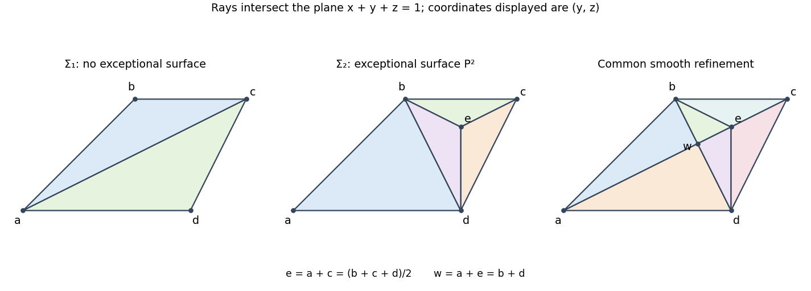

<h1 id="2/solution">Solution</h1>

↑ **Parent:** [2](../2.md)

The [smoothness criterion for a toric variety](../../../../../smoothness-criterion-for-a-toric-variety.md) says that every cone must be regular: its primitive ray generators must be part of a [lattice basis](../../../../../basis-of-a-toric-lattice.md) of $N$. Such a $d$-dimensional cone gives the chart $\mathbb A^d\times(\mathbb C^*)^{n-d}$; all charts are smooth precisely under this criterion.

Here is a terminating construction of a smooth [fan subdivision](../../../../../fan-subdivision.md). First subdivide compatibly into [simplicial polyhedral cones](../../../../../simplicial-polyhedral-cone.md). One method is the barycentric subdivision: choose a rational interior ray in each nonzero cone and perform the [star subdivisions](../../../../../star-subdivision.md) in decreasing dimension. Its cones correspond to chains of faces, hence are simplicial. For a simplicial cone with primitive generators $v_i$, let its multiplicity be the index of their integer span in the saturated lattice $N\cap\operatorname{span}_{\mathbb R}\sigma$.

If a cone is not regular, choose a nonregular face $\tau$ minimal under inclusion. Its half-open fundamental parallelepiped contains a nonzero point of the [toric lattice](../../../../../lattice-in-toric-geometry.md) $w=\sum_i\alpha_iv_i$, $0\le\alpha_i<1$. Every coefficient is positive: otherwise $w$ lies in the span of a regular proper face, whose generators extend to a lattice basis, forcing all the remaining coefficients to be integers and hence zero. Replace $w$ by the primitive vector $w'$ on its ray; its coefficients $\beta_i$ still satisfy $0<\beta_i<1$. Star-subdivide the entire fan at this ray. In each cone containing $\tau$, the new maximal cones replace one of these $v_i$ by $w'$, so multilinearity of the determinant makes the new multiplicity $\beta_i$ times the old one. It is a positive integer strictly smaller than the old multiplicity. Other cones are unchanged. Select $\tau$ inside a maximal cone of largest multiplicity. The number of maximal cones having that largest multiplicity decreases, and once it reaches zero the largest multiplicity decreases. This lexicographic integer descent terminates at multiplicity one. It proves **every finite rational fan has a smooth subdivision**, not merely a simplicial one; this is [multiplicity descent in toric desingularization](../../../../../multiplicity-descent-in-toric-desingularization.md).

For the specified threefold, abbreviate the primitive rays by

$$
a=(1,0,0),\quad b=(1,1,1),\quad c=(0,2,1),\quad d=(1,1,0).
$$

Its boundary two-dimensional faces are $ab,bc,cd,da$. For example their supporting normals, chosen inward, are $(0,1,-1),(1,1,-2),(1,-1,2),(0,0,1)$; each is zero on the named pair and positive on the other two rays. These normals are primitive. Equivalently the greatest common divisor of the two-by-two minors for each ray pair is one, so these faces are regular; the rays themselves are primitive as well. The full cone is three-dimensional with four extremal rays, hence not simplicial and not regular. The [orbit-cone correspondence](../../../../../orbit-cone-correspondence.md) now shows **the closed torus-fixed point is its only singular point**: every other orbit belongs to the smooth chart of a proper face.

Define the first subdivision by its maximal cones

$$
\boxed{\Sigma_1^{\max}=\{abc,acd\}.}
$$

Here a string of letters denotes their nonnegative span; all faces are included. This is the triangulation along diagonal $ac$ of a positive cross-section. Both determinants have absolute value one, so it is smooth. The subdivision has the same support as the original cone, hence its [toric morphism](../../../../../toric-morphism.md) is proper and birational and is a resolution. No new rays were added, so it has **no exceptional surfaces**. Its internal wall $ac$ gives a compact exceptional curve isomorphic to $\mathbb P^1$, by the two-ray quotient fan at that wall. The only proper coarsening is the original nonregular cone, so this resolution is minimal in the stated fan sense.

For a second resolution, set

$$
e=a+c=(1,2,1)=\tfrac12(b+c+d),\qquad \boxed{\Sigma_2^{\max}=\{abd,bce,cde,dbe\}.}
$$

Start with the other diagonal $bd$. The cone $abd$ is regular, but $bcd$ has determinant of absolute value two. Its primitive interior point $e$ divides it into the three regular cones shown, each with determinant of absolute value one. Therefore $\Sigma_2$ is again a smooth resolution and is different from $\Sigma_1$.

This fan has exactly one new ray, so **its only exceptional surface is $E_e\cong\mathbb P^2$**. To identify it, quotient $N$ by $\mathbb Ze$. The three neighboring rays are $\bar b,\bar c,\bar d$, their sum is zero, and consecutive pairs are bases because $bce,cde,dbe$ are regular. Their quotient fan is the [simplex fan](../../../../../simplex-fan.md) of the [projective plane](../../../../../projective-plane.md). In fact its normal bundle is $\mathcal O_{\mathbb P^2}(-2)$: the chart $U_{bcd}$ before subdivision is $\mathbb A^3/\{\pm1\}$ since its index-two lattice extension is generated by $(b+c+d)/2$, and the new radial parameter is the square of the ordinary radial parameter of $\mathcal O(-1)$. It has the transition factors of $\mathcal O(-2)$.

For minimality, the ray $e$ cannot be deleted in a smooth coarsening. Deleting an interior ray in this triangulation merges all three incident cones into $bcd$, which is nonregular, or merges further into the original nonsimplicial cone. If $e$ is retained, deleting a wall between its three incident cones gives a nonconvex union unless all three are merged, again giving $bcd$. The remaining internal wall $bd$ separates $abd$ and $bde$; their union has four extremal rays $a,b,d,e$, since $a+e=b+d$, and is not regular. Thus no proper coarsening is smooth. These are the [two minimal toric resolutions of a four-ray threefold cone](../../../../../two-minimal-toric-resolutions-of-a-four-ray-threefold-cone.md).

The factorization can be made completely explicit. Starting with $\Sigma_1$, add $e=a+c$ in the wall $ac$, producing a smooth fan $\Sigma_A$ with maximal cones $abe,bce,ade,cde$. Next add

$$
w=a+e=(2,2,1)=b+d
$$

in the wall $ae$. The resulting common fan has maximal cones

$$
abw,\quad bwe,\quad adw,\quad dwe,\quad bce,\quad cde.
$$

Starting instead with $\Sigma_2$, the star subdivision at $w=b+d$ in the wall $bd$ gives exactly the same six cones. Each insertion is the sum of the generators of a smooth two-dimensional cone. Such a [star subdivision](../../../../../star-subdivision.md) is the [toric blowup along an orbit closure](../../../../../toric-blowup-along-an-orbit-closure.md) of its smooth invariant curve: in local coordinates the center has ideal $(x_1,x_2)$, and the two blowup charts with ratios $x_2/x_1$ and $x_1/x_2$ give the two new cones. We have the zigzag of blowup morphisms

$$
\boxed{X_{\Sigma_1}\ \longleftarrow\ X_{\Sigma_A}\ \longleftarrow\ X_{\Sigma_B}\ \longrightarrow\ X_{\Sigma_2}.}
$$

The required birational map is the composite of the inverses of the first two morphisms with the last. This supplies individual smooth toric blowups, rather than appealing to an abstract factorization theorem.

**[Figure 1](#2/image-cross-sections-of-the-two-minimal-smooth-fans-and-their-common-refinement-obtained-by-invariant-curve-blowups). Cross-sections of the two minimal smooth fans and their common refinement obtained by invariant-curve blowups**.

## ↑ Ancestors (10)

1. [2](../2.md)
2. [Paper 12](../../paper-12-split.md)
3. [Iii](../../split.md)
4. [2002](../../../split.md)
5. [Past exam of the mathematics course of the University of Cambridge](../../../../split.md)
6. [Mathematics course of the University of Cambridge](../../../../../mathematics-course-of-the-university-of-cambridge.md)
7. [Course of the University of Cambridge](../../../../../course-of-the-university-of-cambridge.md)
8. [University of Cambridge](../../../../../university-of-cambridge-split.md)
9. [List of universities](../../../../../list-of-universities.md)
10. [Codex Wiki](../../../../../split.md)
