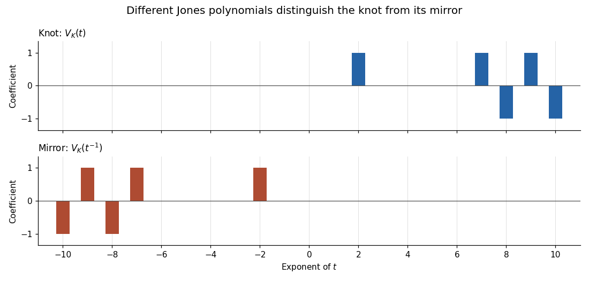

<h1 id="3/solution">Solution</h1>

↑ **Parent:** [3](../3.md)

Let $F$ be an oriented [Seifert surface](../../../../../seifert-surface.md) of [genus](../../../../../genus-of-a-surface.md) $g$ for $K$, and choose a basis $a_1,\ldots,a_{2g}$ of $H_1(F;\mathbb Z)$. Push a representative curve slightly in the positive normal direction to obtain $a_i^+$. The [Seifert matrix](../../../../../seifert-matrix.md) in our row convention is

$$
V_{ij}=\operatorname{lk}(a_i^+,a_j).
$$

The difference $V-V^T$ is the [intersection form](../../../../../intersection-form.md) of F, up to the convention for its [orientation](../../../../../orientation-of-a-simplex.md); in a symplectic basis it is a direct sum of unimodular two-by-two skew blocks.

Write $X=S^3\setminus\operatorname{int}N(K)$ for the [knot exterior](../../../../../knot-exterior.md). Linking number with K gives the epimorphism $\pi_1(X)\to\mathbb Z$ sending a positive meridian to one. Let $\widetilde X$ be the associated [infinite cyclic cover](../../../../../infinite-cyclic-cover-of-a-knot-exterior.md), with [deck transformation](../../../../../deck-transformation.md) t. The [Alexander module of a knot](../../../../../alexander-module-of-a-knot.md) is $\mathcal A_K=H_1(\widetilde X;\mathbb Z)$, regarded as a [module](../../../../../module-mathematics.md) over the [Laurent polynomial ring](../../../../../laurent-polynomial-ring.md) $\Lambda=\mathbb Z[t,t^{-1}]$. Its order, the greatest common divisor of the maximal presentation minors, is the [Alexander polynomial of a knot](../../../../../alexander-polynomial.md), defined up to $\pm t^k$. Equivalently these minors generate its zeroth [Fitting ideal](../../../../../fitting-ideal.md); we will obtain a square presentation, so its [determinant](../../../../../determinant.md) gives the order. No assertion that $\Lambda$ is a [principal ideal domain](../../../../../principal-ideal-domain.md) is needed.

Here is the [Seifert-matrix presentation of the Alexander module](../../../../../seifert-matrix-presentation-of-the-alexander-module.md) with its topological justification. Cut X along F, obtaining a connected manifold Y with two boundary copies $F^+$ and $F^-$. Up to collars this is the complement of a thickening of F in $S^3$. [Alexander duality](../../../../../alexander-duality.md) gives $H_1(Y;\mathbb Z)\cong\mathbb Z^{2g}$ and the perfect linking pairing with $H_1(F;\mathbb Z)$. Choose generators $b_j$ satisfying $\operatorname{lk}(b_j,a_i)=\delta_{ij}$. This [homology](../../../../../homology-split.md) statement does not require Y to be a handlebody. The two inclusions satisfy

$$
i_+(a_i)=\sum_jV_{ij}b_j,\qquad i_-(a_i)=\sum_jV_{ji}b_j.
$$

Indeed the first coefficients are the defining positive [linking numbers](../../../../../linking-number.md); for the second, moving the two curves to opposite sides and using symmetry of linking gives $\operatorname{lk}(a_i^-,a_j)=\operatorname{lk}(a_j^+,a_i)$.

Stack copies of Y, identifying the positive copy of F in one layer with the negative copy in the next. This is $\widetilde X$. The [Mayer–Vietoris sequence](../../../../../mayer-vietoris-sequence.md), with all translates collected into Laurent [modules](../../../../../module-mathematics.md), contains

$$
H_1(F)\otimes\Lambda\xrightarrow{\,t i_+-i_-\,}H_1(Y)\otimes\Lambda\longrightarrow\mathcal A_K\longrightarrow H_0(F)\otimes\Lambda\xrightarrow{\,t-1\,}H_0(Y)\otimes\Lambda.
$$

The last map is injective because $\Lambda$ is an [integral domain](../../../../../integral-domain.md). Thus the entire [Alexander module](../../../../../alexander-module-of-a-knot.md) is presented by the row relations $tV-V^T$ (transpose the [matrix](../../../../../matrix.md) if using column vectors). At $t=1$ its [determinant](../../../../../determinant.md) is $\det(V-V^T)=1$, so the [determinant](../../../../../determinant.md) is nonzero and the [module](../../../../../module-mathematics.md) is a [torsion module](../../../../../torsion-module.md). Consequently

$$
\boxed{\Delta_K(t)\doteq\det(tV-V^T),\qquad\operatorname{br}\Delta_K\leq2g_s(K),}
$$

where $\doteq$ denotes equality up to a [Laurent unit](../../../../../unit-of-a-laurent-polynomial-ring.md). The second conclusion follows because a [determinant](../../../../../determinant.md) of size $2g$ with entries linear in t has breadth at most $2g$; minimize over [Seifert surfaces](../../../../../seifert-surface.md).

For the displayed diagram, start on the outer lower arc near the lower left undercrossing and follow the arc through the lower outer loop toward the upper right undercrossing. Number successive undercrossings $0,\ldots,9$, and let $x_i$ label the incoming arc at crossing $i$. Reading the overpassing arcs and the conjugation exponents in a consistent meridian convention gives

$$
(o_0,\ldots,o_9)=(6,0,7,6,9,1,3,0,4,8),\qquad(\varepsilon_0,\ldots,\varepsilon_9)=(-1,1,-1,-1,-1,-1,-1,-1,-1,-1).
$$

Thus the [Wirtinger presentation](../../../../../wirtinger-presentation.md) relations are $x_{i+1}=x_{o_i}^{\varepsilon_i}x_ix_{o_i}^{-\varepsilon_i}$, with indices modulo ten. Their [Fox derivatives](../../../../../fox-derivative.md) after [abelianization](../../../../../abelianization.md) give row relations

$$
t^{\varepsilon_i}z_i-z_{i+1}+(1-t^{\varepsilon_i})z_{o_i}=0.
$$

Delete the redundant last relation and the last column, setting $z_9=0$. This is a nine-generator presentation of the [Alexander module](../../../../../alexander-module-of-a-knot.md). The cofactor [determinant](../../../../../determinant.md) is $t^{-6}(t^4+t^3-3t^2+t+1)$; here is a smaller elimination check. Retain $z_1,z_4$. Seven relations solve the other generators as

$$
\begin{aligned}
z_8&=(1-t)z_4,&z_5&=t^{-1}z_4,&z_6&=t^{-2}z_4+(1-t^{-1})z_1,\\
z_0&=tz_1-(t-1)z_6,&z_2&=tz_1+(1-t)z_0,&z_3&=tz_4-(t-1)z_6,\\
z_7&=t^{-1}z_6+(1-t^{-1})z_3.
\end{aligned}
$$

The two remaining rows, at undercrossings two and seven, are the [matrix](../../../../../matrix.md)

$$
N=\begin{pmatrix}(t^2-t+1)/t^2&-(2t^3-2t^2+1)/t^3\\(t^2-1)/t^2&(t^4-2t^2+t+1)/t^3\end{pmatrix}.
$$

Its [determinant](../../../../../determinant.md) is $t^{-3}(t^4+t^3-3t^2+t+1)$, differing from the original cofactor only by a [Laurent unit](../../../../../unit-of-a-laurent-polynomial-ring.md). Consequently

$$
\boxed{\Delta_K(t)\doteq t^4+t^3-3t^2+t+1.}
$$

The factor has value one at $t=1$ and is reciprocal, as required. Its [Conway-normalized Alexander polynomial](../../../../../conway-normalized-alexander-polynomial.md) is $t^2+t-3+t^{-1}+t^{-2}$, and its [knot determinant](../../../../../knot-determinant.md) is three.

For the genus upper bound, the over/under [Gauss code](../../../../../gauss-code.md) from the same traversal is

$$
7_O\ 1_O\ 0_U\ 5_O\ 1_U\ 2_U\ 6_O\ 3_U\ 8_O\ 4_U\ 5_U\ 0_O\ 3_O\ 6_U\ 2_O\ 7_U\ 9_O\ 8_U\ 4_O\ 9_U.
$$

Number these visits $0,\ldots,19$. The [oriented smoothing permutation of a Gauss code](../../../../../oriented-smoothing-permutation-of-a-gauss-code.md) has cycles

$$
(0,16),\ (1,5,15),\ (2,12,8,18,10,4),\ (3,11),\ (6,14),\ (7,13),\ (9,19,17).
$$

There are seven [Seifert circles](../../../../../seifert-circle.md), so the [Seifert algorithm](../../../../../seifert-algorithm.md) gives ten bands and seven disks: $1-2g=7-10$, hence $g=2$. The [Alexander breadth bound on Seifert genus](../../../../../alexander-breadth-bound-on-seifert-genus.md) supplies the matching lower bound from breadth four. Therefore $\boxed{g_s(K)=2}$.

Modulo two, the primitive Alexander [polynomial](../../../../../polynomial-split.md) becomes $t^4+t^3+t^2+t+1$. It has neither zero nor one as a root, and it is not $(t^2+t+1)^2=t^4+t^2+1$, the only possible product of irreducible monic quadratics over $\mathbb F_2$. It is therefore irreducible over $\mathbb F_2$, hence over $\mathbb Q$ and $\mathbb Z$ by [Gauss lemma for polynomials](../../../../../gauss-lemma-for-polynomials.md). The [full-degree irreducible Alexander polynomial implies a prime knot](../../../../../full-degree-irreducible-alexander-polynomial-implies-a-prime-knot.md) criterion now applies, since its breadth is exactly twice the genus. Thus **the knot is prime**. The full-degree condition is needed to rule out a nontrivial summand with unit [Alexander polynomial](../../../../../alexander-polynomial.md).

To test reflection, calculate the [Jones polynomial](../../../../../jones-polynomial.md) from the same crossing data. The diagram has nine positive crossings and one negative crossing, so its [writhe of a link diagram](../../../../../writhe-of-a-link-diagram.md) is eight. Enumerate the $2^{10}$ [bracket smoothing states](../../../../../bracket-smoothing-state.md), join their smoothed ends, and weight each state by $A^{a-b}(-A^2-A^{-2})^{s-1}$. Correct by $(-A^3)^{-8}$ and put $t=A^{-4}$. This gives

$$
\boxed{V_K(t)=t^2+t^7-t^8+t^9-t^{10}.}
$$

As checks, $V_K(1)=1$ and $V_K(-1)=-3=\Delta_K(-1)$. The [Jones polynomial of a mirror](../../../../../jones-polynomial-of-a-mirror.md) is $V_K(t^{-1})$, which differs from this [polynomial](../../../../../polynomial-split.md). Therefore **the knot is not equivalent to its reflection**. Reversing all crossing conventions reciprocates the displayed [Jones polynomial](../../../../../jones-polynomial.md) and leaves the conclusion unchanged.

**[Figure 1](#3/image-jones-polynomial-coefficients-of-the-knot-and-its-mirror-occupy-different-exponent-ranges). Jones polynomial coefficients of the knot and its mirror occupy different exponent ranges**.

## ↑ Ancestors (10)

1. [3](../3.md)
2. [Paper 19](../../paper-19-split.md)
3. [Iii](../../split.md)
4. [2002](../../../split.md)
5. [Past exam of the mathematics course of the University of Cambridge](../../../../split.md)
6. [Mathematics course of the University of Cambridge](../../../../../mathematics-course-of-the-university-of-cambridge.md)
7. [Course of the University of Cambridge](../../../../../course-of-the-university-of-cambridge.md)
8. [University of Cambridge](../../../../../university-of-cambridge-split.md)
9. [List of universities](../../../../../list-of-universities.md)
10. [Codex Wiki](../../../../../split.md)
