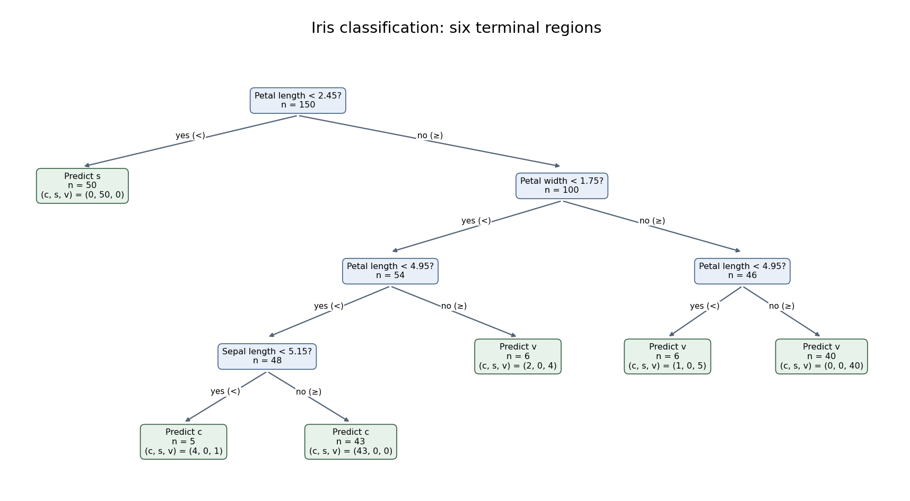

# Paper 39

↑ **Parent:** [Iii](../iii.md)

[https://www.maths.cam.ac.uk/postgrad/part-iii/files/pastpapers/2002/Paper39.pdf](https://www.maths.cam.ac.uk/postgrad/part-iii/files/pastpapers/2002/Paper39.pdf)

**Table of contents**

- [1](#1)
  - [i](#1/i)
    - [Solution](#1/i/solution)
  - [ii](#1/ii)
    - [Solution](#1/ii/solution)
- [2](#2)
  - [Solution](#2/solution)
- [3](#3)
  - [Solution](#3/solution)
- [4](#4)
  - [Solution](#4/solution)
- [5](#5)
  - [Solution](#5/solution)
- [6](#6)
  - [Solution](#6/solution)

## 1

↑ **Parent:** [Paper 39](paper-39.md)

<h3 id="1/i">i</h3>

↑ **Parent:** [1](#1)

<h4 id="1/i/solution">Solution</h4>

↑ **Parent:** [I](#1/i)

Work with a nonsingular [multivariate normal distribution](../../../probability-and-statistics.md#multivariate-normal-distribution), so $V$ is [positive-definite](../../../linear-algebra.md#positive-definite-bilinear-form). The claimed finite [maximum-likelihood estimates](../../../statistical-modelling.md#maximum-likelihood-estimator) also require the centered [sample covariance matrix](../../../variance.md#sample-covariance-matrix) to be nonsingular; the exceptional case is discussed below.

Independence gives, up to a constant, the [log-likelihood](../../../statistical-modelling.md#log-likelihood)

$$
\ell(\mu,V)=-\frac n2\log\det V
-\frac12\sum_{i=1}^n(Y_i-\mu)^TV^{-1}(Y_i-\mu).
$$

Let $\bar Y=n^{-1}\sum_iY_i$ and $S=n^{-1}\sum_i(Y_i-\bar Y)(Y_i-\bar Y)^T$. The centered sum is zero, and expansion therefore gives

$$
\sum_i(Y_i-\mu)(Y_i-\mu)^T
=nS+n(\bar Y-\mu)(\bar Y-\mu)^T.
$$

For every fixed [positive-definite matrix](../../../linear-algebra.md#positive-definite-matrix) $V$, the extra quadratic term in the [log-likelihood](../../../statistical-modelling.md#log-likelihood) is $-n(\bar Y-\mu)^TV^{-1}(\bar Y-\mu)/2$, with unique maximum at $\mu=\bar Y$.

Assume $S$ is [positive-definite](../../../linear-algebra.md#positive-definite-bilinear-form). Maximizing over $V$ now means minimizing $\log\det V+\operatorname{tr}(V^{-1}S)$. Put $A=S^{1/2}V^{-1}S^{1/2}$, another [positive-definite matrix](../../../linear-algebra.md#positive-definite-matrix). Then

$$
\log\det V+\operatorname{tr}(V^{-1}S)
=\log\det S-\log\det A+\operatorname{tr}A.
$$

If $a_1,\ldots,a_p>0$ are its [eigenvalues](../../../linear-operator-theory.md#eigenvalue), the variable part is $\sum_j(a_j-\log a_j)$. The scalar inequality $a-\log a\ge1$, with equality only at $a=1$, shows that this is minimized uniquely at $A=I$, or $V=S$. Thus

$$
\boxed{\widehat\mu=\bar Y,\qquad
\widehat V=S=\frac1n\sum_i(Y_i-\bar Y)(Y_i-\bar Y)^T.}
$$

The divisor is $n$ because this is [maximum likelihood estimation](../../../statistical-modelling.md#maximum-likelihood-estimation), not the unbiased [covariance](../../../variance.md#covariance) estimate with divisor $n-1$.

The nonsingularity condition matters. The centered scatter has [rank](../../../linear-algebra.md#rank-one-quadratic-form) at most $n-1$. If $S$ is singular, choose $\mu=\bar Y$, retain positive [covariance](../../../variance.md#covariance) [eigenvalues](../../../linear-operator-theory.md#eigenvalue) on its range and let a [covariance](../../../variance.md#covariance) [eigenvalue](../../../linear-operator-theory.md#eigenvalue) on its [null space](../../../linear-algebra.md#kernel-of-a-linear-map) tend to zero. The quadratic [likelihood](../../../statistical-modelling.md#likelihood-function) term remains finite, while $-\log\det V\to+\infty$. This is [singular covariance and nonexistence of a Gaussian maximum likelihood estimate](../../../statistical-modelling.md#singular-covariance-and-nonexistence-of-a-gaussian-maximum-likelihood-estimate): there is no finite maximizer over nonsingular $V$. Under a nonsingular [Gaussian](../../../probability-theory.md#normal-distribution) population, $S$ is positive definite almost surely when $n>p$; for $n\le p$ it is necessarily singular. The asserted estimate and the inverse in the next part have their usual meaning under $n>p$.

<h3 id="1/ii">ii</h3>

↑ **Parent:** [1](#1)

<h4 id="1/ii/solution">Solution</h4>

↑ **Parent:** [Ii](#1/ii)

By the [spectral theorem](../../../hilbert-space.md#spectral-theorem), write $V=U\operatorname{diag}(v_1,\ldots,v_p)U^T$, where $U$ is [orthogonal](../../../linear-algebra.md#orthogonal-vectors) and each $v_j>0$. Choose the [whitening transformation](../../../statistical-modelling.md#whitening-transformation)

$$
\boxed{L=V^{-1/2}=U\operatorname{diag}(v_1^{-1/2},\ldots,v_p^{-1/2})U^T.}
$$

A [linear image of a multivariate normal vector](../../../probability-and-statistics.md#linear-image-of-a-multivariate-normal-vector) is [multivariate normal](../../../probability-and-statistics.md#multivariate-normal-distribution), and $LVL^T=I$. Thus $Z_i=L(Y_i-\mu)$ are independent $N_p(0,I)$ [random vectors](../../../random-variable.md#random-vector). Their whole joint distribution is independent of $\mu,V$.

Define $\bar Z=n^{-1}\sum_iZ_i$ and $S_Z=n^{-1}\sum_i(Z_i-\bar Z)(Z_i-\bar Z)^T$. These satisfy

$$
\bar Z=L(\bar Y-\mu),\qquad S_Z=LSL^T,
\qquad S_Z^{-1}=L^{-T}S^{-1}L^{-1}.
$$

Therefore

$$
\boxed{(\bar Y-\mu)^TS^{-1}(\bar Y-\mu)
=\bar Z^TS_Z^{-1}\bar Z.}
$$

The right side is a function of independent standard [multivariate normal](../../../probability-and-statistics.md#multivariate-normal-distribution) observations only, so its distribution depends on $n,p$ but not on $\mu,V$. This is the same [affine invariance of Hotelling's statistic](../../../statistical-modelling.md#affine-invariance-of-hotelling-s-statistic) that permits multivariate mean tests with unknown [covariance](../../../variance.md#covariance). The proof concerns the jointly transformed mean and [covariance](../../../variance.md#covariance); whitening the mean alone would not establish the conclusion. Inverses exist almost surely under $n>p$. If $V$ is singular, no square [matrix](../../../vector-space.md#matrix) can whiten it to $I$, so nonsingularity of the population [covariance](../../../variance.md#covariance) is necessary as well.

## 2

↑ **Parent:** [Paper 39](paper-39.md)

<h3 id="2/solution">Solution</h3>

↑ **Parent:** [2](#2)

The calculation is [principal component analysis on a correlation matrix](../../../statistical-learning.md#principal-component-analysis-on-a-correlation-matrix), rather than on an unscaled [covariance matrix](../../../variance.md#covariance-matrix). For each of the eleven rating variables, subtract its column mean and divide by its column [standard deviation](../../../variance.md#standard-deviation). If $Z$ is the resulting $43\times11$ [matrix](../../../vector-space.md#matrix), use the divisor convention of the fitted object to write

$$
R=\frac1{43}Z^TZ,
\qquad R a_k=\lambda_k a_k,
\qquad a_k^Ta_\ell=\delta_{k\ell},
\qquad\lambda_1\ge\cdots\ge\lambda_{11}\ge0.
$$

Here the scaling [standard deviations](../../../variance.md#standard-deviation) use divisor $43$, consistently with this convention. Using sample [standard deviations](../../../variance.md#standard-deviation) with divisor $42$ gives the same [correlation matrix](../../../variance.md#correlation-matrix) and directions, with the corresponding score scale. Every diagonal entry of $R$ is one, so $\sum_k\lambda_k=\operatorname{tr}R=11$.

A [principal component](../../../statistical-learning.md#principal-component) is the [linear combination](../../../vector-space.md#linear-combination) of the standardized ratings along $a_k$. Its [principal component score](../../../statistical-learning.md#principal-component-score) for judge $i$ is $t_{ik}=z_i^Ta_k$, and its [variance](../../../variance.md) is $\lambda_k$. The displayed component [standard deviations](../../../variance.md#standard-deviation) are $\sqrt{\lambda_k}$; the [explained variance of a principal component](../../../statistical-learning.md#explained-variance-of-a-principal-component) is $\lambda_k/11$. In particular,

$$
\lambda_1\simeq(3.1833029)^2\simeq10.1334,\qquad
\lambda_2\simeq(0.65163561)^2\simeq0.424629.
$$

The first component explains about $92.122\%$ of the standardized variation, and the first two jointly explain **$95.982\%$**. Components three, four and five add about $2.321\%$, $0.830\%$ and $0.339\%$. The cumulative line adds these proportions successively; it is not the proportion explained by that component alone. Retaining two components discards about $4.018\%$ of the total standardized squared variation.

The displayed [principal component loadings](../../../statistical-learning.md#principal-component-loading) are the unit [eigenvector](../../../linear-operator-theory.md#eigenvector) coefficients $a_{jk}$. The first direction has positive, broadly similar weights for all ratings. It measures an overall favorable-rating tendency: a judge high on most ratings has a high first score. The second direction compares integrity and demeanour, with large positive coefficients, against such attributes as decision promptness, case-flow management and physical ability, with negative coefficients. Thus among similarly rated judges, a positive second score indicates relatively stronger integrity/demeanour compared with those operational ratings. This is a description of a data direction, not a causal interpretation. Multiplying a whole [eigenvector](../../../linear-operator-theory.md#eigenvector) and its scores by minus one reflects the display but changes nothing substantive.

These [principal component loadings](../../../statistical-learning.md#principal-component-loading) are not themselves variable-component correlations. With standardized variables,

$$
\operatorname{Cov}(Z_j,a_k^TZ)=\lambda_k a_{jk},
\qquad\operatorname{Corr}(Z_j,a_k^TZ)=\sqrt{\lambda_k}\,a_{jk}.
$$

For example, the integrity correlation with component one is approximately $3.1833\times0.289\simeq0.920$. Blank loadings in the printed second column indicate suppressed small entries, not exact zeros. The complete unrounded loading vectors in the fitted object must be used to calculate scores.

A two-dimensional representation plots the 43 pairs

$$
\boxed{(t_{i1},t_{i2})=(z_i^Ta_1,z_i^Ta_2),\qquad i=1,\ldots,43,}
$$

with each point labeled by its judge. In the fitted software object these are the first two columns of the score [matrix](../../../vector-space.md#matrix). Nearby points have similar projections of their standardized ratings. The rank-two reconstruction $\widehat z_i=t_{i1}a_1+t_{i2}a_2$ is the [orthogonal projection](../../../hilbert-space.md#orthogonal-projection) onto the leading principal plane and minimizes the total squared reconstruction error over all two-dimensional linear subspaces. To see this, for any orthonormal pair of directions the captured [variance](../../../variance.md) is the sum of its two Rayleigh quotients, at most $\lambda_1+\lambda_2$ by diagonalizing $R$; the remaining [variance](../../../variance.md) is the total minus that captured sum. Distances in the plot omit the smaller components, so a close projected pair need not be equally close in every original rating. The actual 43 coordinates cannot be recovered from the summary alone; the supplied data [matrix](../../../vector-space.md#matrix) or fitted score [matrix](../../../vector-space.md#matrix) is needed.

The printed descriptive list omits INTG, although the loading table includes it. INTG denotes integrity and supplies the eleventh variable. The standard data set also contains a contacts variable; the stated eleven-rating analysis uses the ratings, not contacts.

## 3

↑ **Parent:** [Paper 39](paper-39.md)

<h3 id="3/solution">Solution</h3>

↑ **Parent:** [3](#3)

The response is the species [categorical variable](../../../statistical-modelling.md#categorical-variable), while the four measurements are candidate predictors. The dot in the formula means all other columns of the data frame. The fitted object is a [classification tree](../../../statistical-learning.md#classification-tree): it recursively partitions predictor space by binary threshold rules and assigns a species and class-probability vector to each terminal region. Sepal width was available but was not selected in the displayed tree.

At a node $t$, let $n_{tk}$ be the number of observations of class $k$ and $n_t=\sum_kn_{tk}$. The [multinomial likelihood](../../../discrete-probability-distribution.md#multinomial-likelihood) is maximized by $\widehat p_{tk}=n_{tk}/n_t$. The fitted class is one attaining the largest proportion, with a software convention resolving ties. The [classification-tree deviance](../../../statistical-learning.md#classification-tree-deviance) is

$$
D(t)=-2\sum_kn_{tk}\log\widehat p_{tk},\qquad0\log0=0.
$$

A pure node has zero deviance. At each nonterminal node, consider candidate split points between distinct observed predictor values, and choose the split with the largest decrease $D(t)-D(t_L)-D(t_R)$. Repeating this local maximization constructs a binary [decision tree](../../../computer-science.md#decision-tree); it does not solve a global optimization over all trees. Growth stops when nodes are pure or size/deviance controls prohibit further splitting. Mixed leaves with five or six observations can therefore remain. The node number $j$ has children $2j$ and $2j+1$, and a terminal-node marker means that no further split was retained.

The [probability](../../../probability-theory.md#probability) triples are in class order $(c,s,v)$, not $(s,c,v)$. For example, the pure left leaf has [probability](../../../probability-theory.md#probability) vector $(0,1,0)$ and predicts $s$, while the 54-observation node has counts $(49,0,5)$ and predicts $c$. The root counts are $(50,50,50)$, giving $D=300\log3\simeq329.584$ and a tied majority class. Its reported choice of $c$ does not indicate a more common class.

The complete derived decision rule is shown below. Each leaf includes its fitted class and the observed class counts, so both the branching logic and its remaining errors are visible. For the observed data, the printed strict inequalities leave no equality cases because the thresholds fall between measurement values. A consistent right-branch convention at equality extends the rule to new specimens.

**[Figure 1](#3/image-six-leaf-iris-classification-tree-with-fitted-classes-and-class-counts-at-every-terminal-node). Six-leaf iris classification tree with fitted classes and class counts at every terminal node**.

The six terminal nodes contain the class counts

$$
\begin{array}{c|r|rrr|c|r}
\text{node}&n&c&s&v&\text{prediction}&\text{errors}\\\hline
2&50&0&50&0&s&0\\
24&5&4&0&1&c&1\\
25&43&43&0&0&c&0\\
13&6&2&0&4&v&2\\
14&6&1&0&5&v&1\\
15&40&0&0&40&v&0
\end{array}
$$

Thus the training [misclassification error](../../../statistical-learning.md#misclassification-rate) is

$$
\boxed{\frac{1+2+1}{150}=\frac4{150}\simeq0.02667.}
$$

The terminal [classification-tree deviance](../../../statistical-learning.md#classification-tree-deviance) is instead

$$
\begin{aligned}
D_{\mathrm{tree}}={}&-2\left(4\log\frac45+\log\frac15\right)
-2\left(2\log\frac26+4\log\frac46\right)\\
&-2\left(\log\frac16+5\log\frac56\right)
\simeq5.004+7.638+5.407=18.049.
\end{aligned}
$$

The displayed residual mean deviance divides this by $150-6=144$, yielding approximately $0.1253$. This is the summary's reporting convention, not a normal-error residual mean square or an automatic chi-squared calibration with 144 [statistical degrees of freedom](../../../statistical-inference.md#statistical-degrees-of-freedom). The two summary measures answer different questions: deviance depends on the fitted [probability](../../../probability-theory.md#probability) of each observed class, while misclassification counts only whether the majority-class prediction is correct. Both are training quantities. [Cross-validation](../../../statistical-learning.md#cross-validation) or independent test data, rather than the displayed training error, are needed to assess prediction on new specimens; [cost-complexity tree pruning](../../../statistical-learning.md#cost-complexity-tree-pruning) can select a less elaborate tree if predictive performance warrants it.

## 4

↑ **Parent:** [Paper 39](paper-39.md)

<h3 id="4/solution">Solution</h3>

↑ **Parent:** [4](#4)

A [randomized complete block design](../../../statistical-modelling.md#randomized-complete-block-design) groups similar [experimental units](../../../statistical-modelling.md#experimental-unit) into [experimental blocks](../../../statistical-modelling.md#blocks-in-experimental-design) and places every [treatment](../../../causal-inference.md#treatment) once in each [experimental block](../../../statistical-modelling.md#blocks-in-experimental-design), independently randomizing [treatment](../../../causal-inference.md#treatment) allocation within [experimental blocks](../../../statistical-modelling.md#blocks-in-experimental-design). Blocking removes background between-block variation from within-block [treatment](../../../causal-inference.md#treatment) comparisons. A [balanced incomplete block design](../../../statistical-modelling.md#balanced-incomplete-block-design) has $v$ [treatments](../../../causal-inference.md#treatment) and $b$ [experimental blocks](../../../statistical-modelling.md#blocks-in-experimental-design) of size $k<v$, with each [treatment](../../../causal-inference.md#treatment) occurring in $r$ [experimental blocks](../../../statistical-modelling.md#blocks-in-experimental-design) and every distinct [treatment](../../../causal-inference.md#treatment) pair together in $\lambda$ [experimental blocks](../../../statistical-modelling.md#blocks-in-experimental-design). Counting [treatment](../../../causal-inference.md#treatment) occurrences and co-occurrences gives $vr=bk$ and $r(k-1)=\lambda(v-1)$.

A [Latin square](../../../statistical-modelling.md#latin-square) of order $q$ places each of $q$ [treatment](../../../causal-inference.md#treatment) symbols once in every row and every column of a $q\times q$ array. This controls two nuisance directions. A [Graeco-Latin square](../../../statistical-modelling.md#graeco-latin-square) superposes two [mutually orthogonal Latin squares](../../../statistical-modelling.md#mutually-orthogonal-latin-squares): each square is Latin, and each ordered pair of symbols from the two squares occurs exactly once. The two symbol factors can then be fitted together with row and column effects. Random permutations of row labels, column labels and [treatment](../../../causal-inference.md#treatment) symbols provide a suitable randomized allocation without destroying these balances.

For the operator experiment, fit the additive [normal linear model](../../../statistical-modelling.md#normal-linear-model)

$$
Y_{ij}=\mu+r_i+c_j+\tau_{o(i,j)}+\epsilon_{ij},
\qquad\sum_ir_i=\sum_jc_j=\sum_o\tau_o=0,
\qquad\epsilon_{ij}\overset{\mathrm{iid}}\sim N(0,\sigma^2).
$$

Here $r_i,c_j$ account for the two fabric directions, and $\tau_o$ is the operator effect. Additivity, independent equal-variance errors and the [normal](../../../probability-theory.md#normal-distribution) assumption supply the exact [F-test](../../../probability-and-statistics.md#f-test); there is only one observation per cell, so an unrestricted [interaction](../../../statistical-model.md#interaction-statistics) model is not available.

In the [analysis of variance for a Latin square](../../../statistical-modelling.md#analysis-of-variance-for-a-latin-square), the three centered factor spaces each have dimension $4-1=3$. Together with the [intercept](../../../linear-regression.md#regression-intercept) the model has [rank](../../../linear-algebra.md#rank-one-quadratic-form) ten, leaving $16-10=6$ residual [statistical degrees of freedom](../../../statistical-inference.md#statistical-degrees-of-freedom). The corrected total has $16-1=15$. The completed calculation is

$$
\begin{array}{c|r|r|r}
\text{source}&\text{df}&\text{SS}&\text{MS}\\\hline
\text{row}&3&5.00&5/3\\
\text{column}&3&8.50&8.5/3\\
\text{operator}&3&18.25&18.25/3\\
\text{residual}&6&17.25&17.25/6=2.875\\
\text{corrected total}&15&49.00&
\end{array}
$$

Under the [null hypothesis](../../../statistical-modelling.md#null-hypothesis) $\tau_1=\cdots=\tau_4=0$, the operator [F-statistic](../../../probability-and-statistics.md#f-statistic) is

$$
\boxed{F=\frac{18.25/3}{17.25/6}\simeq2.116.}
$$

The upper five-percent critical value for $F_{3,6}$ is $4.76$, so **the operator effect is not significant at five percent** in this model.

The decision is independent of the order of fitting rows, columns and operators. To prove the required [orthogonality](../../../linear-algebra.md#orthogonal-vectors), let $u_i$ be any centered row coefficients and $w_o$ any centered operator coefficients. Their observation-space [inner product](../../../linear-algebra.md#inner-product) is $\sum_{i,j}u_iw_{o(i,j)}=\sum_i u_i\sum_o w_o=0$, since every operator occurs once in each row. The same calculation applies to columns and operators, and all row-column pairs occur once as well. Thus the three centered spaces are mutually [orthogonal](../../../linear-algebra.md#orthogonal-vectors); their projections commute and sequential sums of squares equal adjusted sums of squares in every fitting order.

With machines included, the layout is a [Graeco-Latin square](../../../statistical-modelling.md#graeco-latin-square): the machine symbols are Latin, and all sixteen operator-machine pairs occur exactly once. Fit

$$
Y_{ij}=\mu+r_i+c_j+\tau_{o(i,j)}+\eta_{m(i,j)}+\epsilon_{ij},
\qquad\sum_m\eta_m=0
$$

in addition to the earlier constraints. The machine space contributes three new [statistical degrees of freedom](../../../statistical-inference.md#statistical-degrees-of-freedom) and is [orthogonal](../../../linear-algebra.md#orthogonal-vectors) to the previous factor spaces, so the operator sum of squares remains $18.25$. The residual sum of squares and [statistical degrees of freedom](../../../statistical-inference.md#statistical-degrees-of-freedom) become

$$
\operatorname{SSE}_{\mathrm{new}}=17.25-16.50=0.75,
\qquad\nu_{\mathrm{new}}=6-3=3.
$$

Hence

$$
\boxed{F_{\mathrm{operator}}=\frac{18.25/3}{0.75/3}=\frac{73}{3}\simeq24.333.}
$$

This exceeds $F_{3,3}(0.05)=9.28$ but not $F_{3,3}(0.01)=29.46$. Therefore **the operator effect is now significant at five percent, but not at one percent**. Adjustment for machines has removed substantial residual variation without altering the operator numerator. This illustrates why a balanced nuisance factor can change precision and significance even when it does not change the estimated [treatment](../../../causal-inference.md#treatment) [contrasts](../../../statistical-modelling.md#contrast-statistics).

## 5

↑ **Parent:** [Paper 39](paper-39.md)

<h3 id="5/solution">Solution</h3>

↑ **Parent:** [5](#5)

Code each factor level by $x_j\in\{-1,1\}$. A nonconstant [factorial contrast](../../../statistical-modelling.md#factorial-contrast) indexed by a nonempty factor set $A$ has sign column $g_A(x)=\prod_{j\in A}x_j$. Flipping any coordinate in $A$ reverses that sign and pairs the [treatment](../../../causal-inference.md#treatment) combinations, so exactly $2^{m-1}$ have each sign. Allocating the two signs to two [experimental blocks](../../../statistical-modelling.md#blocks-in-experimental-design) therefore divides the full [factorial design](../../../statistical-modelling.md#factorial-design) into equal [experimental blocks](../../../statistical-modelling.md#blocks-in-experimental-design). The [contrast](../../../statistical-modelling.md#contrast-statistics) is confounded with [experimental blocks](../../../statistical-modelling.md#blocks-in-experimental-design) because its column is constant within each [experimental block](../../../statistical-modelling.md#blocks-in-experimental-design): changing its coefficient and compensating by the two [experimental block](../../../statistical-modelling.md#blocks-in-experimental-design) [intercepts](../../../linear-regression.md#regression-intercept) leaves every fitted value unchanged. It has no information separate from [experimental block](../../../statistical-modelling.md#blocks-in-experimental-design) differences. Randomize the allocation of the two groups to days and the run order within days.

Write $A,B,C$ for temperature, pressure and catalyst, respectively, with low levels and catalyst one coded minus. In the supplied allocation, $ABC=-1$ on day one and $ABC=1$ on day two. Thus **the three-factor [interaction](../../../statistical-model.md#interaction-statistics) $ABC$ is confounded with days**. Every other nonconstant factorial column is [orthogonal](../../../linear-algebra.md#orthogonal-vectors) to the day [contrast](../../../statistical-modelling.md#contrast-statistics), because its product with $ABC$ is a nonconstant sign column on the full cube and consequently sums to zero.

If all [interactions](../../../statistical-model.md#interaction-statistics) are negligible, the fitted model contains an [intercept](../../../linear-regression.md#regression-intercept), one day [contrast](../../../statistical-modelling.md#contrast-statistics) and the three [main effects](../../../statistical-modelling.md#main-effect). The corrected total [statistical degrees of freedom](../../../statistical-inference.md#statistical-degrees-of-freedom) partition as

$$
\boxed{7=1\ \text{(days)}+1\ \text{(temperature)}+1\ \text{(pressure)}
+1\ \text{(catalyst)}+3\ \text{(residual)}.}
$$

The three residual [statistical degrees of freedom](../../../statistical-inference.md#statistical-degrees-of-freedom) are the unused [two-factor interaction](../../../statistical-model.md#two-factor-interaction) columns $AB,AC,BC$, pooled as error under the stated negligible-interaction assumption. There is no independent pure-error replication of [treatment](../../../causal-inference.md#treatment) combinations.

For four days with two runs each, **all three [main effects](../../../statistical-modelling.md#main-effect) can be estimated**. One regular allocation pairs each [treatment](../../../causal-inference.md#treatment) combination with its complete opposite:

$$
\begin{array}{c|cc}
\text{block}&\text{first }(A,B,C)&\text{second }(A,B,C)\\\hline
1&(-,-,-)&(+,+,+)\\
2&(-,-,+)&(+,+,-)\\
3&(-,+,-)&(+,-,+)\\
4&(-,+,+)&(+,-,-)
\end{array}
$$

The block-generating columns can be $AB$ and $AC$; their product $BC$ is also constant in [experimental blocks](../../../statistical-modelling.md#blocks-in-experimental-design). Thus $AB,AC,BC$ span the three [experimental block](../../../statistical-modelling.md#blocks-in-experimental-design) [contrasts](../../../statistical-modelling.md#contrast-statistics), while $A,B,C$ and $ABC$ vary within [experimental blocks](../../../statistical-modelling.md#blocks-in-experimental-design). The [main effects](../../../statistical-modelling.md#main-effect) remain mutually [orthogonal](../../../linear-algebra.md#orthogonal-vectors) and separate from the [experimental block](../../../statistical-modelling.md#blocks-in-experimental-design) effects; with an additive main-effect model there is one residual degree of freedom, represented by $ABC$.

For the further request about $AC$, the distinction between regular confounding and unrestricted pairing is important. **A regular four-block allocation cannot retain all three [main effects](../../../statistical-modelling.md#main-effect) and $AC$.** Its three confounded columns form a rank-two defining subgroup. To preserve [main effects](../../../statistical-modelling.md#main-effect), these columns must lie in $\{AB,AC,BC,ABC\}$. If the subgroup includes $ABC$ and a two-factor column, their product is a main-effect column, which is forbidden. Hence the only permissible nonidentity subgroup is $\{AB,AC,BC\}$, and it necessarily confounds $AC$. This proves impossibility in the usual regular factorial-blocking framework, rather than relying on a count of available [statistical degrees of freedom](../../../statistical-inference.md#statistical-degrees-of-freedom).

The literal request does not explicitly restrict arrangements to regular [experimental blocks](../../../statistical-modelling.md#blocks-in-experimental-design). If arbitrary pairings are permitted, a nonregular construction can estimate $A,B,C,AC$ together, assuming the other [interactions](../../../statistical-model.md#interaction-statistics) are omitted from the model. An explicit allocation is

$$
\begin{array}{c|cc}
\text{block}&\text{first }(A,B,C)&\text{second }(A,B,C)\\\hline
1&(-,-,-)&(-,-,+)\\
2&(-,+,-)&(+,-,-)\\
3&(-,+,+)&(+,+,+)\\
4&(+,-,+)&(+,+,-)
\end{array}
$$

Every [treatment](../../../causal-inference.md#treatment) combination occurs exactly once. Fit one unrestricted [intercept](../../../linear-regression.md#regression-intercept) per day and the four coefficients $\beta_A,\beta_B,\beta_C,\beta_{AC}$. By [estimability from within-block differences](../../../statistical-modelling.md#estimability-from-within-block-differences), subtracting the second run from the first in each [experimental block](../../../statistical-modelling.md#blocks-in-experimental-design) removes all day effects and yields the coefficient [matrix](../../../vector-space.md#matrix)

$$
D=\begin{pmatrix}
0&0&-2&2\\
-2&2&0&2\\
-2&0&0&-2\\
0&-2&2&2
\end{pmatrix},\qquad\det D=-64\ne0.
$$

Thus all four coefficients are uniquely determined from the four day differences. In this broader design class the answer is **yes, under the reduced four-effect model**. The resulting fit is saturated: four [experimental block](../../../statistical-modelling.md#blocks-in-experimental-design) [intercepts](../../../linear-regression.md#regression-intercept) plus four [treatment](../../../causal-inference.md#treatment) coefficients use all eight observations, leaving no residual estimate of error [variance](../../../variance.md). Replication or external error information would be needed for inference. This does not contradict the impossibility for regular [orthogonal](../../../linear-algebra.md#orthogonal-vectors) confounding, and it does not claim simultaneous unbiased estimation when arbitrary additional [interactions](../../../statistical-model.md#interaction-statistics) are retained.

## 6

↑ **Parent:** [Paper 39](paper-39.md)

<h3 id="6/solution">Solution</h3>

↑ **Parent:** [6](#6)

Let $f(x)=(f_1(x),\ldots,f_p(x))^T$ and let an [approximate experimental design](../../../statistical-modelling.md#approximate-experimental-design) $\xi$ specify the proportions of observations allocated to points of the design region. Its normalized [information matrix of an experimental design](../../../statistical-modelling.md#information-matrix-of-an-experimental-design) is

$$
M(\xi)=\int f(x)f(x)^T\,d\xi(x).
$$

For $N$ independent equal-variance observations realizing those proportions, $X^TX=NM(\xi)$, and the [least-squares estimator](../../../statistical-modelling.md#ordinary-least-squares-estimators) has [covariance matrix](../../../variance.md#covariance-matrix) $\sigma^2M(\xi)^{-1}/N$. A [D-optimal design](../../../statistical-modelling.md#d-optimal-design) maximizes $\det M(\xi)$, equivalently minimizing the [determinant](../../../linear-algebra.md#determinant) of this [covariance](../../../variance.md#covariance) at fixed $N$. A [G-optimal design](../../../statistical-modelling.md#g-optimal-design) minimizes the largest [variance of a fitted regression mean](../../../statistical-modelling.md#variance-of-a-fitted-regression-mean) over the design region, equivalently

$$
\sup_x d(x,\xi),\qquad d(x,\xi)=f(x)^TM(\xi)^{-1}f(x),
$$

where $d$ is the [design sensitivity function](../../../statistical-modelling.md#design-sensitivity-function). This is the [variance](../../../variance.md) of the estimated mean multiplied by $N/\sigma^2$, not the [variance](../../../variance.md) of a new noisy observation.

For continuous regressors spanning a $p$-dimensional parameter space on a compact design region, the [general equivalence theorem for optimal design](../../../statistical-modelling.md#general-equivalence-theorem-for-optimal-design) states that, among approximate designs with nonsingular information [matrices](../../../vector-space.md#matrix), the following are equivalent: being a [D-optimal design](../../../statistical-modelling.md#d-optimal-design), being a [G-optimal design](../../../statistical-modelling.md#g-optimal-design), and

$$
\boxed{\sup_x d(x,\xi)=p.}
$$

At every support point of an optimal design, $d=p$. To see the criterion, the sensitivity average is $\int d\,d\xi=\operatorname{tr}(M^{-1}M)=p$, so the supremum is at least $p$. Adding an infinitesimal allocation at $x$ has directional derivative $d(x,\xi)-p$ for $\log\det M$. At a D-optimum each derivative is nonpositive. Conversely, if all sensitivities are at most $p$, the tangent bound for the concave function $\log\det M$ shows that no competing design increases it. A nonsingular D-optimum exists by the spanning assumption and compactness of the information-matrix set, so the smallest possible G-value is also $p$. Equality at support points follows from the average. The theorem refers to the full approximate-design class; constrained integer allocations or mandated augmentations require separate comparison.

For the linear mean $\beta_0+\beta_1x_1+\beta_2x_2$, take $f(x)=(1,x_1,x_2)^T$. Equal replication at the four corners gives

$$
X^TX=4mI_3.
$$

All odd corner sums and the sum of $x_1x_2$ vanish, while each squared regressor sum is $4m$. If $\bar Y_{ab}$ is the mean of the $m$ observations at $(a,b)$, $a,b\in\{-1,1\}$, the [least-squares normal equations](../../../linear-regression.md#normal-equations-for-linear-least-squares) give

$$
\boxed{\widehat\beta=\frac14\sum_{a,b\in\{-1,1\}}\bar Y_{ab}
\begin{pmatrix}1\\a\\b\end{pmatrix},\qquad
\operatorname{Cov}(\widehat\beta)=\frac{\sigma^2}{4m}I_3.}
$$

In particular the [intercept](../../../linear-regression.md#regression-intercept) is the average of the four cell means, and each slope is the average of its sign-weighted cell means. Independence and equal error [variance](../../../variance.md) suffice for this [covariance](../../../variance.md#covariance) formula; [normal](../../../probability-theory.md#normal-distribution) errors are not needed for it.

The normalized corner design has $M=I_3$, so its sensitivity is

$$
d(x,\xi)=1+x_1^2+x_2^2\le3\qquad\text{on }[-1,1]^2,
$$

with equality at all four corners. Since $p=3$, the [general equivalence theorem for optimal design](../../../statistical-modelling.md#general-equivalence-theorem-for-optimal-design) proves that **the equally weighted corner design is D-optimal and G-optimal**.

For the augmentation, all $m$ added observations share the regressor $f=(1,x_1,x_2)^T$. The enlarged [design matrix](../../../linear-regression.md#design-matrix) satisfies

$$
\widetilde X^T\widetilde X=m(4I_3+ff^T).
$$

By the [matrix determinant lemma](../../../linear-algebra.md#matrix-determinant-lemma),

$$
\begin{aligned}
\det(\widetilde X^T\widetilde X)
&=m^3\det(4I_3)\left(1+f^T(4I_3)^{-1}f\right)\\
&=64m^3\left(1+\frac{1+x_1^2+x_2^2}{4}\right)
=16m^3(5+x_1^2+x_2^2).
\end{aligned}
$$

For the permitted nine points, the [determinant](../../../linear-algebra.md#determinant) is $80m^3$ at the center, $96m^3$ at an edge midpoint and $112m^3$ at a corner. Therefore

$$
\boxed{(x_1,x_2)\in\{(-1,-1),(-1,1),(1,-1),(1,1)\},
\qquad\det(\widetilde X^T\widetilde X)=112m^3.}
$$

All four corners tie for the best mandated single-point augmentation. This is optimality among the specified augmented designs, not unrestricted D-optimality with $5m$ observations: the resulting normalized [determinant](../../../linear-algebra.md#determinant) is $112/125<1$, whereas equal corner proportions have [determinant](../../../linear-algebra.md#determinant) one. The restriction that the extra $m$ runs all occur at one point is what prevents recovering equal proportions.

## ↑ Ancestors (8)

1. [Iii](../iii.md)
2. [2002](../../2002.md)
3. [Past exam of the mathematics course of the University of Cambridge](../../../past-exam-of-the-mathematics-course-of-the-university-of-cambridge.md)
4. [Mathematics course of the University of Cambridge](../../../university-of-cambridge.md#mathematics-course-of-the-university-of-cambridge)
5. [Course of the University of Cambridge](../../../university-of-cambridge.md#course-of-the-university-of-cambridge)
6. [University of Cambridge](../../../university-of-cambridge.md)
7. [List of universities](../../../README.md#list-of-universities)
8. [Codex Wiki](../../../README.md)
