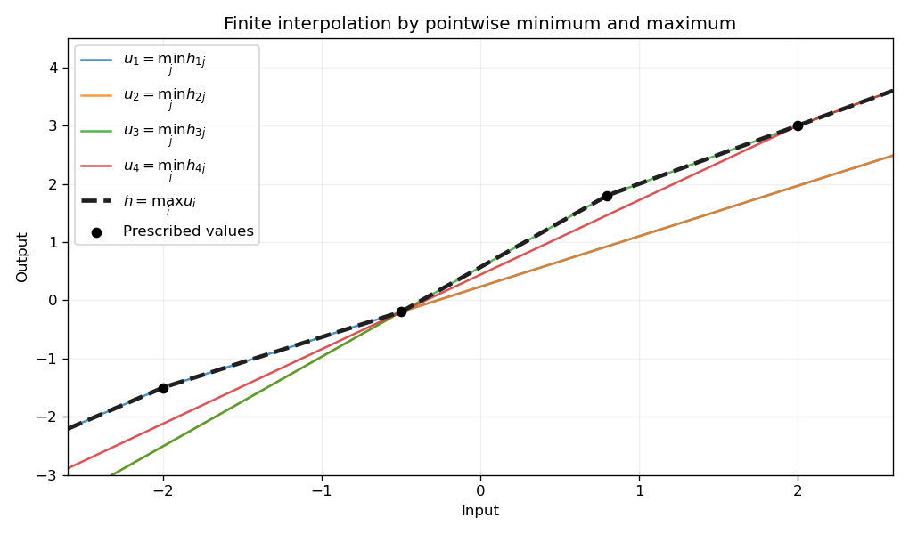

<h1 id="3/b/solution">Solution</h1>

↑ **Parent:** [B](../b.md)

Here transitivity is [order n-transitivity](../../../../../../order-n-transitivity.md): increasing tuples are compared, rather than arbitrary reorderings. For increasing tuples $\alpha_1<\cdots<\alpha_n$ and $\beta_1<\cdots<\beta_n$, choose $h_{ij}$ sending both $\alpha_i$ to $\beta_i$ and $\alpha_j$ to $\beta_j$ when $i\ne j$, using order two-transitivity. For $i=j$, choose an element sending the single point to its target, using transitivity. Define

$$
\boxed{h=\bigvee_{i=1}^n\bigwedge_{j=1}^nh_{ij}}.
$$

**[Figure 1](#3/b/image-finite-order-interpolation-constructed-from-pointwise-minima-and-maxima). Finite order interpolation constructed from pointwise minima and maxima**.

This belongs to the [lattice-ordered permutation group](../../../../../../lattice-ordered-permutation-group.md). At $\alpha_i$, all terms in its $i$th inner [meet](../../../../../../greatest-lower-bound-in-a-partially-ordered-set.md) equal $\beta_i$. At $\alpha_k$, every inner [meet](../../../../../../greatest-lower-bound-in-a-partially-ordered-set.md) is at most $\beta_k$, because its $j=k$ term takes that value. The outer [join](../../../../../../least-upper-bound-in-a-partially-ordered-set.md) is consequently exactly $\beta_k$ there. Thus $h$ maps the whole tuple to its target. This [finite interpolation by lattice operations](../../../../../../finite-interpolation-by-lattice-operations.md) proves every finite order-transitivity without assuming the group permits arbitrary cut-and-paste restrictions of its elements.

## ↑ Ancestors (11)

1. [B](../b.md)
2. [3](../../3.md)
3. [Paper 4](../../../paper-4-split.md)
4. [Iii](../../../split.md)
5. [2002](../../../../split.md)
6. [Past exam of the mathematics course of the University of Cambridge](../../../../../split.md)
7. [Mathematics course of the University of Cambridge](../../../../../../mathematics-course-of-the-university-of-cambridge.md)
8. [Course of the University of Cambridge](../../../../../../course-of-the-university-of-cambridge.md)
9. [University of Cambridge](../../../../../../university-of-cambridge-split.md)
10. [List of universities](../../../../../../list-of-universities.md)
11. [Codex Wiki](../../../../../../split.md)
