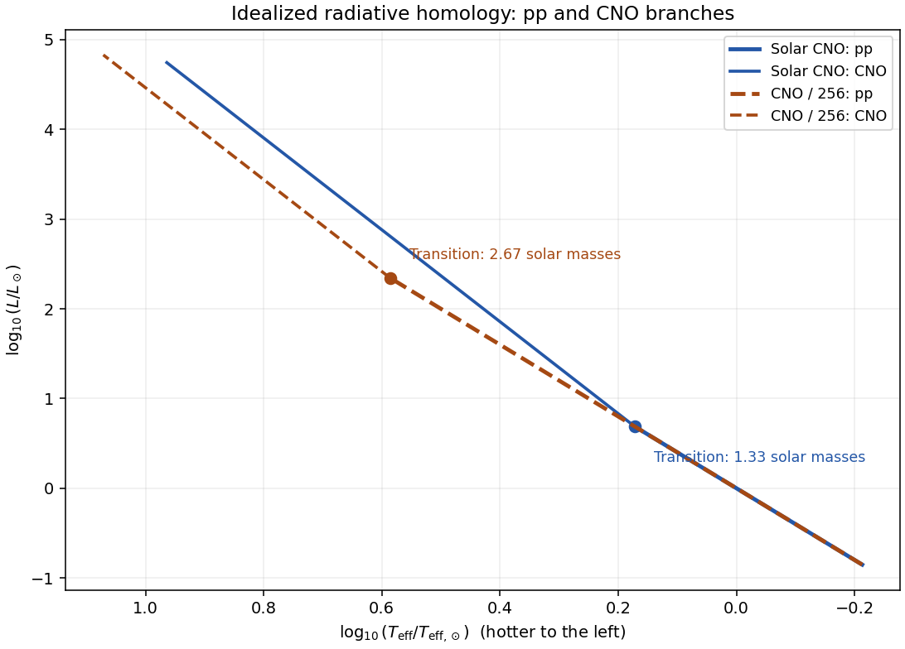

<h1 id="2/solution">Solution</h1>

↑ **Parent:** [2](../2.md)

In [stellar homology](../../../../../stellar-homology.md), write $r=Rx$, $m=Mf(x)$ and $\rho=\rho_c h(x)$, with common dimensionless profiles. Integrating [hydrostatic equilibrium](../../../../../hydrostatic-equilibrium.md) from the surface, where the [pressure](../../../../../pressure.md) is negligible, gives

$$
P_c=\frac{GM\rho_c}{R}\int_0^1\frac{f(x)h(x)}{x^2}\,dx.
$$

The profile integral is common to the sequence. Similarly, [mass conservation](../../../../../mass-conservation.md) gives $M=4\pi\rho_cR^3\int_0^1x^2h(x)dx$. These prove the [homology scaling of central stellar pressure](../../../../../homology-scaling-of-central-stellar-pressure.md):

$$
\rho_c\propto\frac{M}{R^3},\qquad P_c\propto\frac{GM\rho_c}{R}\propto\frac{GM^2}{R^4}.
$$

The [ideal gas law](../../../../../ideal-gas-law.md) consequently gives $T_c\propto\mu M/R$, with the gravitational and gas constants absorbed into the coefficient.

The [radiative diffusion in a star](../../../../../radiative-diffusion-in-a-star.md) equation has a characteristic gradient $T_c/R$. Hence $L\propto RT_c^4/(\kappa_c\rho_c)$. Using [Kramers' opacity law](../../../../../kramers-opacity-law.md), and comparing fixed-composition homologous models, this becomes

$$
L_{\rm rad}\propto\frac{RT_c^{15/2}}{\kappa_0\rho_c^2}
\propto\kappa_0^{-1}\mu^{15/2}M^{11/2}R^{-1/2}.
$$

The volume integral of the [stellar energy-generation rate](../../../../../stellar-energy-generation-rate.md) $\epsilon=\epsilon_0\rho T^\nu$ instead gives

$$
L_{\rm nuc}\propto M\epsilon_0\rho_cT_c^\nu
\propto\epsilon_0\mu^\nu M^{\nu+2}R^{-\nu-3}.
$$

The dimensionless integrals behind these relations do not depend on $M$ along a homologous sequence. In [stellar thermal equilibrium](../../../../../stellar-thermal-equilibrium.md) the two [luminosities](../../../../../luminosity.md) agree, proving [Kramers homology with a variable nuclear exponent](../../../../../kramers-homology-with-a-variable-nuclear-exponent.md):

$$
R^{\nu+5/2}\propto\epsilon_0\kappa_0\mu^{\nu-15/2}M^{\nu-7/2}.
$$

For the specified [proton–proton chain](../../../../../proton-proton-chain.md) exponent $\nu=7/2$, the mass factor cancels. Thus

$$
\boxed{R=\text{constant},\qquad L\propto M^{11/2}.}
$$

The model captures two important features of the [lower main sequence](../../../../../lower-main-sequence.md): [hydrogen burning](../../../../../hydrogen-burning.md) primarily uses the [proton–proton chain](../../../../../proton-proton-chain.md), and gas rather than [radiation pressure](../../../../../radiation-pressure.md) supplies the principal support. A radiative interior and a [Kramers' opacity law](../../../../../kramers-opacity-law.md) approximation are useful near the Sun. It is a simplified local model: the Sun has a convective envelope, the coolest [main sequence](../../../../../main-sequence.md) stars become fully convective, and real [opacities](../../../../../opacity.md) and burning exponents vary. In particular a literally constant radius is not a realistic law over the entire [lower main sequence](../../../../../lower-main-sequence.md).

On this [proton–proton chain](../../../../../proton-proton-chain.md) branch $T_c\propto M$, because $R$ and [mean molecular weight](../../../../../mean-molecular-weight.md) are fixed. Normalizing to the Sun gives the upper mass estimate

$$
\boxed{M_*\simeq\frac{2\times10^7}{1.5\times10^7}M_\odot=\frac43M_\odot.}
$$

For the specified [CNO cycle](../../../../../cno-cycle.md) exponent $\nu=23/2$, the homology relation instead reads $R^{14}\propto M^8$. Substituting into the radiative [luminosity](../../../../../luminosity.md) relation gives

$$
\boxed{R\propto M^{4/7},\qquad L\propto M^{73/14},\qquad T_c\propto M^{3/7}.}
$$

This branch retains the deliberately idealized fully radiative assumptions, even though real [CNO cycle](../../../../../cno-cycle.md) cores are often convective.

For a [Hertzsprung-Russell diagram](../../../../../hertzsprung-russell-diagram.md), use the [Stefan–Boltzmann law](../../../../../stefan-boltzmann-law.md), $L=4\pi R^2\sigma T_{\rm eff}^4$. On the [proton–proton chain](../../../../../proton-proton-chain.md) branch $T_{\rm eff}\propto M^{11/8}$, so $L\propto T_{\rm eff}^4$. On the [CNO cycle](../../../../../cno-cycle.md) branch $T_{\rm eff}\propto M^{57/56}$, giving $L\propto T_{\rm eff}^{292/57}$. Thus the upper branch rises slightly more steeply toward the hot, luminous upper left in a logarithmic [Hertzsprung-Russell diagram](../../../../../hertzsprung-russell-diagram.md). The sketch below matches the approximate branches continuously at their respective burning crossovers; the true crossover has both heating terms and is smooth.

The [proton–proton chain](../../../../../proton-proton-chain.md) begins with reactions between [hydrogen](../../../../../hydrogen.md) nuclei, so its specific heating scales as $X_H^2\rho T^{7/2}$ in this approximation. The catalytic [CNO cycle](../../../../../cno-cycle.md) involves [hydrogen](../../../../../hydrogen.md) and CNO nuclei, and scales as $X_HZ_{\rm CNO}\rho T^{23/2}$. Here $X_H$ is the [hydrogen mass fraction](../../../../../hydrogen-mass-fraction.md) and $Z_{\rm CNO}$ the [CNO mass fraction](../../../../../cno-mass-fraction.md), not the total abundance of every metal. Consequently

$$
\frac{\epsilon_{\rm CNO}}{\epsilon_{pp}}\propto\frac{Z_{\rm CNO}}{X_H}T^8.
$$

Keeping $X_H$ fixed while dividing $Z_{\rm CNO}$ by 256 gives the [CNO crossover temperature](../../../../../cno-crossover-temperature.md)

$$
\boxed{T_{*,\rm poor}=256^{1/8}(2\times10^7\,\mathrm K)=4\times10^7\,\mathrm K,\qquad
M_{*,\rm poor}\simeq\frac83M_\odot.}
$$

The mass estimate uses the unchanged [proton–proton chain](../../../../../proton-proton-chain.md) branch below crossover, together with the stipulated unchanged [opacity](../../../../../opacity.md) and [mean molecular weight](../../../../../mean-molecular-weight.md).

The low-CNO [proton–proton chain](../../../../../proton-proton-chain.md) sequence therefore lies on the same locus, but extends to twice the transition mass. Beyond its later crossover the low-CNO [CNO cycle](../../../../../cno-cycle.md) sequence has the same logarithmic slope $292/57$ but a different normalization. At a fixed mass where both sequences are CNO-dominated, lowering the nuclear coefficient by 256 gives

$$
\frac{R_{\rm poor}}{R_{\rm solar}}=256^{-1/14}=2^{-4/7},\qquad
\frac{L_{\rm poor}}{L_{\rm solar}}=2^{2/7},\qquad
\frac{T_{{\rm eff},\rm poor}}{T_{{\rm eff},\rm solar}}=2^{5/14}.
$$

Thus those low-CNO models are smaller, hotter and modestly more luminous at the same mass. At the same [effective temperature](../../../../../effective-temperature.md), their CNO branch is lower in [luminosity](../../../../../luminosity.md) than the solar-composition CNO branch; these comparisons hold different quantities fixed.

**[Figure 1](#2/image-radiative-homology-sequences-for-solar-cno-abundance-and-a-cno-abundance-reduced-by-256-with-their-different-burning-crossovers). Radiative homology sequences for solar CNO abundance and a CNO abundance reduced by 256, with their different burning crossovers**.

## ↑ Ancestors (10)

1. [2](../2.md)
2. [Paper 42](../../paper-42-split.md)
3. [Iii](../../split.md)
4. [2002](../../../split.md)
5. [Past exam of the mathematics course of the University of Cambridge](../../../../split.md)
6. [Mathematics course of the University of Cambridge](../../../../../mathematics-course-of-the-university-of-cambridge.md)
7. [Course of the University of Cambridge](../../../../../course-of-the-university-of-cambridge.md)
8. [University of Cambridge](../../../../../university-of-cambridge-split.md)
9. [List of universities](../../../../../list-of-universities.md)
10. [Codex Wiki](../../../../../split.md)
