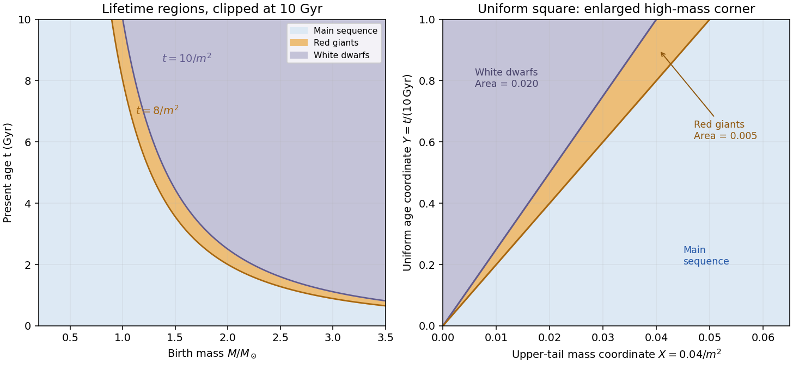

<h1 id="3/solution">Solution</h1>

↑ **Parent:** [3](../3.md)

A constant number [star formation rate](../../../../../star-formation-rate.md) over $10\,\mathrm{Gyr}$ produces a uniform present-age distribution. The [birth-age distribution under constant star formation](../../../../../birth-age-distribution-under-constant-star-formation.md) therefore gives

$$
\boxed{Y(t)=\frac{t}{10\,\mathrm{Gyr}}=0.1\frac{t}{\mathrm{Gyr}}\quad(0\le t\le10\,\mathrm{Gyr}).}
$$

Outside this age interval the [cumulative distribution function](../../../../../cumulative-distribution-function.md) is zero or one. The census here retains stellar remnants as objects, as required by the population model.

Write $m=M/M_\odot$. The [initial mass function](../../../../../initial-mass-function.md) is proportional to $m^{-3}$ on $m\ge0.2$. Normalizing the tail integral gives the [power-law initial-mass-function tail coordinate](../../../../../power-law-initial-mass-function-tail-coordinate.md):

$$
\boxed{X(m)=\frac{\int_m^\infty s^{-3}ds}{\int_{0.2}^\infty s^{-3}ds}
=\frac{0.04}{m^2}\quad(m\ge0.2).}
$$

For lower thresholds $X=1$. Because the birth [mass](../../../../../mass.md) and formation time have [independence](../../../../../independent-random-variables.md), the [probability integral transform](../../../../../probability-integral-transform.md) makes $(X,Y)$ uniform on the unit square. $X$ is an upper-tail coordinate, so larger masses have smaller $X$.

A [red giant](../../../../../red-giant.md) of current age $t$ lies in the [stellar lifetime regions in a mass-age diagram](../../../../../stellar-lifetime-regions-in-a-mass-age-diagram.md)

$$
\frac{8}{m^2}\le\frac{t}{\mathrm{Gyr}}<\frac{10}{m^2},\qquad 0\le\frac{t}{\mathrm{Gyr}}\le10.
$$

There are no [red giants](../../../../../red-giant.md) below $m=\sqrt{0.8}$ in this model. For $\sqrt{0.8}<m<1$ the upper boundary is the population's age limit, while for $m\ge1$ both lifetime boundaries are present. A [white dwarf](../../../../../white-dwarf.md) lies above $t/\mathrm{Gyr}=10/m^2$.

In uniform [probability](../../../../../probability.md) coordinates the main-sequence boundary is $Y=20X$ and the end of the giant phase is $Y=25X$. The giant region is therefore $20X\le Y<25X$, clipped to the unit square: it is the triangle with vertices $(0,0),(1/25,1),(1/20,1)$. Its area, and hence the individual giant fraction, is

$$
\boxed{\Pr(G)=\frac12\left(\frac1{20}-\frac1{25}\right)=\frac1{200}=0.5\%.}
$$

The [white dwarf](../../../../../white-dwarf.md) region $Y\ge25X$ is the triangle with vertices $(0,0),(0,1),(1/25,1)$, giving

$$
\boxed{\Pr(W)=\frac12\frac1{25}=\frac1{50}=2\%.}
$$

The remaining $97.5\%$ are on the [main sequence](../../../../../main-sequence.md). Boundaries have zero [probability](../../../../../probability.md) and do not affect these counts. Treating every post-giant object as a [white dwarf](../../../../../white-dwarf.md) is a stipulated toy-model assumption; real high-mass stars have other [stellar remnants](../../../../../stellar-remnant.md).

**[Figure 2](#3/image-red-giant-and-white-dwarf-regions-in-mass-age-coordinates-and-their-triangular-images-in-uniform-tail-mass-and-age-coordinates). Red-giant and white-dwarf regions in mass-age coordinates and their triangular images in uniform tail-mass and age coordinates**.

For the binary calculations, use a [coeval binary population](../../../../../coeval-binary-population.md): components share their birth time even though their birth masses are independently drawn and their subsequent evolution is independent. Hence $(X_1,X_2,Y)$ is uniform in the unit cube. At a fixed age coordinate $Y=y$, a component is a giant when $y/25<X<y/20$, and a [white dwarf](../../../../../white-dwarf.md) when $0<X<y/25$. Define the conditional state fractions

$$
g(y)=\frac{y}{100},\qquad w(y)=\frac{y}{25},\qquad e(y)=g(y)+w(y)=\frac{y}{20}.
$$

Components have [conditional independence](../../../../../conditional-independence.md) given $y$; averaging over the common age must be done after forming the conditional pair [probabilities](../../../../../probability.md). The [continuous-birth binary state fractions](../../../../../continuous-birth-binary-state-fractions.md) below are consequently volumes in this cube, not products of the marginal single-star fractions.

## ↑ Ancestors (10)

1. [3](../3.md)
2. [Paper 42](../../paper-42-split.md)
3. [Iii](../../split.md)
4. [2002](../../../split.md)
5. [Past exam of the mathematics course of the University of Cambridge](../../../../split.md)
6. [Mathematics course of the University of Cambridge](../../../../../mathematics-course-of-the-university-of-cambridge.md)
7. [Course of the University of Cambridge](../../../../../course-of-the-university-of-cambridge.md)
8. [University of Cambridge](../../../../../university-of-cambridge-split.md)
9. [List of universities](../../../../../list-of-universities.md)
10. [Codex Wiki](../../../../../split.md)
