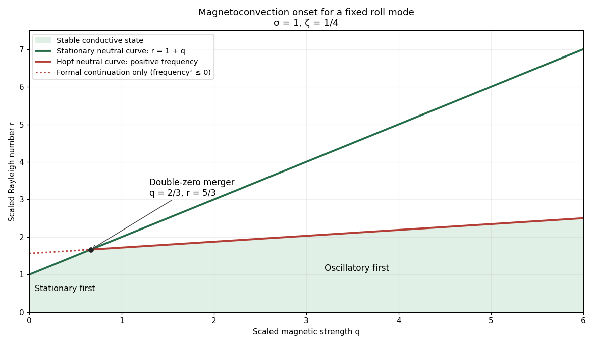

<h1 id="3/solution">Solution</h1>

↑ **Parent:** [3](../3.md)

Let $g>0$ be the magnitude of the downward gravity and write $\alpha_T$ for the [thermal expansion coefficient](../../../../../thermal-expansion-coefficient.md), to distinguish it from the dynamo coefficient of the previous question. The conductive state has $\mathbf u=0$, $\mathbf B=B_0\hat{\mathbf z}$ and $T_0(z)=T_r-\Delta T z/d$. Its gravitational term is absorbed in a background hydrostatic [pressure](../../../../../pressure.md).

For the dimensional two-dimensional fields, choose the [stream function](../../../../../stream-function.md) and [Cartesian magnetic flux function](../../../../../cartesian-magnetic-flux-function.md) conventions

$$
\mathbf u=(-\psi_z,0,\psi_x),\qquad
\mathbf B=(-A_z,0,A_x),\qquad A=B_0x+\chi_{\rm dim}.
$$

These automatically give zero [divergence](../../../../../divergence.md). Define the [Jacobian determinant](../../../../../jacobian-determinant.md) bracket $J(f,h)=f_xh_z-f_zh_x$, so $\mathbf u\cdot\nabla h=J(\psi,h)$. The full [magnetic flux](../../../../../magnetic-flux.md) function, including the imposed field, must be retained in the magnetic force; using the perturbation alone would lose its linear restoring term.

The scalar [vorticity](../../../../../vorticity.md) is $(\nabla\times\mathbf u)_y=-\nabla^2\psi$. Also $(\nabla\times\mathbf B)_y=-\nabla^2A$, and hence

$$
(\nabla\times\mathbf B)\times\mathbf B=-\nabla^2A\,\nabla A,
\qquad
\left[\nabla\times\bigl((\nabla\times\mathbf B)\times\mathbf B\bigr)\right]_y
=-J(A,\nabla^2A).
$$

The [buoyancy](../../../../../buoyancy.md) perturbation is $g\alpha_T(T-T_0)\hat{\mathbf z}$, whose [curl](../../../../../curl.md) in the $y$ direction is $-g\alpha_T(T-T_0)_x$. Taking the [curl](../../../../../curl.md) of the momentum equation and multiplying by minus one eliminates [pressure](../../../../../pressure.md) and therefore gives

$$
\partial_t\nabla^2\psi+J(\psi,\nabla^2\psi)
=\nu\nabla^4\psi+g\alpha_T(T-T_0)_x
+\frac1{\mu_0\rho_r}J(A,\nabla^2A).
$$

We have restored $\mu_0$ in this dimensional expression. The printed magnetic force uses units in which $\mu_0=1$, or equivalently a correspondingly rescaled field.

Use length scale $d$, time scale $d^2/\kappa$, [velocity](../../../../../velocity.md) scale $\kappa/d$, stream-function scale $\kappa$, magnetic flux-function scale $B_0d$, and [temperature](../../../../../temperature.md) perturbation scale $\Delta T$. Thus the dimensionless total flux function is

$$
\boxed{A=x+\chi,\qquad T=T_r+\Delta T(\Theta-z).}
$$

Here $x,z$ now denote coordinates divided by $d$, and the same $T$ notation in the second identity denotes the physical [temperature](../../../../../temperature.md). The dimensionless parameters for [thermal-diffusion scaling of planar magnetoconvection](../../../../../thermal-diffusion-scaling-of-planar-magnetoconvection.md) are

$$
\boxed{R=\frac{g\alpha_T\Delta T d^3}{\nu\kappa},\qquad
Q=\frac{B_0^2d^2}{\mu_0\rho_r\nu\eta},\qquad
\sigma=\frac\nu\kappa,\qquad\zeta=\frac\eta\kappa.}
$$

These are the [Rayleigh number](../../../../../rayleigh-number.md), [Chandrasekhar number](../../../../../chandrasekhar-number.md), [Prandtl number](../../../../../prandtl-number.md) and [magnetic-to-thermal diffusivity ratio](../../../../../magnetic-to-thermal-diffusivity-ratio.md). The nondimensional magnetic-force coefficient is $B_0^2d^2/(\mu_0\rho_r\kappa^2)=\sigma\zeta Q$, so omitting the factor $\zeta$ would use a different magnetic parameter.

The [resistive induction equation](../../../../../resistive-induction-equation.md) becomes $A_t+J(\psi,A)=\zeta\nabla^2A$. Since $J(\psi,x)=-\psi_z$, its perturbation equation has source $+\psi_z$. Similarly, advection of the conductive [temperature](../../../../../temperature.md) [gradient](../../../../../gradient.md) gives $J(\psi,-z)=-\psi_x$, producing the source $+\psi_x$ in the perturbation heat equation. The resulting nonlinear equations are therefore

$$
\begin{aligned}
(\nabla^2\psi)_t+J(\psi,\nabla^2\psi)
&=\sigma\left[\nabla^4\psi+R\Theta_x+\zeta QJ(A,\nabla^2A)\right],\\
\Theta_t+J(\psi,\Theta)&=\psi_x+\nabla^2\Theta,\\
\chi_t+J(\psi,\chi)&=\psi_z+\zeta\nabla^2\chi.
\end{aligned}
$$

This derives both forcing signs from the background fields, rather than selecting them by a stream-function convention after the fact.

For the specified roll mode put $K=\pi/\lambda$ and $p_L=K^2+\pi^2$, the positive [eigenvalue](../../../../../eigenvalue.md) of minus the [Laplacian](../../../../../laplacian.md) on each spatial factor. Write

$$
f_s=\sin Kx\sin\pi z,\quad
f_T=\cos Kx\sin\pi z,\quad
f_A=\sin Kx\cos\pi z,
$$

and take $\psi=(p_L/K)af_s$, $\Theta=bf_T$, $\chi=\lambda cf_A$, with amplitudes depending on $\tau=p_Lt$. These factors satisfy the printed [boundary conditions](../../../../../boundary-condition.md): sine factors make the normal [velocity](../../../../../velocity.md) and $B_x=-\chi_z$ vanish at the required faces; the second derivatives of the [velocity](../../../../../velocity.md) factors give the stress-free conditions; $\Theta$ vanishes at the top and bottom and $\Theta_x$ vanishes at the sides.

Discard quadratic perturbation terms. Since $\nabla^2A=\nabla^2\chi$, the magnetic force linearizes to $J(x,\nabla^2\chi)=(\nabla^2\chi)_z$. The needed derivatives are

$$
\psi_x=p_Laf_T,\qquad \psi_z=p_L\lambda af_A,
\qquad\Theta_x=-Kbf_s,
\qquad(\nabla^2\chi)_z=p_L\pi\lambda cf_s.
$$

The heat and induction equations give $b'=a-b$ and $c'=a-\zeta c$. In the [vorticity](../../../../../vorticity.md) equation, its left side is $-(p_L^3/K)a'f_s$ and its three right-side contributions are $\sigma[(p_L^3/K)a-RKb+\zeta Qp_L\pi\lambda c]f_s$. Consequently, with

$$
r=\frac{K^2R}{p_L^3}=\frac{\pi^2R}{\lambda^2p_L^3},\qquad
q=\frac{\pi^2Q}{p_L^2},
$$

the [three-amplitude vertical-field magnetoconvection](../../../../../three-amplitude-vertical-field-magnetoconvection.md) system is

$$
\boxed{a'=\sigma(-a+rb-\zeta qc),\qquad
b'=a-b,\qquad c'=a-\zeta c.}
$$

Primes now mean $d/d\tau$. They are genuine time derivatives, as the original PDF shows.

For its [linear stability](../../../../../linear-stability.md), seek amplitudes proportional to $e^{s\tau}$. Eliminating $b,c$ or taking the determinant gives

$$
P(s)=(s+\sigma)(s+1)(s+\zeta)-\sigma r(s+\zeta)+\sigma\zeta q(s+1)
=s^3+A_1s^2+A_2s+A_3,
$$

where

$$
A_1=\sigma+1+\zeta,\quad
A_2=\sigma+\sigma\zeta+\zeta-\sigma r+\sigma\zeta q,
\quad A_3=\sigma\zeta(1+q-r).
$$

Assume the physical range $\sigma>0$, $\zeta>0$, $q\ge0$. The [Routh-Hurwitz stability criterion](../../../../../routh-hurwitz-stability-criterion.md) gives strict decay exactly when $A_2>0$, $A_3>0$ and $A_1A_2>A_3$. At $r=0$ these hold. As $r$ increases, the first loss of stability can occur through a zero [eigenvalue](../../../../../eigenvalue.md) or a conjugate imaginary pair.

The stationary threshold is

$$
\boxed{r_s=1+q.}
$$

At this value, $P(s)=s(s^2+A_1s+C)$ with

$$
C=\zeta(\sigma+1)-\sigma(1-\zeta)q.
$$

If $C>0$, the other two roots have negative real parts and the zero root is simple. Its derivative with respect to $r$ is $ds/dr=\sigma\zeta/C>0$. This is stationary onset; the reflection symmetry of the roll permits a generic [pitchfork bifurcation](../../../../../pitchfork-bifurcation-normal-form.md). The linear calculation does not determine whether the nonlinear branch is supercritical or subcritical.

For oscillatory onset set $s=i\omega$, $\omega\ne0$. Separating real and imaginary parts gives $\omega^2=A_2$ and $A_1A_2=A_3$. Solving the latter for $r$ yields

$$
\boxed{r_H=\frac{(\sigma+\zeta)(1+\zeta)}\sigma
+\frac{\zeta(\sigma+\zeta)}{\sigma+1}q,\qquad
\omega_H^2=\zeta\left[\frac{\sigma(1-\zeta)}{\sigma+1}q-\zeta\right].}
$$

A genuine [Hopf bifurcation](../../../../../hopf-bifurcation.md) onset requires $\omega_H^2>0$, so

$$
\boxed{0<\zeta<1,\qquad
q>q_*:=\frac{\zeta(\sigma+1)}{\sigma(1-\zeta)}.}
$$

At this threshold $P(s)=(s+A_1)(s^2+\omega_H^2)$, giving the third root $-A_1<0$. The pair crosses transversely: differentiating $P(s,r)=0$ at $i\omega_H$ gives

$$
\Re\frac{ds}{dr}
=\frac{\sigma(A_1-\zeta)}{2(A_1^2+\omega_H^2)}
=\frac{\sigma(\sigma+1)}{2(A_1^2+\omega_H^2)}>0.
$$

The first [instability](../../../../../instability.md) of the conductive state is therefore **stationary at $r_s$** if $\zeta\ge1$, or if $0<\zeta<1$ and $q<q_*$. It is **oscillatory at $r_H<r_s$** if $0<\zeta<1$ and $q>q_*$. At $q=q_*$, the two thresholds meet and $P(s)=s^2(s+A_1)$: the frequency is zero and neither a simple pitchfork nor a nonzero-frequency Hopf test applies. The [oscillatory marginality in vertical-field magnetoconvection](../../../../../oscillatory-marginality-in-vertical-field-magnetoconvection.md) formula must not be used where its frequency squared is negative.

**[Figure 1](#3/image-stationary-and-oscillatory-magnetoconvection-neutral-curves-for-prandtl-number-one-and-magnetic-to-thermal-diffusivity-ratio-one-quarter-showing-the-double-zero-merger-and-stable-region). Stationary and oscillatory magnetoconvection neutral curves for Prandtl number one and magnetic-to-thermal diffusivity ratio one quarter, showing the double-zero merger and stable region**.

For conversion back to physical parameters, $R_{s,H}=\lambda^2p_L^3r_{s,H}/\pi^2$, while the dimensional Hopf frequency is $(\kappa p_L/d^2)\omega_H$. These are onset conditions for the specified spatial mode. Identifying the globally first mode would additionally require comparison over the allowed spatial modes. Nonlinear saturation and the stability of the bifurcating finite-amplitude states are not determined by this linear three-amplitude system alone.

## ↑ Ancestors (10)

1. [3](../3.md)
2. [Paper 43](../../paper-43-split.md)
3. [Iii](../../split.md)
4. [2002](../../../split.md)
5. [Past exam of the mathematics course of the University of Cambridge](../../../../split.md)
6. [Mathematics course of the University of Cambridge](../../../../../mathematics-course-of-the-university-of-cambridge.md)
7. [Course of the University of Cambridge](../../../../../course-of-the-university-of-cambridge.md)
8. [University of Cambridge](../../../../../university-of-cambridge-split.md)
9. [List of universities](../../../../../list-of-universities.md)
10. [Codex Wiki](../../../../../split.md)
