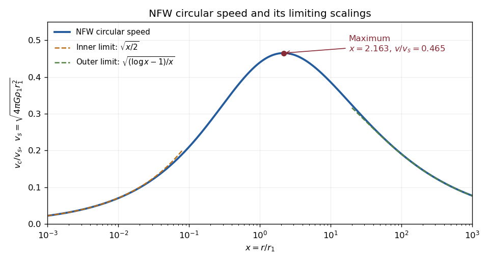

<h1 id="2/a/solution">Solution</h1>

↑ **Parent:** [A](../a.md)

Put $x=r/r_1$. The [NFW profile](../../../../../../navarro-frenk-white-profile.md) becomes $\rho_D=\rho_1/[x(1+x)^2]$. Integrating spherical shells gives

$$
\begin{aligned}
M_D(r)&=4\pi\rho_1r_1^3\int_0^x\frac{u}{(1+u)^2}\,du\\
&=4\pi\rho_1r_1^3\left[\log(1+x)-\frac{x}{1+x}\right].
\end{aligned}
$$

Define $F(x)=[\log(1+x)-x/(1+x)]/x$. The spherical [circular speed](../../../../../../circular-speed.md) is therefore

$$
\boxed{v_{\rm NFW,c}^2(r)=\frac{GM_D(r)}r=4\pi G\rho_1r_1^2F(x).}
$$

At small $x$, the bracket is $x^2/2-2x^3/3+O(x^4)$, giving

$$
v_{\rm NFW,c}^2\simeq2\pi G\rho_1r_1r,
\qquad v_{\rm NFW,c}\propto r^{1/2}.
$$

At large $x$, the bracket is $\log x-1+O(1/x)$, giving

$$
v_{\rm NFW,c}\simeq\sqrt{4\pi G\rho_1r_1^2}\,
\left(\frac{\log x-1}{x}\right)^{1/2}.
$$

Thus the curve rises from zero, reaches one broad maximum, and eventually falls as $[\log r/r]^{1/2}$. The untruncated [NFW profile](../../../../../../navarro-frenk-white-profile.md) has logarithmically divergent mass, but its circular speed still tends to zero.

Differentiating $F$ shows that its stationary point satisfies

$$
\frac{x^2}{(1+x)^2}=\log(1+x)-\frac{x}{1+x}.
$$

The numerator of $F'$ has derivative $x(1-x)/(1+x)^3$: it increases up to one and decreases thereafter, crossing zero once at positive $x>1$. Numerical bisection gives $x_{\max}\simeq2.16258$ and $F(x_{\max})\simeq0.2162166$. Hence

$$
\boxed{r_{\max}\simeq2.163r_1,\qquad
v_{\rm NFW,c,max}\simeq1.648\,r_1\sqrt{G\rho_1}.}
$$

Equivalently $v_{\max}\simeq0.4650\sqrt{4\pi G\rho_1r_1^2}$. This is the [NFW mass and circular-speed profile](../../../../../../nfw-mass-and-circular-speed-profile.md).

**[Figure 1](#2/a/image-nfw-circular-speed-its-maximum-and-inner-and-outer-asymptotic-scalings). NFW circular speed, its maximum and inner and outer asymptotic scalings**.

## ↑ Ancestors (11)

1. [A](../a.md)
2. [2](../../2.md)
3. [Paper 44](../../../paper-44-split.md)
4. [Iii](../../../split.md)
5. [2002](../../../../split.md)
6. [Past exam of the mathematics course of the University of Cambridge](../../../../../split.md)
7. [Mathematics course of the University of Cambridge](../../../../../../mathematics-course-of-the-university-of-cambridge.md)
8. [Course of the University of Cambridge](../../../../../../course-of-the-university-of-cambridge.md)
9. [University of Cambridge](../../../../../../university-of-cambridge-split.md)
10. [List of universities](../../../../../../list-of-universities.md)
11. [Codex Wiki](../../../../../../split.md)
