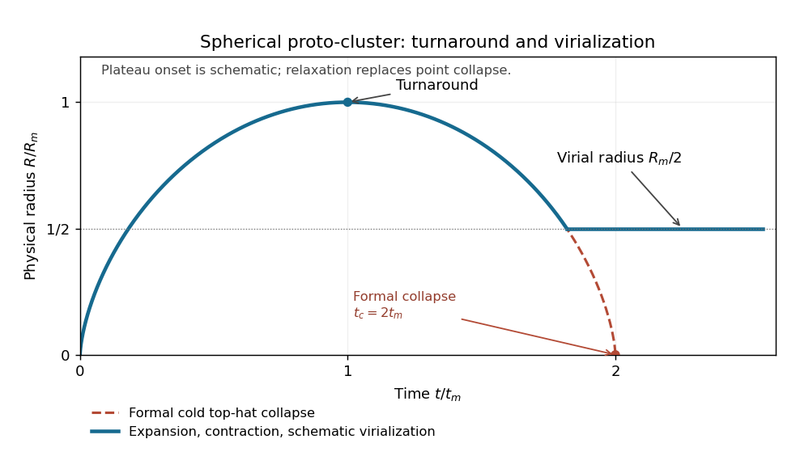

<h1 id="3/a/solution">Solution</h1>

↑ **Parent:** [A](../a.md)

In an [Einstein-de Sitter universe](../../../../../../einstein-de-sitter-universe.md), a slightly overdense spherical region initially expands nearly with the [Hubble flow](../../../../../../hubble-flow.md), with its early physical radius proportional to $t^{2/3}$. Its extra self-gravity gradually slows its expansion relative to the background. The radius reaches a maximum at [spherical-collapse turnaround](../../../../../../turnaround-of-spherical-collapse.md), where the coherent radial velocity is zero; it then contracts. The ideal pressureless top-hat would collapse to a point, but real collisionless matter undergoes crossing and relaxation into a bound system with random motions and [virial equilibrium](../../../../../../virial-equilibrium.md).

The bound-shell solution illustrates the stages:

$$
R=A(1-\cos\theta),\qquad t=B(\theta-\sin\theta),\qquad A^3=GMB^2.
$$

At $\theta=\pi$, $R_m=2A$ and $t_m=\pi B$; the formal cold collapse occurs at $\theta=2\pi$, $t_c=2t_m$. For a uniform isolated sphere, let $U=-3GM^2/(5R)$. At turnaround $K_m=0$, whereas the final [virial theorem](../../../../../../virial-theorem.md) gives $2K_v+U_v=0$. Conservation of energy gives $U_m=K_v+U_v=U_v/2$, hence

$$
\boxed{R_v=R_m/2.}
$$

The usual spherical-collapse prescription associates virialization with roughly the formal collapse epoch, not with a literal instantaneous halt of the cold shell. The sketch distinguishes the formal point collapse from the schematic settling at the virial radius:

**[Figure 1](#3/a/image-spherical-proto-cluster-radius-expansion-turnaround-formal-collapse-and-schematic-virialization). Spherical proto-cluster radius: expansion, turnaround, formal collapse and schematic virialization**.

The plateau onset is illustrative. A real cluster's relaxation, ongoing accretion and nonuniform density profile replace the cold solution, and surface pressure or energy exchange can change the half-radius estimate. The radius here is physical, not comoving.

## ↑ Ancestors (11)

1. [A](../a.md)
2. [3](../../3.md)
3. [Paper 45](../../../paper-45-split.md)
4. [Iii](../../../split.md)
5. [2002](../../../../split.md)
6. [Past exam of the mathematics course of the University of Cambridge](../../../../../split.md)
7. [Mathematics course of the University of Cambridge](../../../../../../mathematics-course-of-the-university-of-cambridge.md)
8. [Course of the University of Cambridge](../../../../../../course-of-the-university-of-cambridge.md)
9. [University of Cambridge](../../../../../../university-of-cambridge-split.md)
10. [List of universities](../../../../../../list-of-universities.md)
11. [Codex Wiki](../../../../../../split.md)
