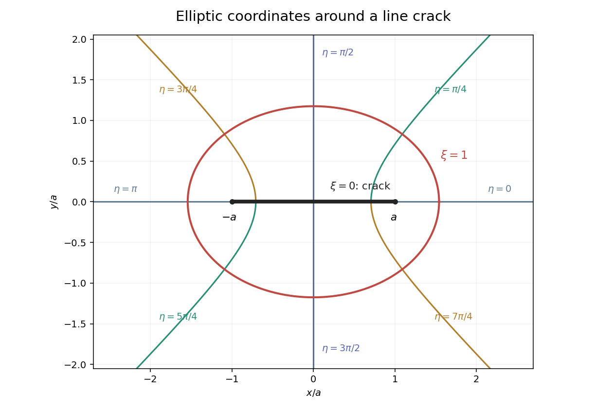

<h1 id="4/solution">Solution</h1>

↑ **Parent:** [4](../4.md)

The [Darcy law](../../../../../darcy-law.md) here is $\mathbf u=-k\nabla p/\mu$, with hydrostatic contributions absorbed into $p$ if present. Since $k$ is uniform and the fluid is incompressible, $\nabla\cdot\mathbf u=0$ gives $\Delta p=0$ in the porous matrix.

[Pressure](../../../../../pressure.md) is uniform across the thin crack at leading order. No-slip [lubrication theory](../../../../../lubrication-theory.md) gives its flux per unit depth $q=-h^3p_x/(12\mu)$. Conservation in a short crack segment says $q_x=-[u_y]^+_-$, while [Darcy flow](../../../../../darcy-flow.md) gives $[u_y]^+_-=-(k/\mu)[p_y]^+_-$. Therefore

$$
\boxed{\partial_x\!\left(\frac{h^3}{12}p_x\right)+k[p_y]^+_-=0.}
$$

The other interfacial condition is **[pressure](../../../../../pressure.md) continuity**, $[p]^+_-=0$. The far [pressure gradient](../../../../../pressure-gradient.md) is $-\mu U\mathbf e_x/k$; outside the slit both [pressure](../../../../../pressure.md) and normal [Darcy flux](../../../../../darcy-velocity.md) are continuous. The leading tapered-crack flux vanishes at its endpoints. The assumptions $h\ll a$ and $h\gg\sqrt k$ justify transverse [pressure](../../../../../pressure.md) uniformity and neglect of porous-wall slip on scale $\sqrt k$. Close to the sharp tips the reduced model is an outer approximation, not a uniformly resolved tip solution. This is [lubrication boundary condition for a crack in a Darcy medium](../../../../../lubrication-boundary-condition-for-a-crack-in-a-darcy-medium.md).

These are planar [elliptic coordinates](../../../../../elliptic-coordinates.md). The curve $\xi=0$ is the slit $[-a,a]$, traced on its upper and lower sides. The curve $\xi=1$ is the ellipse with semiaxes $a\cosh1$ and $a\sinh1$. For fixed noncardinal $\eta$, the coordinate curve is the appropriate branch of $x^2/(a^2\cos^2\eta)-y^2/(a^2\sin^2\eta)=1$. The cardinal angles give the two exterior horizontal rays and the upper/lower vertical rays. The requested original sketch is:

**[Figure 1](#4/image-elliptic-coordinate-ellipse-crack-and-eight-constant-angle-curves). Elliptic-coordinate ellipse, crack and eight constant-angle curves**.

On the upper face $0<\eta<\pi$, the supplied derivatives reduce to $\partial_x=-(a\sin\eta)^{-1}\partial_\eta$ and $\partial_y=(a\sin\eta)^{-1}\partial_\xi$. The same point on the lower face has angle $2\pi-\eta$, so its $\partial_y$ has the opposite sign. Thus

$$
[p_y]^+_-=\frac{p_\xi(0,\eta)+p_\xi(0,2\pi-\eta)}{a\sin\eta}.
$$

Insert this and the tangential derivative into the crack condition and multiply by $12a^2\sin\eta$ to obtain

$$
\boxed{\partial_\eta\!\left(\frac{h^3}{\sin\eta}p_\eta\right)+12ak\bigl[p_\xi(0,\eta)+p_\xi(0,2\pi-\eta)\bigr]=0.}
$$

[Pressure](../../../../../pressure.md) continuity becomes $p(0,\eta)=p(0,2\pi-\eta)$. The uniform-flow background is $p_0=-\mu Ux/k=-(\mu Ua/k)\cosh\xi\cos\eta$. Its derivatives immediately give

$$
\boxed{(p_\xi,p_\eta)\sim\frac{\mu Ua e^\xi}{2k}(-\cos\eta,\sin\eta).}
$$

The [harmonic](../../../../../harmonic-function.md) equation is $p_{\xi\xi}+p_{\eta\eta}=0$ because the metric multiplier is nonzero outside the slit.

For the specified profile, $h^3=H_0^3\sin\eta$ on the upper face. Its coefficient in the tangential operator is constant, so the imposed cosine mode separates. With $P_0=\mu Ua/k$, write $p=P_0F(\xi)\cos\eta$. Harmonicity gives $F''=F$, the interfacial condition gives $F'(0)=\alpha F(0)$, and the far field fixes the growing coefficient to $-1/2$. Therefore

$$
\boxed{F(\xi;\alpha)=-\frac12e^\xi+\frac{\alpha-1}{2(\alpha+1)}e^{-\xi}=-\cosh\xi+\frac\alpha{1+\alpha}e^{-\xi},\quad\alpha=\frac{H_0^3}{24ka}.}
$$

Reflection [symmetry](../../../../../symmetry-physics.md) makes the two face derivatives equal. Other homogeneous cosine modes decaying as $e^{-m\xi}$ would require $-m=\alpha m^2$ at the slit, impossible for $m>0$ and $\alpha\ge0$. The constant [pressure](../../../../../pressure.md) gauge is immaterial. This justifies the separated [crack pressure in elliptic coordinates](../../../../../crack-pressure-in-elliptic-coordinates.md), not only a candidate satisfying selected conditions.

At the midpoint $F(0)=-1/(1+\alpha)$ and $p_x=-\mu U/[k(1+\alpha)]$. Hence

$$
\boxed{Q=\frac{H_0^3U}{12k(1+\alpha)}=2aU\frac\alpha{1+\alpha}.}
$$

For $\alpha\ll1$, $Q\sim H_0^3U/(12k)$ and the crack barely perturbs the imposed Darcy [pressure gradient](../../../../../pressure-gradient.md). For $\alpha\gg1$, $Q\sim2aU$ and the slit is nearly equipotential: its high axial conductance collects flow from the surrounding matrix rather than sustaining a substantial [pressure gradient](../../../../../pressure-gradient.md). The parameter compares crack conductance $H_0^3/\mu$ with matrix conductance $ka/\mu$. In fact $q(x)=Q\sqrt{1-x^2/a^2}$, so the tip flux is zero in this outer model.

Subtracting the exact uniform background gives $\delta p=P_0\alpha e^{-\xi}\cos\eta/(1+\alpha)$. Since $r\sim ae^\xi/2$ and $\eta\sim\theta$ at infinity,

$$
\boxed{\delta p\sim\frac{\alpha\mu Ua^2}{2(1+\alpha)k}\frac{\cos\theta}{r}.}
$$

**The printed far-field coefficient is too large by a factor of two.** The factor $1/2$ is forced by the stated coordinate map. An independent check is the large-$\alpha$ solution $p=-(\mu U/k)\operatorname{Re}\sqrt{z^2-a^2}$, whose expansion has precisely $\delta p\sim\mu Ua^2\cos\theta/(2kr)$. This is the [elliptic crack pressure dipole](../../../../../elliptic-crack-pressure-dipole.md).

The phrase “suitably chosen curve” matters for the pressure-only dissipation [integral](../../../../../integral.md). Put $C_d=\alpha\mu Ua^2/[2(1+\alpha)k]$ and use a rectangle with end faces $x=\pm X$ and transverse extent $|y|\le H$, taking $a\ll X\ll H$. The horizontal faces have $n_x=0$. The two end-face [integrals](../../../../../integral.md) of $\delta p\,n_x$ total

$$
2C_d\int_{-H}^{H}\frac{X}{X^2+y^2}dy=4C_d\arctan(H/X)\longrightarrow2\pi C_d.
$$

This is a fixed-throughflow normalization: the integrated [velocity](../../../../../velocity.md) perturbation on an infinite end face is zero, since it is proportional to $\partial_x\int\delta p\,dy=\partial_x(\pi C_d\operatorname{sgn}x)=0$. Work on the transverse faces vanishes as $H/X\to\infty$. Thus the requested line functional gives

$$
\boxed{\Delta\mathcal D=-2\pi UC_d=-\frac{\pi\mu U^2a^2}{k}\frac\alpha{1+\alpha}.}
$$

A bare circular cutoff would give $-\pi UC_d$ instead; it does not enforce this same throughflow normalization, so its pressure-only term cannot be substituted into the fixed-throughflow dissipation comparison. Keeping the control surface explicit resolves that ambiguity. This is [fixed-throughflow dissipation reduction of a conductive crack](../../../../../fixed-throughflow-dissipation-reduction-of-a-conductive-crack.md).

Let $s=\pi\phi a^2\alpha/(1+\alpha)\ll1$. The noninteracting average dissipation per area is $\mu U^2/k+\phi\Delta\mathcal D=(\mu U^2/k)(1-s)$. Equating this with $\mu U^2/k_{xx}^*$ gives

$$
\boxed{k_{xx}^*=\frac{k}{1-s}\quad\text{in the additive approximation},\qquad k_{xx}^*=k\left[1+\pi\phi a^2\frac\alpha{1+\alpha}+O((\phi a^2)^2)\right].}
$$

Only the first-order density term is controlled by the noninteraction assumption; the rational form is not an all-orders result. It increases permeability along the aligned cracks and saturates as their conductance becomes large. This is [dilute permeability enhancement by aligned cracks](../../../../../dilute-permeability-enhancement-by-aligned-cracks.md).

## ↑ Ancestors (10)

1. [4](../4.md)
2. [Paper 47](../../paper-47-split.md)
3. [Iii](../../split.md)
4. [2002](../../../split.md)
5. [Past exam of the mathematics course of the University of Cambridge](../../../../split.md)
6. [Mathematics course of the University of Cambridge](../../../../../mathematics-course-of-the-university-of-cambridge.md)
7. [Course of the University of Cambridge](../../../../../course-of-the-university-of-cambridge.md)
8. [University of Cambridge](../../../../../university-of-cambridge-split.md)
9. [List of universities](../../../../../list-of-universities.md)
10. [Codex Wiki](../../../../../split.md)
