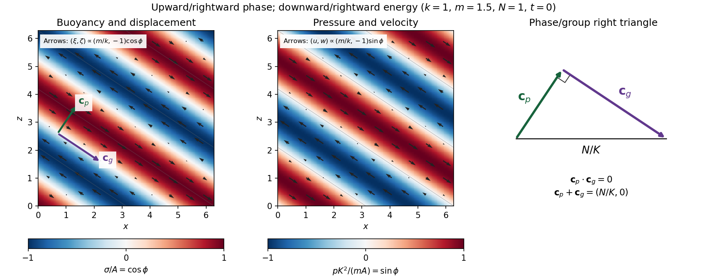

<h1 id="1/solution">Solution</h1>

↑ **Parent:** [1](../1.md)

Let $p$ be [kinematic pressure](../../../../../kinematic-pressure.md), with the resting hydrostatic part subtracted, and let $\sigma$ be the [buoyancy perturbation](../../../../../buoyancy-perturbation.md) about background buoyancy $N^2z$. The nonrotating inviscid [Boussinesq equations](../../../../../boussinesq-equations.md), with no buoyancy diffusion, are

$$
\frac{Du}{Dt}=-p_x,\qquad
\frac{Dw}{Dt}=-p_z+\sigma,\qquad
u_x+w_z=0,\qquad
\frac{D\sigma}{Dt}+N^2w=0,
\qquad \frac D{Dt}=\partial_t+u\partial_x+w\partial_z.
$$

Here the third equation is [mass conservation](../../../../../mass-conservation.md) for [incompressible flow](../../../../../incompressible-flow.md), and the last expresses [buoyancy](../../../../../buoyancy.md) conservation following a parcel. Linearization about rest removes the products of disturbances. For a [plane internal gravity wave](../../../../../plane-internal-gravity-wave.md) proportional to $e^{i(kx+mz-\omega t)}$, the resulting [Linearized Boussinesq equations](../../../../../linearized-boussinesq-equations.md) become

$$
-i\omega\widehat u=-ik\widehat p,\qquad
-i\omega\widehat w=-im\widehat p+\widehat\sigma,\qquad
k\widehat u+m\widehat w=0,\qquad
-i\omega\widehat\sigma+N^2\widehat w=0.
$$

With $K=(k^2+m^2)^{1/2}$ and $k\ne0$, the first and third equations give $\widehat p=-m\omega\widehat w/k^2$. Substitution in vertical momentum and buoyancy gives the [dispersion relation](../../../../../dispersion-relation.md)

$$
\boxed{\omega^2=\frac{N^2k^2}{k^2+m^2}.}
$$

Since the [velocity](../../../../../velocity.md) is the time [derivative](../../../../../derivative.md) of the [displacement field](../../../../../displacement-field-mechanics.md), $\widehat{\boldsymbol u}=-i\omega\widehat{\boldsymbol\xi}$. Thus the complete [buoyancy polarization of a plane internal gravity wave](../../../../../buoyancy-polarization-of-a-plane-internal-gravity-wave.md) is

$$
\boxed{
\widehat w=\frac{i\omega}{N^2}\widehat\sigma,\quad
\widehat u=-\frac{im\omega}{kN^2}\widehat\sigma,\quad
\widehat\zeta=-\frac{\widehat\sigma}{N^2},\quad
\widehat\xi=\frac{m\widehat\sigma}{kN^2},\quad
\widehat p=-\frac{im}{K^2}\widehat\sigma.}
$$

Both [velocity](../../../../../velocity.md) and [displacement](../../../../../displacement.md) are perpendicular to the [wavevector](../../../../../wavevector.md); [pressure](../../../../../pressure.md) and [velocity](../../../../../velocity.md) are in [quadrature](../../../../../phase-quadrature.md) with [buoyancy](../../../../../buoyancy.md) and [displacement](../../../../../displacement.md).

For upward/rightward [phase velocity](../../../../../phase-velocity.md), choose $k,m>0$ and $\omega=Nk/K$. Differentiating this [dispersion relation](../../../../../dispersion-relation.md) gives the [group velocity](../../../../../group-velocity.md), while the vector [phase velocity](../../../../../phase-velocity.md) points along the [wavevector](../../../../../wavevector.md):

$$
\boxed{\mathbf c_g=\left(\frac{Nm^2}{K^3},-\frac{Nkm}{K^3}\right),\qquad
\mathbf c_p=\frac{Nk}{K^3}(k,m).}
$$

Their [dot product](../../../../../dot-product.md) is zero and $\mathbf c_p+\mathbf c_g=(N/K,0)$. Draw $\mathbf c_g$ from the tip of $\mathbf c_p$: the [right-triangle geometry of internal-wave velocities](../../../../../right-triangle-geometry-of-internal-wave-velocities.md) has horizontal hypotenuse $N/K$. This hypotenuse is distinct from the [horizontal phase velocity](../../../../../horizontal-phase-velocity.md) $\omega/k$.

At an instant with real [complex amplitude](../../../../../complex-amplitude.md) $\widehat\sigma=A$, write $\phi=kx+mz-\omega t$. The spatial fields are

$$
\sigma=A\cos\phi,\quad
(\xi,\zeta)=\frac A{N^2}(m/k,-1)\cos\phi,\quad
(u,w)=\frac{\omega A}{N^2}(m/k,-1)\sin\phi,\quad
p=\frac{mA}{K^2}\sin\phi.
$$

The [constant-phase lines of an internal gravity wave](../../../../../constant-phase-line-of-an-internal-gravity-wave.md) slope down to the right, with $dz/dx=-k/m$. [Buoyancy](../../../../../buoyancy.md) maxima lie a quarter [wavelength](../../../../../wavelength.md) from [pressure](../../../../../pressure.md) maxima; the oscillating [displacement](../../../../../displacement.md) and [velocity](../../../../../velocity.md) run along the phase lines. The [group velocity](../../../../../group-velocity.md) points down and right along them, despite upward/rightward motion of the [wave phase](../../../../../phase-waves.md).

**[Figure 1](#1/image-internal-wave-buoyancy-displacement-pressure-and-velocity-fields-with-downward-energy-propagation-and-the-phase-group-velocity-right-triangle). Internal-wave buoyancy, displacement, pressure and velocity fields, with downward energy propagation and the phase/group-velocity right triangle**.

Let $P=\overline{\xi_xu+\zeta_xw}$, using horizontal averaging over a [wavelength](../../../../../wavelength.md). This is the [displacement pseudomomentum of an internal gravity wave](../../../../../displacement-pseudomomentum-of-an-internal-gravity-wave.md), whose sign convention is opposite to $k\overline E/\omega$. For complex coefficients, $\overline{ab}=\tfrac12\operatorname{Re}(\widehat a\widehat b^*)$. The above [wave polarization](../../../../../polarization-waves.md) consequently gives

$$
P=-\frac{\omega K^2|\widehat\sigma|^2}{2kN^4},\qquad
\overline{\zeta_xp}=\frac{km|\widehat\sigma|^2}{2N^2K^2}.
$$

Since $c_{gz}=-\omega m/K^2$, these obey $\overline{\zeta_xp}=c_{gz}P$. With weak [kinematic viscosity](../../../../../kinematic-viscosity.md), each leading monochromatic [velocity](../../../../../velocity.md) component satisfies $\nabla^2u=-K^2u$, $\nabla^2w=-K^2w$. The dissipative term is therefore $-\nu K^2P$, so the supplied averaged balance reduces to

$$
P_t+\partial_z(c_{gz}P)=-\nu K^2P.
$$

For constant $k,m,N$ and a steady wave envelope, $c_{gz}P_z=-\nu K^2P$. As $P$ is proportional to squared [wave amplitude](../../../../../wave-amplitude.md), [viscous attenuation of an internal gravity wave](../../../../../viscous-attenuation-of-an-internal-gravity-wave.md) gives

$$
\boxed{|\widehat\sigma(z)|=|\widehat\sigma(z_s)|
\exp\left[-\frac{\nu K^2(z-z_s)}{2c_{gz}}\right].}
$$

Here $c_{gz}<0$, so amplitude decreases below a source at $z_s$: **the source is above the receiving level**. The same conclusion follows directly because downward [group velocity](../../../../../group-velocity.md) carries [energy](../../../../../energy.md) from the source downward. Upward [phase velocity](../../../../../phase-velocity.md) does not locate the source.

For a slowly varying mean [shear flow](../../../../../shear-flow.md) $U(z)$, the local [intrinsic frequency](../../../../../intrinsic-frequency.md) is $\widehat\omega=\omega-kU(z)$. A local [WKB approximation](../../../../../wkb-approximation.md) uses $\widehat\omega^2=N^2k^2/(k^2+m(z)^2)$, with varying vertical [wavenumber](../../../../../wavenumber.md) and [group velocity](../../../../../group-velocity.md). The appropriate transported quantity is [wave action](../../../../../wave-action-fluid-dynamics.md), or horizontal [wave pseudomomentum](../../../../../wave-pseudomomentum.md) $kE/\widehat\omega$; its vertical flux has viscous loss, and the changing polarization factors must be retained. In particular, $P/|\widehat\sigma|^2$ is no longer constant.

Near a [critical level of an internal gravity wave](../../../../../critical-level-of-an-internal-gravity-wave.md), $\widehat\omega\to0$, so $|m|\sim N|k|/|\widehat\omega|$ and $|c_{gz}|\sim\widehat\omega^2/(N|k|)$. The damping per vertical distance, of order $\nu K^2/|c_{gz}|$, grows rapidly. The waves are strongly attenuated over a narrow altitude range and transfer momentum to the mean flow there or before reaching the critical level. The inviscid [WKB approximation](../../../../../wkb-approximation.md) eventually fails; [viscosity](../../../../../dynamic-viscosity.md) and possibly [internal-wave breaking](../../../../../internal-wave-breaking.md) regulate the small scales.

## ↑ Ancestors (10)

1. [1](../1.md)
2. [Paper 49](../../paper-49-split.md)
3. [Iii](../../split.md)
4. [2002](../../../split.md)
5. [Past exam of the mathematics course of the University of Cambridge](../../../../split.md)
6. [Mathematics course of the University of Cambridge](../../../../../mathematics-course-of-the-university-of-cambridge.md)
7. [Course of the University of Cambridge](../../../../../course-of-the-university-of-cambridge.md)
8. [University of Cambridge](../../../../../university-of-cambridge-split.md)
9. [List of universities](../../../../../list-of-universities.md)
10. [Codex Wiki](../../../../../split.md)
